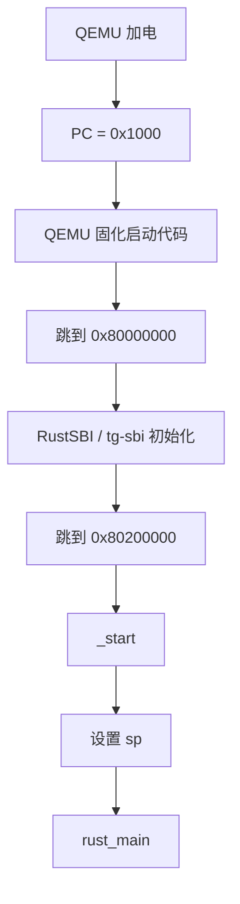
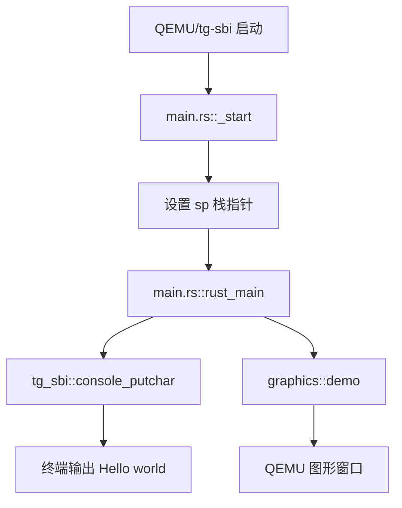
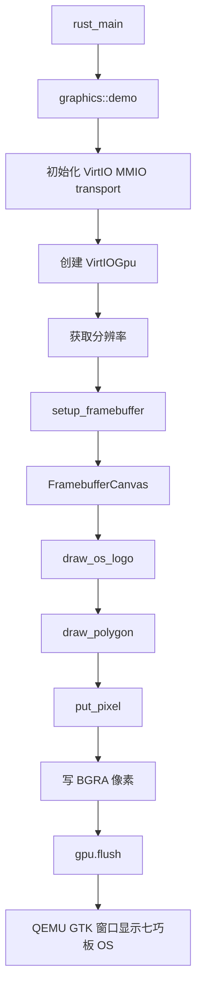
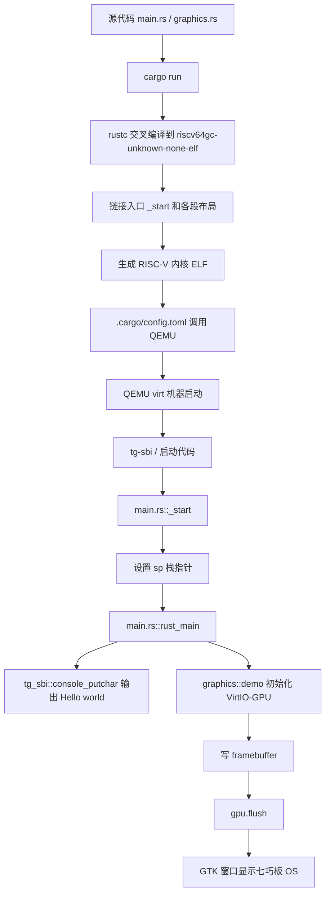

# OS 第一章整合补充稿：从普通 Hello World 到裸机最小执行环境

> 本文是我结合 rCore Guide 第一章、tg-rcore-tutorial-ch1 代码、AI 协作问答以及本地 ch1-tangram 调试过程整理出来的补充稿。  
> 这份稿子的目标不是把代码机械贴一遍，而是尽量用我自己的学习口吻，把“为什么需要这些模块”“程序到底从哪里开始”“裸机上如何输出字符和图形”讲清楚。后续我会再把它和自己的 Word 笔记合并，整理成正式 Markdown 笔记。

## 0. 第一章我真正要讲清楚的问题

第一章表面上只是做一个 `Hello, world!`，但它真正要解决的不是“如何打印字符串”，而是：

```text
一个程序在没有操作系统的机器上，究竟如何开始运行？
```

普通应用程序里，我只要写：

```rust
fn main() {
    println!("Hello, world!");
}
```

它就能在终端显示文字。但这不是因为这三行代码本身很完整，而是因为操作系统、标准库、运行时环境已经在背后替我做了大量工作。

第一章就是把这些背后的支撑一层一层拆掉，然后自己补一个最小执行环境：

```text
普通 Rust Hello world
  -> 切换到 RISC-V 裸机目标
  -> 移除 std
  -> 移除普通 main
  -> 自己提供 panic_handler
  -> 自己提供 _start 入口
  -> 自己设置栈
  -> 自己通过 SBI 输出字符/关机
  -> 最后在 QEMU 模拟的 RISC-V 裸机上运行
```

我现在对第一章的总体理解是：

```text
它是从“我写 main，操作系统帮我运行”
过渡到“我自己告诉机器从哪里开始、如何准备栈、如何输出、如何退出”的过程。
```

这才是操作系统学习真正开始的地方。

## 1. 普通 Hello World 背后的隐藏执行环境

普通 Hello World 看起来是：

```rust
fn main() {
    println!("Hello, world!");
}
```

但真实执行链不是这么短。它背后大概有这样一层执行环境栈：

```text
应用程序
  -> Rust 标准库 std
  -> C runtime / libc / 系统库
  -> 操作系统系统调用
  -> 设备驱动
  -> 硬件
```

当我调用 `println!` 时，真实过程更像：

```text
println!
  -> Rust 标准库进行格式化
  -> 调用标准输出接口
  -> 通过系统调用请求操作系统
  -> 操作系统把字节写到终端/串口/控制台
  -> 最后硬件或模拟器显示出来
```

完整调用链可以写成：

```text
cargo run
  -> rustc 编译 Rust 源码
  -> 链接 Rust 标准库 std
  -> 链接 runtime / 系统库
  -> 操作系统加载可执行文件
  -> runtime 初始化
  -> 调用 main()
  -> println!
  -> write 系统调用
  -> 终端显示 Hello world
```

所以普通 `main()` 不是机器真正执行的第一条指令。普通程序的 `main()` 是被运行时环境调用的。操作系统先加载程序，runtime 先做初始化，然后才进入我们写的 `main()`。

### 自问自答

**问：为什么平时 `println!` 可以直接用？**  
因为程序运行在操作系统上，Rust 标准库 `std` 可以借助操作系统提供的系统调用完成输出。

**问：`println!` 是不是直接操作屏幕？**  
不是。它先格式化字符串，再通过标准库和系统调用请求操作系统输出。

**问：为什么裸机上 `println!` 就不能用了？**  
因为裸机没有操作系统，也没有现成的标准输出、文件描述符和 `write` 系统调用。

## 2. 目标三元组与 bare-metal

Rust 编译程序时要知道目标平台是什么，这个目标平台用目标三元组描述。

普通平台可能是：

```text
x86_64-pc-windows-msvc
x86_64-unknown-linux-gnu
```

这类目标都默认有操作系统和运行时支持。

rCore 第一章的目标是：

```text
riscv64gc-unknown-none-elf
```

拆开来看：

```text
riscv64gc
  RISC-V 64 位架构，带常用扩展。

unknown
  厂商未知，这里不重要。

none
  没有操作系统。

elf
  输出 ELF 格式可执行文件。
```

这里最关键的是 `none`。它表示目标平台没有操作系统支持，因此标准库 `std` 不能使用。

如果直接把普通 Hello World 编译到这个目标上，会出现：

```text
can't find crate for `std`
```

这不是 Rust 莫名其妙报错，而是在告诉我：

```text
你现在选择的是一个没有 OS 的目标。
std 本身依赖 OS，所以这里找不到 std。
```

### 自问自答

**问：为什么目标三元组里有 `none` 就不能用 std？**  
因为 `std` 依赖操作系统，比如线程、文件、标准输出、堆分配等，而 `none` 表示目标平台没有操作系统。

**问：`riscv64gc-unknown-none-elf` 和 `riscv64gc-unknown-linux-gnu` 有什么区别？**  
前者是裸机目标，后者是运行在 RISC-V Linux 上的应用程序目标。

**问：为什么我们不用 Linux 目标？**  
因为课程目标是写操作系统内核，而不是写运行在 Linux 上的应用。

## 3. `no_std`：从 std 退到 core

裸机没有 `std`，所以我们要在代码开头加：

```rust
#![no_std]
```

它的意思是：

```text
不要链接 Rust 标准库 std，只使用核心库 core。
```

`core` 是 Rust 最底层、最不依赖环境的一部分。它仍然提供：

```text
基本类型
Option / Result
slice / ptr
trait
core::fmt
volatile 访问
部分底层内存操作
```

但它不提供：

```text
println!
文件系统
线程
网络
标准输入输出
操作系统系统调用封装
默认堆分配
```

也就是说，程序从：

```text
main.rs -> std -> OS
```

变成：

```text
main.rs -> core
```

这一步会直接暴露两个问题：

```text
1. println! 没有了
2. panic_handler 没有了
```

`println!` 没了，是因为输出依赖操作系统或外设。`panic_handler` 没了，是因为 `core` 只保留 panic 机制的接口，没有提供具体处理方式。

### 自问自答

**问：`core` 是不是一个更小的 `std`？**  
可以粗略这么理解，但更准确地说，`core` 是不依赖操作系统的 Rust 核心能力集合。

**问：`core::fmt` 能不能直接打印？**  
不能。`core::fmt` 只负责格式化，不负责把字符串输出到哪里。输出到串口、SBI、framebuffer 都要自己实现。

**问：`no_std` 是不是代表不能用任何库？**  
不是。可以使用 `core`，也可以使用支持 `no_std` 的第三方库。

## 4. `panic_handler`：补齐 panic 处理

普通 Rust 程序中，如果发生：

```rust
panic!("error");
```

或者：

```rust
assert!(false);
```

标准库会帮我们打印错误信息并终止程序。

但是 `no_std` 环境没有标准库，因此编译器要求我们自己提供：

```rust
#[panic_handler]
fn panic(_info: &core::panic::PanicInfo) -> ! {
    loop {}
}
```

这里的 `#[panic_handler]` 是告诉编译器：

```text
程序 panic 时，就进入这个函数处理。
```

返回类型 `!` 表示函数永远不返回。因为 panic 说明程序已经不能正常继续执行，所以它要么死循环，要么关机，要么重启。

在 tg ch1 中，panic 处理是：

```rust
#[panic_handler]
fn panic(_info: &core::panic::PanicInfo) -> ! {
    shutdown(true)
}
```

也就是：

```text
panic
  -> tg_sbi::shutdown(true)
  -> 以异常状态退出 QEMU
```

### 自问自答

**问：为什么不实现 `panic_handler` 就不能编译？**  
因为 Rust 编译器必须知道 panic 时调用哪个函数。`std` 环境下标准库提供默认实现，`no_std` 后要自己补。

**问：为什么 `panic_handler` 不能正常返回？**  
因为 panic 代表程序进入不可恢复状态，返回原位置继续执行是不安全的。

**问：第一章为什么 panic 可以直接关机？**  
因为第一章没有进程、线程、错误恢复机制，最简单可靠的做法就是停止运行。

## 5. `no_main`：移除标准 runtime 入口

普通 Rust 程序的 `main()` 不是机器第一条指令。普通程序启动链大概是：

```text
操作系统加载可执行文件
  -> runtime 初始化
  -> 设置参数、环境变量、栈等
  -> 调用 main()
```

裸机没有操作系统，也没有普通 runtime，所以要写：

```rust
#![no_main]
```

它的含义是：

```text
不要使用 Rust 默认 main 入口，我自己定义真正的入口。
```

这个真正入口就是 `_start`。

可以这样理解：

```text
main 是高级语言世界里的入口。
_start 是机器启动链路里真正能跳转到的入口。
```

如果 `no_main` 之后没有 `_start`，程序就会失去明确入口。CPU 不会自动理解 Rust 的函数名，也不会帮我们找一个 `main` 来执行。

### 自问自答

**问：为什么裸机不能直接从 `main` 开始？**  
因为 `main` 是 runtime 调用的，而裸机没有 runtime。

**问：`no_main` 是不是代表没有主逻辑了？**  
不是。它只是不用标准入口机制。我们仍然可以定义 `rust_main` 作为 Rust 侧主逻辑。

**问：`no_main` 后最需要补什么？**  
需要补 `_start`，否则机器不知道从哪里进入我们的代码。

## 6. `_start`：机器真正入口

`_start` 是第一章最关键的点之一。

Guide 原版通常用 `entry.asm`：

```asm
.section .text.entry
.globl _start
_start:
    la sp, boot_stack_top
    call rust_main
```

这段代码做了几件事：

```text
1. 定义全局符号 _start
2. 把 _start 放进 .text.entry 段
3. 设置栈指针 sp
4. 跳到 Rust 侧的 rust_main
```

这里要注意：`entry.asm` 不是被 `main.rs` 像普通函数一样调用。恰恰相反，它执行得更早。机器先进入 `_start`，然后 `_start` 再跳到 `rust_main`。

原版启动关系是：

```text
QEMU/RustSBI
  -> entry.asm::_start
  -> 设置 sp
  -> main.rs::rust_main
```

为什么 `_start` 必须先设置栈？

因为 Rust 函数调用需要栈。局部变量、返回地址、保存寄存器、函数调用上下文都可能依赖栈。如果栈指针没有设置，直接进入 Rust 函数，就像单片机没有初始化 MSP 就调用 C 函数，很容易跑飞。

在 tg 组件化 ch1 中，没有单独 `entry.asm`，而是把 `_start` 写在 `main.rs` 里：

```rust
#[unsafe(naked)]
#[unsafe(no_mangle)]
#[unsafe(link_section = ".text.entry")]
unsafe extern "C" fn _start() -> ! {
    core::arch::naked_asm!(
        "la sp, {stack} + {stack_size}",
        "j  {main}",
        stack_size = const STACK_SIZE,
        stack = sym STACK,
        main = sym rust_main,
    )
}
```

这和 `entry.asm` 做的是同一件事，只是写法变成了 Rust 文件中的内联汇编。

几个标记的含义：

```text
#[unsafe(no_mangle)]
  不让编译器改函数名，保证底层和链接器能找到 _start。

#[unsafe(link_section = ".text.entry")]
  把 _start 放进入口段，方便链接器把它放到代码最前面。

#[unsafe(naked)]
  不生成普通函数序言和尾声，因为此时栈还没初始化。

naked_asm!
  直接写最底层启动汇编。
```

### 自问自答

**问：`_start` 和 `rust_main` 谁先执行？**  
`_start` 先执行。它负责设置最小运行环境，然后跳到 `rust_main`。

**问：为什么 `_start` 不能写成普通 Rust 函数？**  
普通 Rust 函数会默认生成函数序言/尾声，可能使用栈。但 `_start` 执行时栈还没准备好。

**问：`entry.asm` 和 `main.rs` 里的 `_start` 是什么关系？**  
它们是两种实现方式。Guide 原版用单独汇编文件，tg ch1 把同样逻辑写进了 `main.rs`。

**问：`_start` 不设置栈会怎样？**  
后续 Rust 函数调用可能使用错误栈地址，导致内存破坏、异常或直接跑飞。

## 7. `linker.ld`：入口地址和段布局

`linker.ld` 是链接脚本。它不是运行时执行的代码，而是编译链接阶段给链接器看的“内存布局说明书”。

它负责回答：

```text
程序入口是谁？
代码段放在哪里？
只读数据放在哪里？
全局变量放在哪里？
.bss 从哪里到哪里？
内核整体从哪个物理地址开始？
```

Guide 中常见配置是：

```ld
OUTPUT_ARCH(riscv)
ENTRY(_start)
BASE_ADDRESS = 0x80200000;

SECTIONS
{
    . = BASE_ADDRESS;

    .text : {
        *(.text.entry)
        *(.text .text.*)
    }

    .rodata : { ... }
    .data : { ... }
    .bss : { ... }
}
```

我一开始会把 `linker.ld` 理解成“连接这些程序上下文的东西”，这个方向是对的，但可以更准确：

```text
linker.ld 不是运行时连接上下文。
它是在链接阶段决定代码和数据最终放到内存的什么位置。
```

最关键的三点：

```text
ENTRY(_start)
  告诉链接器程序入口符号是 _start。

BASE_ADDRESS = 0x80200000
  告诉链接器内核从 0x80200000 开始布局。

*(.text.entry)
  把入口段放到代码段最前面。
```

为什么地址很重要？

因为 QEMU/RustSBI 的启动流程已经约定了：

```text
QEMU 固化代码从 0x1000 开始
  -> 跳到 0x80000000 的 RustSBI
  -> RustSBI 初始化后跳到 0x80200000
  -> 这里必须是内核入口
```

如果链接脚本没有把 `_start` 放到 `0x80200000` 附近，RustSBI 跳过去时就找不到正确的第一条内核指令。

这和 STM32 的复位向量/中断向量表类似：入口地址错了，CPU 就会跳到错误位置执行。

### 自问自答

**问：`linker.ld` 是不是运行时被调用？**  
不是。它是链接阶段使用的配置文件。

**问：为什么 `_start` 要放到 `.text.entry`？**  
为了让链接器明确把入口代码放在最前面，保证内核入口地址处就是第一条要执行的代码。

**问：为什么一定要匹配 `0x80200000`？**  
因为 RustSBI 初始化后会把控制权交给这个地址，内核必须在这里准备好入口指令。

**问：如果入口地址错了会怎样？**  
轻则 QEMU 没输出，重则非法指令、异常、死循环，因为 CPU 在错误地址取到了错误内容。

## 8. ELF 和 bin 镜像

编译后得到的 ELF 文件不只是代码和数据，它还包含很多元数据：

```text
ELF header
program header
section header
symbol table
debug 信息
.text/.rodata/.data/.bss 等真正内容
```

某些 QEMU loader 很简单，只是把文件逐字节复制到某个物理地址。如果直接把带 ELF 头的文件当纯镜像加载，那么 `0x80200000` 处可能不是第一条指令，而是 ELF 元数据。

所以 Guide 会使用：

```bash
rust-objcopy --strip-all os -O binary os.bin
```

含义：

```text
把 ELF 元数据去掉，只保留真正需要放进内存执行的代码和数据。
```

调用链：

```text
cargo build --release
  -> 生成 ELF 可执行文件 os
  -> rust-objcopy 去掉元数据
  -> 得到 os.bin
  -> QEMU loader 把 os.bin 放到 0x80200000
  -> RustSBI 跳到 0x80200000
```

当前 tg ch1 使用 QEMU `-kernel` 和组件化框架，流程和 Guide 不完全一样，但理解 ELF/bin 的差别很重要，因为后续内核镜像和加载会反复遇到。

## 9. SBI：裸机下的最小服务层

裸机上没有操作系统，但内核仍然需要最基础的服务，例如：

```text
输出一个字符
关机
设置定时器
获取硬件信息
```

这些服务在 rCore 中通过 SBI 提供。

SBI 全称：

```text
Supervisor Binary Interface
```

可以理解成：

```text
S 态内核向更底层 M 态固件请求服务的接口。
```

第一章里内核还很弱，不想一开始就自己写复杂驱动，所以先借助 RustSBI 或 tg-sbi 输出字符和关机。

字符输出链路：

```text
rust_main
  -> console_putchar
  -> SBI 调用
  -> ecall
  -> M 态固件处理
  -> QEMU 串口输出
```

Guide 原版通常有：

```text
sbi.rs
  封装 sbi_call、console_putchar、shutdown

console.rs
  在 sbi.rs 基础上实现 print!/println!
```

tg ch1 当前直接使用：

```rust
use tg_sbi::{console_putchar, shutdown};
```

因此最小输出可以是：

```rust
for c in b"Hello, world!\n" {
    console_putchar(*c);
}
```

### 自问自答

**问：SBI 是操作系统吗？**  
不是。SBI 更像内核下面的一层固件接口。

**问：SBI 和系统调用有什么区别？**  
系统调用通常是用户程序请求内核服务；SBI 调用是内核请求更底层固件服务。

**问：为什么第一章不直接自己驱动所有硬件？**  
第一章目标是建立最小执行环境，先借助 SBI 可以把注意力放在启动链和内核入口上。

## 10. QEMU：模拟完整 RISC-V 机器

QEMU 在这里不是操作系统，而是模拟器。它模拟一台 RISC-V 机器，包括：

```text
CPU
物理内存
UART 串口
VirtIO 设备
MMIO 外设空间
```

Guide 典型命令：

```bash
qemu-system-riscv64 \
  -machine virt \
  -nographic \
  -bios rustsbi-qemu.bin \
  -device loader,file=os.bin,addr=0x80200000
```

含义：

```text
qemu-system-riscv64
  模拟完整 RISC-V 64 位机器。

-machine virt
  使用 QEMU 提供的 virt 虚拟开发板。

-nographic
  不开图形窗口，把串口输出到终端。

-bios rustsbi-qemu.bin
  指定启动固件。

-device loader,file=os.bin,addr=0x80200000
  把内核镜像加载到指定物理地址。
```

QEMU 启动地址链：

```text
0x1000
  QEMU 内置极小启动代码

0x80000000
  RustSBI / M 态固件

0x80200000
  rCore 内核入口
```

所以 QEMU 不是直接理解 Rust 代码。Rust 代码必须先编译成 RISC-V 指令，再被链接到正确地址，QEMU 模拟的 CPU 才能从对应地址取指执行。

### 启动链图



## 11. tg 组件化 ch1 的实际模块对应

Guide 原版结构：

```text
os/src
├── entry.asm
├── linker.ld
├── lang_items.rs
├── sbi.rs
├── console.rs
└── main.rs
```

tg 组件化 ch1 当前结构：

```text
tg-rcore-tutorial-ch1
├── Cargo.toml
├── .cargo
│   └── config.toml
└── src
    ├── main.rs
    └── graphics.rs
```

对应关系：

| Guide 原版模块 | 作用 | tg ch1 当前对应 |
|---|---|---|
| `entry.asm` | 裸机入口，设置栈，跳到 Rust 主逻辑 | `main.rs::_start` |
| `linker.ld` | 控制入口地址和段布局 | tg 框架内部处理，理解作用即可 |
| `lang_items.rs` | `panic_handler` | `main.rs::panic` |
| `sbi.rs` | SBI 调用封装 | `tg-sbi` crate |
| `console.rs` | `print!/println!` | 当前直接用 `console_putchar` |
| `main.rs` | 内核主逻辑 | `main.rs::rust_main` |
| 无 | 图形扩展 | `graphics.rs` |

当前 `main.rs` 的核心流程：

```text
_start
  -> 设置栈 sp
  -> 跳到 rust_main

rust_main
  -> console_putchar 输出 Hello world
  -> graphics::demo 绘制图形
  -> loop 保持 QEMU 窗口

panic
  -> shutdown(true)
```

图：



## 12. ch1 原始 Hello World 调用链

原始 ch1 最小输出链：

```text
main.rs::_start
  -> 设置 sp
  -> 跳到 rust_main

main.rs::rust_main
  -> for c in b"Hello, world!\n"
  -> tg_sbi::console_putchar(c)
  -> SBI legacy console_putchar
  -> QEMU UART/终端输出
  -> shutdown(false)
```

对应代码：

```rust
extern "C" fn rust_main() -> ! {
    for c in b"Hello, world!\n" {
        console_putchar(*c);
    }
    shutdown(false)
}
```

`shutdown(false)` 表示正常关机退出 QEMU。

## 13. ch1-tangram：从字符输出扩展到 framebuffer 图形输出

老师 demo 的方向是：

```text
在 ch1 最小内核基础上
通过 VirtIO-GPU 操作 framebuffer
把七巧板 “OS” 图案渲染到 QEMU 图形窗口
```

原始 ch1 只有字符输出：

```text
rust_main
  -> console_putchar
  -> QEMU 串口
```

扩展后增加图形输出：

```text
rust_main
  -> graphics::demo
  -> VirtIO-GPU
  -> framebuffer
  -> QEMU GTK 窗口
```

framebuffer 可以理解为一块显存/图像缓冲区：

```text
屏幕上的每个像素
  -> 对应 framebuffer 里的一组字节
```

如果格式是 BGRA，一个像素通常占 4 字节：

```text
B 蓝色
G 绿色
R 红色
A 透明度/保留位
```

所以画图本质是：

```text
计算像素坐标
  -> 计算 framebuffer 下标
  -> 写入颜色字节
  -> flush 通知 GPU 刷新
```

当前图形调用链：

```text
graphics::demo
  -> MmioTransport::new(0x1000_1000)
  -> VirtIOGpu::new
  -> gpu.resolution()
  -> gpu.setup_framebuffer()
  -> framebuffer.fill(0)
  -> FramebufferCanvas::new
  -> draw_os_logo
  -> draw_polygon
  -> put_pixel
  -> 写 framebuffer
  -> gpu.flush()
```

图：



像素写入：

```rust
let index = (y * self.width + x) * 4;
self.framebuffer[index] = color.b;
self.framebuffer[index + 1] = color.g;
self.framebuffer[index + 2] = color.r;
self.framebuffer[index + 3] = 0xff;
```

## 14. Canvas 抽象与 framebuffer 思想

为了不让绘图算法直接绑定具体设备，可以先抽象一个 `Canvas`：

```rust
pub trait Canvas {
    fn put_pixel(&mut self, x: usize, y: usize, color: Color);
}
```

这样绘图算法只关心“往某个画布上画像素”，不关心底层到底是：

```text
MemoryCanvas
FramebufferCanvas
真实 GPU framebuffer
ASCII 预览
```

这和后端里常见的接口抽象类似：业务逻辑不直接关心底层 MySQL/TCP/Redis 细节，而是调用抽象接口。

framebuffer 的核心映射：

```text
二维坐标 (x, y)
  -> 一维数组下标 y * width + x
```

如果一个像素 4 字节，则：

```text
byte_index = (y * width + x) * 4
```

## 15. 本地图形调试记录

### 15.1 Windows 本地工具链问题

本地环境需要：

```text
Rustup
Rust stable
riscv64gc-unknown-none-elf target
QEMU
Visual Studio Build Tools / MSVC linker
Windows SDK
```

曾遇到：

```text
error: linker `link.exe` not found
```

原因：

```text
Windows MSVC Rust 工具链需要 MSVC linker。
VS Code 不是 Visual Studio Build Tools。
```

还遇到：

```text
LINK : fatal error LNK1181: 无法打开输入文件“kernel32.lib”
```

原因：

```text
Windows SDK 没装完整。
```

最后用环境脚本统一配置：

```powershell
. C:\Users\FLY\Desktop\OS\setup-rcore-env.ps1
```

### 15.2 QEMU 图形后端问题

本地使用：

```toml
runner = [
    "qemu-system-riscv64",
    "-machine",
    "virt",
    "-display",
    "gtk",
    "-serial",
    "stdio",
    "-device",
    "virtio-gpu-device,bus=virtio-mmio-bus.0,xres=800,yres=480",
    "-D",
    "qemu.log",
    "-bios",
    "none",
    "-kernel",
]
```

其中：

```text
-display gtk
  使用 GTK 窗口显示图像。

-serial stdio
  把串口日志输出到终端。

-device virtio-gpu-device
  添加 VirtIO-GPU 虚拟显卡。

xres=800,yres=480
  设置窗口分辨率。
```

曾经尝试 `sdl` 后端，但本机不稳定，最终 `gtk` 可用。

### 15.3 为什么需要 allocator

加入 `virtio-drivers` 后可能报：

```text
no global memory allocator found
```

原因：

```text
virtio-drivers 内部需要动态分配队列、DMA 相关结构。
ch1 原本是最小裸机环境，没有堆分配器。
```

解决方式是加一个最小 bump allocator：

```text
只分配
不释放
适合 ch1 这种启动后画一次图的 demo
```

### 15.4 为什么 `setup_framebuffer` 一开始失败

日志：

```text
[graphics] init virtio transport
[graphics] init virtio gpu
[graphics] get resolution
[graphics] setup framebuffer
[graphics] failed to setup framebuffer
```

原因是 DMA 池太小。

原来如果只有：

```text
64 * 4096 = 256 KiB
```

但 framebuffer 需要：

```text
800 * 480 * 4 = 1,536,000 字节，约 1.5 MiB
```

所以扩大到：

```text
512 * 4096 = 2 MiB
```

之后 `setup_framebuffer()` 才能成功。

### 15.5 为什么需要 kill QEMU

图形 demo 最后会：

```rust
loop {
    core::hint::spin_loop();
}
```

这样窗口不会自动关闭，方便观察图形。

因此重新运行前可能需要杀掉旧 QEMU：

```powershell
Get-Process qemu-system-riscv64 -ErrorAction SilentlyContinue | Stop-Process -Force
```

## 16. 第一章完整大调用链

这张图把第一章从编译到运行串起来：



## 17. 第一章关键问答汇总

### Q1：为什么裸机不能用 `println!`？

`println!` 不只是格式化字符串，还需要把数据写到标准输出。标准输出依赖操作系统文件描述符/系统调用。裸机没有 OS，所以不能直接用。

### Q2：为什么需要 `panic_handler`？

Rust 编译器要求 `panic!` 有明确处理方式。`std` 环境由标准库提供，`no_std` 环境必须自己实现。

### Q3：为什么需要 `no_main`？

普通 `main` 依赖 runtime 初始化。裸机没有 runtime，所以禁用普通 main，自己定义 `_start`。

### Q4：`_start` 和 `rust_main` 的关系是什么？

`_start` 是 CPU/链接脚本意义上的真正入口。它先设置栈 `sp`，然后跳到 Rust 函数 `rust_main`。`rust_main` 才是我们写主要逻辑的地方。

### Q5：为什么链接地址要是 `0x80200000`？

QEMU/RustSBI 约定把控制权交给 `0x80200000`。内核第一条指令必须被链接并加载到这个地址，否则 CPU 会跳到错误内容。

### Q6：ELF 为什么不能总是直接给 QEMU？

ELF 包含元数据。某些简单 loader 只会逐字节复制，不理解 ELF。因此教程中常用 `objcopy` 提取纯二进制镜像。

### Q7：Framebuffer 本质是什么？

Framebuffer 是一段连续内存。屏幕上的每个像素对应内存中的若干字节。二维坐标通过 `y * width + x` 映射到一维地址。

### Q8：为什么大数组可能导致栈问题？

如果大数组作为局部变量创建，会放在栈上。ch1 原始栈很小，过大的局部数组可能导致栈爆。

### Q9：为什么 `setup_framebuffer` 失败？

VirtIO-GPU framebuffer 需要 DMA 内存。`800x480x4` 约 1.5 MiB，原 DMA 池如果只有 256 KiB 就不够，扩大 DMA 池后解决。

### Q10：为什么 QEMU 窗口不会自动退出？

为了保留图形画面，`rust_main` 调用 `graphics::demo` 后进入 `loop`。因此 `cargo run` 会一直运行，需要手动停止 QEMU。

## 18. 我现在可以怎样讲给别人听

如果用一段话概括第一章：

> 第一章不是简单地写 Hello World，而是在解释一个程序脱离操作系统后还能不能运行。普通 Rust 程序依赖 `std`、runtime 和操作系统系统调用，所以 `println!` 看起来简单，其实背后有完整执行环境。  
> 当目标平台换成 `riscv64gc-unknown-none-elf` 后，就进入没有操作系统的裸机环境，`std` 不能用了，于是要用 `#![no_std]` 退回 `core`。没有 `std` 后，panic 处理也没有默认实现，所以要自己写 `panic_handler`。  
> 接着，因为裸机没有标准 runtime，普通 `main` 不能作为真正入口，所以要 `#![no_main]` 并自己提供 `_start`。`_start` 是机器真正能跳到的入口，它首先设置栈指针，然后跳到 Rust 侧的 `rust_main`。  
> 为了让机器跳到正确位置，还需要链接脚本安排入口地址和各个段的布局。QEMU 模拟 RISC-V 机器，RustSBI 或 tg-sbi 负责更底层初始化，最后把控制权交给内核入口。内核再通过 SBI 输出字符或关机。  
> 在此基础上，我们进一步把字符输出扩展到图形输出，通过 VirtIO-GPU 获取 framebuffer，直接写像素并 flush 到 QEMU 窗口，实现 ch1-tangram 的七巧板 OS 图案。

## 19. 本章最终理解

第一章最重要的不是背代码，而是建立一个思维：

```text
程序不是天然会运行的。
程序运行需要执行环境。
普通应用的执行环境由操作系统和标准库提供。
内核本身不能依赖另一个操作系统。
所以写内核的第一步，就是自己搭一个最小执行环境。
```

这个最小执行环境包括：

```text
编译目标：riscv64gc-unknown-none-elf
语言环境：no_std + core
错误处理：panic_handler
入口机制：no_main + _start
栈初始化：设置 sp
地址布局：linker.ld / .text.entry
底层服务：SBI
运行平台：QEMU
输出能力：console_putchar / framebuffer
```

我现在对第一章的理解是：

```text
它不是在教我打印一句 Hello world。
它是在教我：当没有操作系统时，我要如何从零建立一条让程序能启动、能输出、能停止、能扩展设备的最小链路。
```

