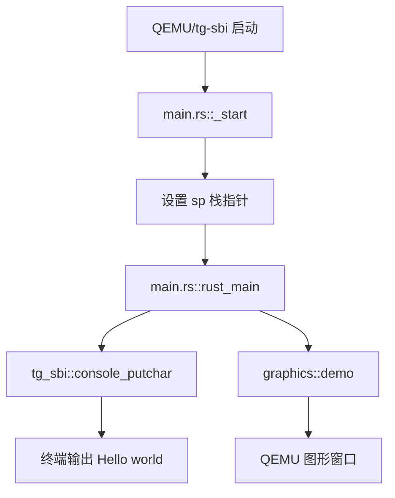
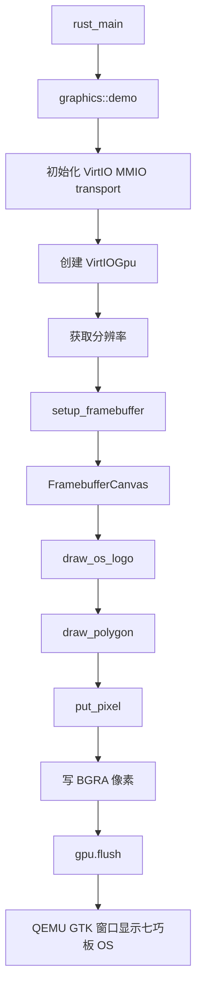

# OS 第一章补充讲述稿：从普通 Hello World 到裸机最小执行环境

> 本文是我在学习 rCore 第一章时，为了把“我大概懂了”变成“我能讲给别人听”而整理的一份补充稿。  
> 它不会只罗列代码，而是尽量从一个没有完整 OS 背景的学习者视角，解释为什么要有这些模块、它们如何连接，以及程序究竟是怎样从一台“什么都没有的机器”上跑起来的。

## 0. 这一章我到底要讲明白什么

第一章表面上只是让程序在 QEMU 里打印 `Hello, world!`，但真正要理解的并不是“打印字符串”本身，而是：

```text
一个程序为什么能开始执行？
它的第一条指令在哪里？
它为什么需要栈？
它为什么平时能用 println!，到了裸机就不能用了？
没有操作系统的时候，谁来帮它输出字符？
```

我一开始容易把 `main.rs` 里的 `main` 或 `rust_main` 当成程序真正的起点，但后来发现这其实是普通应用开发留下来的习惯。在裸机环境里，机器并不知道 Rust 的 `main` 是什么，它只知道从某个地址取机器指令执行。因此，第一章最核心的问题是：

```text
从 CPU 加电开始，到 Rust 代码真正运行，中间到底经过了哪些层？
```

为了讲清楚这个问题，本文按下面 11 个部分展开：

```text
1. 普通 Hello world 背后的隐藏执行环境
2. 目标三元组与 bare-metal
3. no_std：从 std 退到 core
4. panic_handler：补齐 panic 处理
5. no_main：移除标准 runtime 入口
6. _start：机器真正入口
7. linker.ld：入口地址和段布局
8. SBI：裸机下的最小服务层
9. QEMU：模拟完整 RISC-V 机器
10. tg 组件化 ch1 的实际模块对应
11. ch1-tangram：从字符输出扩展到 framebuffer 图形输出
```

## 1. 普通 Hello World 背后的隐藏执行环境

我们平时写的 Rust 程序一般是这样的：

```rust
fn main() {
    println!("Hello, world!");
}
```

这个程序看起来很简单，但它能运行并不是因为这三行代码本身足够完整，而是因为操作系统和标准库在背后已经帮我们做了大量工作。

在普通 Linux、Windows 或 macOS 上，程序的执行环境大概是：

```text
应用程序
  -> Rust 标准库 std
  -> C runtime / libc
  -> 操作系统系统调用
  -> 驱动程序
  -> 硬件
```

也就是说，当我们写：

```rust
println!("Hello, world!");
```

真实发生的并不是“Rust 直接控制屏幕显示文字”，而是：

```text
println!
  -> Rust 标准库格式化字符串
  -> 调用底层输出接口
  -> 通过系统调用请求操作系统
  -> 操作系统把字节写到终端/串口/控制台
  -> 最后硬件或模拟器显示出来
```

所以，普通 Hello World 的完整调用链更像是：

```text
cargo run
  -> rustc 编译 Rust 源码
  -> 链接 Rust 标准库 std
  -> 链接运行时 runtime
  -> 操作系统加载可执行文件
  -> runtime 初始化
  -> 调用 main()
  -> println!
  -> write 系统调用
  -> 终端显示
```

这里有一个很关键的点：普通 `main()` 并不是机器第一条执行的指令。它是被运行时环境调用的。操作系统先加载程序，运行时先做初始化，然后才进入我们写的 `main()`。

因此，第一章要做的事情本质上是把这些依赖一层层拆掉：

```text
std 不要了
普通 main 不要了
操作系统系统调用不要了
运行时 runtime 不要了
```

拆掉之后，就必须自己补上最小的执行环境。

### 自问自答

**问：为什么平时 `println!` 可以直接用？**  
因为普通程序运行在操作系统上，Rust 标准库 `std` 可以借助操作系统提供的系统调用完成输出。

**问：`println!` 是不是直接操作屏幕？**  
不是。它先格式化字符串，再通过标准库和系统调用请求操作系统输出。

**问：为什么这件事到了裸机就变麻烦了？**  
因为裸机没有操作系统，也就没有现成的 `write` 系统调用、终端抽象和标准库输出能力。

## 2. 目标三元组与 bare-metal

Rust 编译程序时需要知道目标平台是什么。这个目标平台通常用“目标三元组”描述。

比如在普通 Windows 上可能是：

```text
x86_64-pc-windows-msvc
```

在 Linux 上可能是：

```text
x86_64-unknown-linux-gnu
```

这些目标都默认有操作系统支持，因此可以使用 `std`。

rCore 第一章的目标是：

```text
riscv64gc-unknown-none-elf
```

可以拆开理解：

```text
riscv64gc
  目标 CPU 是 RISC-V 64 位架构。

unknown
  厂商不重要。

none
  没有操作系统。

elf
  输出 ELF 格式的可执行文件。
```

其中最重要的是 `none`。它说明这个程序不是运行在 Linux 上的 RISC-V 应用，而是运行在没有操作系统的裸机环境中。

这就是 bare-metal。所谓 bare-metal，不是说真的有一块物理开发板，而是说从软件视角看，这个平台没有操作系统帮忙。

所以，如果我们直接把普通 Hello World 编译到这个目标上，就会遇到问题：

```text
can't find crate for `std`
```

这不是 Rust 出错，而是在提醒我们：

```text
你选择的目标平台没有操作系统，因此 Rust 标准库 std 无法使用。
```

### 自问自答

**问：为什么目标三元组里有 `none` 就不能用 std？**  
因为 `std` 依赖操作系统，比如线程、文件、标准输出、堆分配等能力，而 `none` 表示目标平台没有操作系统。

**问：`riscv64gc-unknown-none-elf` 和 `riscv64gc-unknown-linux-gnu` 有什么区别？**  
前者是裸机目标，没有 Linux；后者是运行在 RISC-V Linux 上的应用程序目标。

**问：我们为什么不用 Linux 目标？**  
因为课程目标是写操作系统内核，而不是写运行在 Linux 上的应用。

## 3. no_std：从 std 退到 core

既然裸机没有 `std`，我们就需要在代码开头写：

```rust
#![no_std]
```

它的意思是：

```text
不要链接 Rust 标准库 std，只使用核心库 core。
```

`core` 可以理解为 Rust 最底层、最不依赖环境的一部分。它仍然提供很多语言基础能力，例如：

```text
基本类型
Option / Result
slice / ptr
core::fmt
trait
部分底层内存操作
```

但它不提供：

```text
println!
文件系统
线程
网络
标准输入输出
操作系统系统调用封装
默认堆分配
```

所以 `no_std` 之后，程序从：

```text
main.rs -> std -> OS
```

变成：

```text
main.rs -> core
```

这一步看起来只是加了一个属性，但意义非常大：我们正式把程序从“应用程序开发”拉到了“裸机/内核开发”的语境里。

不过，`no_std` 之后马上会暴露两个问题：

```text
1. println! 没有了
2. panic_handler 没有了
```

第一个问题好理解，`println!` 依赖标准库输出。第二个问题则说明：Rust 即使在底层环境中，也仍然需要知道程序崩溃时怎么办。

### 自问自答

**问：`core` 是不是一个“更小的 std”？**  
可以这么粗略理解，但更准确地说，`core` 是不依赖操作系统的 Rust 核心能力集合。

**问：`no_std` 是不是代表什么库都不能用？**  
不是。可以用 `core`，也可以用其他支持 `no_std` 的第三方库。

**问：为什么 `println!` 不在 core 里？**  
因为输出字符最终需要某种外设或操作系统接口，而 `core` 不能假设这些东西存在。

## 4. panic_handler：补齐 panic 处理

在普通 Rust 程序中，如果发生：

```rust
panic!("error");
```

或者：

```rust
assert!(false);
```

标准库会帮我们打印错误信息，然后终止程序。

但是在 `no_std` 环境中，没有标准库帮忙，所以编译器要求我们自己提供：

```rust
#[panic_handler]
fn panic(_info: &core::panic::PanicInfo) -> ! {
    loop {}
}
```

这里的 `#[panic_handler]` 是一个标记，告诉编译器：

```text
如果程序发生 panic，就跳到这个函数处理。
```

返回类型 `!` 表示这个函数不会正常返回。因为 panic 代表程序已经进入无法正常继续执行的状态，所以它要么死循环，要么关机，要么重启。

在我们当前 tg ch1 里，panic 处理是：

```rust
#[panic_handler]
fn panic(_info: &core::panic::PanicInfo) -> ! {
    shutdown(true)
}
```

也就是说：

```text
panic
  -> 调用 SBI shutdown
  -> 以异常状态退出 QEMU
```

### 自问自答

**问：为什么不实现 panic_handler 就不能编译？**  
因为 Rust 编译器必须知道 panic 发生时调用哪个函数。`std` 中默认有实现，`no_std` 后就需要自己补上。

**问：为什么 panic_handler 不能正常返回？**  
因为 panic 表示程序已经不能按正常逻辑继续执行，返回到原来的位置是不安全的。

**问：第一章里为什么 panic 可以直接关机？**  
因为第一章还没有进程、线程、错误恢复机制。最简单可靠的做法就是停止运行。

## 5. no_main：移除标准 runtime 入口

普通 Rust 程序中，我们写：

```rust
fn main() {}
```

但这个 `main` 并不是 CPU 第一条执行的指令。普通程序真正开始执行时，会先经过操作系统加载和运行时初始化。

大致是：

```text
操作系统加载可执行文件
  -> runtime 初始化
  -> 调用 main()
```

而裸机环境没有操作系统，也没有普通 runtime，所以我们需要写：

```rust
#![no_main]
```

它的意思是：

```text
不要使用 Rust 默认的 main 入口，我自己定义真正的入口。
```

这个真正入口就是 `_start`。

可以这样理解：

```text
main 是高级语言世界里的入口。
_start 是机器启动链路里真正能被跳转到的入口。
```

如果 `no_main` 之后没有 `_start`，程序就会失去明确入口。裸机上 CPU 不会自动理解 Rust 的函数名，也不会帮我们找一个 main 来执行。

### 自问自答

**问：为什么裸机不能直接从 main 开始？**  
因为 main 是 runtime 调用的，而裸机没有 runtime。

**问：`no_main` 是不是删除了主函数？**  
不是删除主逻辑，而是不使用标准入口机制。我们可以自己定义 `rust_main` 作为 Rust 侧主逻辑。

**问：`no_main` 后最需要补什么？**  
需要补 `_start`。否则机器不知道从哪里进入我们的代码。

## 6. `_start`：机器真正入口

`_start` 是第一章最关键的点之一。

Guide 原版一般用 `entry.asm` 来写：

```asm
.section .text.entry
.globl _start
_start:
    la sp, boot_stack_top
    call rust_main
```

这段代码的意思是：

```text
1. 定义一个全局符号 _start
2. 把它放到 .text.entry 段
3. 设置栈指针 sp
4. 跳到 Rust 侧的 rust_main
```

这里容易误解的一点是：`entry.asm` 不是被 `main.rs` 像普通函数一样调用的。恰恰相反，它是更早执行的入口代码。机器先进入 `_start`，然后 `_start` 再跳到 `rust_main`。

也就是说，原版 Guide 的启动关系是：

```text
QEMU/RustSBI
  -> entry.asm::_start
  -> 设置 sp
  -> main.rs::rust_main
```

为什么 `_start` 必须先设置栈指针？

因为 Rust 函数调用需要栈。比如局部变量、返回地址、保存寄存器、函数调用上下文，都可能依赖栈。如果栈指针没有设置，直接进入 Rust 函数，就像在单片机里没有初始化 MSP 就调用 C 函数一样，很容易跑飞。

在 tg 组件化 ch1 中，没有单独的 `entry.asm` 文件，而是把 `_start` 写在 `main.rs` 里：

```rust
#[unsafe(naked)]
#[unsafe(no_mangle)]
#[unsafe(link_section = ".text.entry")]
unsafe extern "C" fn _start() -> ! {
    core::arch::naked_asm!(
        "la sp, {stack} + {stack_size}",
        "j  {main}",
        stack_size = const STACK_SIZE,
        stack = sym STACK,
        main = sym rust_main,
    )
}
```

这其实和 `entry.asm` 做的是同一件事，只是写法变成了 Rust 文件里的内联汇编。

几个标记的含义：

```text
#[unsafe(no_mangle)]
  不让编译器改函数名，保证底层能找到 _start。

#[unsafe(link_section = ".text.entry")]
  把 _start 放进 .text.entry 段，方便链接器把它放到最前面。

#[unsafe(naked)]
  不生成普通函数序言和尾声，因为此时栈还没初始化。

naked_asm!
  直接写最底层启动汇编。
```

### 自问自答

**问：`_start` 和 `rust_main` 谁先执行？**  
`_start` 先执行。它负责设置最小运行环境，然后跳到 `rust_main`。

**问：为什么 `_start` 不能写成普通 Rust 函数？**  
普通 Rust 函数会默认生成函数序言/尾声，可能使用栈。但 `_start` 执行时栈还没准备好，所以要用 naked function 或汇编。

**问：`entry.asm` 和 `main.rs` 里的 `_start` 是什么关系？**  
它们是两种实现方式。Guide 原版用单独汇编文件，tg ch1 把同样逻辑写进了 `main.rs`。

**问：`_start` 不设置栈会怎样？**  
后续 Rust 函数调用可能使用错误的栈地址，导致内存破坏、异常或直接跑飞。

## 7. `linker.ld`：入口地址和段布局

`linker.ld` 是链接脚本。它不是运行时执行的代码，而是编译链接阶段给链接器看的“内存布局说明书”。

它负责回答：

```text
程序入口是谁？
代码段放在哪里？
只读数据放在哪里？
全局变量放在哪里？
.bss 从哪里到哪里？
内核整体从哪个物理地址开始？
```

Guide 中常见配置是：

```ld
OUTPUT_ARCH(riscv)
ENTRY(_start)
BASE_ADDRESS = 0x80200000;

SECTIONS
{
    . = BASE_ADDRESS;

    .text : {
        *(.text.entry)
        *(.text .text.*)
    }

    .rodata : { ... }
    .data : { ... }
    .bss : { ... }
}
```

其中最重要的是：

```text
ENTRY(_start)
  告诉链接器入口符号是 _start。

BASE_ADDRESS = 0x80200000
  告诉链接器内核从这个地址开始布局。

*(.text.entry)
  把 _start 所在的入口段放到代码段最前面。
```

我一开始会把 `linker.ld` 理解成“连接这些程序上下文的东西”，这个说法方向是对的，但可以再准确一点：

```text
linker.ld 不是在运行时连接上下文。
它是在编译链接时决定所有代码和数据在最终内存中的位置。
```

为什么地址这么重要？

因为 QEMU/RustSBI 的启动流程已经约定了：

```text
QEMU 固化代码从 0x1000 开始
  -> 跳到 0x80000000 的 RustSBI
  -> RustSBI 初始化后跳到 0x80200000
  -> 这里必须是内核入口
```

如果链接脚本没有把 `_start` 放到 `0x80200000` 附近，那么 RustSBI 跳过去时就找不到正确的第一条内核指令。

这和 STM32 的复位向量/中断向量表很像：入口地址错了，CPU 就会跳到错误位置执行。

### 自问自答

**问：`linker.ld` 是不是运行时被调用？**  
不是。它是链接阶段使用的配置文件，决定最终 ELF 里各个段的位置。

**问：为什么 `_start` 要放到 `.text.entry`？**  
为了让链接脚本能明确把入口代码放到最前面，保证内核入口地址处就是第一条要执行的代码。

**问：为什么一定要匹配 `0x80200000`？**  
因为 RustSBI 初始化后会把控制权交给这个地址，内核必须在这里准备好入口指令。

**问：如果入口地址错了会怎样？**  
轻则 QEMU 没输出，重则非法指令、异常、死循环。因为 CPU 在错误地址取到了错误内容。

## 8. SBI：裸机下的最小服务层

裸机上没有操作系统，但内核仍然需要一些最基础的服务，例如：

```text
输出一个字符
关机
设置定时器
获取硬件信息
```

这些服务在 rCore 里通过 SBI 提供。

SBI 全称是：

```text
Supervisor Binary Interface
```

可以理解成：

```text
S 态内核向更底层 M 态固件请求服务的接口。
```

在第一章中，内核还很弱，它还不能自己完整驱动所有硬件。所以我们让 RustSBI 或 tg-sbi 这个更底层固件帮忙做一些事情。

字符输出链路大概是：

```text
rust_main
  -> console_putchar
  -> SBI 调用
  -> ecall
  -> M 态固件处理
  -> QEMU 串口输出
```

Guide 原版通常会有：

```text
sbi.rs
  封装 sbi_call、console_putchar、shutdown

console.rs
  在 sbi.rs 基础上实现 print!/println!
```

我们当前 tg ch1 中，`tg-sbi` crate 已经封装了：

```rust
use tg_sbi::{console_putchar, shutdown};
```

所以 `rust_main` 可以直接：

```rust
for c in b"Hello, world!\n" {
    console_putchar(*c);
}
```

这就是第一章最小输出链。

### 自问自答

**问：SBI 是操作系统吗？**  
不是。SBI 更像内核下面的一层固件接口，为 S 态内核提供少量底层服务。

**问：为什么内核不直接操作硬件输出字符？**  
第一章目标是建立最小执行环境，不想一开始就陷入复杂驱动。先借助 SBI 输出字符更简单。

**问：SBI 和系统调用有什么区别？**  
系统调用通常是用户程序请求内核服务；SBI 调用是内核请求更底层固件服务。

## 9. QEMU：模拟完整 RISC-V 机器

QEMU 在这里不是简单的“运行一个程序”，而是在模拟一台 RISC-V 机器。

常见启动命令类似：

```bash
qemu-system-riscv64 \
  -machine virt \
  -nographic \
  -bios rustsbi-qemu.bin \
  -device loader,file=os.bin,addr=0x80200000
```

参数大概含义：

```text
qemu-system-riscv64
  模拟完整 RISC-V 64 位机器。

-machine virt
  使用 QEMU 提供的 virt 虚拟开发板。

-nographic
  不开图形窗口，把串口输出到终端。

-bios rustsbi-qemu.bin
  指定启动固件。

-device loader,file=os.bin,addr=0x80200000
  把内核镜像加载到指定物理地址。
```

QEMU 启动地址链：

```text
0x1000
  QEMU 内置的极小启动代码。

0x80000000
  RustSBI / M 态固件位置。

0x80200000
  rCore 内核入口位置。
```

也就是说：

```text
QEMU 不是直接理解 Rust 代码。
QEMU 只是在模拟 CPU 从某个地址开始取指令。
Rust 代码必须先被编译、链接、放到正确地址，CPU 才能执行。
```

### 自问自答

**问：QEMU 是不是操作系统？**  
不是。QEMU 是模拟器，模拟硬件环境。我们写的内核运行在它模拟的机器上。

**问：为什么 QEMU 要知道内核加载地址？**  
因为它需要把内核镜像放进模拟物理内存的正确位置，否则 RustSBI 跳过去找不到内核。

**问：为什么有时候要把 ELF 转成 bin？**  
因为 ELF 里有元数据，而简单 loader 可能只是逐字节加载文件。bin 更像纯粹的内存镜像。

## 10. tg 组件化 ch1 的实际模块对应

Guide 原版结构比较传统：

```text
os/src
├── entry.asm
├── linker.ld
├── lang_items.rs
├── sbi.rs
├── console.rs
└── main.rs
```

而我们当前 tg 组件化 ch1 更简化：

```text
tg-rcore-tutorial-ch1
├── Cargo.toml
├── .cargo
│   └── config.toml
└── src
    ├── main.rs
    └── graphics.rs
```

对应关系可以这样理解：

| Guide 原版模块 | 作用 | tg ch1 当前对应 |
|---|---|---|
| `entry.asm` | 裸机入口，设置栈，跳到 Rust 主逻辑 | `main.rs::_start` |
| `linker.ld` | 控制入口地址和段布局 | tg 框架内部处理，理解作用即可 |
| `lang_items.rs` | `panic_handler` | `main.rs::panic` |
| `sbi.rs` | SBI 调用封装 | `tg-sbi` crate |
| `console.rs` | `print!/println!` | 当前直接用 `console_putchar` |
| `main.rs` | 内核主逻辑 | `main.rs::rust_main` |
| 无 | 图形扩展 | `graphics.rs` |

当前 `main.rs` 的核心流程是：

```text
_start
  -> 设置栈 sp
  -> 跳到 rust_main

rust_main
  -> console_putchar 输出 Hello world
  -> graphics::demo 绘制图形
  -> loop 保持 QEMU 窗口

panic
  -> shutdown(true)
```

可以画成：



## 11. ch1-tangram：从字符输出扩展到 framebuffer 图形输出

原始 ch1 只输出字符：

```text
rust_main
  -> console_putchar
  -> QEMU 串口
```

我们扩展 ch1-tangram 后，增加了图形输出：

```text
rust_main
  -> graphics::demo
  -> VirtIO-GPU
  -> framebuffer
  -> QEMU GTK 窗口
```

这里最重要的概念是 framebuffer。

framebuffer 可以理解为一块显存/图像缓冲区：

```text
屏幕上的每个像素
  -> 对应 framebuffer 里的一组字节
```

如果格式是 BGRA，那么一个像素通常占 4 字节：

```text
B 蓝色
G 绿色
R 红色
A 透明度/保留位
```

所以画图本质上不是“调用一个高级画图函数”，而是：

```text
计算某个像素的位置
  -> 计算它在 framebuffer 中的下标
  -> 写入颜色字节
  -> flush 通知 GPU 刷新
```

我们当前的图形调用链是：

```text
graphics::demo
  -> MmioTransport::new(0x1000_1000)
  -> VirtIOGpu::new
  -> gpu.resolution()
  -> gpu.setup_framebuffer()
  -> FramebufferCanvas::new
  -> draw_os_logo
  -> draw_polygon
  -> put_pixel
  -> 写 framebuffer
  -> gpu.flush()
```

Mermaid 图：



这里我们也遇到了一个很典型的底层问题：DMA 内存不够。

屏幕大小是：

```text
800 * 480 * 4 字节 = 1,536,000 字节，约 1.5 MiB
```

如果 DMA 池只有 256 KiB，`setup_framebuffer` 就会失败。后来把 DMA pool 调大后，VirtIO-GPU 才能成功申请 framebuffer。

### 自问自答

**问：为什么图形输出比字符输出复杂？**  
字符输出只需要把字节发到串口；图形输出需要初始化 GPU 设备、申请 framebuffer、写像素并刷新。

**问：framebuffer 是什么？**  
可以理解为一块表示屏幕像素的内存。写这块内存，就是在改变屏幕图像。

**问：为什么要 `gpu.flush()`？**  
因为写入 framebuffer 后，需要通知设备把缓冲区内容刷新到显示窗口。

**问：为什么 DMA 池太小会失败？**  
因为 framebuffer 本身需要较大的连续缓冲区。内存池不够时，驱动无法完成显存/缓冲区申请。

## 12. 我现在可以怎样把第一章讲给别人听

如果要用比较通顺的话讲第一章，我会这样说：

> 第一章并不是简单地写一个 Hello World，而是在解释一个程序脱离操作系统后还能不能运行。普通 Rust 程序依赖 `std`、runtime 和操作系统系统调用，所以 `println!` 看起来简单，其实背后有完整执行环境。  
> 当我们把目标平台换成 `riscv64gc-unknown-none-elf` 后，就进入了没有操作系统的裸机环境，`std` 不能用了，于是要用 `#![no_std]` 退回 `core`。没有 `std` 后，panic 处理也没有默认实现，所以要自己写 `panic_handler`。  
> 接着，因为裸机没有标准 runtime，普通 `main` 也不能作为真正入口，所以要 `#![no_main]`，并自己提供 `_start`。`_start` 是机器真正能跳到的入口，它首先设置栈指针，然后再跳到 Rust 侧的 `rust_main`。  
> 为了让机器跳到正确位置，还需要链接脚本安排入口地址和各个段的布局。QEMU 模拟 RISC-V 机器，RustSBI 或 tg-sbi 负责更底层初始化，最后把控制权交给内核入口。内核再通过 SBI 输出字符或关机。  
> 在此基础上，我们进一步把字符输出扩展到图形输出，通过 VirtIO-GPU 获取 framebuffer，直接写像素并 flush 到 QEMU 窗口，实现 ch1-tangram 的七巧板 OS 图案。

## 13. 本章复习问题

下面这些问题可以用来检查自己是不是真的理解了第一章。

### 13.1 为什么普通 Hello World 背后需要执行环境？

因为 `println!` 并不是直接操作硬件，它依赖标准库、系统调用和操作系统终端驱动。普通应用程序能运行，是因为操作系统已经提供了进程加载、内存管理、标准输出等环境。

### 13.2 为什么 bare-metal 不能用 std？

因为 `std` 需要操作系统服务，而 bare-metal 目标没有操作系统。比如文件、线程、标准输出、系统调用，这些都不是 CPU 天生就有的。

### 13.3 `no_std` 后还剩什么？

还剩 `core`。它提供 Rust 语言最基础的能力，但不提供依赖操作系统的功能。

### 13.4 为什么要自己写 `panic_handler`？

因为 `core` 只定义 panic 机制，不提供具体处理方式。没有 `std` 后，编译器需要我们告诉它 panic 时该跳到哪里。

### 13.5 为什么 `no_main` 后要 `_start`？

因为普通 `main` 是 runtime 调用的。裸机没有 runtime，所以必须自己定义机器启动链路能找到的入口 `_start`。

### 13.6 `_start` 为什么要设置栈指针？

因为 Rust 函数调用需要栈。没有正确的 `sp`，函数调用、局部变量、返回地址等都可能出错。

### 13.7 `entry.asm` 和 `main.rs` 的关系是什么？

Guide 原版里，`entry.asm` 提供 `_start`，它先执行，然后跳到 `main.rs` 里的 `rust_main`。tg ch1 中把 `_start` 写进了 `main.rs`，但作用相同。

### 13.8 `linker.ld` 到底在“链接”什么？

它决定最终程序中代码段、数据段、入口段等放在内存的什么位置。它不是运行时函数，而是链接阶段使用的布局脚本。

### 13.9 SBI 和系统调用有什么区别？

系统调用是用户程序请求内核服务；SBI 调用是 S 态内核请求 M 态固件服务。

### 13.10 QEMU 在这里扮演什么角色？

QEMU 模拟完整 RISC-V 机器，包括 CPU、内存和外设。我们的内核不是运行在 Windows/Linux 上，而是运行在 QEMU 模拟出来的裸机上。

### 13.11 framebuffer 为什么能显示图形？

因为 framebuffer 是屏幕像素对应的一块内存。我们把颜色写到对应像素位置，再让 GPU 刷新，窗口中就能看到图形。

## 14. 本章最终理解

第一章最重要的不是背代码，而是建立一个思维：

```text
程序不是天然会运行的。
程序运行需要执行环境。
普通应用的执行环境由操作系统和标准库提供。
内核本身不能依赖另一个操作系统。
所以写内核的第一步，就是自己搭一个最小执行环境。
```

这个最小执行环境包括：

```text
编译目标：riscv64gc-unknown-none-elf
语言环境：no_std + core
错误处理：panic_handler
入口机制：no_main + _start
栈初始化：设置 sp
地址布局：linker.ld / .text.entry
底层服务：SBI
运行平台：QEMU
输出能力：console_putchar / framebuffer
```

我现在对第一章的理解是：

```text
它是从“我写 main，操作系统帮我运行”
过渡到“我自己告诉机器从哪里开始、如何准备栈、如何输出、如何退出”的过程。
```

这也就是操作系统学习真正开始的地方。

