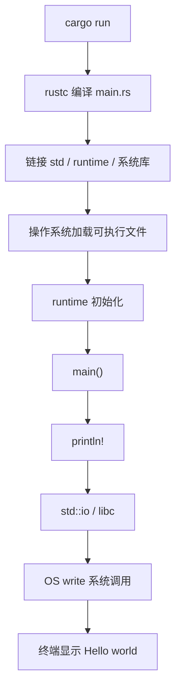
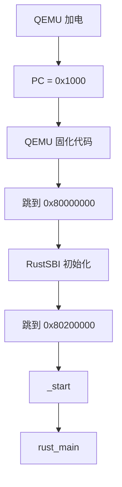
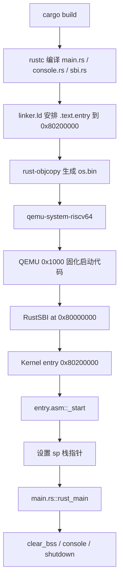
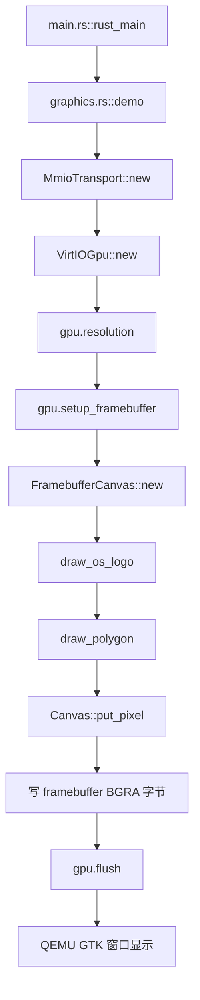
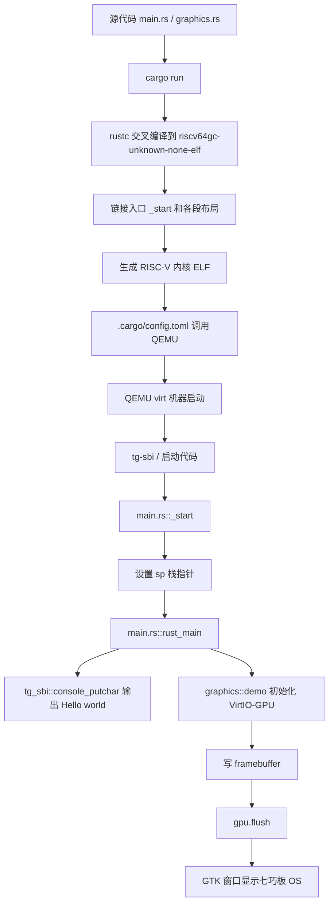

# rCore 第一章代码链与模块对应底稿

> 目标：这份底稿专门整理 rCore Guide 第一章从普通 Rust 程序到 RISC-V 裸机内核的“调用链、代码链、模块职责”。它不是最终提交版，而是给后续手写正式 Markdown 笔记使用的详细母版。

参考页面：

- [第一章：应用程序与基本执行环境 - 引言](https://learningos.cn/rCore-Tutorial-Guide/chapter1/0intro.html)
- [应用程序执行环境与平台支持](https://learningos.cn/rCore-Tutorial-Guide/chapter1/1app-ee-platform.html)
- [移除标准库依赖](https://learningos.cn/rCore-Tutorial-Guide/chapter1/2remove-std.html)
- [构建用户态执行环境](https://learningos.cn/rCore-Tutorial-Guide/chapter1/3mini-rt-usrland.html)
- [构建裸机执行环境](https://learningos.cn/rCore-Tutorial-Guide/chapter1/4mini-rt-baremetal.html)

## 0. 第一章到底在干什么

第一章不是一上来写复杂操作系统，而是做一件很基础但非常重要的事：把一个看起来简单的 `Hello, world!` 程序背后的执行环境一层层剥开。

普通程序能运行，是因为背后已经有很多东西替你准备好了：

```text
Rust 代码
  -> Rust 标准库 std
  -> C runtime / libc
  -> 操作系统系统调用
  -> 驱动程序
  -> 硬件
```

但是我们现在不是写运行在 Linux/Windows 上的应用，而是写“操作系统内核”。操作系统内核本身不能再依赖另一个操作系统，所以第一章的主线就是：

```text
普通 Rust Hello world
  -> 改成 RISC-V 裸机目标
  -> 去掉 std
  -> 去掉普通 main
  -> 自己提供 panic_handler
  -> 自己提供 _start 入口
  -> 自己设置栈
  -> 自己通过 SBI 输出字符/关机
  -> 在 QEMU 模拟的 RISC-V 裸机上运行
```

最终目标可以用一句话概括：

```text
在没有操作系统支持的 RISC-V 裸机环境中，建立一个最小执行环境，让内核能启动、能输出、能退出。
```

## 1. 第一章的总体分层

可以先把第一章理解成 5 层递进。

```text
第 1 层：普通应用程序
  main() -> println! -> std -> OS -> terminal

第 2 层：切换到 bare-metal 目标
  riscv64gc-unknown-none-elf，没有 OS，没有 std

第 3 层：移除 std
  #![no_std]，只剩 core，需要自己补 panic_handler

第 4 层：移除普通 main
  #![no_main]，不再依赖标准 runtime，需要自己提供 _start

第 5 层：裸机最小运行时
  QEMU/RustSBI -> _start -> rust_main -> SBI console/shutdown
```

对应到你熟悉的嵌入式，可以类比成：

```text
普通 Rust main
  类似你在操作系统上写应用

_start
  类似单片机复位后真正跳到的启动入口

linker.ld
  类似 STM32 链接脚本/启动地址/段布局安排

sp 栈指针
  类似启动代码里要先设置 MSP/栈顶，否则 C 函数不能正常调用

SBI
  类似内核向更底层固件请求服务，比方说输出字符、关机
```

## 2. Guide 原版第一章代码结构

Guide 第一章中的传统代码结构大致是：

```text
rCore-Tutorial-Code
├── bootloader
│   └── rustsbi-qemu.bin
└── os
    ├── Cargo.toml
    ├── Makefile
    └── src
        ├── console.rs
        ├── entry.asm
        ├── lang_items.rs
        ├── linker.ld
        ├── logging.rs
        ├── main.rs
        └── sbi.rs
```

每个模块的职责如下：

```text
bootloader/rustsbi-qemu.bin
  RISC-V M 态固件，负责更底层的机器初始化。
  它初始化完成后，把控制权交给内核入口 0x80200000。

os/Cargo.toml
  Rust 项目配置，例如 panic = "abort"、依赖项、编译选项。

os/Makefile
  封装 build/run/debug 等命令。
  最后通常会调用 cargo、rust-objcopy、qemu-system-riscv64。

os/src/entry.asm
  裸机入口汇编。
  负责定义 _start，设置栈 sp，然后跳到 rust_main。

os/src/linker.ld
  链接脚本。
  负责告诉链接器：内核从 0x80200000 开始放，入口符号是 _start，各个段如何排列。

os/src/lang_items.rs
  no_std 环境下补齐 Rust 编译器需要的语义项，主要是 panic_handler。

os/src/sbi.rs
  封装 SBI 调用，例如 shutdown、console_putchar。

os/src/console.rs
  基于 sbi.rs 封装 print!/println! 风格的格式化输出。

os/src/logging.rs
  基于 console.rs 封装日志输出。

os/src/main.rs
  Rust 侧主逻辑，通常提供 rust_main。
```

## 3. 我们当前 tg 组件化 ch1 的实际结构

我们本地使用的是组件化仓库，不是 Guide 最原始的目录，因此结构更紧凑：

```text
tg-rcore-tutorial-ch1
├── Cargo.toml
├── .cargo
│   └── config.toml
└── src
    ├── main.rs
    └── graphics.rs
```

此外它依赖其他 crate：

```text
tg-rcore-tutorial-sbi
  提供 tg_sbi::console_putchar / shutdown
  通过 nobios feature 提供内建的最小 SBI 支持

virtio-drivers
  我们为 ch1-tangram 新增，用来操作 VirtIO-GPU framebuffer
```

Guide 原版和 tg 组件化版本的对应关系：

| Guide 原版模块 | 职责 | tg ch1 当前对应 |
|---|---|---|
| `entry.asm` | 裸机入口，设置栈，跳到 Rust 主函数 | `main.rs::_start`，用 naked function + inline asm 实现 |
| `linker.ld` | 控制入口地址和段布局 | tg 框架内部链接配置处理，理解作用即可 |
| `lang_items.rs` | `panic_handler` | `main.rs::panic` |
| `sbi.rs` | SBI 调用封装 | `tg-sbi` crate |
| `console.rs` | `print!/println!` | 当前直接调用 `console_putchar`，后续可封装 |
| `main.rs` | 内核 Rust 主逻辑 | `main.rs::rust_main` |
| `Makefile` | 构建运行封装 | `.cargo/config.toml` runner + `cargo run` |
| `bootloader/rustsbi-qemu.bin` | 外部 SBI 固件 | `tg-sbi` 的 `nobios` 模式 |
| 无 | 图形扩展 | `graphics.rs`，我们新增的 ch1-tangram 图形模块 |

## 4. 第一层：普通 Rust 应用的调用链

普通 Rust 程序：

```rust
fn main() {
    println!("Hello, world!");
}
```

它看起来只有 3 行，但真实调用链很长：

```text
cargo run
  -> cargo build
  -> rustc 编译 main.rs
  -> 链接 std / runtime / 系统库
  -> 操作系统加载可执行文件
  -> Rust/C runtime 初始化
  -> 调用 main()
  -> println!
  -> std::io
  -> libc / 系统调用 write
  -> 操作系统终端驱动
  -> 屏幕显示 Hello world
```

Mermaid 图：



关键理解：

```text
println! 不是魔法。
它最终还是要让操作系统帮忙把字节写到终端。
```

这也是为什么一旦我们切到没有操作系统的 `riscv64gc-unknown-none-elf`，`println!` 和 `std` 就不能直接用了。

## 5. 第二层：目标三元组和裸机目标

普通电脑上 Rust 默认目标可能类似：

```text
x86_64-pc-windows-msvc
```

或 Linux 下：

```text
x86_64-unknown-linux-gnu
```

这说明程序运行在有操作系统、有标准运行时库的环境。

而 rCore 第一章目标是：

```text
riscv64gc-unknown-none-elf
```

拆开解释：

```text
riscv64gc
  RISC-V 64 位 CPU 架构，带有一组常用扩展。

unknown
  厂商未知。

none
  没有操作系统。

elf
  输出 ELF 格式文件，但没有标准运行时库。
```

当你执行：

```bash
cargo run --target riscv64gc-unknown-none-elf
```

会报类似错误：

```text
can't find crate for `std`
```

真正含义：

```text
Rust 编译器说：你要编译到一个没有 OS 的目标上。
这个目标没有 std，因为 std 本身就需要 OS 支持。
```

所以代码链在这里断了：

```text
main.rs
  -> println!
  -> std
  -> 需要 OS
  -> bare-metal 没有 OS
  -> 编译失败
```

## 6. 第三层：`#![no_std]`，从 std 退回 core

加入：

```rust
#![no_std]
```

意思是：

```text
不要链接 Rust 标准库 std。
只使用不依赖操作系统的核心库 core。
```

`core` 还能提供：

```text
基本类型
Option / Result
slice / ptr
core::fmt
trait
volatile 访问
部分底层抽象
```

`core` 不提供：

```text
println!
文件系统
线程
网络
堆分配
标准输入输出
操作系统系统调用封装
```

所以此时调用链变成：

```text
main.rs
  -> core
  -> 没有 println!
  -> 没有 std runtime
```

这一步会引出两个问题：

```text
问题 1：println! 没了
  因为 println! 属于 std 的高级输出设施。

问题 2：panic_handler 没了
  因为 core 只有 panic 的接口壳子，没有具体处理方式。
```

## 7. 第四层：补 `panic_handler`

`no_std` 后，Rust 编译器仍然要知道 panic 时怎么办。

标准库里一般会做：

```text
打印 panic 信息
杀死当前线程/进程
把错误交给操作系统处理
```

但现在没有 std，也没有操作系统，所以要自己提供：

```rust
use core::panic::PanicInfo;

#[panic_handler]
fn panic(_info: &PanicInfo) -> ! {
    loop {}
}
```

Guide 原版模块对应：

```text
os/src/lang_items.rs
  -> 提供 panic_handler

os/src/main.rs
  -> mod lang_items;
```

tg ch1 当前对应：

```text
src/main.rs
  -> 直接定义 #[panic_handler] fn panic(...)
```

调用链：

```text
assert! 失败 / unwrap 失败 / panic!
  -> core::panic!
  -> 找到 #[panic_handler]
  -> panic 函数
  -> loop 或 shutdown(true)
```

当前 tg ch1 是：

```text
panic
  -> tg_sbi::shutdown(true)
  -> 异常关机退出 QEMU
```

## 8. 第五层：`#![no_main]`，移除普通 main

加入：

```rust
#![no_main]
```

意思是：

```text
不要使用 Rust 标准意义上的 main 入口。
我会自己提供真正入口。
```

普通程序的进入路径：

```text
操作系统加载程序
  -> runtime 初始化
  -> 调用 main()
```

裸机程序的进入路径：

```text
CPU 从某个固定地址开始取指
  -> bootloader / RustSBI
  -> 内核入口 _start
  -> 设置栈
  -> 调用 rust_main
```

所以 `main` 不是机器真正认识的第一入口。机器最后看到的是某个地址上的机器码。我们在裸机里要把这个入口显式做出来，也就是 `_start`。

如果此时只有：

```rust
#![no_std]
#![no_main]
```

但是没有 `_start`，那会得到一个几乎没有实际执行内容的空程序，入口地址也可能不对。

## 9. 第六层：`_start`，真正的裸机入口

Guide 原版用 `entry.asm`：

```asm
.section .text.entry
.globl _start
_start:
    la sp, boot_stack_top
    call rust_main

.section .bss.stack
.globl boot_stack
boot_stack:
    .space 4096 * 16
.globl boot_stack_top
boot_stack_top:
```

它做两件事：

```text
1. 设置 sp 栈指针
2. 调用 rust_main
```

为什么要先设置栈？

因为 Rust 函数调用需要栈。函数参数、返回地址、局部变量、保存寄存器等都可能用到栈。没有栈就直接调用 Rust 函数，很容易乱飞。

tg ch1 当前没有单独 `entry.asm`，而是在 `src/main.rs` 中用 naked function 实现：

```rust
#[unsafe(naked)]
#[unsafe(no_mangle)]
#[unsafe(link_section = ".text.entry")]
unsafe extern "C" fn _start() -> ! {
    const STACK_SIZE: usize = 131072;
    static mut STACK: [u8; STACK_SIZE] = [0u8; STACK_SIZE];

    core::arch::naked_asm!(
        "la sp, {stack} + {stack_size}",
        "j  {main}",
        stack_size = const STACK_SIZE,
        stack = sym STACK,
        main = sym rust_main,
    )
}
```

这里可以这样理解：

```text
#[unsafe(no_mangle)]
  不要改名，让链接器和底层启动代码能找到 _start。

#[unsafe(link_section = ".text.entry")]
  把 _start 放进 .text.entry 段，方便链接器把它放在代码最前面。

#[unsafe(naked)]
  不生成普通函数开头/结尾，因为此时栈还没准备好。

naked_asm!
  直接写启动汇编。
```

调用链：

```text
QEMU/tg-sbi
  -> 跳到内核入口 _start
  -> _start 设置 sp
  -> 跳到 rust_main
```

## 10. 第七层：`linker.ld`，把入口放到正确地址

Guide 原版通过链接脚本控制内存布局：

```ld
OUTPUT_ARCH(riscv)
ENTRY(_start)
BASE_ADDRESS = 0x80200000;

SECTIONS
{
    . = BASE_ADDRESS;

    .text : {
        *(.text.entry)
        *(.text .text.*)
    }

    .rodata : { ... }
    .data : { ... }
    .bss : { ... }
}
```

最重要的三句：

```text
OUTPUT_ARCH(riscv)
  告诉链接器目标架构是 RISC-V。

ENTRY(_start)
  告诉链接器程序入口符号是 _start。

BASE_ADDRESS = 0x80200000
  告诉链接器内核应该从 0x80200000 开始布局。
```

为什么是 `0x80200000`？

Guide 中的启动链是：

```text
QEMU 加电
  -> PC = 0x1000
  -> QEMU 固化启动代码跳到 0x80000000
  -> RustSBI 在 0x80000000 附近运行
  -> RustSBI 初始化后跳到 0x80200000
  -> 执行内核第一条指令
```

所以内核入口必须和 RustSBI 约定的位置匹配。你之前类比 STM32 向量表是很对的：入口地址错了，就像中断向量/复位向量指错位置，CPU 会跑到错误代码上。

Mermaid 图：



## 11. 第八层：为什么要从 ELF 得到 `.bin`

Guide 原版里，构建后会得到 ELF 文件：

```text
target/riscv64gc-unknown-none-elf/release/os
```

ELF 不只是代码和数据，它还有很多元数据：

```text
ELF header
program header
section header
symbol table
debug 信息
真正的 .text/.rodata/.data/.bss 内容
```

QEMU 的简单 loader 如果只是把文件逐字节放到某地址，那么不能直接把带 ELF 头的文件当作“第一条指令从文件第一个字节开始”的镜像。

所以 Guide 用：

```bash
rust-objcopy --strip-all os -O binary os.bin
```

含义：

```text
把 ELF 元数据去掉，只保留真正需要加载进内存的代码/数据。
```

调用链：

```text
cargo build --release
  -> 生成 ELF 可执行文件 os
  -> rust-objcopy 去掉元数据
  -> 得到 os.bin
  -> QEMU loader 把 os.bin 放到 0x80200000
  -> RustSBI 跳到 0x80200000
```

当前 tg ch1 使用 QEMU `-kernel` 和组件化框架，流程和 Guide 不完全一样，但理解 ELF/bin 的差别非常重要，因为后面内核镜像和加载都会反复遇到。

## 12. 第九层：SBI 输出与关机

裸机上没有 `println!`，但我们仍然想输出字符。

Guide 的思路：

```text
console.rs
  -> 格式化输出 print!/println!

sbi.rs
  -> console_putchar / shutdown

RustSBI
  -> 真正帮忙把字符发到 QEMU 控制台，或执行关机
```

调用链：

```text
println!("Hello")
  -> console::_print
  -> core::fmt::Write::write_str
  -> sbi::console_putchar
  -> sbi_call
  -> ecall
  -> RustSBI
  -> QEMU UART
```

tg ch1 当前更直接：

```rust
extern "C" fn rust_main() -> ! {
    for c in b"Hello, world!\n" {
        console_putchar(*c);
    }
    graphics::demo();
    loop {
        core::hint::spin_loop();
    }
}
```

当前调用链：

```text
rust_main
  -> tg_sbi::console_putchar
  -> SBI/ecall/MMIO 相关底层处理
  -> QEMU 串口输出
```

如果未来要补得更像 Guide，可以加：

```text
console.rs
  -> 实现 core::fmt::Write
  -> 封装 print!/println!
```

## 13. 用户态最小执行环境：为什么先做 userland mini runtime

Guide 的第 3 节“构建用户态执行环境”是在做一个过渡实验。

它不是最终裸机内核，而是在已有 OS 上模拟：

```text
如果没有 std，我怎么自己提供 _start、输出、退出？
```

这时用的是 `qemu-riscv64` 用户态模拟，而不是完整机器模拟 `qemu-system-riscv64`。

两种 QEMU 的区别：

```text
qemu-riscv64
  用户态模拟器。
  模拟 RISC-V 用户程序，背后仍然借助宿主 Linux 的系统调用语义。

qemu-system-riscv64
  系统级模拟器。
  模拟完整机器：CPU、内存、外设。
  用来跑操作系统内核。
```

用户态 mini runtime 的代码链：

```text
_start
  -> println!
  -> sys_write
  -> syscall()
  -> ecall
  -> Linux 内核处理 write
  -> 终端输出
  -> sys_exit
  -> ecall
  -> Linux 内核处理 exit
  -> 程序退出
```

模块职责：

```text
main.rs
  提供 _start，组织主流程。

syscall.rs
  用汇编 ecall 发起系统调用。
  封装 sys_write / sys_exit。

console.rs
  基于 sys_write 实现 print!/println!。

lang_items.rs
  提供 panic_handler。
```

为什么不能让 `_start` 直接 `return`？

因为 `_start` 是最底层入口，不是被普通函数调用进来的。普通函数 `return` 需要返回到调用者，但 `_start` 没有正常调用者。它如果直接 `ret`，返回地址可能是垃圾值，就会段错误或跑飞。所以必须调用 `sys_exit` 明确告诉操作系统“我要退出”。

## 14. 裸机执行环境：真正跑在 QEMU virt 机器上

Guide 第 4 节进入真正裸机。

完整链路是：

```text
cargo build
  -> 编译 RISC-V 内核 ELF
  -> 链接脚本安排入口地址
  -> rust-objcopy 得到 os.bin
  -> qemu-system-riscv64 启动 virt 机器
  -> QEMU 固化代码跳到 RustSBI
  -> RustSBI 跳到 0x80200000
  -> _start
  -> 设置 sp
  -> rust_main
  -> clear_bss
  -> println/shutdown
```

模块调用图：



## 15. `.bss` 清零为什么重要

`.bss` 保存未初始化的全局变量。

高级语言默认认为：

```rust
static mut X: usize = 0;
```

这样的未初始化/零初始化全局数据在程序开始时应该是 0。

在普通 OS 里，加载器会帮程序清零 `.bss`。但裸机环境里没有 OS 加载器帮你做，所以要自己清零。

Guide 中：

```rust
fn clear_bss() {
    extern "C" {
        fn sbss();
        fn ebss();
    }
    (sbss as usize..ebss as usize).for_each(|a| {
        unsafe { (a as *mut u8).write_volatile(0) }
    });
}
```

`sbss` 和 `ebss` 来自 `linker.ld`：

```text
sbss
  .bss 段开始地址

ebss
  .bss 段结束地址
```

调用链：

```text
linker.ld 定义 sbss/ebss
  -> rust_main 调用 clear_bss
  -> 逐字节写 0
  -> 全局变量处于预期初始状态
```

## 16. 当前 tg ch1-tangram 的新增图形链

我们在 ch1 基础上扩展了图形输出，核心思路是：

```text
原来：
  rust_main -> console_putchar -> 串口输出 Hello world

现在：
  rust_main -> graphics::demo -> VirtIO-GPU -> framebuffer -> QEMU GTK 窗口
```

当前文件：

```text
src/main.rs
  _start
  rust_main
  panic_handler
  BumpAllocator
  mod graphics

src/graphics.rs
  VirtioHal
  FramebufferCanvas
  draw_os_logo
  demo
```

图形调用链：

```text
rust_main
  -> graphics::demo()
  -> MmioTransport::new(0x1000_1000)
  -> VirtIOGpu::new(transport)
  -> gpu.resolution()
  -> gpu.setup_framebuffer()
  -> FramebufferCanvas::new(framebuffer, width, height)
  -> draw_os_logo(&mut canvas)
  -> draw_polygon(...)
  -> canvas.put_pixel(...)
  -> framebuffer[index] = BGRA
  -> gpu.flush()
  -> QEMU GTK 窗口显示七巧板 OS
```

Mermaid 图：



## 17. 当前本地 ch1 的 QEMU runner

当前 `.cargo/config.toml`：

```toml
[build]
target = "riscv64gc-unknown-none-elf"

[target.riscv64gc-unknown-none-elf]
runner = [
    "qemu-system-riscv64",
    "-machine",
    "virt",
    "-display",
    "gtk",
    "-serial",
    "stdio",
    "-device",
    "virtio-gpu-device,bus=virtio-mmio-bus.0,xres=800,yres=480",
    "-D",
    "qemu.log",
    "-bios",
    "none",
    "-kernel",
]
```

运行时：

```powershell
. C:\Users\FLY\Desktop\OS\setup-rcore-env.ps1
cd C:\Users\FLY\Desktop\OS\tg-rcore-tutorial-test\tg-rcore-tutorial-ch1
cargo run
```

实际链路：

```text
cargo run
  -> 编译 tg-rcore-tutorial-ch1
  -> 读取 .cargo/config.toml
  -> 启动 qemu-system-riscv64
  -> 使用 GTK 显示窗口
  -> 加载内核 ELF
  -> 执行 _start
  -> rust_main
  -> Hello world + 七巧板图形
```

注意：

```text
因为 rust_main 最后 loop，QEMU 窗口会保持打开。
下次运行前如果端口/窗口占用，需要先 kill 旧 QEMU。
```

PowerShell：

```powershell
Get-Process qemu-system-riscv64 -ErrorAction SilentlyContinue | Stop-Process -Force
```

## 18. 第一章完整大调用链

这张图把第一章从编译到运行串起来：



## 19. 你之前问答的修正版答案

### 问题 1：为什么 `println!` 不能直接用了？

你的回答方向是对的：因为 `println!` 依赖 `std`，而 `std` 依赖操作系统提供的系统调用。

修正版：

```text
println! 属于 Rust 标准库 std 提供的高级输出能力。
它最终需要调用操作系统的 write 系统调用。
裸机目标 riscv64gc-unknown-none-elf 没有操作系统，所以没有 std，也没有 write 系统调用封装。
因此必须先移除 println!，后续再自己通过 SBI 或 syscall 实现输出。
```

### 问题 2：为什么要 `panic_handler`？

你的回答方向也是对的：panic 报错需要有一个处理函数，否则编译器不知道出错后怎么办。

修正版：

```text
Rust 的 core 里保留了 panic! 机制，但没有提供具体处理方式。
std 会提供默认 panic 处理，例如打印错误并终止进程。
no_std 环境没有 std，所以必须自己提供 #[panic_handler]。
第一章里可以简单 loop 或 shutdown，因为此时还没有复杂错误恢复机制。
```

### 问题 3：为什么要 `no_main`？

你的类比“普通 C/Rust 默认有 main，但裸机要从 0 开始启动”是对的。

修正版：

```text
普通 main 不是机器第一条指令。
普通程序的 main 是被运行时 runtime 调用的。
裸机环境没有 runtime，所以不能依赖普通 main。
#![no_main] 表示我们不用标准入口，改为自己提供 _start。
```

### 问题 4：为什么没有 `_start` 会是空程序或入口不对？

修正版：

```text
禁用 std 和 main 后，如果没有自己提供 _start，编译器/链接器就找不到明确的程序入口。
即使生成了合法 ELF，也可能没有实际可执行逻辑，入口地址可能是 0。
对裸机来说，入口地址不对就无法启动。
```

### 问题 5：`_start` 和 `rust_main` 有什么区别？

修正版：

```text
_start 是机器启动入口，负责最底层初始化，例如设置 sp。
rust_main 是 Rust 侧主逻辑，通常在栈准备好之后才能安全运行。

_start 更像 STM32 startup.s 里的 Reset_Handler。
rust_main 更像进入 C/Rust 后的主函数。
```

### 问题 6：`linker.ld` 的作用是什么？

修正版：

```text
linker.ld 不是运行时调用的代码，而是编译链接阶段给链接器看的布局说明书。
它决定 .text/.rodata/.data/.bss 放在哪里，也决定 _start 是否位于 QEMU/RustSBI 约定的入口地址。
```

### 问题 7：SBI 是什么？

修正版：

```text
SBI 是 Supervisor Binary Interface。
在 rCore 第一章里，内核运行在 S 态，RustSBI/tg-sbi 运行在更底层的 M 态。
内核可以通过 ecall 请求 SBI 服务，例如输出字符、关机。
它有点像“内核下面的极简固件服务层”。
```

### 问题 8：为什么图形输出本质是写 framebuffer？

修正版：

```text
屏幕图像本质上是一块像素数组。
每个像素通常由若干字节表示颜色，例如 BGRA。
我们通过 VirtIO-GPU 拿到 framebuffer，然后把七巧板图案对应的颜色写入这块内存。
最后 gpu.flush() 通知设备刷新，QEMU 窗口就显示图形。
```

## 20. 第一章可以写进正式笔记的核心总结

第一章可以总结成：

```text
第一章完成了从“依赖操作系统的普通 Rust Hello world”到“自己提供最小执行环境的 RISC-V 裸机程序”的转变。

这个过程依次移除了 std、普通 main、标准 runtime，并补上了 panic_handler、_start、栈初始化、链接布局和 SBI 输出。

在 tg 组件化实验中，这些传统模块被压缩或封装到了 main.rs、tg-sbi crate 和 .cargo/config.toml 中。

进一步的 ch1-tangram 扩展则把字符输出扩展为图形输出：通过 VirtIO-GPU 获取 framebuffer，直接写像素并 flush 到 QEMU GTK 窗口。
```

## 21. 复习时最该盯住的 10 个点

```text
1. std 为什么依赖 OS？
2. core 和 std 的区别是什么？
3. no_std 后为什么缺 println!？
4. no_std 后为什么要 panic_handler？
5. no_main 后为什么要 _start？
6. _start 为什么要先设置 sp？
7. linker.ld 为什么要把入口放到 0x80200000？
8. QEMU -> RustSBI -> kernel 的启动地址链是什么？
9. SBI console_putchar 和普通 println! 有什么区别？
10. framebuffer 图形输出为什么本质是写内存？
```

## 22. 后续手写正式版建议结构

正式笔记可以按下面顺序写：

```text
1. 普通 Hello world 背后的隐藏执行环境
2. 目标三元组与 bare-metal
3. no_std：从 std 退到 core
4. panic_handler：补齐 panic 处理
5. no_main：移除标准 runtime 入口
6. _start：机器真正入口
7. linker.ld：入口地址和段布局
8. SBI：裸机下的最小服务层
9. QEMU：模拟完整 RISC-V 机器
10. tg 组件化 ch1 的实际模块对应
11. ch1-tangram：从字符输出扩展到 framebuffer 图形输出
```

