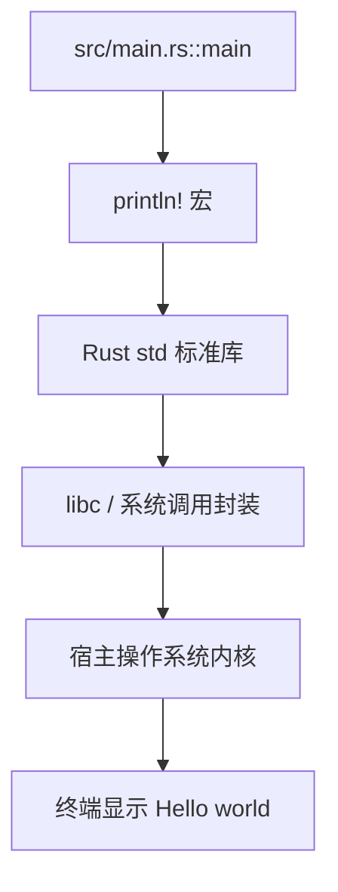
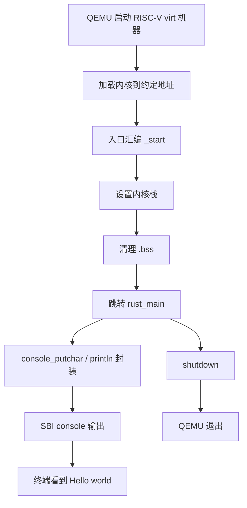

# rCore ch1 执行流程归纳：从普通程序到裸机内核

> 本文件用于整理 ch1 的“从 0 到能在 QEMU 裸机上运行”的完整流程。重点不是背代码，而是讲清楚：普通 Rust 程序为什么不能直接变成内核，为什么要有 `_start`、`linker.ld`、SBI 和 QEMU。

## 1. 本章要解决的问题

普通 `Hello, world!` 程序看起来只有几行：

```rust
fn main() {
    println!("Hello, world!");
}
```

但它背后默认依赖了完整的执行环境：

- Rust 标准库 `std`
- 操作系统提供的系统调用
- C/Rust runtime 帮我们调用 `main`
- 操作系统加载 ELF、准备栈、初始化内存

ch1 的目标是把这些“别人帮我们做的事情”一点点拿回来，最终形成一个最小内核：

- 不依赖宿主 OS 的 `std`
- 有自己的入口 `_start`
- 有自己的链接布局
- 可以通过 SBI 输出字符
- 可以被 QEMU 当作 RISC-V 裸机内核启动

## 2. 普通程序阶段：`cargo run` 背后的隐藏层

在普通 Linux/Windows/macOS 上运行 Rust 程序时，流程大概是：



这里的关键点是：`println!` 不是 CPU 自己会的东西，它最终要请求操作系统帮忙把字符写到终端。

因此，当我们要写“操作系统内核本身”时，不能再依赖一个已经存在的操作系统。否则逻辑会变成：

```text
我要写操作系统
  -> 但是我的代码依赖操作系统才能运行
  -> 这就循环依赖了
```

所以 ch1 第一刀就是：去掉 `std`。

## 3. 目标三元组：从宿主程序变成裸机程序

普通电脑上 Rust 默认目标可能是：

```text
x86_64-pc-windows-msvc
x86_64-unknown-linux-gnu
```

这类目标都默认有操作系统和标准库。

rCore 使用的裸机目标是：

```text
riscv64gc-unknown-none-elf
```

它可以拆开理解：

```text
riscv64gc  -> CPU 指令集是 RISC-V 64 位
unknown    -> 厂商不重要
none       -> 没有操作系统
elf        -> 输出 ELF 格式文件
```

因此它没有 `std`，只能使用不依赖操作系统的 `core`。

## 4. `no_std`：从 `std` 退回 `core`

内核入口文件会加：

```rust
#![no_std]
```

它的含义是：

```text
不要链接 Rust 标准库 std
只使用核心库 core
```

`core` 里面保留了 Rust 语言最基础的能力，例如：

- 基本类型
- `Option` / `Result`
- slice / 引用 / trait 等核心机制

但它不提供：

- 文件系统
- 网络
- 线程
- 标准输入输出
- `println!`

所以 `println!` 暂时不能用了。

## 5. `panic_handler`：自己补一个崩溃处理

去掉 `std` 后，编译器会问：如果代码 panic 了怎么办？

普通程序里，`std` 会帮我们打印错误并退出进程。但裸机内核没有这些服务，所以必须自己提供：

```rust
#[panic_handler]
fn panic(_info: &PanicInfo) -> ! {
    loop {}
}
```

这段代码的意思是：

```text
如果发生 panic，先不打印、不退出，就原地死循环。
```

这里的 `-> !` 表示函数永不返回。

## 6. `no_main`：不要默认 runtime 入口

普通 Rust 程序不是 CPU 一开机就执行 `main`。

实际流程是：

```text
操作系统加载程序
  -> runtime 初始化
  -> 设置栈、参数、环境变量等
  -> 调用 main
```

但裸机环境没有这个 runtime，所以要加：

```rust
#![no_main]
```

它表示：

```text
不要再假设有普通意义上的 main 入口。
机器真正的第一条指令由我们自己指定。
```

这就是后面 `_start` 出场的原因。

## 7. `_start`：机器真正入口

ch1 里会有类似 `entry.asm` 的汇编入口：

```asm
.section .text.entry
.globl _start
_start:
    ...
```

几个关键点：

- `_start` 是一个符号，表示内核第一条指令的位置。
- `.globl _start` 表示这个符号对链接器可见。
- `.text.entry` 是专门放入口代码的段。
- 入口代码通常要先设置栈，再跳到 Rust 函数。

为什么不直接从 Rust `main` 开始？

因为 CPU 启动时只认识机器指令地址，不认识 Rust 的高级语义。Rust 编译器可以把 Rust 编译成机器码，但“第一条机器码应该放在哪里、谁来跳过去”要靠 `_start` 和链接脚本指定。

## 8. `linker.ld`：把代码放到正确物理地址

QEMU + RustSBI 约定：内核入口在 `0x80200000`。

因此链接脚本要告诉链接器：

```ld
ENTRY(_start)
BASE_ADDRESS = 0x80200000;
```

可以把 `linker.ld` 理解成：

```text
不是写程序逻辑，而是规定程序各部分在内存中怎么摆放。
```

典型布局：

```text
0x80200000
  .text.entry  -> _start，第一条指令
  .text        -> 普通代码
  .rodata      -> 只读数据
  .data        -> 已初始化全局变量
  .bss         -> 未初始化全局变量，需要清零
```

如果链接地址错了，RustSBI 跳到 `0x80200000` 时可能看到的不是入口指令，内核就会直接飞掉。

这和嵌入式里向量表/启动地址配错非常像。

## 9. SBI：裸机下的最小服务层

SBI 可以理解成 RISC-V 裸机世界里的“最小固件服务接口”。

在 ch1 中，我们暂时不自己写串口驱动，而是调用 SBI：

```text
内核 console_putchar
  -> SBI call
  -> QEMU / RustSBI
  -> 宿主终端显示字符
```

这不是完整操作系统，只是帮助内核启动初期完成一些底层服务。

## 10. QEMU：模拟一台 RISC-V 机器

本地或云端执行 `cargo run` 时，最终会启动类似：

```text
qemu-system-riscv64
  -machine virt
  -bios none 或 RustSBI
  -kernel target/.../tg-rcore-tutorial-ch1
```

可以这样理解：

```text
宿主 Windows/Linux 上运行了一个 QEMU 程序
QEMU 在软件里模拟一台 RISC-V 电脑
我们的内核被加载到这台“假电脑”的内存里
CPU 从约定入口开始执行
```

## 11. ch1 组件化仓库中的模块对应

在 tg-rCore ch1 中，大致对应关系是：

```text
tg-rcore-tutorial-ch1/
  Cargo.toml              -> crate 配置
  .cargo/config.toml      -> cargo run 时如何启动 qemu
  src/main.rs             -> 内核主逻辑，rust_main 在这里
  src/entry.asm 或启动组件 -> 设置栈并跳入 Rust
  src/linker.ld 或构建脚本 -> 规定内核地址布局
  tg-rcore-tutorial-sbi   -> SBI 调用封装，例如 console_putchar/shutdown
```

实际调用链可以概括为：



## 12. ch1-tangram 的扩展理解

ch1-tangram 是在最小内核上扩展图形输出。

普通 ch1 只会字符输出：

```text
内核 -> SBI console -> 终端字符
```

图形版需要进一步变成：

```text
内核 -> VirtIO-GPU / framebuffer -> 像素数组 -> QEMU 图形窗口
```

这里的核心变化不是“操作系统突然高级了”，而是输出目标变了：

- 字符输出：写一个字节到 console
- 图形输出：把颜色值写进 framebuffer

framebuffer 可以理解成一块二维显存：

```text
screen[y][x] = RGB 颜色
```

七巧板图案本质就是一组几何图形或像素区域，被画到 framebuffer 中。

## 13. 本章最重要的自查问题

### Q1：为什么 `println!` 不能直接用？

因为 `println!` 依赖 `std`，而 `std` 依赖操作系统系统调用。我们正在写操作系统内核，不能反过来依赖一个已经存在的操作系统。

### Q2：`no_std` 是不是等于没有 Rust？

不是。`no_std` 只是不用标准库，Rust 的核心语言能力仍然在 `core` 里。

### Q3：为什么要 `panic_handler`？

因为 `core` 只提供 panic 机制的壳，不提供具体处理方式。内核必须告诉编译器 panic 后怎么做。

### Q4：为什么要 `no_main`？

因为普通 `main` 依赖 runtime 帮忙调用。裸机没有 runtime，所以入口必须自己定义。

### Q5：`_start` 和 `main.rs` 是什么关系？

`_start` 是机器入口，CPU 先执行它；`main.rs` 里的 Rust 函数是 `_start` 设置好基本环境后跳过去执行的高级逻辑。

### Q6：`linker.ld` 是不是代码逻辑？

不是。它规定代码和数据在内存里的摆放方式，尤其是入口地址必须和 QEMU/RustSBI 约定一致。

### Q7：SBI 是操作系统吗？

不是。它更像固件服务层，帮助早期内核完成字符输出、关机等底层操作。

## 14. 一句话总结

ch1 的本质是：把普通程序背后由操作系统和 runtime 偷偷完成的事情拆开，然后在裸机环境中手动补回最小的一套启动、布局、输出和退出机制。

