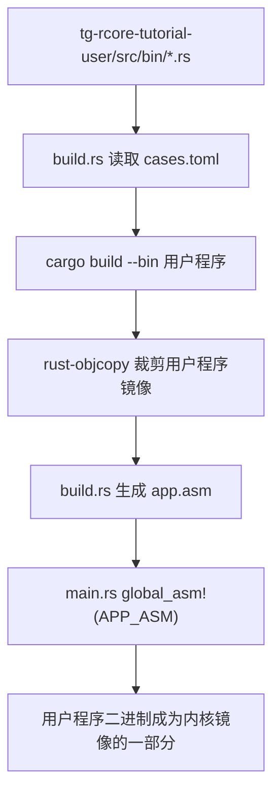
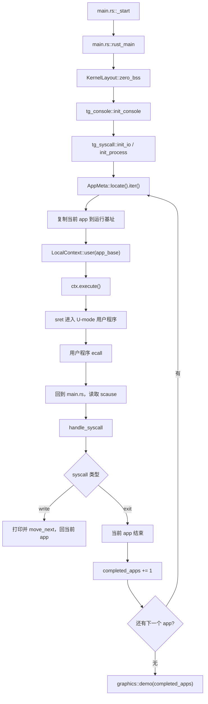
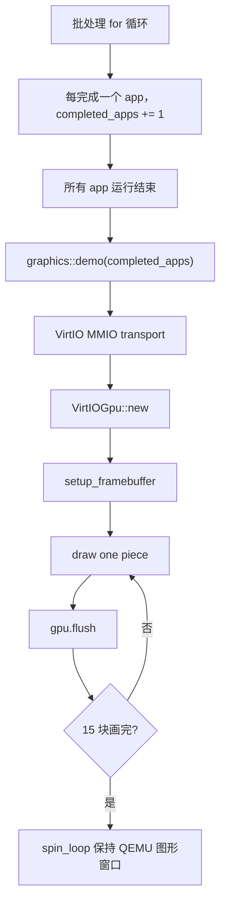

# rCore ch2 代码链与模块对应底稿

> 本文用于整理 ch2 批处理系统和 ch2-moving-tangram 扩展实验的代码调用链。它不是最终论文式总结，而是后续写学习报告时可以直接拆改的底稿。

## 1. ch2 要解决什么问题

ch1 的重点是让内核自己能在裸机上启动，并通过 SBI 打印字符。ch2 往前走了一步：内核不再只是“自己运行”，而是开始成为用户程序的执行环境。

ch2 的核心能力可以概括成：

```text
把多个用户程序提前打包进内核
  -> 内核运行时找到这些程序
  -> 一次运行一个用户程序
  -> 用户程序通过 ecall 请求内核服务
  -> 当前程序 exit 后运行下一个程序
```

这个模型叫批处理系统。它还不是 ch3 的分时多任务，因为 ch2 没有时间片轮转，也没有多个任务来回切换。它的特点是顺序、自动、一个接一个。

## 2. 本仓库 tg 组件化 ch2 的实际结构

传统 rCore 教程里 ch2 常见结构有 `batch.rs`、`trap/`、`syscall/` 等目录。当前组件化仓库把很多能力封装到外部 crate 中，所以本章主线更集中：

```text
tg-rcore-tutorial-ch2/
├── build.rs
│   ├── 读取 tg-rcore-tutorial-user/cases.toml
│   ├── 编译 ch2 对应用户程序
│   ├── 必要时用 rust-objcopy 生成用户程序二进制
│   └── 生成 app.asm，并通过 APP_ASM 链接进内核
├── .cargo/config.toml
│   ├── 指定 riscv64gc-unknown-none-elf 目标
│   ├── 配置 QEMU runner
│   └── 配置 tg 用户程序目录
├── src/main.rs
│   ├── _start：设置内核栈并跳到 rust_main
│   ├── rust_main：初始化内核并批处理运行 app
│   ├── handle_syscall：处理用户程序 ecall
│   └── impls：实现 console / syscall trait
├── src/graphics.rs
│   ├── VirtioHal：给 virtio-drivers 提供 DMA 和地址转换
│   ├── FramebufferCanvas：向 framebuffer 写像素
│   ├── piece(index)：返回七巧板图形块
│   └── demo(completed_apps)：逐块渲染 O/S 图案
└── ../tg-rcore-tutorial-user/
    ├── cases.toml：决定 ch2 跑哪些用户程序，以及装载基址
    └── src/bin：各个用户态测试程序
```

## 3. 构建期调用链

ch2 的用户程序不是从文件系统读出来的，因为此时还没有文件系统。它们是在构建内核时被打包进内核镜像的。



这里的 `app.asm` 负责记录：

```text
base：用户程序运行时复制到哪里
step：多个 app 是否分散到不同地址
count：app 数量
app_i_start / app_i_end：每个 app 在内核镜像里的边界
.incbin：把 app 二进制原样嵌入
```

## 4. 运行期批处理调用链

当前组件化 ch2 的运行主链在 `src/main.rs::rust_main()` 里。



关键点：

```text
LocalContext::user(app_base)
```

这一步不是普通函数调用，而是在准备一个用户态上下文。之后 `ctx.execute()` 会恢复寄存器并通过 `sret` 进入 U-mode。

## 5. syscall 调用链

用户程序不能直接调用内核函数，只能通过 `ecall` 进入内核。

```text
用户程序 println!
  -> user_lib 的 write 封装
  -> tg_syscall user 侧 syscall
  -> asm!("ecall")
  -> CPU 从 U-mode 进入 S-mode
  -> 内核读取 a7 和 a0-a5
  -> tg_syscall::handle
  -> SyscallContext::write / exit
```

寄存器约定：

```text
a7：syscall id
a0-a5：参数
a0：返回值
sepc：用户程序 ecall 所在 PC
```

处理完非 exit syscall 后需要：

```text
ctx.move_next()
```

也就是让 `sepc += 4`，否则返回用户态后会再次执行同一条 `ecall`。

## 6. ch2-moving-tangram 扩展调用链

进阶任务要求基于 ch2 的多程序/多批次机制，逐块渲染七巧板组成的 “O/S” 图案。当前实现采用“批处理完成计数 + 内核统一逐块绘制”的方式：



这版不是让每个用户程序真正直接画一块，而是把“完成了多少个批处理程序”映射到“图形逐块出现”。它的教学价值是把抽象的批处理节奏可视化。

## 7. 图形模块职责

`src/graphics.rs` 主要分成四层：

```text
VirtioHal
  给 virtio-drivers 提供 DMA 分配、物理/虚拟地址转换。

FramebufferCanvas
  把 RGB 转成 framebuffer 中的 BGRA 像素。

draw_polygon / contains
  用多边形填充算法画三角形和四边形。

demo(completed_apps)
  初始化 VirtIO-GPU，逐块画 O/S 七巧板并 flush。
```

一个像素写入大概是：

```text
index = (y * width + x) * 4
framebuffer[index + 0] = B
framebuffer[index + 1] = G
framebuffer[index + 2] = R
framebuffer[index + 3] = A
```

## 8. 本次调试中最关键的地址问题

原始 ch2 的 app 装载基址是：

```text
0x8040_0000
```

加入 VirtIO-GPU、DMA 静态缓冲区和绘图代码后，内核镜像明显变大。继续把用户程序复制到 `0x8040_0000`，容易覆盖内核区域或与内核区域靠得过近。

现象：

```text
QEMU 能启动
串口输出停在 [ch2] app meta ready
看不到 load app0
图形窗口 inactive
```

修正：

```text
tg-rcore-tutorial-user/cases.toml
[ch2]
base = 0x8100_0000
```

修正后能看到：

```text
load app0 to 0x81000000
...
load app7 to 0x81000000
[ch2-tangram] init virtio gpu
```

这说明批处理流程已正常跑完，并进入图形初始化。

## 9. 当前验证状态

已完成：

```text
cargo build 通过
QEMU 能用绝对路径启动
ch2 app0-app7 能顺序运行
VirtIO-GPU 能进入初始化并获取 display info
O/S 图案能在 QEMU 图形窗口显示
S 右侧越界问题已通过把坐标压回 640 宽 framebuffer 内修正
```

需要注意：

```text
当前 demo 为了让图形窗口保留，最后使用 spin_loop。
因此课程原 test.sh 基础 checker 不适合直接验证这个进阶图形版本。
若要跑自动 checker，需要临时切回 shutdown(false)，或增加 feature 区分 test/demo 模式。
```

