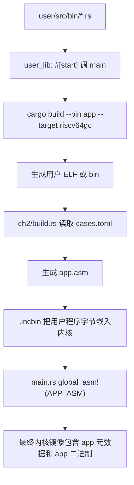
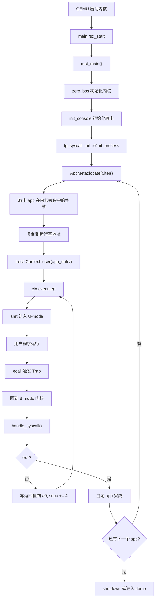
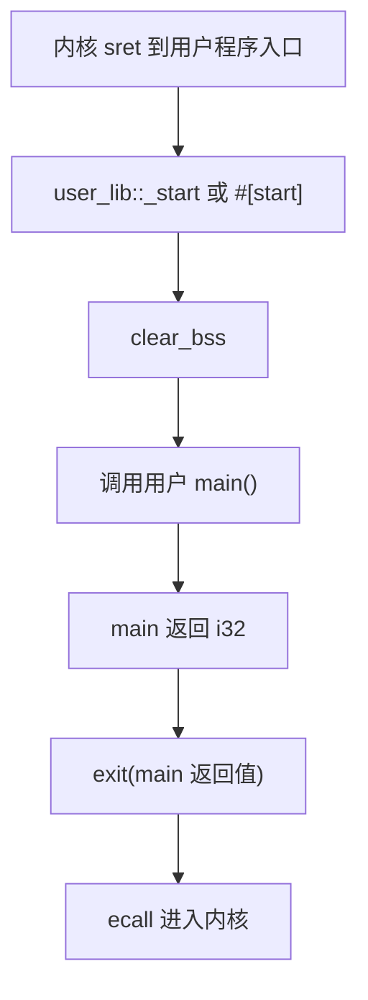
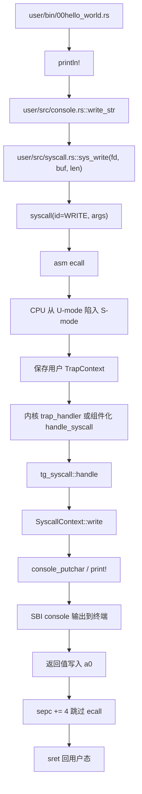
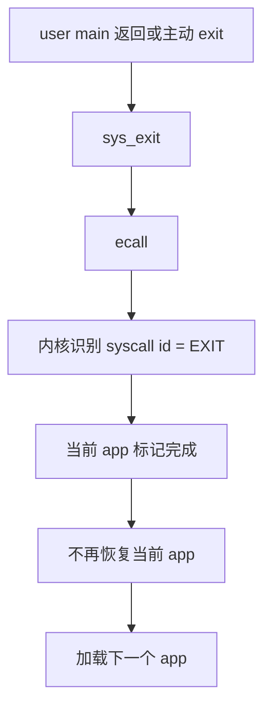

# rCore ch2 代码链与模块对应底稿

## 0. 这一章到底在解决什么

ch1 只证明“内核自己能在裸机上启动，并能借助 SBI 打印字符”。ch2 开始让内核成为用户程序的执行环境：用户程序不再和内核写在一起，而是作为独立应用被编译、打包、加载、运行。

这一章的关键词是：

```text
应用程序
批处理
系统调用
Trap
TrapContext
用户态 U-mode
内核态 S-mode
```

最重要的一句话：

```text
ch2 建立了“用户程序 -> ecall -> 内核处理 -> 返回用户程序/运行下一个程序”的基本闭环。
```

## 1. Guide 原文代码树和当前组件化仓库的区别

Guide 里的传统 rCore ch2 通常会出现这样的结构：

```text
os/
├── build.rs
├── src/
│   ├── batch.rs
│   ├── console.rs
│   ├── entry.asm
│   ├── lang_items.rs
│   ├── link_app.S
│   ├── linker.ld
│   ├── main.rs
│   ├── sbi.rs
│   ├── syscall/
│   │   ├── fs.rs
│   │   ├── mod.rs
│   │   └── process.rs
│   └── trap/
│       ├── context.rs
│       ├── mod.rs
│       └── trap.S
└── user/
    ├── src/lib.rs
    ├── src/syscall.rs
    └── src/bin/*.rs
```

而组件化 `tg-rcore-tutorial-ch2` 把很多通用能力抽到 crate 里，所以本章源码看起来更集中：

```text
tg-rcore-tutorial-ch2/
├── build.rs
├── src/main.rs
└── src/graphics.rs

tg-rcore-tutorial-user/
├── cases.toml
├── src/lib.rs
├── src/syscall.rs
└── src/bin/*.rs
```

对应关系：

```text
Guide 的 batch.rs
  -> 当前仓库 main.rs + tg_linker::AppMeta

Guide 的 trap/context.rs + trap.S
  -> 当前仓库 tg-kernel-context crate 的 LocalContext

Guide 的 syscall/fs.rs/process.rs/mod.rs
  -> 当前仓库 tg-syscall crate + main.rs 里的 SyscallContext 实现

Guide 的 link_app.S
  -> 当前仓库 build.rs 生成的 app.asm，通过 APP_ASM 链接进内核

Guide 的 user_lib
  -> tg-rcore-tutorial-user/src/lib.rs 和 syscall.rs
```

所以组件化版本不是没有这些概念，而是把它们封装到了 crate 或更集中的模块里。学习时不能只看文件数量，要把 Guide 的结构映射到当前仓库。

## 2. 构建期：用户程序如何变成内核的一部分

ch2 没有文件系统，所以用户程序不是运行时从磁盘读出来的，而是在构建内核时被打包进内核镜像。



`app.asm` 里大概保存：

```text
base：运行时把 app 复制到哪个地址
step：多个 app 间的地址间隔
count：app 数量
app_0_start/app_0_end：app 在内核镜像中的边界
.incbin：把 app 字节原样嵌入
```

你之前问过“这是 app 在内核里的地址，还是 app 运行时的地址”。答案是两层：

```text
app_0_start/app_0_end
  是 app 被嵌入内核镜像后的存放位置。

base + i * step
  是内核运行时把 app 复制过去的运行位置。
```

这就形成了：

```text
内核镜像中的 app 字节
  -> AppMeta 找到边界
  -> copy 到约定运行地址
  -> 从该运行地址进入用户态执行
```

## 3. 运行期：批处理系统主链路



这是 ch2 的批处理系统：一次只运行一个 app。当前 app 不 exit，内核不会主动跑下一个 app。

## 4. 用户程序自己的启动链

用户态不是直接从 `main()` 开始的。`tg-rcore-tutorial-user/src/lib.rs` 会提供一个最小运行时入口。



你之前问过：“为什么不直接执行 main？”

原因是：哪怕是用户程序，也需要一个很小的运行时做准备工作。比如清空 `.bss`，调用 `main`，并在 `main` 返回后自动 `exit`。如果没有这层，`main` 返回后 CPU 不知道下一步去哪里，程序可能乱跑。

## 5. `println!` 到 `sys_write` 的完整链路

这是你当时最想理顺的一条链。用户程序打印字符，并不是直接写终端，而是通过系统调用请求内核写。



寄存器约定：

```text
a7：系统调用编号，比如 SYS_WRITE
a0-a5：系统调用参数
a0：返回值
sepc：发生 Trap 时用户程序的 PC
scause：Trap 原因
sstatus：特权状态
```

如果内核处理完 `write` 不执行 `sepc += 4`，返回用户态后会再次执行同一条 `ecall`，程序就会卡在同一个系统调用上。

## 6. TrapContext 保存了什么

在 Guide 原文中，TrapContext 是非常核心的结构。它保存的是“用户态被打断时的现场”。

可以理解为：

```text
TrapContext = 用户程序暂停瞬间的寄存器快照
```

典型内容包括：

```text
x[0..31]：通用寄存器
sstatus：进入 Trap 前后的特权状态
sepc：用户程序被打断的位置
```

当用户程序执行 `ecall`：

```text
U-mode 用户程序
  -> ecall
  -> 硬件切 S-mode
  -> trap.S 保存寄存器到 TrapContext
  -> trap_handler 根据 scause 处理
  -> __restore 从 TrapContext 恢复寄存器
  -> sret 回用户态
```

组件化版本里这些底层细节被 `tg-kernel-context::LocalContext` 封装，但理解上仍然是 TrapContext 这条逻辑。

## 7. `sys_exit` 和运行下一个程序

当用户程序调用 `exit`：



这里和 `write` 不同：

```text
write：处理完还要回到当前用户程序。
exit：处理完当前用户程序结束，不再回去。
```

这就是批处理系统的“一次一个”：只有当前程序 exit 后，才轮到下一个程序。

## 8. ch2-moving-tangram 和基础流程的关系

图形化七巧板不是 ch2 基础机制的核心，而是扩展实验。它把“多个程序按批次执行”的抽象节奏可视化。

本仓库的实现思路可以理解为：

```text
批处理执行 app0
批处理执行 app1
...
批处理执行 appN
内核根据完成数量或固定图案绘制七巧板 O/S
VirtIO-GPU 刷新 framebuffer
```

它不是替代批处理，而是建立在批处理完成之后的展示层。

## 9. 本章最容易混淆的三组地址

第一组：内核镜像地址

```text
app 被 .incbin 放在内核镜像里的位置。
```

第二组：用户程序运行地址

```text
内核把 app 复制到 base 指定地址后，从这里进入用户态。
```

第三组：物理地址

```text
ch2 还没有页表，所以运行地址基本就是物理地址。
```

到 ch4 后会变成：

```text
用户虚拟地址 -> 页表 -> 物理地址
```

所以 ch2 是后面虚拟内存机制的铺垫。

## 10. 一句话总结 ch2

```text
ch2 让内核第一次真正成为用户程序的执行环境：它能加载用户程序，切到 U-mode 执行，处理 ecall，再根据 exit 顺序执行下一个程序。
```

## 11. 细化版：从源码到运行的 32 个步骤

下面这一段是给自己讲课时用的“慢动作版本”。它不追求短，而是把每一步都拆开，方便我对着 Guide 和组件化代码树逐项解释。

1. `user/src/bin/*.rs` 是用户程序源码，每个文件可以理解成一个独立应用。
2. 用户程序不是直接依赖 Rust 标准库，而是依赖 `user_lib` 这层最小用户态运行库。
3. `user_lib` 提供 `_start` 或 `#[start]`，所以用户程序不是一进来就运行 `main`。
4. `_start` 先清理用户程序自己的 `.bss`，保证未初始化全局变量从 0 开始。
5. `_start` 再调用用户写的 `main()`，这才进入真正的应用逻辑。
6. 用户 `main()` 返回后，`user_lib` 会自动调用 `exit(code)`，不让 CPU 乱跑。
7. 构建内核时，`build.rs` 会根据 `cases.toml` 确定本章要打包哪些用户程序。
8. 每个用户程序会被编译成 RISC-V 裸机目标上的 ELF 或二进制内容。
9. `build.rs` 生成类似 Guide 中 `link_app.S` 的汇编文件，在组件化版本里表现为 `app.asm`。
10. `app.asm` 用 `.incbin` 把用户程序字节原样塞进内核镜像。
11. 这些字节此时还不是“正在运行的用户程序”，只是“被存放在内核镜像里的数据”。
12. `app.asm` 还会记录每个 app 的起止边界，例如 `app_0_start`、`app_0_end`。
13. `main.rs` 通过 `global_asm!(APP_ASM)` 把这个自动生成的汇编文件纳入最终链接。
14. 链接完成后，内核镜像里同时包含内核代码、内核数据、用户 app 的二进制字节。
15. QEMU 启动后先执行内核入口，ch1 的 `_start/linker/SBI` 机制仍然是基础。
16. 内核初始化 `.bss`、console、日志和 syscall 处理环境。
17. 内核运行时通过 `AppMeta::locate()` 找到构建期嵌入进来的 app 元数据。
18. `AppMeta` 告诉内核：有几个 app，每个 app 在内核镜像中的字节边界在哪里。
19. 对于 app0，内核先根据 `app_0_start..app_0_end` 取出它的原始字节。
20. 内核把这段字节复制到约定运行地址，例如 `base + 0 * step`。
21. ch2 还没有页表，所以这里的运行地址基本就是物理地址，不存在虚拟地址翻译。
22. 复制完成后，内核构造用户态上下文，入口 PC 指向 app 的运行地址。
23. 用户态上下文还要设置特权状态，让 `sret` 后 CPU 进入 U-mode 而不是继续留在 S-mode。
24. 用户栈也要被设置好，否则 app 一调用函数或保存局部变量就会出问题。
25. 内核执行 `ctx.execute()` 或 Guide 中的 `__restore/sret` 路径，把控制权交给用户程序。
26. app 在 U-mode 中运行，不能直接访问内核函数，也不能直接碰 SBI 或硬件。
27. app 要打印时，`println!` 会走到用户态 `sys_write` 包装函数。
28. `sys_write` 把 syscall id 放入 `a7`，把 `fd/buf/len` 放入 `a0/a1/a2`。
29. app 执行 `ecall` 后，CPU 根据 `stvec` 跳到内核 Trap 入口。
30. Trap 入口保存用户寄存器到 TrapContext 或组件化 `LocalContext` 中，防止用户现场丢失。
31. 内核读取 `scause` 知道这是 UserEnvCall，再读取 `a7` 知道它请求 `write`。
32. `write` 输出完成后，内核把返回值写回 `a0`，把 `sepc += 4`，最后 `sret` 回用户程序。

如果系统调用是 `exit`，第 32 步不同：内核不会再返回当前 app，而是标记当前应用结束，加载下一个 app。

## 12. 更细的模块职责表

| 模块或文件 | Guide 里的角色 | 组件化仓库里的对应 | 我应该怎么讲 |
| --- | --- | --- | --- |
| `user/src/bin/*.rs` | 用户应用 | `tg-rcore-tutorial-user/src/bin/*.rs` | 真正被内核运行的应用程序，不是内核代码 |
| `user/src/lib.rs` | 用户库入口 | 同名用户库 crate | 提供 `_start -> main -> exit` 的生命周期 |
| `user/src/syscall.rs` | 发起系统调用 | 同名用户库 syscall 包装 | 负责把 id 和参数放寄存器，然后 `ecall` |
| `os/build.rs` | 生成 app 链接信息 | `tg-rcore-tutorial-ch2/build.rs` | 构建期把 app 变成内核镜像中的数据 |
| `link_app.S` | 嵌入 app 二进制 | 自动生成 `app.asm` | 用 `.incbin` 把 app 字节塞进内核 |
| `batch.rs` | 批处理管理 | `main.rs + AppMeta` | 找 app、复制 app、进入 app、处理 app 结束 |
| `trap.S` | 保存/恢复 TrapContext | `tg-kernel-context` | 保存用户现场，处理完再回用户态 |
| `trap/mod.rs` | trap 分发处理 | `main.rs` 调度和 `handle_syscall` | 根据 `scause` 判断 ecall/异常 |
| `syscall/mod.rs` | syscall 总分发 | `tg_syscall::handle` | 根据 syscall id 调不同实现 |
| `syscall/fs.rs` | write/read | `impl IO for SyscallContext` | 用户打印最终走这里 |
| `syscall/process.rs` | exit/yield | `impl Process/Scheduling` | 控制应用生命周期 |
| `console.rs` | 内核输出 | `tg-console/tg-sbi` | 最终调用 SBI 或 console putchar |

## 13. `sys_write` 的寄存器级慢动作

以用户程序执行 `println!("hello")` 为例：

1. `println!` 先把格式化结果交给用户态 `console::Stdout`。
2. `Stdout::write_str` 调用 `write(fd=1, buf, len)`。
3. `write` 再调用 `sys_write`。
4. `sys_write` 调用通用 `syscall(SYS_WRITE, [fd, buf, len])`。
5. 内联汇编把 `SYS_WRITE` 放进 `a7`。
6. 内联汇编把 `fd` 放进 `a0`，一般 `1` 表示 stdout。
7. 内联汇编把字符串缓冲区地址放进 `a1`。
8. 内联汇编把字符串长度放进 `a2`。
9. `ecall` 触发从 U-mode 到 S-mode 的 Trap。
10. CPU 自动设置 `sepc/scause/sstatus` 等 CSR。
11. Trap 入口把普通寄存器也保存起来，形成 TrapContext。
12. 内核读取 `a7=SYS_WRITE`，知道这是写操作。
13. 内核读取 `a0/a1/a2`，知道写哪个 fd、从哪里读用户数据、读多少。
14. ch2 没有页表隔离，所以读取用户 buffer 比 ch4 以后简单。
15. 内核把用户 buffer 中的字节交给 console。
16. console 再通过 SBI 或串口输出到 QEMU 终端。
17. 内核把写入长度或成功返回值写回 `a0`。
18. 内核把 `sepc += 4`，让用户程序跳过刚才那条 `ecall`。
19. `sret` 恢复到 U-mode。
20. 用户程序从 `sys_write` 返回，继续执行下一行代码。

## 14. ch2 和后续章节的关系

1. ch2 第一次区分了“内核代码”和“用户程序”。
2. ch2 第一次建立了 U-mode 和 S-mode 的往返路径。
3. ch2 的 app 仍然是顺序执行，所以还没有真正的任务调度。
4. ch2 的地址仍然比较“直给”，因为没有页表。
5. ch3 会把“当前 app”扩展成“多个任务的 TCB 数组”。
6. ch4 会把“直接物理地址”扩展成“用户虚拟地址到物理地址的页表映射”。
7. ch5 会把“顺序 app”扩展成“进程和父子关系”。
8. ch6 会把“程序构建期嵌入”扩展成“从文件系统加载/访问文件”。

所以 ch2 是后面所有章节的第一条地基：没有 ch2 的 Trap/syscall/user runtime，就没有后面的多任务、地址空间和文件系统。
