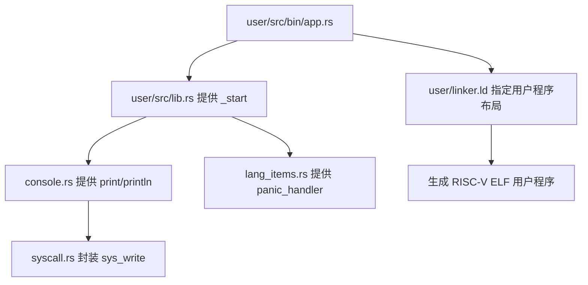
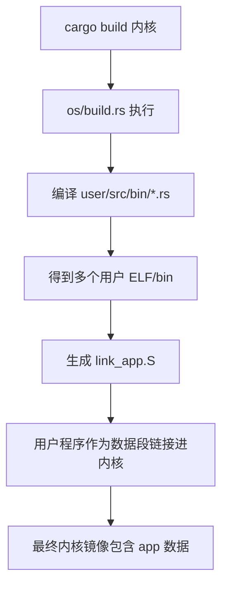
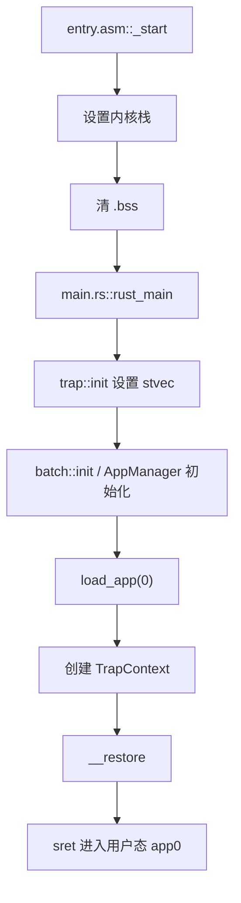
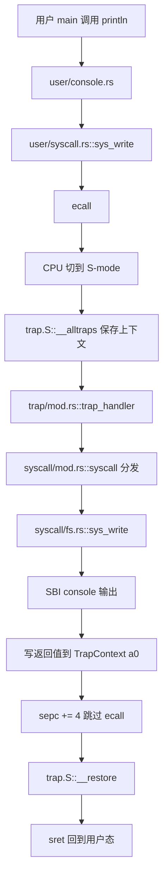

# rCore ch2 执行流程归纳：批处理系统与用户态/内核态往返

> 本文件整理 ch2 的完整流程。ch2 的核心是：内核不再只打印 Hello world，而是能加载并执行用户程序；用户程序不能直接操作硬件，必须通过系统调用进入内核。

## 1. 本章要解决的问题

ch1 只有一个内核本体，没有真正的用户程序。ch2 开始引入：

- 用户态程序 `user/src/bin/*.rs`
- 用户库 `user/src/lib.rs`
- 系统调用 `syscall`
- Trap 机制
- 批处理加载器

本章可以看成一个最简单的“自动运行多个程序”的系统：

```text
内核启动
  -> 找到第一个用户程序
  -> 切到用户态执行
  -> 用户程序 exit
  -> 内核加载下一个用户程序
  -> 直到所有程序执行完
```

## 2. 用户程序编写与编译

用户程序一般位于：

```text
user/src/bin/*.rs
```

用户代码里可以写：

```rust
println!("hello");
```

但这里的 `println!` 不是标准库的 `println!`，而是用户库 `user_lib` 自己封装出来的。

用户态构建流程：



关键点：

- 用户程序没有普通 `main` 入口，而是由 `user/src/lib.rs` 中的 `_start` 调用用户 `main`。
- `_start` 在用户态负责清 BSS、调用 `main`、最后调用 `exit`。
- 用户程序的链接脚本会把程序放到固定用户虚拟/物理基址附近，例如 `0x10000`。

## 3. 用户库的作用

用户库可以理解成“用户态的小 runtime”。

它负责：

- 定义 `_start`
- 提供 `println!`
- 提供 `sys_write` / `sys_exit`
- 提供 panic 处理

典型调用链：

```text
用户 main()
  -> println!
  -> console.rs::write_str
  -> syscall.rs::sys_write
  -> syscall(id=SYS_WRITE, args)
  -> ecall
  -> 进入内核
```

所以用户库不是内核，它只是帮用户程序把高级接口变成系统调用。

## 4. 内核构建阶段：把用户程序打包进内核

ch2 的批处理系统通常会在构建内核时处理用户程序：

```text
os/build.rs
  -> 扫描 user/src/bin
  -> 编译每个用户程序
  -> 生成 link_app.S
  -> 把应用二进制嵌入内核数据段
```

可以理解成：

```text
用户程序不是运行时从硬盘读取的
而是编译内核时就一起塞进内核镜像
```

典型数据结构包括：

- 应用数量
- 每个应用起始地址
- 每个应用结束地址
- 应用名称

构建阶段流程：



## 5. 内核启动流程

ch2 的内核启动还是从 ch1 的裸机启动延续而来：

```text
QEMU
  -> _start
  -> 设置栈
  -> 清 BSS
  -> rust_main
```

进入 `rust_main` 后，ch2 会额外做：

- 初始化日志
- 初始化 Trap 入口
- 初始化批处理系统
- 加载第一个用户程序
- 切换到用户态

整体流程：



## 6. 批处理加载逻辑

批处理系统的关键是：一次只运行一个应用。

常见流程：

```text
AppManager 保存当前 app_id
load_app(app_id)
  -> 找到 app 对应的二进制数据
  -> 清空用户程序区域
  -> 把 app 复制到固定地址
  -> 刷新 icache
  -> 准备进入用户态
```

为什么要清空用户程序区域？

因为所有程序都被加载到同一个固定地址。如果不清空，旧程序残留数据可能影响新程序。

为什么要刷新指令缓存？

因为刚刚把新程序机器码复制到内存里，CPU 可能还缓存着旧指令。刷新后才能确保取到新程序的指令。

## 7. Trap 与系统调用

ch2 通过 Trap 建立用户态和内核态之间的往返。

以 `sys_write` 为例：



这条链很重要：

```text
用户程序不能直接写终端
  -> 它只能 ecall 请求内核
  -> 内核检查 syscall id
  -> 内核执行真正操作
  -> 再返回用户态
```

## 8. 用户程序退出与加载下一个

用户程序执行结束后调用：

```text
sys_exit(exit_code)
```

流程：

```text
用户 app0 调用 exit
  -> ecall 进入内核
  -> trap_handler 识别 SYS_EXIT
  -> mark app0 finished
  -> AppManager.current_app += 1
  -> load_app(app1)
  -> __restore 进入 app1
```

所以 ch2 的“调度”非常简单：

```text
不是抢占
不是并发
不是时间片
只是一个程序结束后，再运行下一个
```

## 9. 本章模块对应

```text
os/
  build.rs              -> 构建时生成 link_app.S，嵌入用户程序
  src/main.rs           -> 内核主入口 rust_main
  src/batch.rs          -> 批处理应用管理、load_app
  src/trap/mod.rs       -> trap_handler
  src/trap/trap.S       -> __alltraps / __restore
  src/syscall/mod.rs    -> syscall 分发
  src/syscall/fs.rs     -> sys_write
  src/syscall/process.rs-> sys_exit

user/
  src/lib.rs            -> 用户态 _start
  src/console.rs        -> 用户态 println 封装
  src/syscall.rs        -> ecall 封装
  src/bin/*.rs          -> 具体用户程序
  src/linker.ld         -> 用户程序内存布局
```

## 10. ch2 与后续章节的关系

ch2 奠定了三件事：

1. 用户程序和内核分离。
2. 用户通过系统调用请求内核服务。
3. 内核可以批量运行多个应用。

但 ch2 仍然很弱：

- 所有用户程序共用同一个加载地址。
- 一次只能运行一个。
- 没有地址空间隔离。
- 没有进程父子关系。

这些问题会在 ch3、ch4、ch5 逐步解决。

## 11. 一句话总结

ch2 的本质是：把“内核自己运行”升级成“内核作为管理者，按批次加载用户程序，并通过 Trap/系统调用在用户态和内核态之间往返”。

