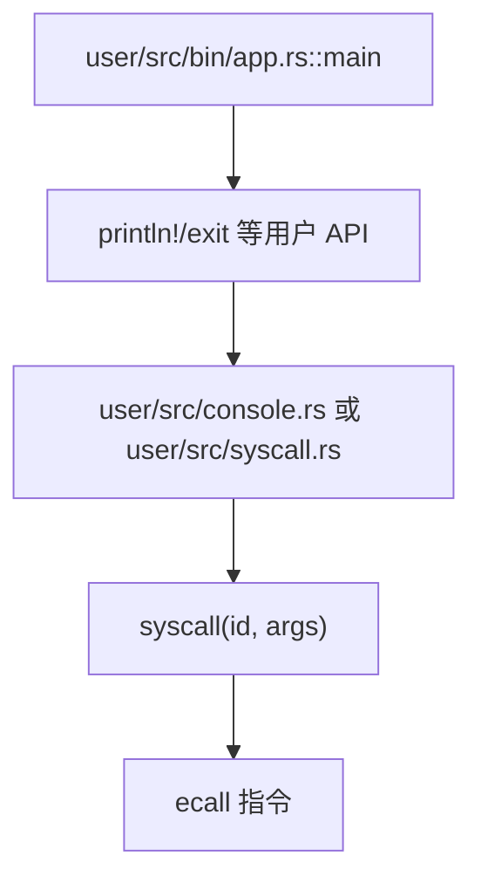
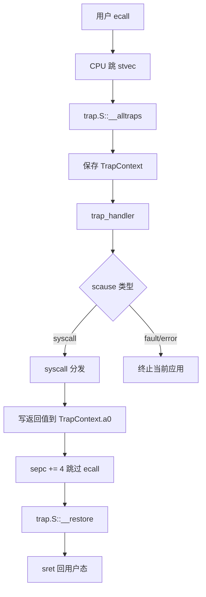
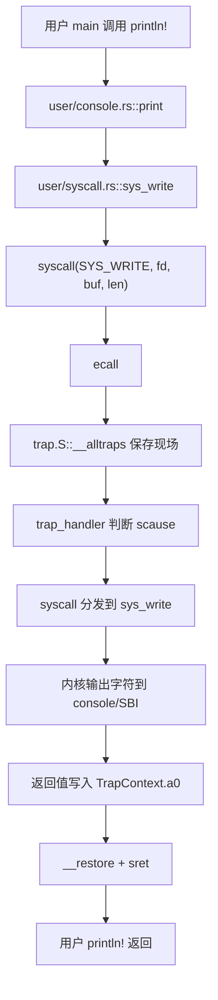
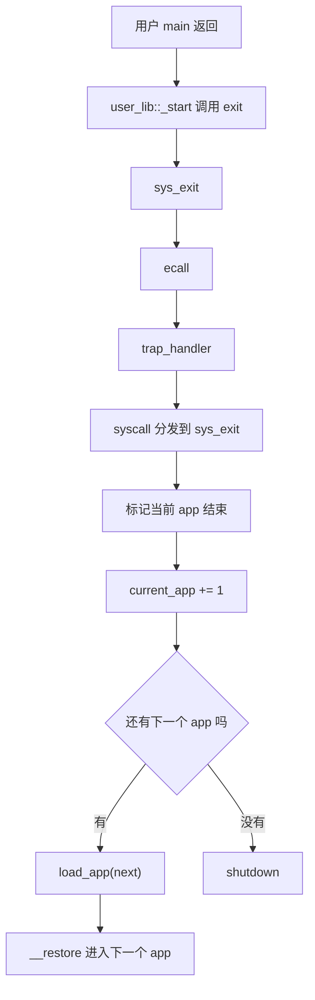

# rCore ch2 批处理与 syscall 模块关系精讲版

> 这一版重点不是“程序怎么跑完一个再跑下一个”的表面流程，而是讲清：用户态库、`ecall`、Trap、syscall 分发、批处理加载器之间到底是什么关系。ch2 是后面所有章节的地基，因为它第一次把“用户程序”和“内核服务”分开。

## 0. 先把一句话说准

第二章的核心是：

```text
用户程序不能直接操作硬件或内核资源；
它只能通过用户库封装的 syscall 方法执行 ecall；
ecall 触发 trap 进入内核；
内核 trap_handler 判断这是系统调用后，再交给 syscall 分发具体服务；
批处理系统负责一个程序退出后加载下一个程序。
```

这里最容易混的是：

```text
syscall 不是 CPU 自动切换特权级的机制；
ecall/trap 才是进入内核的底层机制；
syscall 是内核在 trap 之后进行的软件分发。
```

## 1. ch2 相对 ch1 多了什么

ch1 只有内核自己：

```text
内核启动
  -> 输出 Hello world
  -> 关机
```

ch2 开始出现真正的用户程序：

```text
user/src/bin/*.rs
```

于是系统被分成两层：

```text
用户态程序
  -> 写业务逻辑，比如 println、exit

内核态程序
  -> 管理加载、输出、退出、切换到下一个程序
```

这就是操作系统最基本的分层：

```text
用户程序不能为所欲为；
内核提供受控服务。
```

## 2. 用户态模块关系

用户目录里常见结构：

```text
user/src/lib.rs
  -> 用户库入口，提供 _start

user/src/syscall.rs
  -> syscall 方法封装，内部执行 ecall

user/src/console.rs
  -> print/println 宏封装，最终调用 sys_write

user/src/lang_items.rs
  -> panic_handler

user/src/bin/*.rs
  -> 具体用户程序 main

user/linker.ld
  -> 用户程序链接布局，比如入口地址和段位置
```

关系图：



这里要讲清楚：

```text
用户程序 main 不是机器第一条入口；
user_lib::_start 才是用户程序入口；
_start 做完初始化后调用 main；
main 返回后 _start 再调用 exit。
```

所以用户态自己的小 runtime 是：

```text
_start
  -> clear_bss
  -> main
  -> exit
```

## 3. syscall 方法和 ecall 的区别

用户库里可能有一个函数叫：

```rust
fn syscall(id: usize, args: [usize; 3]) -> isize
```

它本身只是普通函数封装。

真正让 CPU 进入内核的是：

```text
ecall 指令
```

调用关系：

```text
println!
  -> sys_write
  -> syscall(SYS_WRITE, ...)
  -> 把 id 放 a7，参数放 a0/a1/a2
  -> ecall
```

所以你给别人讲的时候可以这样说：

```text
syscall 函数是用户库提供的“统一拨号器”；
ecall 是真正拨出去的那一下；
trap 是 CPU 接到这个拨号后强制进入内核的机制；
内核 syscall 分发器是接线员，决定转到 sys_write 还是 sys_exit。
```

## 4. Trap 是什么

Trap 是 CPU 的异常/中断进入机制。

ch2 最重要的是同步异常：

```text
Environment call from U-mode
```

也就是用户态执行 `ecall`。

CPU 会做：

```text
保存异常原因到 scause；
保存用户程序返回地址到 sepc；
切到 S-mode；
跳到 stvec 指定的 trap 入口。
```

trap 不是 syscall 专用。以后它还会处理：

```text
时钟中断；
page fault；
非法指令；
外设中断。
```

ch2 里主要拿它处理系统调用。

## 5. trap.S 和 trap_handler 的关系

`trap.S` 是底层现场保存/恢复。

它负责：

```text
__alltraps:
  保存用户寄存器到 TrapContext
  调用 Rust 的 trap_handler

__restore:
  从 TrapContext 恢复寄存器
  sret 回用户态
```

`trap_handler` 是 Rust 逻辑判断。

它负责：

```text
看 scause 是什么；
如果是 syscall，就调用 syscall 分发；
如果是错误，就杀掉当前应用；
如果 exit，就加载下一个应用。
```

关系：



## 6. syscall 分发层是什么

内核 syscall 层不是特权级切换本身。

它更像：

```text
根据系统调用号 id，调用对应的内核服务函数。
```

例如：

```text
SYS_WRITE -> sys_write
SYS_EXIT  -> sys_exit
```

`sys_write` 可能会调用 console/SBI 输出字符。

`sys_exit` 会通知批处理系统当前应用结束。

所以层次是：

```text
ecall/trap：负责进内核
syscall 分发：负责找服务
sys_write/sys_exit：负责真正干活
```

## 7. 批处理系统是什么

批处理系统不是调度器的最终形态。

它只做：

```text
当前应用结束后，加载下一个应用。
```

核心结构一般是 AppManager：

```text
num_app
current_app
app_start[]
```

其中 `app_start` 记录每个用户程序在内核镜像中的起止地址。

构建时：

```text
build.rs 扫描用户程序
  -> 编译成二进制
  -> 生成 link_app.S
  -> 把用户程序嵌入内核
```

运行时：

```text
load_app(app_id)
  -> 找到 app 起止地址
  -> 清空用户程序加载区域
  -> 把 app 复制到固定地址
  -> 刷新 icache
  -> 构造 TrapContext
  -> __restore 进入用户态
```

## 8. 为什么 ch2 一次只能运行一个

因为 ch2 没有保存多个用户程序的运行状态。

它的模型是：

```text
app0 加载到固定地址
app0 运行
app0 exit
app1 覆盖同一块地址
app1 运行
```

所以：

```text
app0 一旦退出，就不能恢复；
app1 是重新加载后开始运行；
没有真正的并发和时间片。
```

这和 ch3 的区别很大：

```text
ch2：一个程序跑完，再加载下一个。
ch3：多个任务都保留上下文，轮流恢复执行。
```

## 9. sys_write 的完整链路



这条链说明：

```text
println 不是直接输出；
println 最终是 sys_write；
sys_write 不是直接从用户态执行；
它必须通过 ecall/trap 进入内核。
```

## 10. sys_exit 的完整链路



## 11. ch2 的模块精髓

```text
user_lib：
  把用户 API 封装成 syscall。

ecall：
  触发从 U-mode 到 S-mode 的同步异常。

trap：
  CPU 进入内核的统一机制。

trap.S：
  保存/恢复寄存器现场。

trap_handler：
  判断异常原因，决定调用 syscall 或终止应用。

syscall：
  软件分发器，根据 id 调用具体内核服务。

batch/AppManager：
  管理当前运行到第几个应用，负责加载下一个。
```

## 12. ch2 和后续章节的连接

```text
ch2 建立用户态/内核态往返：
  ecall -> trap -> syscall -> __restore。

ch3 在这个基础上加入任务上下文：
  不再 exit 后加载下一个，而是 yield/timer 后切换到另一个任务。

ch4 在这个基础上加入地址空间：
  用户传入的指针变成用户虚拟地址，内核需要页表翻译。

ch5 在这个基础上加入进程：
  不再只是预置 app，而是 fork/exec/waitpid 动态管理生命周期。
```

## 13. 给别人讲第二章时可以这样说

第二章真正建立的是用户态和内核态之间的服务边界。用户程序不能直接操作内核资源，它只能调用用户库里的 syscall 封装，最终执行 ecall。ecall 触发 CPU trap 进入内核，trap.S 保存用户现场，trap_handler 根据 scause 判断这是系统调用，再交给 syscall 分发器调用 sys_write、sys_exit 等具体服务。批处理系统 AppManager 负责在一个程序 exit 后加载下一个程序。它还不是多任务，只是顺序执行多个应用，但它奠定了后面所有章节的基础：用户请求内核服务，都要走 ecall/trap/syscall 这条路。

