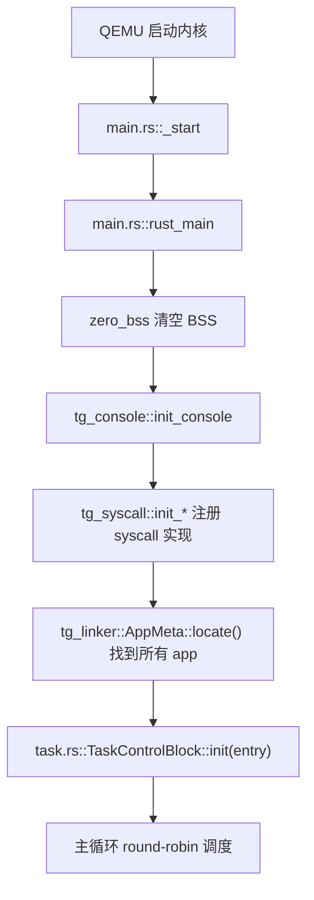
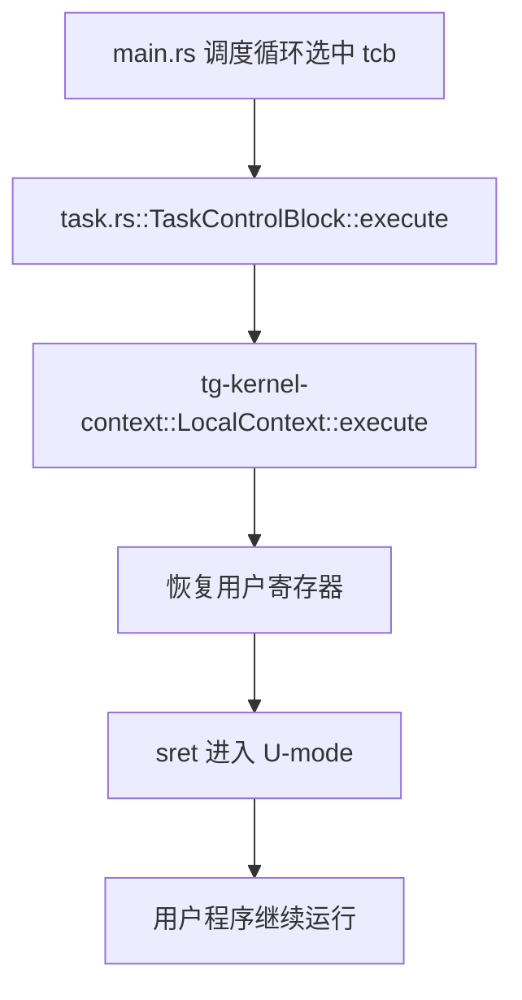
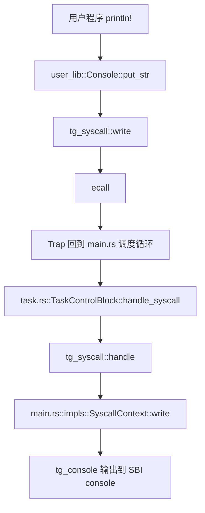
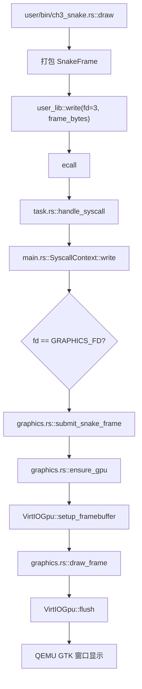
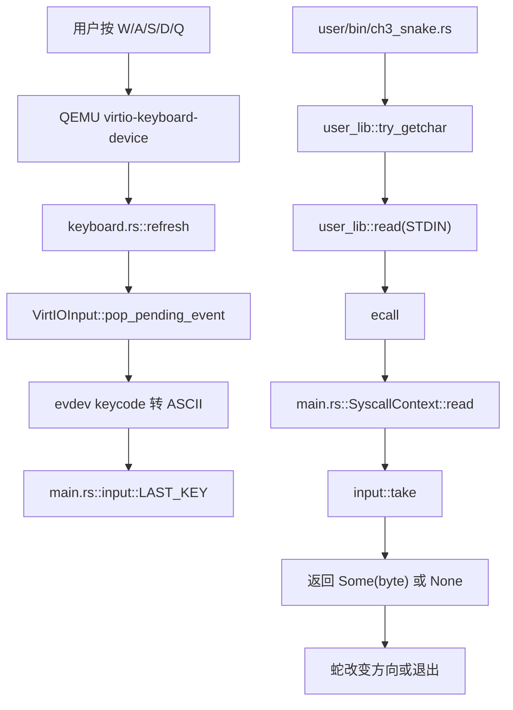
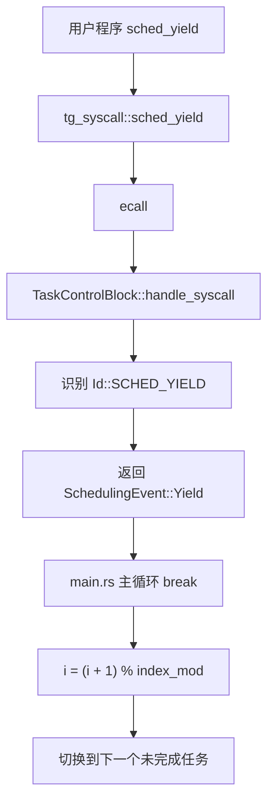
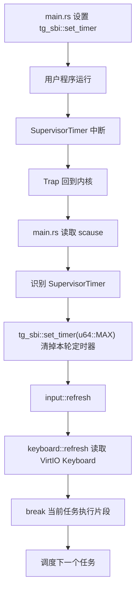
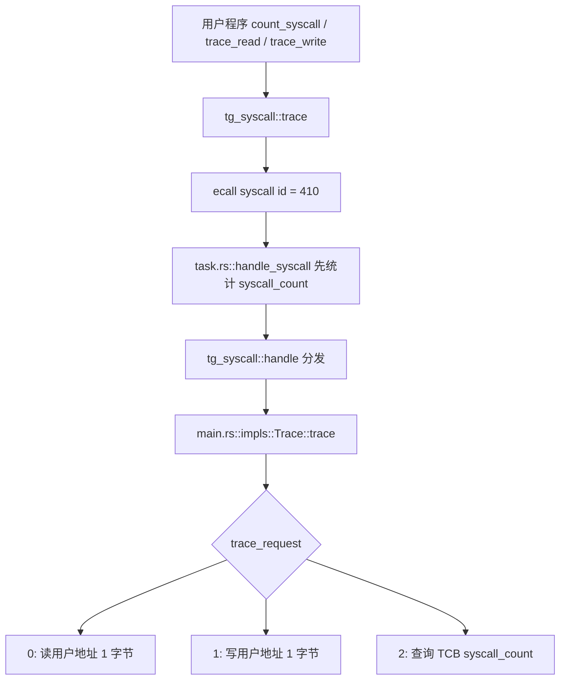
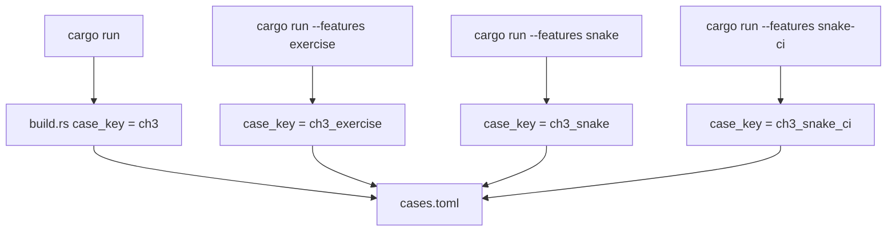

# rCore ch3 代码链与模块对应底稿

本文用“模块在哪里、函数怎么走”的方式整理 ch3。目标不是背代码，而是知道一条执行流经过哪些模块。

## 1. 目录结构重点

```text
tg-rcore-tutorial-ch3/
├── build.rs
├── Cargo.toml
├── test.sh
└── src
    ├── main.rs
    ├── task.rs
    ├── graphics.rs
    └── keyboard.rs

tg-rcore-tutorial-user/
├── cases.toml
└── src
    ├── lib.rs
    └── bin
        ├── ch3_trace.rs
        ├── ch3_snake.rs
        └── ch3_snake_ci.rs
```

模块分工：

```text
build.rs
  选择 cases.toml 里的应用，把用户程序编译并链接进内核。

src/main.rs
  内核入口、主调度循环、系统调用实现、Trap 原因处理、stdin 输入缓存入口。

src/task.rs
  TaskControlBlock、系统调用处理、任务完成状态、系统调用计数。

src/graphics.rs
  ch3-snake 图形输出支持，把用户态 SnakeFrame 画到 VirtIO-GPU framebuffer。

src/keyboard.rs
  ch3-snake 键盘输入支持，从 VirtIO Keyboard 读取 W/A/S/D/Q。

tg-rcore-tutorial-user/src/lib.rs
  用户态最小运行时，提供 println、sleep、try_getchar 等接口。

tg-rcore-tutorial-user/src/bin/ch3_snake.rs
  用户态可交互贪吃蛇。

tg-rcore-tutorial-user/src/bin/ch3_snake_ci.rs
  自动演示贪吃蛇，用于 CI。
```

## 2. 启动到多任务加载



关键点：

```text
build.rs 提前把用户程序作为数据放进内核镜像。
rust_main 运行时通过 AppMeta 找到这些应用。
每个 app 对应一个 TaskControlBlock。
```

## 3. 一个任务被执行的路径



这里的 `execute()` 不是普通函数调用，而是恢复寄存器后通过 RISC-V 特权级返回机制进入用户程序。

## 4. write 系统调用路径：普通字符输出



重点：

```text
用户态只负责发出 syscall。
真正写终端的是内核里的 SyscallContext::write。
```

## 5. write 系统调用路径：snake 图形输出



`fd = 3` 是本实验约定的图形通道。它让用户态仍然走系统调用，而不是直接访问 GPU。

## 6. read 系统调用路径：snake 键盘输入



这个输入实现是轮询式的。它不是完整键盘中断驱动，但已经符合本章扩展目标：用户态通过 `read` 请求内核提供输入。

## 7. yield 调度路径



这里的调度逻辑很朴素，是 round-robin 轮转。

## 8. 时钟中断调度路径



本次 ch3-snake 把输入刷新也挂到了时间片边界上。这样即使用户态没有立刻主动读取，内核也会周期性缓存一个按键。

## 9. trace 练习路径



关键点：

```text
caller.entity 保存了当前 TaskControlBlock 指针。
trace_request = 2 查询的是当前任务自己的 syscall_count。
```

## 10. snake 和 snake-ci 的构建选择



这样同一个 ch3 内核可以运行不同的用户程序集合：

```text
base: 原始多任务测试
exercise: trace 作业测试
snake: 人玩的图形贪吃蛇
snake-ci: 自动演示/CI 测试
```

## 11. 常用命令

```powershell
cd C:\Users\FLY\Desktop\OS\Tg-rCore-Tutorial-2026S-git\tg-rcore-tutorial-ch3
$env:Path="C:\Program Files\qemu;$env:Path"

# 基础测试
cargo run

# trace 练习
cargo run --features exercise

# 可交互图形贪吃蛇
cargo run --features snake

# 自动测试贪吃蛇
cargo run --features snake-ci
```

在 GitHub/CNB 的 Linux CI 里，`test.sh` 会自动把 runner 改成 headless 模式：

```bash
./test.sh base
./test.sh exercise
./test.sh snake
```
