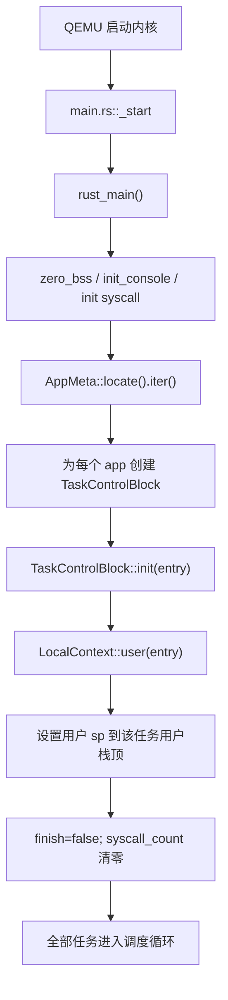
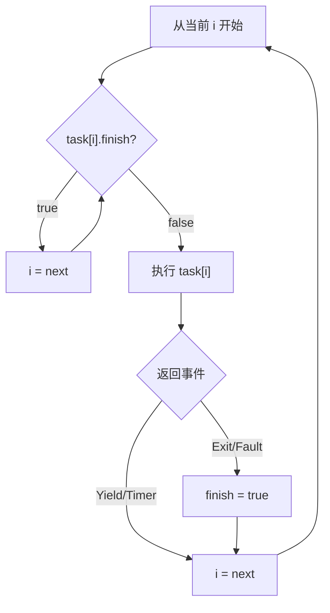
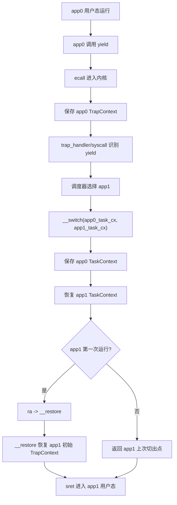
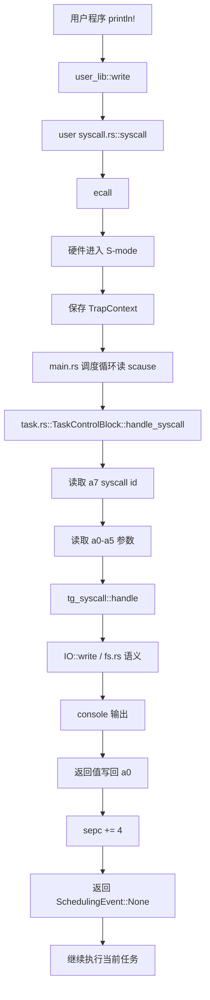
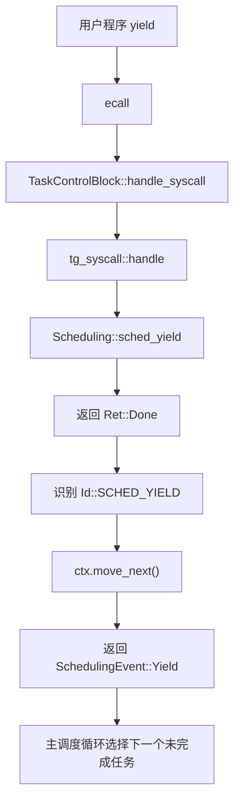
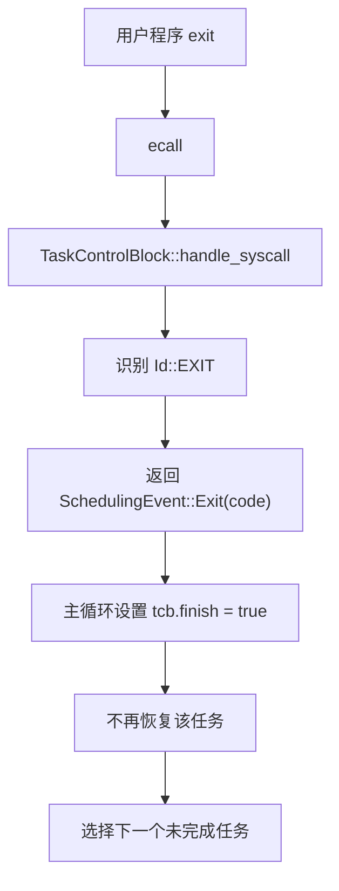
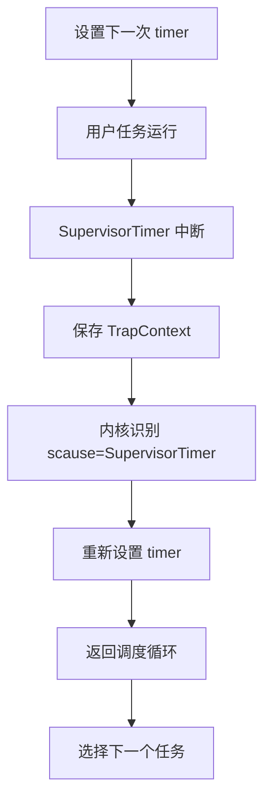
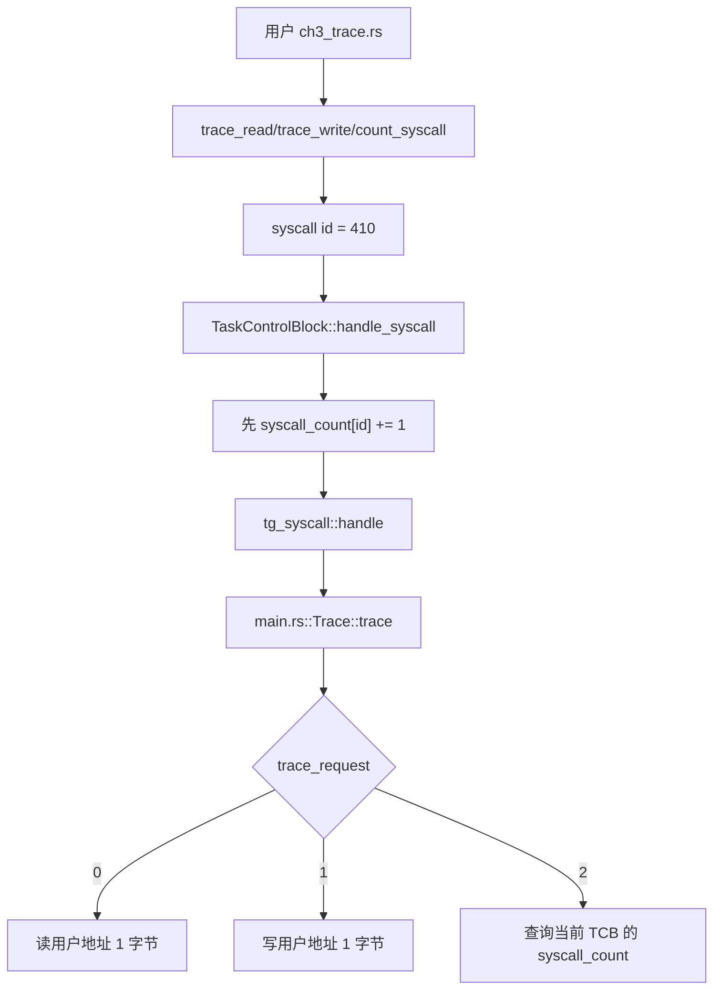

# rCore ch3 代码链与模块对应底稿

## 0. ch3 主线

ch2 是批处理：一个 app exit 后才运行下一个。ch3 的目标是分时多任务：多个 app 都可以被内核管理，每个 app 运行一小段时间后让出 CPU，之后还能从原来的位置继续。

核心问题：

```text
如何保存一个任务的执行现场？
如何恢复另一个任务的执行现场？
第一次运行任务时没有旧现场怎么办？
系统调用和时钟中断如何触发调度？
```

Guide 原文中的 ch3 通常有：

```text
loader.rs
task/
  context.rs
  switch.S
  switch.rs
  task.rs
  mod.rs
timer.rs
trap/
syscall/
```

当前组件化 `tg-rcore-tutorial-ch3` 更集中：

```text
tg-rcore-tutorial-ch3/
├── src/main.rs
├── src/task.rs
├── src/graphics.rs
└── src/keyboard.rs
```

对应关系：

```text
Guide loader.rs
  -> build.rs + tg_linker::AppMeta + main.rs 加载循环

Guide task/task.rs
  -> ch3/src/task.rs::TaskControlBlock

Guide task/mod.rs TaskManager
  -> ch3/src/main.rs 中全局任务数组 + 调度循环

Guide task/context.rs + switch.S
  -> tg-kernel-context crate 的 LocalContext::execute

Guide trap/mod.rs
  -> main.rs 调度循环读取 scause 并调用 handle_syscall

Guide syscall/fs.rs/process.rs
  -> tg-syscall crate + main.rs 中 IO/Process/Scheduling/Clock/Trace trait 实现
```

## 1. ch3 启动和任务初始化链



`TaskControlBlock` 可以理解成一个任务档案袋：

```text
ctx：用户态上下文，保存寄存器和返回位置
finish：任务是否结束
stack：该任务自己的用户栈
syscall_count：trace 作业用的系统调用计数
```

Guide 里的 `TaskManager` 在当前组件化仓库中没有单独文件，但功能仍然存在：全局任务数组、当前下标、轮转选择未完成任务，这些共同承担了 TaskManager 的职责。

## 2. TaskManager 的职责

TaskManager 不是只保存 TCB，它要管理任务状态。

Guide 里的典型状态：

```text
UnInit
Ready
Running
Exited
```

当前组件化版本简化成：

```text
finish = false：还能运行
finish = true：已经 exit 或被杀死
当前下标 i：调度器正在考虑哪个任务
```

调度器做的事：



所以你可以把 TaskManager 理解成“任务表 + 状态机 + 选下一个任务的策略”。

## 3. TrapContext 和 TaskContext 的区别

这是 ch3 最容易混的点。

### TrapContext

TrapContext 保存“用户态进入内核时”的现场。

触发场景：

```text
用户程序 ecall
用户程序非法指令
用户程序访存异常
时钟中断
```

保存内容：

```text
用户通用寄存器
sepc
sstatus
```

作用：

```text
让内核处理完 Trap 后，还能回到同一个用户程序继续。
```

### TaskContext

TaskContext 保存“内核态任务切换时”的现场。

触发场景：

```text
内核决定从 app0 切到 app1
```

保存内容通常更少：

```text
ra
sp
s0-s11 等 callee-saved 寄存器
```

作用：

```text
让内核以后能回到某个任务对应的内核执行路径。
```

一句话区分：

```text
TrapContext：用户态 <-> 内核态之间的现场。
TaskContext：内核态任务 <-> 内核态任务之间的现场。
```

当前组件化版本中，这些底层细节被 `LocalContext` 封装，但理解上仍然沿用这个区别。

## 4. 第一次进入任务：为什么要“伪造”上下文

你之前问过：第一次运行 app 时，它明明没有被切出过，为什么可以被“恢复”？

答案是：内核提前构造了一个看起来像“刚从内核返回用户态”的上下文。

Guide 中常见做法：

```text
TaskContext::goto_restore()
  -> ra 设置成 __restore
  -> sp 指向内核栈上提前放好的 TrapContext
```

这样第一次 `__switch` 到该任务时：

```text
__switch 恢复 ra/sp
  -> ret 跳到 __restore
  -> __restore 从伪造的 TrapContext 恢复用户寄存器
  -> sret 进入 app0 用户态
```

所以“假地址骗系统运行”的本质是：

```text
第一次没有真实的历史现场。
内核就提前摆好一个初始现场。
让通用的恢复路径以为它正在恢复一个任务。
```

这不是作弊，而是操作系统常用技巧：用统一的上下文切换路径启动新任务。

## 5. app0 yield 后如何回到 app1，再回到 app0



之后 app1 再 yield：

```text
app1 保存自己的 TrapContext
__switch 保存 app1 TaskContext
恢复 app0 TaskContext
回到 app0 上次被 switch 走之后的位置
__restore 恢复 app0 TrapContext
sret 回 app0 用户态
```

这就是为什么 app0 运行一半后还能继续：它的用户现场在 TrapContext 中，内核切换现场在 TaskContext 中。

## 6. syscall 调用链：以 write 为例



Guide 中会把 syscall 拆成：

```text
syscall/mod.rs：按 syscall id 分发
syscall/fs.rs：write/read 等文件 IO
syscall/process.rs：exit/yield 等进程控制
```

组件化版本中：

```text
tg_syscall::handle：统一分发
main.rs impl IO：对应 fs.rs
main.rs impl Process/Scheduling：对应 process.rs
task.rs handle_syscall：从上下文取 id/args，并把返回事件交给调度器
```

## 7. yield 调用链



`yield` 的含义不是退出，而是：

```text
我暂时让出 CPU，但我的状态要保存，之后还要回来。
```

## 8. exit 调用链



`exit` 和 `yield` 的区别：

```text
yield：保存现场，以后回来。
exit：任务结束，不再回来。
```

## 9. 时钟中断和分时

ch3 从“协作式 yield”进一步走向“分时”。时钟中断让任务即使不主动 yield，也会被内核打断。



这里 `stvec` 指向 Trap 入口，`scause` 告诉内核这是时钟中断，`sepc` 保存被打断的用户 PC，`sstatus` 保存返回状态。

## 10. trace 作业调用链



这说明 trace 的统计应该放在 TCB 里，因为每个任务有自己的 syscall 历史。

## 11. ch3-snake 扩展和基础主线

snake 不是 ch3 基础机制本身，而是用用户态游戏检验：

```text
多任务
系统调用
输入输出
分时调度
```

图形输出：

```text
用户态 SnakeFrame
  -> write(fd=3)
  -> 内核 graphics.rs
  -> VirtIO-GPU
```

键盘输入：

```text
VirtIO-keyboard
  -> keyboard.rs
  -> input::take
  -> read(STDIN)
  -> 用户态改变方向
```

这和 Guide 的基础目标一致：用户程序仍然只通过系统调用和内核交互。

## 12. ch2 到 ch3 的本质升级

```text
ch2：内核每次只关心一个 app。
ch3：内核同时维护多个任务的档案和状态。

ch2：exit 后才进入下一个。
ch3：yield 或 timer 后就能切换。

ch2：只需要一个当前用户上下文。
ch3：每个任务都要有自己的上下文和栈。
```

一句话：

```text
ch3 的本质是把“程序顺序执行”升级成“任务状态可保存、可切换、可恢复”。
```
