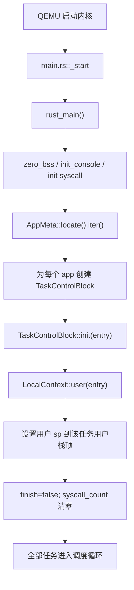
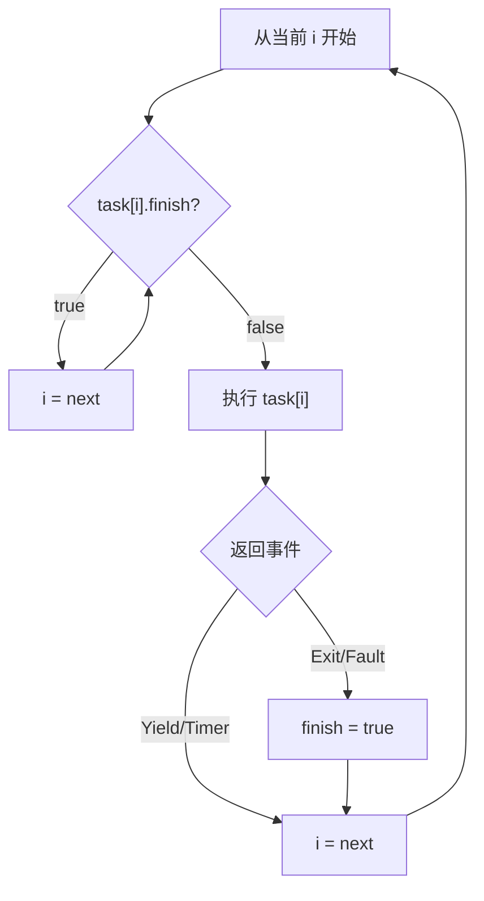
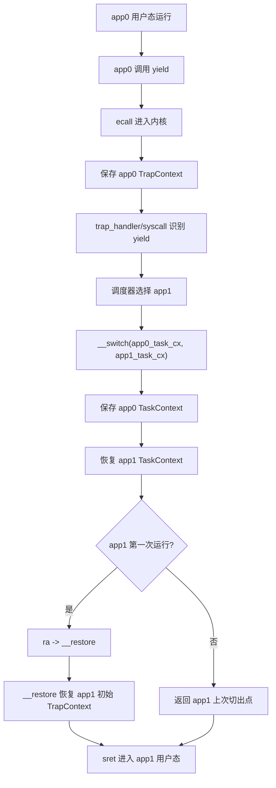
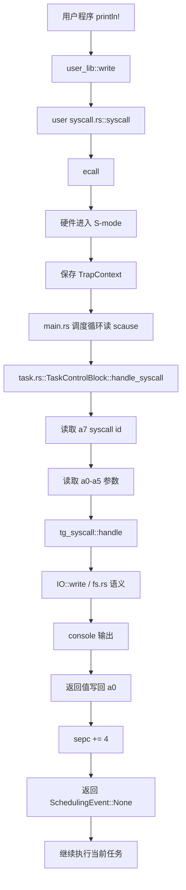
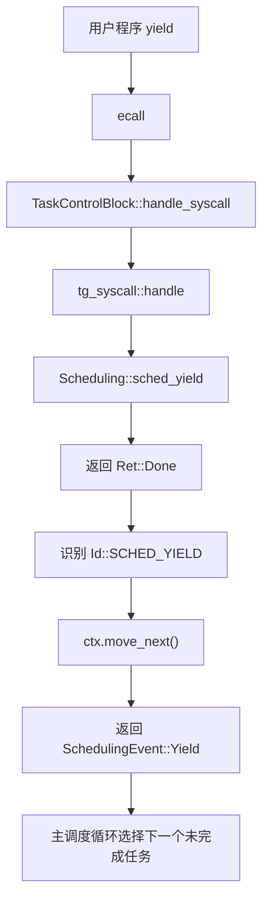
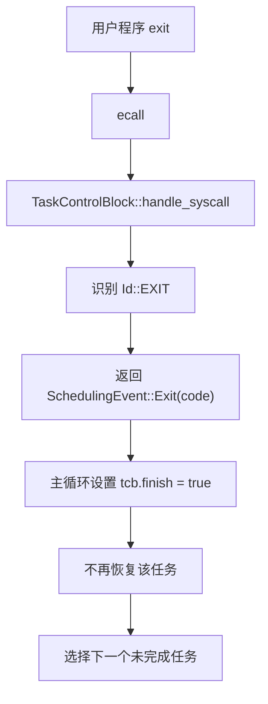
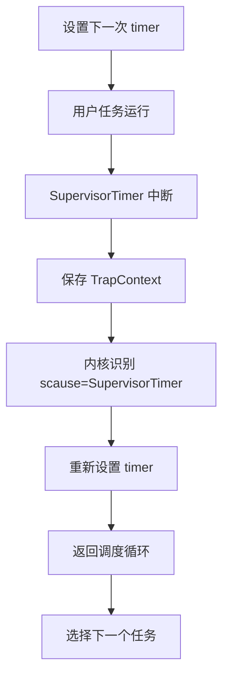
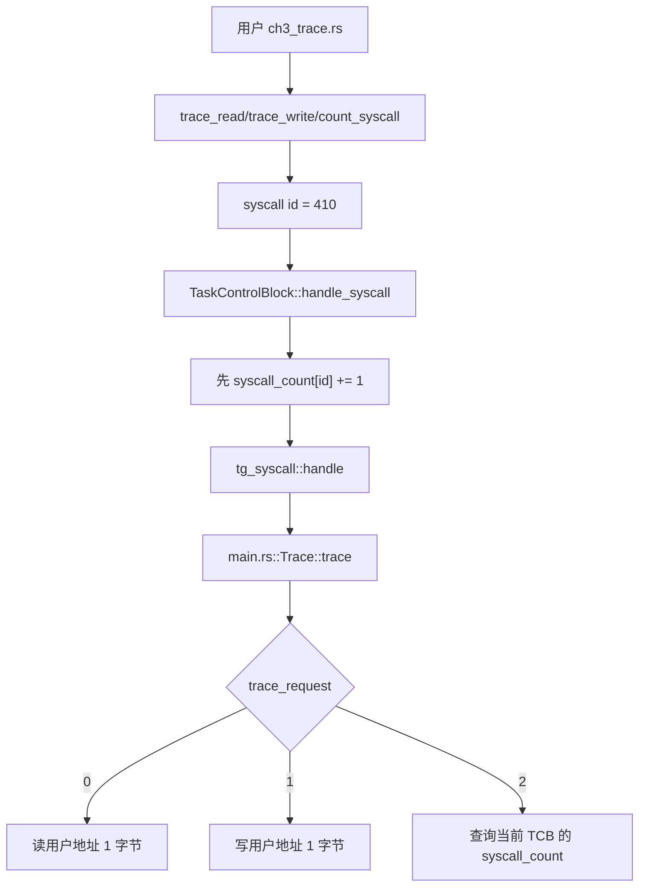

# rCore ch3 代码链与模块对应底稿

## 0. ch3 主线

ch2 是批处理：一个 app exit 后才运行下一个。ch3 的目标是分时多任务：多个 app 都可以被内核管理，每个 app 运行一小段时间后让出 CPU，之后还能从原来的位置继续。

核心问题：

```text
如何保存一个任务的执行现场？
如何恢复另一个任务的执行现场？
第一次运行任务时没有旧现场怎么办？
系统调用和时钟中断如何触发调度？
```

Guide 原文中的 ch3 通常有：

```text
loader.rs
task/
  context.rs
  switch.S
  switch.rs
  task.rs
  mod.rs
timer.rs
trap/
syscall/
```

当前组件化 `tg-rcore-tutorial-ch3` 更集中：

```text
tg-rcore-tutorial-ch3/
├── src/main.rs
├── src/task.rs
├── src/graphics.rs
└── src/keyboard.rs
```

对应关系：

```text
Guide loader.rs
  -> build.rs + tg_linker::AppMeta + main.rs 加载循环

Guide task/task.rs
  -> ch3/src/task.rs::TaskControlBlock

Guide task/mod.rs TaskManager
  -> ch3/src/main.rs 中全局任务数组 + 调度循环

Guide task/context.rs + switch.S
  -> tg-kernel-context crate 的 LocalContext::execute

Guide trap/mod.rs
  -> main.rs 调度循环读取 scause 并调用 handle_syscall

Guide syscall/fs.rs/process.rs
  -> tg-syscall crate + main.rs 中 IO/Process/Scheduling/Clock/Trace trait 实现
```

## 1. ch3 启动和任务初始化链



`TaskControlBlock` 可以理解成一个任务档案袋：

```text
ctx：用户态上下文，保存寄存器和返回位置
finish：任务是否结束
stack：该任务自己的用户栈
syscall_count：trace 作业用的系统调用计数
```

Guide 里的 `TaskManager` 在当前组件化仓库中没有单独文件，但功能仍然存在：全局任务数组、当前下标、轮转选择未完成任务，这些共同承担了 TaskManager 的职责。

## 2. TaskManager 的职责

TaskManager 不是只保存 TCB，它要管理任务状态。

Guide 里的典型状态：

```text
UnInit
Ready
Running
Exited
```

当前组件化版本简化成：

```text
finish = false：还能运行
finish = true：已经 exit 或被杀死
当前下标 i：调度器正在考虑哪个任务
```

调度器做的事：



所以你可以把 TaskManager 理解成“任务表 + 状态机 + 选下一个任务的策略”。

## 3. TrapContext 和 TaskContext 的区别

这是 ch3 最容易混的点。

### TrapContext

TrapContext 保存“用户态进入内核时”的现场。

触发场景：

```text
用户程序 ecall
用户程序非法指令
用户程序访存异常
时钟中断
```

保存内容：

```text
用户通用寄存器
sepc
sstatus
```

作用：

```text
让内核处理完 Trap 后，还能回到同一个用户程序继续。
```

### TaskContext

TaskContext 保存“内核态任务切换时”的现场。

触发场景：

```text
内核决定从 app0 切到 app1
```

保存内容通常更少：

```text
ra
sp
s0-s11 等 callee-saved 寄存器
```

作用：

```text
让内核以后能回到某个任务对应的内核执行路径。
```

一句话区分：

```text
TrapContext：用户态 <-> 内核态之间的现场。
TaskContext：内核态任务 <-> 内核态任务之间的现场。
```

当前组件化版本中，这些底层细节被 `LocalContext` 封装，但理解上仍然沿用这个区别。

## 4. 第一次进入任务：为什么要“伪造”上下文

你之前问过：第一次运行 app 时，它明明没有被切出过，为什么可以被“恢复”？

答案是：内核提前构造了一个看起来像“刚从内核返回用户态”的上下文。

Guide 中常见做法：

```text
TaskContext::goto_restore()
  -> ra 设置成 __restore
  -> sp 指向内核栈上提前放好的 TrapContext
```

这样第一次 `__switch` 到该任务时：

```text
__switch 恢复 ra/sp
  -> ret 跳到 __restore
  -> __restore 从伪造的 TrapContext 恢复用户寄存器
  -> sret 进入 app0 用户态
```

所以“假地址骗系统运行”的本质是：

```text
第一次没有真实的历史现场。
内核就提前摆好一个初始现场。
让通用的恢复路径以为它正在恢复一个任务。
```

这不是作弊，而是操作系统常用技巧：用统一的上下文切换路径启动新任务。

## 5. app0 yield 后如何回到 app1，再回到 app0



之后 app1 再 yield：

```text
app1 保存自己的 TrapContext
__switch 保存 app1 TaskContext
恢复 app0 TaskContext
回到 app0 上次被 switch 走之后的位置
__restore 恢复 app0 TrapContext
sret 回 app0 用户态
```

这就是为什么 app0 运行一半后还能继续：它的用户现场在 TrapContext 中，内核切换现场在 TaskContext 中。

## 6. syscall 调用链：以 write 为例



Guide 中会把 syscall 拆成：

```text
syscall/mod.rs：按 syscall id 分发
syscall/fs.rs：write/read 等文件 IO
syscall/process.rs：exit/yield 等进程控制
```

组件化版本中：

```text
tg_syscall::handle：统一分发
main.rs impl IO：对应 fs.rs
main.rs impl Process/Scheduling：对应 process.rs
task.rs handle_syscall：从上下文取 id/args，并把返回事件交给调度器
```

## 7. yield 调用链



`yield` 的含义不是退出，而是：

```text
我暂时让出 CPU，但我的状态要保存，之后还要回来。
```

## 8. exit 调用链



`exit` 和 `yield` 的区别：

```text
yield：保存现场，以后回来。
exit：任务结束，不再回来。
```

## 9. 时钟中断和分时

ch3 从“协作式 yield”进一步走向“分时”。时钟中断让任务即使不主动 yield，也会被内核打断。



这里 `stvec` 指向 Trap 入口，`scause` 告诉内核这是时钟中断，`sepc` 保存被打断的用户 PC，`sstatus` 保存返回状态。

## 10. trace 作业调用链



这说明 trace 的统计应该放在 TCB 里，因为每个任务有自己的 syscall 历史。

## 11. ch3-snake 扩展和基础主线

snake 不是 ch3 基础机制本身，而是用用户态游戏检验：

```text
多任务
系统调用
输入输出
分时调度
```

图形输出：

```text
用户态 SnakeFrame
  -> write(fd=3)
  -> 内核 graphics.rs
  -> VirtIO-GPU
```

键盘输入：

```text
VirtIO-keyboard
  -> keyboard.rs
  -> input::take
  -> read(STDIN)
  -> 用户态改变方向
```

这和 Guide 的基础目标一致：用户程序仍然只通过系统调用和内核交互。

## 12. ch2 到 ch3 的本质升级

```text
ch2：内核每次只关心一个 app。
ch3：内核同时维护多个任务的档案和状态。

ch2：exit 后才进入下一个。
ch3：yield 或 timer 后就能切换。

ch2：只需要一个当前用户上下文。
ch3：每个任务都要有自己的上下文和栈。
```

一句话：

```text
ch3 的本质是把“程序顺序执行”升级成“任务状态可保存、可切换、可恢复”。
```

## 13. 细化版：ch3 从启动到调度的 35 个步骤

这一段专门用来补足“流程还能更细”的部分。它把 ch3 拆成比 Guide 更慢的讲法。

1. ch3 仍然沿用 ch2 的用户程序构建方式：用户 app 会在构建期被编译并嵌入内核镜像。
2. 不同之处是，ch2 运行一个 app 时才加载一个；ch3 初始化时就会为多个 app 准备任务结构。
3. 内核启动后先完成 ch1/ch2 已有的基础初始化，例如 `.bss`、console、日志、syscall 环境。
4. `AppMeta::locate()` 找到所有被嵌入的用户程序。
5. 内核依次读取每个 app 的起止边界，知道它们的二进制内容在哪里。
6. 每个 app 会被复制到自己的运行区域，避免多个 app 覆盖同一个地址。
7. 对每个 app，内核创建一个 `TaskControlBlock`，即 TCB。
8. TCB 里至少保存用户上下文、用户栈、结束标记、系统调用计数。
9. 用户栈必须每个任务一份，否则 app0 和 app1 的函数调用、局部变量会互相踩。
10. `TaskControlBlock::init(entry)` 会把上下文设置为“将来从 entry 进入用户态”。
11. `LocalContext::user(entry)` 或 Guide 中的 `TrapContext::app_init_context` 设置初始用户 PC。
12. 初始用户栈指针 `sp` 被设置到该任务用户栈顶部。
13. `finish=false` 表示任务还没退出，可以被调度。
14. `syscall_count` 清零，给 ch3 trace 作业统计当前任务自己的 syscall 次数。
15. 所有 TCB 组成任务表，Guide 中由 `TaskManager` 管理。
16. 组件化版本里虽然没有单独 `TaskManager` 文件，但全局任务数组、当前下标、调度循环共同承担这个职责。
17. 调度器从当前下标开始找一个 `finish=false` 的任务。
18. 找到任务后，内核恢复它的上下文并进入用户态。
19. app 在 U-mode 运行，和 ch2 一样不能直接访问内核。
20. app 主动调用 `yield` 时，会通过用户态 syscall 包装执行 `ecall`。
21. `ecall` 让 CPU 从 U-mode 切到 S-mode，并跳到 Trap 入口。
22. Trap 入口保存用户态现场，这份现场就是 TrapContext 语义。
23. 内核通过 `scause` 确认这是 UserEnvCall。
24. 内核读取 `a7` 得到 syscall id，例如 `SCHED_YIELD`。
25. `TaskControlBlock::handle_syscall` 从当前任务上下文中读取 syscall id 和参数。
26. `tg_syscall::handle` 或 Guide 的 `syscall/mod.rs` 分发到具体 syscall 实现。
27. 如果是 `yield`，syscall 层返回“让出 CPU”的语义事件。
28. `handle_syscall` 把 `sepc += 4`，保证之后不会重复执行同一个 `ecall`。
29. 主调度循环收到 `SchedulingEvent::Yield`，不结束当前任务，只是选择下一个任务。
30. 如果是 Guide 标准实现，这里会调用 `__switch` 保存当前任务 TaskContext，恢复下一个任务 TaskContext。
31. 如果下一个任务第一次运行，它的 TaskContext 是内核提前伪造的，`ra` 指向 `__restore`。
32. `__restore` 再恢复提前放好的初始 TrapContext，最后 `sret` 进入该 app 用户态。
33. 如果下一个任务不是第一次运行，`__switch` 会恢复它上次被切走时保存的 TaskContext。
34. 恢复 TaskContext 后会回到该任务上次切出后的内核恢复路径，再通过 TrapContext 回用户态。
35. 这样 app0、app1、app2 就可以轮流执行，而且每个 app 都能从上次暂停的位置继续。

## 14. TaskManager 的 10 个具体职责

旧文档只说了 TaskManager 管理任务状态，这里进一步展开。

1. 保存所有 TCB，也就是所有任务的档案。
2. 记录当前正在运行或刚刚运行的是哪个任务。
3. 初始化每个任务的用户栈和入口上下文。
4. 判断任务是否已经退出，避免再次调度 finished task。
5. 在 `yield` 后选择下一个 Ready 任务。
6. 在 `exit` 后标记当前任务结束，并选择下一个任务。
7. 在时钟中断后强制切走当前任务，实现分时。
8. 在任务第一次运行时提供初始上下文。
9. 在任务再次运行时依赖保存的上下文恢复现场。
10. 最终在所有任务结束后通知内核关机或进入后续 demo。

可以把它类比成一个“宿舍值班表管理员”：

```text
TCB 是每个人的档案。
TaskManager 是拿着档案和排班表的人。
__switch 是真正把值班人从 A 换成 B 的动作。
TrapContext 是每个人离开座位前桌面上摊开的作业状态。
```

## 15. TrapContext 慢动作：什么时候保存，保存后去哪

以 app0 执行 `yield` 为例：

1. app0 在 U-mode 运行。
2. app0 调用 `yield()`。
3. 用户库把 syscall id 和参数放进寄存器。
4. app0 执行 `ecall`。
5. CPU 发现这是从 U-mode 发出的环境调用。
6. CPU 切到 S-mode。
7. CPU 把当前 PC 写入 `sepc`。
8. CPU 把 Trap 原因写入 `scause`。
9. CPU 根据 `stvec` 跳到内核 Trap 入口。
10. Trap 汇编入口保存通用寄存器。
11. 保存结果形成 TrapContext。
12. 内核进入 Rust 层 `trap_handler` 或组件化 `handle_syscall`。
13. 内核读取 TrapContext 中的 `a7/a0-a5`。
14. 内核处理 syscall。
15. 内核把 syscall 返回值写回 TrapContext 的 `a0`。
16. 内核把 TrapContext 的 `sepc += 4`。
17. 如果继续当前任务，`__restore` 直接从这个 TrapContext 恢复。
18. 如果切到别的任务，这个 TrapContext 留在 app0 对应位置，等 app0 以后恢复时再用。

所以 TrapContext 的核心是：

```text
保存用户态暂停点。
让内核处理完还能回到这个用户态暂停点之后。
```

## 16. TaskContext 慢动作：`__switch` 到底保存了什么

TaskContext 不负责保存所有用户寄存器，它只保存“内核态切换任务所需的最小现场”。

以 `__switch(app0, app1)` 为例：

1. 此时 CPU 已经在 S-mode。
2. app0 的用户现场已经通过 TrapContext 保存好了。
3. 调度器决定不继续 app0，而是运行 app1。
4. 内核调用 `__switch(&mut app0.task_cx, &app1.task_cx)`。
5. `__switch` 把当前内核的 `ra` 保存到 app0 的 TaskContext。
6. `__switch` 把当前内核的 `sp` 保存到 app0 的 TaskContext。
7. `__switch` 保存 `s0-s11` 这类 callee-saved 寄存器。
8. `__switch` 从 app1 的 TaskContext 中加载 `ra`。
9. `__switch` 从 app1 的 TaskContext 中加载 `sp`。
10. `__switch` 从 app1 的 TaskContext 中加载 `s0-s11`。
11. `__switch` 执行 `ret`。
12. `ret` 会跳到刚刚恢复出来的 `ra`。
13. 如果 app1 是第一次运行，`ra` 是伪造好的 `__restore` 地址。
14. 如果 app1 不是第一次运行，`ra` 是它上次被切走时保存的返回位置。

这就是你之前问的“为什么 TaskContext 在 switch 之后自动变了”：因为 `__switch` 是汇编，它直接往 TaskContext 指针指向的内存里写寄存器值。

## 17. 第一次运行任务的伪造上下文再解释

第一次运行任务时，问题是：

```text
app0 从来没被切走过，哪里来的 TaskContext？
app0 从来没 Trap 过，哪里来的 TrapContext？
```

内核的做法是提前布置：

1. 在该任务内核栈上放一个初始 TrapContext。
2. 初始 TrapContext 的 `sepc` 设置成用户程序入口。
3. 初始 TrapContext 的 `sp` 设置成用户栈顶。
4. 初始 TrapContext 的 `sstatus` 设置成 `sret` 后回 U-mode。
5. 该任务 TaskContext 的 `ra` 设置为 `__restore`。
6. 该任务 TaskContext 的 `sp` 指向刚才放 TrapContext 的内核栈位置。
7. 第一次 `__switch` 到该任务时恢复 `ra/sp`。
8. `ret` 跳到 `__restore`。
9. `__restore` 以为自己正在恢复一个真实 TrapContext。
10. `sret` 进入用户程序。

所以“伪造”不是乱给地址，而是提前把启动新任务伪装成“恢复旧任务”。这样第一次运行和后续恢复可以复用同一套代码路径。

## 18. ch3 syscall 分类和 Guide 文件对应

Guide 写法：

```text
syscall/mod.rs
  -> syscall(id, args)
  -> match id

syscall/fs.rs
  -> sys_write
  -> sys_read

syscall/process.rs
  -> sys_exit
  -> sys_yield
  -> sys_get_time
```

组件化写法：

```text
task.rs::TaskControlBlock::handle_syscall
  -> 从 LocalContext 读 a7/a0-a5
  -> tg_syscall::handle
  -> main.rs 里不同 trait impl 处理
```

对应关系：

1. `IO::write` 相当于 Guide 的 `syscall/fs.rs::sys_write`。
2. `Process::exit` 相当于 Guide 的 `syscall/process.rs::sys_exit`。
3. `Scheduling::sched_yield` 相当于 Guide 的 `syscall/process.rs::sys_yield`。
4. `Clock::clock_gettime` 相当于 Guide 的 `sys_get_time`。
5. `Trace::trace` 是本课程组件化实验新增练习接口。

## 19. CSR 在 ch3 中的角色

1. `stvec`：Trap 入口地址。没有它，用户 `ecall` 后不知道跳到内核哪里。
2. `sepc`：用户程序被打断的位置。恢复用户态时靠它继续执行。
3. `scause`：Trap 原因。内核靠它区分 syscall、非法指令、访存错误、时钟中断。
4. `sstatus`：保存特权级和中断状态。`sret` 靠它回到正确模式。
5. `sie/sip`：和中断使能、挂起有关，分时系统会涉及。
6. `time`：读当前时间。
7. `stimecmp` 或 SBI timer：设置下一次时钟中断。

记法：

```text
stvec：去哪里处理。
scause：为什么来处理。
sepc：处理完回哪里。
sstatus：以什么状态回去。
```

## 20. ch3 和 ch2 对比的 12 个层层深入点

1. ch2 只有“当前 app”，ch3 有“任务表”。
2. ch2 app 结束后才切换，ch3 app 未结束也能切换。
3. ch2 不需要保存多个任务现场，ch3 必须保存。
4. ch2 主要依赖 TrapContext，ch3 还要理解 TaskContext。
5. ch2 的 `exit` 是主线，ch3 的 `yield/timer` 是主线。
6. ch2 的批处理像“排队做完一个再下一个”，ch3 像“每个人做一会儿轮换”。
7. ch2 的用户栈可以相对简单，ch3 每个任务都必须有独立用户栈。
8. ch2 出错就杀掉当前 app 后继续下一个，ch3 出错还要维护任务状态。
9. ch2 的 syscall 返回当前 app，ch3 的 syscall 可能触发调度。
10. ch2 没有时间片，ch3 引入 timer 后有时间片。
11. ch2 是“用户态和内核态往返”，ch3 是“往返之后还能在任务之间切换”。
12. ch2 为 ch3 提供 ecall/trap 基础，ch3 在此基础上加任务管理。

## 21. 流程再细化：app0 主动 yield 到 app1 的 30 步

这一段专门拆“app0 怎么切到 app1”。它不是概念列表，而是实际发生顺序。

1. app0 当前正在 U-mode 中执行用户代码。
2. app0 调用用户库里的 `yield()`。
3. 用户库把 `SYS_SCHED_YIELD` 作为 syscall id。
4. 用户库把 syscall id 放入 `a7`。
5. 用户库执行 `ecall`。
6. CPU 发现 U-mode 发生环境调用。
7. CPU 把当前用户 PC 写入 `sepc`。
8. CPU 把 Trap 原因写入 `scause`，原因是 UserEnvCall。
9. CPU 根据 `stvec` 跳到内核 Trap 入口。
10. Trap 汇编入口保存 app0 的用户寄存器。
11. 这些被保存的寄存器形成 app0 的 TrapContext。
12. 内核进入 Rust 层 trap 处理逻辑。
13. 内核读取 `scause`，确认这是用户系统调用。
14. 内核进入当前任务的 `handle_syscall`。
15. `handle_syscall` 从当前任务上下文读取 `a7`。
16. `handle_syscall` 确认 syscall id 是 `SCHED_YIELD`。
17. `handle_syscall` 读取 `a0-a5`，虽然 yield 基本不需要复杂参数。
18. `tg_syscall::handle` 或 Guide 的 syscall 分发调用 yield 实现。
19. yield 实现返回一个“当前任务主动让出 CPU”的语义结果。
20. 内核把 syscall 返回值写回 app0 TrapContext 的 `a0`。
21. 内核把 app0 TrapContext 的 `sepc += 4`，跳过 `ecall`。
22. `handle_syscall` 返回 `SchedulingEvent::Yield`。
23. 主调度循环收到 Yield，不把 app0 标记为 finished。
24. TaskManager 或调度循环从任务表中寻找下一个未完成任务。
25. 调度器选中 app1。
26. 内核准备从 app0 切到 app1。
27. Guide 标准流程会调用 `__switch(app0_task_cx, app1_task_cx)`。
28. `__switch` 保存 app0 的 TaskContext，也就是 app0 在内核态切换点的最小现场。
29. `__switch` 恢复 app1 的 TaskContext。
30. CPU 根据恢复出的 app1 上下文，进入 app1 的恢复路径或第一次启动路径。

这里 app0 没有消失。它的状态被分成两部分保存：

```text
app0 用户态现场：TrapContext
app0 内核切换现场：TaskContext
```

## 22. 流程再细化：app1 第一次被调度的 28 步

app1 第一次运行时，它从来没被切出去过，所以没有真实历史现场。这里就是“伪造上下文”的用途。

1. 内核初始化任务时发现 app1 是一个新任务。
2. 内核为 app1 分配或准备用户栈。
3. 内核确定 app1 的用户入口地址。
4. 内核在 app1 的内核栈上放一个初始 TrapContext。
5. 初始 TrapContext 的 `sepc` 设置成 app1 入口。
6. 初始 TrapContext 的用户 `sp` 设置成 app1 用户栈顶。
7. 初始 TrapContext 的 `sstatus` 设置成将来 `sret` 回 U-mode。
8. 初始 TrapContext 的其他寄存器设置成默认值。
9. 内核再构造 app1 的初始 TaskContext。
10. 初始 TaskContext 的 `ra` 设置成 `__restore`。
11. 初始 TaskContext 的 `sp` 指向能找到初始 TrapContext 的位置。
12. app1 的任务状态被设置成 Ready。
13. 调度器第一次选中 app1。
14. `__switch` 从 app1 TaskContext 中恢复 `ra`。
15. `__switch` 从 app1 TaskContext 中恢复 `sp`。
16. `__switch` 恢复必要的 callee-saved 寄存器。
17. `__switch` 执行 `ret`。
18. 因为 `ra=__restore`，所以 `ret` 跳到 `__restore`。
19. `__restore` 根据当前栈位置找到初始 TrapContext。
20. `__restore` 恢复 app1 的用户寄存器。
21. `__restore` 恢复 `sepc`。
22. `__restore` 恢复 `sstatus`。
23. `__restore` 执行 `sret`。
24. CPU 从 S-mode 回到 U-mode。
25. PC 变成 app1 入口地址。
26. app1 从自己的 `_start` 或用户入口开始执行。
27. 从外面看，app1 像是被正常恢复出来的。
28. 实际上，这是内核提前布置初始现场的结果。

## 23. 流程再细化：app1 再 yield 后回到 app0 的 30 步

这一条链用来解释“为什么 app0 可以从 yield 后面继续”。

1. app1 在 U-mode 中运行。
2. app1 调用 `yield()` 或被 timer interrupt 打断。
3. CPU 进入 S-mode。
4. Trap 入口保存 app1 用户现场。
5. app1 的 TrapContext 记录它被打断的位置。
6. 内核处理 app1 的 yield 或 timer。
7. 如果是 yield，内核把 app1 的 `sepc += 4`。
8. 如果是 timer，`sepc` 通常保存被中断时的位置。
9. 调度器决定切回 app0。
10. 内核调用 `__switch(app1_task_cx, app0_task_cx)`。
11. `__switch` 把当前内核 `ra` 保存进 app1 TaskContext。
12. `__switch` 把当前内核 `sp` 保存进 app1 TaskContext。
13. `__switch` 保存 app1 的 callee-saved 寄存器。
14. `__switch` 从 app0 TaskContext 恢复 `ra`。
15. `__switch` 从 app0 TaskContext 恢复 `sp`。
16. `__switch` 恢复 app0 的 callee-saved 寄存器。
17. `__switch` 执行 `ret`。
18. 这次 app0 不是第一次运行，所以 `ra` 是它上次被切走时保存的返回位置。
19. `ret` 回到 app0 上次被切走后的内核恢复路径。
20. 这条路径会继续走向 `__restore` 或组件化 LocalContext 的恢复逻辑。
21. 恢复逻辑找到 app0 之前保存的 TrapContext。
22. 恢复逻辑把 app0 的用户寄存器写回 CPU。
23. 恢复逻辑恢复 app0 的 `sepc`。
24. 因为 app0 yield 时已经 `sepc += 4`，所以它会从 yield 后面继续。
25. 恢复逻辑恢复 app0 的 `sstatus`。
26. 执行 `sret`。
27. CPU 回到 app0 的 U-mode。
28. app0 继续执行 yield 后面的下一条用户代码。
29. 对 app0 来说，它只是“yield 返回了”。
30. 对内核来说，它完成了一次 app1 到 app0 的上下文恢复。

## 24. timer 分时切换的 26 步流程

timer interrupt 和 yield 的最终目的类似，都是触发调度，但来源不同。

1. 内核启动时初始化时钟中断。
2. 内核设置下一次 timer 触发时间。
3. app0 在 U-mode 中运行。
4. app0 没有主动 yield。
5. 时间片耗尽。
6. QEMU/RISC-V timer 产生中断。
7. CPU 从 U-mode 进入 S-mode。
8. CPU 设置 `scause=SupervisorTimer` 或对应时钟中断原因。
9. CPU 保存被打断位置到 `sepc`。
10. CPU 跳到 `stvec` 指向的 Trap 入口。
11. Trap 入口保存 app0 用户寄存器。
12. 内核进入 trap handler。
13. trap handler 读取 `scause`。
14. 内核确认这是 timer interrupt，不是普通 syscall。
15. 内核重新设置下一次 timer。
16. 内核决定当前任务时间片结束。
17. 当前任务不标记 finished。
18. 调度器选择下一个 Ready 任务。
19. 内核调用任务切换逻辑。
20. `__switch` 保存当前任务 TaskContext。
21. `__switch` 恢复下一个任务 TaskContext。
22. 下一个任务通过 `__restore` 或对应恢复路径回用户态。
23. 被中断任务的 TrapContext 保留在任务自己的位置。
24. 将来它再次被调度时，还能从中断点继续。
25. timer 让内核不依赖用户程序自觉。
26. 这就是分时系统比协作式调度更可靠的原因。
