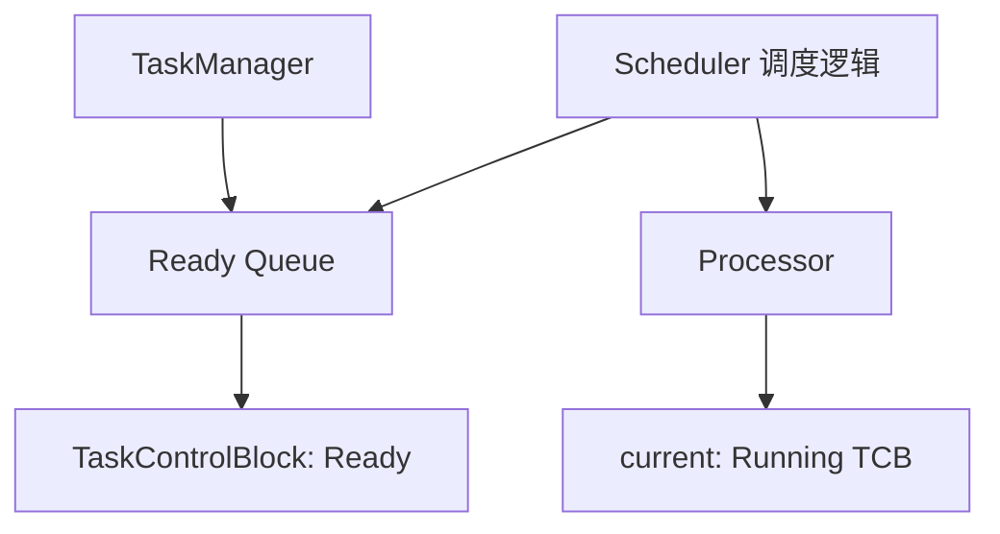
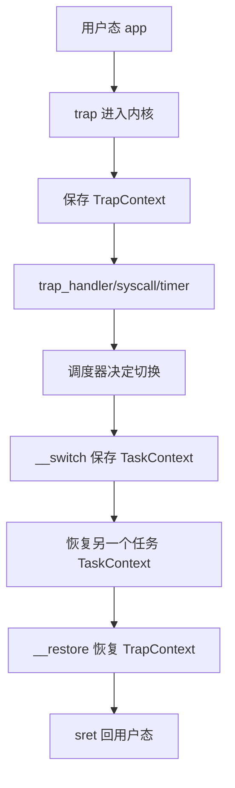
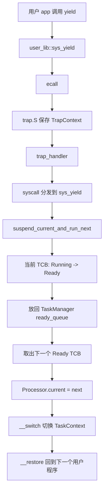
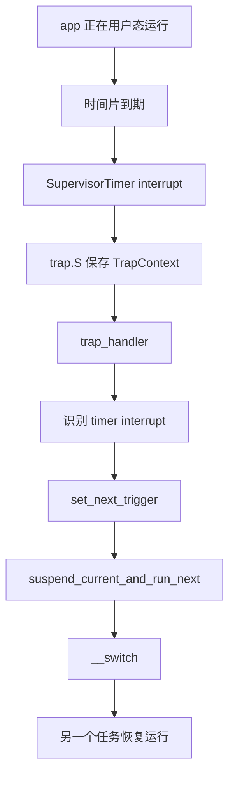
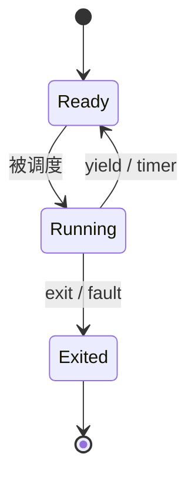

# rCore ch3 多任务调度模块关系精讲版

> 这一版重点解释：第三章不是“批处理多放几个程序”这么简单，而是第一次把任务状态、上下文保存、就绪队列、当前 CPU 执行状态、主动 yield、时钟中断强制切换串起来。它是 ch4 地址空间和 ch5 进程的直接地基。

## 0. 先把一句话说准

第三章的核心是：

```text
内核不再等一个程序 exit 后才运行下一个；
而是给每个程序保存执行现场；
在 yield 或 timer interrupt 时把当前任务挂起；
再恢复另一个任务继续执行。
```

它比 ch2 多出的关键是：

```text
TaskControlBlock；
TaskManager 就绪队列；
Processor 当前运行状态；
TaskContext；
TrapContext；
__switch；
timer interrupt。
```

## 1. ch3 相对 ch2 的变化

ch2：

```text
app0 加载
app0 运行到 exit
app1 覆盖同一加载区域
app1 从头运行
```

ch3：

```text
app0 运行一会儿
  -> 保存现场
app1 运行一会儿
  -> 保存现场
app0 恢复到之前停下的位置继续运行
```

所以 ch3 的关键不是“应用数量变多”，而是：

```text
每个任务都有自己的执行状态；
内核能保存和恢复这些状态。
```

## 2. TCB 是什么

TaskControlBlock 是任务控制块。

它是内核给每个任务建立的“档案袋”。

里面可能包括：

```text
任务状态：Ready / Running / Exited
TaskContext：内核态切换上下文
TrapContext：用户态陷入内核时保存的上下文
KernelStack：内核栈
应用入口和用户栈信息
```

如果说 ch2 的 app 只是“内核要加载的一段二进制”，那么 ch3 的 task 是：

```text
一段二进制 + 它的运行状态 + 它将来怎么恢复。
```

## 3. TaskManager 和 Processor 的区别

这两个非常容易混。

### 3.1 TaskManager

TaskManager 管：

```text
所有等待运行的任务。
```

它通常维护一个就绪队列：

```text
ready_queue
```

可以理解成：

```text
排队等 CPU 的任务列表。
```

### 3.2 Processor

Processor 管：

```text
当前 CPU 正在运行的任务。
```

它更像：

```text
CPU 当前手上正在处理的那一个。
```

关系图：



精准表述：

```text
TaskManager 管队列；
Processor 管当前；
调度函数负责在二者之间移动 TCB。
```

## 4. TrapContext 和 TaskContext 的区别

这是第三章最重要的底层概念。

### 4.1 TrapContext

TrapContext 保存的是：

```text
用户态寄存器现场。
```

发生位置：

```text
用户程序 ecall；
用户程序被 timer interrupt 打断；
用户程序发生异常。
```

保存内容包括：

```text
通用寄存器；
sepc；
sstatus；
用户栈指针等。
```

它回答的问题是：

```text
将来怎么回到这个用户程序？
```

### 4.2 TaskContext

TaskContext 保存的是：

```text
内核态任务切换现场。
```

发生位置：

```text
内核已经通过 trap 进入 S-mode；
调度器决定从当前任务切到另一个任务；
__switch 保存当前内核执行流，再恢复下一个任务的内核执行流。
```

它通常保存：

```text
ra
sp
s0-s11
```

它回答的问题是：

```text
内核调度函数将来怎么继续执行？
```

### 4.3 一句话区别

```text
TrapContext 管“用户态怎么回去”；
TaskContext 管“内核态怎么换任务”。
```

图：



## 5. 第一次运行任务为什么也能 restore

第一次运行某个 app 时，它之前没有真的 trap 过。

但是内核会提前伪造一个 TrapContext：

```text
sepc = 用户程序入口
sp = 用户栈顶
sstatus.SPP = User
```

然后调用 `__restore`。

`__restore` 并不知道这是伪造的，它只做：

```text
从 TrapContext 恢复寄存器；
sret。
```

于是 CPU 就进入用户态，从 app 入口开始执行。

这就是“假装这个任务曾经被中断过，现在恢复它”的意思。

## 6. __switch 是什么

`__switch` 是任务切换的底层汇编函数。

Rust 层调度器做决策：

```text
我要从 task A 切到 task B。
```

汇编层执行实际切换：

```text
保存 A 的 ra/sp/s0-s11 到 A.task_cx；
从 B.task_cx 恢复 ra/sp/s0-s11；
ret 到 B 上次停下的位置。
```

所以：

```text
__switch 不懂什么是进程、文件、地址空间；
它只负责寄存器级别的上下文交换。
```

`switch.rs` 的作用一般是：

```text
给底层 switch.S 汇编函数提供 Rust 可调用接口。
```

也就是：

```text
上层调度器 -> switch.rs 安全/类型封装 -> switch.S 真正换寄存器。
```

## 7. 主动 yield 的完整关系

用户程序主动让出 CPU：



这里关键是：

```text
yield 是用户主动请求；
但真正切换由内核调度器完成；
用户只能请求，不能自己切换到别的任务。
```

## 8. timer interrupt 的完整关系

如果用户程序不主动 yield，内核也要能抢回 CPU。

所以引入时钟中断：

```text
设置下一次 timer；
到时间后 CPU 自动 trap 进内核；
trap_handler 发现是 timer；
重新设置下一次 timer；
调用 suspend_current_and_run_next。
```

流程：



主动 yield 和 timer 的共同点：

```text
最终都进入 suspend_current_and_run_next。
```

区别：

```text
yield：用户主动。
timer：内核强制。
```

## 9. task 状态怎么变化

常见状态：

```text
Ready
Running
Exited
```

状态变化：

```text
创建任务 -> Ready
被 Processor 选中 -> Running
yield/timer -> Ready
exit -> Exited
```

图：



## 10. sys_trace 为什么放在 ch3 很合适

ch3 的练习 `sys_trace` 要统计当前任务系统调用次数。

为什么适合放在 TCB？

因为：

```text
系统调用次数是“当前任务”的运行历史；
TCB 正是任务档案袋；
handle_syscall 每次都能看到 syscall id。
```

所以实现思路：

```text
TaskControlBlock 增加 syscall_count 数组；
每次 handle_syscall 先对 syscall_id 计数；
trace_request=2 时返回某个 syscall id 的次数。
```

这也说明：

```text
TCB 不只是切换用的寄存器容器；
它还可以保存任务级运行信息。
```

## 11. ch3 和 ch4/ch5 的连接

ch3 奠定：

```text
多个执行实体如何保存现场、如何被切换。
```

ch4 在它上面加：

```text
每个执行实体有自己的 MemorySet；
切换任务时还要切换 satp；
用户指针要按对应地址空间翻译。
```

ch5 在它上面加：

```text
执行实体背后有进程生命周期；
fork/exec/waitpid/exit 管理出生、变身、等待、死亡。
```

所以：

```text
ch3 是调度骨架；
ch4 给骨架加内存隔离；
ch5 给骨架加生命周期和父子关系。
```

## 12. 本章模块精髓总结

```text
TaskControlBlock：
  每个任务的档案袋，保存状态、上下文、栈等。

TaskManager：
  管 Ready 队列。

Processor：
  管当前 CPU 正在运行的任务。

TrapContext：
  用户态现场。

TaskContext：
  内核态切换现场。

trap_handler：
  处理 syscall/timer/fault。

syscall：
  ecall 进入内核后的软件分发。

__switch：
  真正交换两个任务的内核上下文。

__restore：
  从 TrapContext 回到用户态。
```

## 13. 给别人讲第三章时可以这样说

第三章不是简单让多个程序排队，而是第一次让每个程序拥有可保存、可恢复的执行状态。用户程序通过 ecall 或时钟中断 trap 进入内核，trap.S 保存用户态 TrapContext，trap_handler 判断是 syscall 还是 timer。如果需要切换任务，内核通过 TaskManager 管理就绪队列，通过 Processor 记录当前运行任务，通过 `__switch` 保存和恢复 TaskContext，最后通过 `__restore` 恢复目标任务的 TrapContext 并 sret 回用户态。主动 yield 和 timer interrupt 的区别只是进入调度的原因不同，最后都会走同一套任务切换机制。第三章的 TCB/TaskContext/TrapContext 是第四章地址空间和第五章进程管理的基础。

