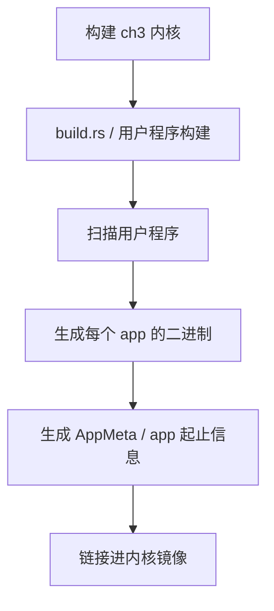
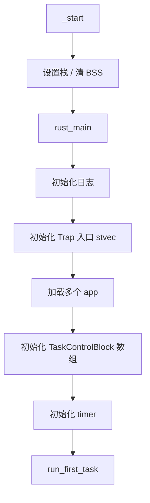
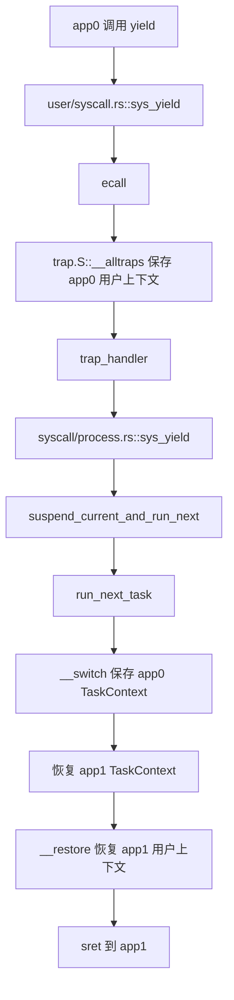
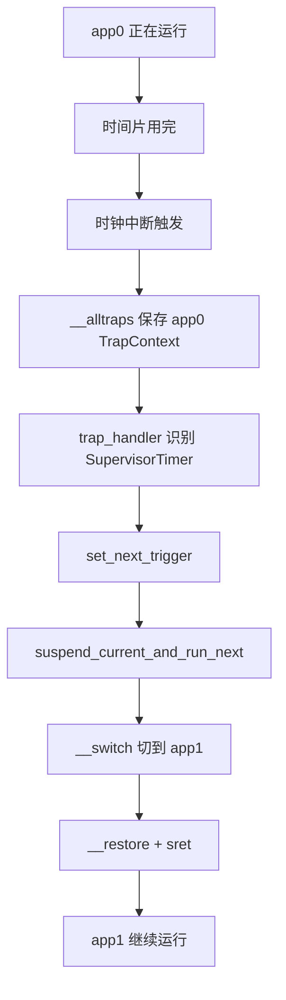

# rCore ch3 执行流程归纳：从批处理到分时多任务

> 本文件重点整理 ch3 的执行流程。这里要特别注意：ch3 不是简单地“一个程序结束再运行下一个”，而是开始支持多个任务轮流运行。它是后续地址空间和进程机制的前身。

## 1. 本章要解决的问题

ch2 的批处理系统有一个明显问题：

```text
app0 不退出
  -> app1 永远没有机会运行
```

ch3 要解决的是：

```text
多个用户程序都已经准备好
内核让它们轮流使用 CPU
每个程序运行一会儿就切换到下一个
```

这就是“多道程序/分时多任务”的雏形。

## 2. 用户程序编写与编译

用户程序仍然位于：

```text
tg-rcore-tutorial-user/src/bin/*.rs
```

用户态流程还是：

```text
用户 main
  -> user_lib 提供 println / yield / sleep / syscall
  -> ecall
  -> 内核处理
```

和 ch2 不同的是，用户程序不再只能靠 `exit` 交出 CPU，还可以：

- 主动 `yield`
- 被时钟中断强制切换
- 调用 `sleep`

## 3. 内核构建阶段：多应用打包与 AppMeta

ch3 仍然会在构建阶段把用户程序准备好，典型流程是：



这里的重点是：内核启动后已经知道有哪些 app，可以把它们加载到不同位置或按任务管理。

## 4. 内核启动与初始化

ch3 的内核启动流程：



和 ch2 的区别：

- ch2 只关心当前 app 是谁。
- ch3 要为每个 app 建立任务控制块。

## 5. TaskControlBlock：任务控制块

ch3 的核心数据结构是 TCB：

```text
TaskControlBlock
  -> 用户上下文 / TrapContext
  -> 任务状态 Ready / Running / Exited
  -> 内核栈或任务切换上下文
  -> syscall 统计等扩展字段
```

可以理解成：

```text
TCB 是内核给每个用户程序建立的档案袋。
里面记录这个程序执行到哪、状态如何、下次怎么恢复。
```

没有 TCB，就无法做到：

- app0 暂停后以后继续执行
- app1 恢复到之前的位置
- 内核知道哪个任务已经退出

## 6. 第一次进入用户程序：伪造上下文

第一次运行 app 时，它之前并没有真的被中断过，所以没有真实保存过的 TrapContext。

内核会“伪造”一个初始上下文：

```text
sepc = 用户程序入口
sp   = 用户栈顶
sstatus.SPP = User
```

然后调用：

```text
__restore
  -> 从伪造 TrapContext 恢复寄存器
  -> sret
  -> CPU 进入 U-mode 执行 app
```

这就是你之前理解的“假装这个程序曾经被 trap 过，现在恢复它”。

## 7. 主动切换：sys_yield

用户程序主动让出 CPU 时：



这里有两个上下文：

```text
TrapContext
  -> 用户态寄存器现场
  -> 用户程序 ecall / 中断时保存

TaskContext
  -> 内核态切换现场
  -> __switch 在内核任务之间切换时保存
```

一句话区别：

```text
TrapContext 管“用户态怎么回去”
TaskContext 管“内核调度函数怎么切换到另一个任务”
```

## 8. 被动切换：时钟中断

如果用户程序一直不 `yield`，内核也不能让它霸占 CPU。

所以 ch3 引入定时器：

```text
timer interrupt
  -> trap 到内核
  -> 设置下一次定时器
  -> suspend_current_and_run_next
```

流程：



主动 `yield` 和时钟中断的区别：

```text
yield       -> 用户程序主动交出 CPU
timer       -> 内核强制收回 CPU
共同点      -> 最后都进入调度器切换任务
```

## 9. sys_trace 练习的流程

ch3 的基础实验要求实现 `sys_trace`：

```text
trace_request = 0 -> 从用户地址读一个字节
trace_request = 1 -> 向用户地址写一个字节
trace_request = 2 -> 查询当前任务某个 syscall 调用次数
```

合理实现思路：

```text
TaskControlBlock 增加 syscall_count 数组
handle_syscall 每次根据 syscall id 计数
trace_request=2 时返回计数
trace_request=0/1 时用 unsafe 直接读写用户地址
```

为什么 ch3 可以直接读写用户地址？

因为 ch3 还没有独立地址空间，内核和用户基本还在同一个物理地址视角下运行。到了 ch4 引入页表后，访问用户地址就必须考虑地址翻译和权限。

## 10. ch3 代码模块对应

```text
tg-rcore-tutorial-ch3/
  src/main.rs
    -> rust_main
    -> syscall trait 实现
    -> timer/trap 主循环

  src/task.rs
    -> TaskControlBlock
    -> handle_syscall
    -> syscall_count / syscall_times

  tg-rcore-tutorial-kernel-context
    -> LocalContext
    -> 保存/恢复用户上下文

  tg-rcore-tutorial-syscall
    -> syscall ID 与 trait 分发

  tg-rcore-tutorial-user/src/bin
    -> ch3_sleep / ch3_trace 等测试程序
```

## 11. ch3 相对 ch2 的演进

```text
ch2：批处理
  -> app0 结束后 app1 才能运行
  -> 主要靠 exit 推进

ch3：分时多任务
  -> app0/app1/app2 可以交替运行
  -> 支持 yield 和 timer interrupt
  -> 每个任务有自己的上下文
```

这一步是后续地址空间和进程的基础。

没有 ch3 的 TCB 和上下文切换，ch4 就无法给每个任务绑定自己的地址空间，ch5 也无法进一步抽象出进程。

## 12. 常见易错点

### Q1：ch3 的用户程序是不是都运行在内核态？

不是。用户程序仍然运行在 U-mode。只是它们的二进制由内核加载和管理。

### Q2：`__restore` 和 `__switch` 是一回事吗？

不是。

```text
__restore -> 从 TrapContext 回到用户态
__switch  -> 在内核态切换两个任务的 TaskContext
```

### Q3：为什么第一次运行任务也能用 `__restore`？

因为内核提前构造了一个初始 TrapContext，让 `__restore` 以为它正在恢复一个被中断过的用户程序。

### Q4：时钟中断为什么要重新设置下一次？

定时器通常是一次性的比较触发。触发一次后，内核要设置下一次触发时间，否则后面就不会继续产生时间片中断。

## 13. 一句话总结

ch3 的本质是：把 ch2 的“一个接一个运行”升级成“多个任务轮流运行”，并引入 TCB、TrapContext、TaskContext、`__switch` 和定时器，为后续地址空间与进程打地基。

