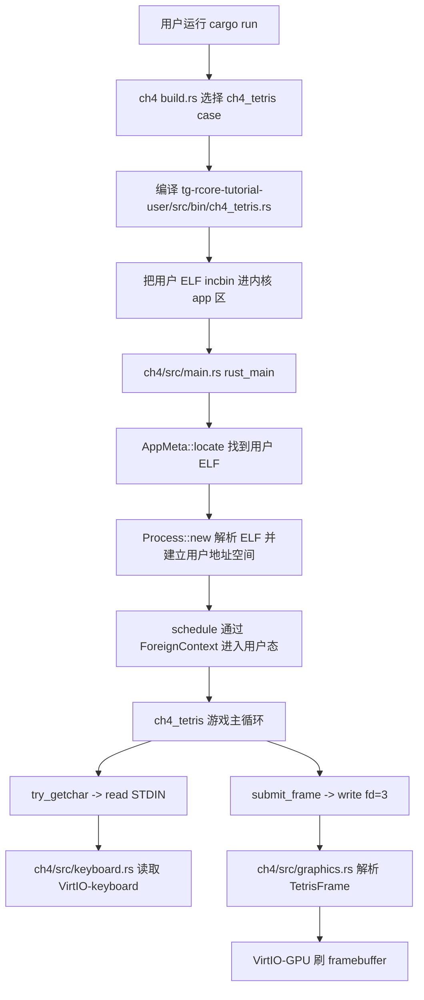

# ch4 Tetris 实现记录

## 当前目标

本次 ch4 扩展的目标不是只在串口里打印字符版俄罗斯方块，而是按 ch3 snake 的路线实现“用户态游戏 + 内核设备支持”：

- 用户态 `ch4_tetris` 负责游戏逻辑，包括方块移动、旋转、下落、行消除、计分和等级递增。
- 内核 ch4 负责提供输入、输出和地址空间安全访问。
- 图形输出走 `write(fd=3, frame)`，由内核解析用户态提交的一帧棋盘数据，再通过 VirtIO-GPU 刷到 QEMU framebuffer。
- 键盘输入走 VirtIO-keyboard，内核轮询键盘事件后通过 `read(STDIN, ...)` 暴露给用户程序。
- 本地 `cargo run` 打开 GTK QEMU 窗口用于交互；测试脚本使用 headless runner，避免 CI 卡在图形窗口。

## 模块调用链



## 用户态和内核态分工

用户态程序只维护游戏规则，不直接操作显卡。每一帧构造 `TetrisFrame`：

- `magic`：帧格式识别，防止 fd=3 收到乱数据。
- `score/lines/level`：当前分数、消行数和等级。
- `cells`：10x20 棋盘，每个格子记录方块类型。

内核收到 `write(fd=3)` 后：

1. 用当前进程地址空间把用户虚拟地址翻译为内核可访问地址。
2. 检查 frame magic 和长度。
3. 初始化或复用 VirtIO-GPU。
4. 把棋盘格子转成彩色像素块。
5. `gpu.flush()` 提交到 QEMU 显示窗口。

## 和 ch4 原理的关系

这个扩展正好对应第四章的重点：用户程序传进来的 `buf` 是用户虚拟地址，内核不能像 ch3 那样直接当物理地址用。ch4 的关键操作是：

```text
用户虚拟地址 buf
  -> 当前进程 address_space.translate
  -> 得到内核可访问的实际地址
  -> 内核安全读取 TetrisFrame
  -> 驱动 VirtIO-GPU 显示
```

这说明地址空间隔离并不是抽象概念，而是每次系统调用访问用户缓冲区时都必须面对的问题。

## 运行方式

本地交互：

```powershell
cd C:\Users\FLY\Desktop\OS\tg-rcore-tutorial-test\tg-rcore-tutorial-ch4
cargo run
```

操作方式：

- `a` 左移
- `d` 右移
- `w` 旋转
- `s` 加速下落
- 空格硬降
- `q` 退出

测试 exercise：

```powershell
cargo ch4-exercise
```

CI 或脚本测试使用 headless runner，不打开 GTK 窗口。

## AI 协作记录摘要

本次主要问题有三类：

1. 本地目录和 git 目录不同步，导致 `cargo-clone`、`try_getchar` 等问题反复出现。
2. 一开始只做了串口 ASCII 版，不符合“ch3 交互图形 demo”的预期。
3. 后续改成 ch3 snake 风格：新增内核 `graphics.rs`、`keyboard.rs`，用户态只提交帧数据。

这次学习到的关键点是：游戏应用不是简单“写一个 Rust 程序”，而是要设计用户态和内核态之间的接口。对于操作系统实验，最重要的是明确哪些事情属于用户程序，哪些事情必须由内核代表用户访问硬件。
