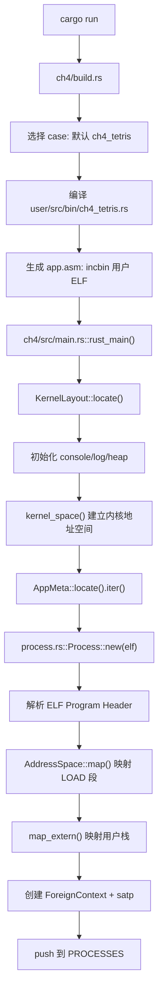
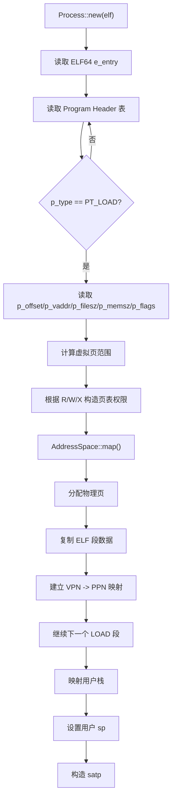
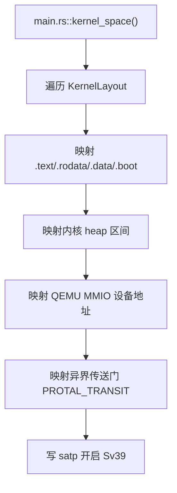
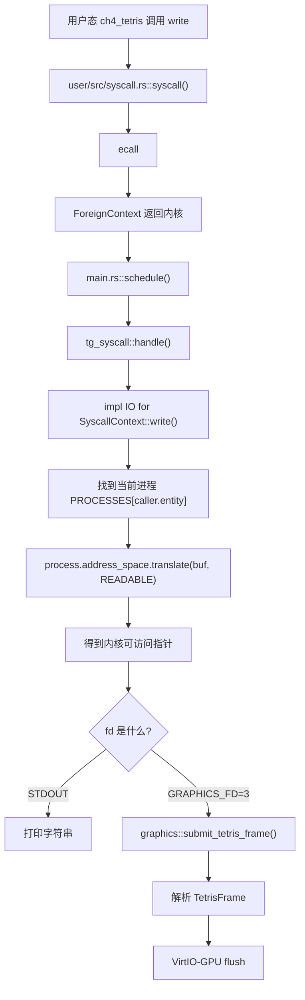
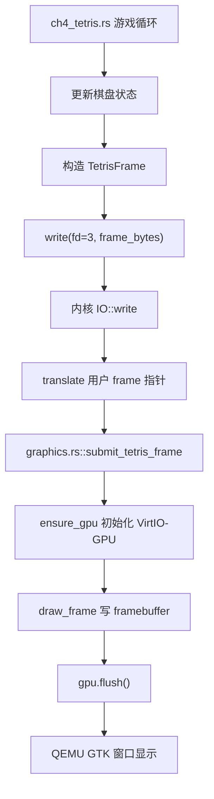
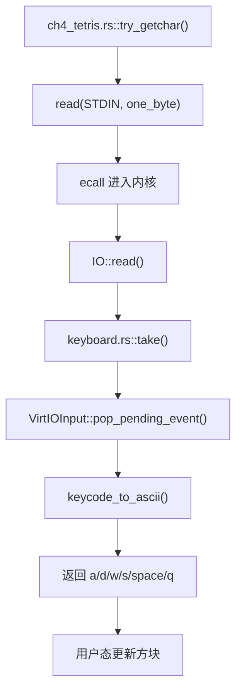
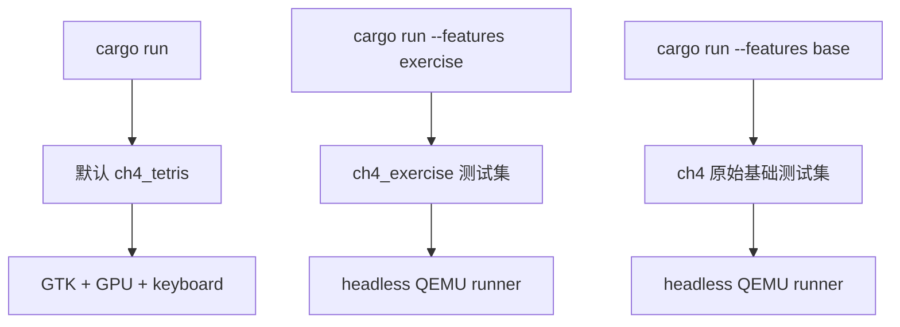

# rCore ch4 代码链与模块对应底稿

## 目录结构观察

ch4 相比 ch3，最关键的变化是引入地址空间和页表管理。代码上可以分成几条线：

```text
tg-rcore-tutorial-ch4/
├── build.rs
├── src/
│   ├── main.rs
│   ├── process.rs
│   ├── graphics.rs
│   ├── keyboard.rs
│   └── ...
tg-rcore-tutorial-kernel-vm/
├── src/
│   ├── lib.rs
│   └── space/
│       ├── mod.rs
│       ├── mapper.rs
│       └── visitor.rs
tg-rcore-tutorial-user/
└── src/bin/
    └── ch4_tetris.rs
```

其中：

- `main.rs`：内核主流程、地址空间初始化、系统调用实现、调度循环。
- `process.rs`：从 ELF 创建用户进程，建立用户地址空间。
- `kernel-vm`：页表和地址空间抽象。
- `graphics.rs`：ch4 Tetris 扩展中的 VirtIO-GPU 输出。
- `keyboard.rs`：ch4 Tetris 扩展中的 VirtIO-keyboard 输入。
- `ch4_tetris.rs`：用户态俄罗斯方块程序。

## 启动与加载链



这个链条说明：用户程序不是运行时从磁盘加载的，而是在构建阶段被 `incbin` 打包进内核镜像。内核启动后通过 `AppMeta` 找到这些 ELF 字节，再为每个 ELF 创建独立进程。

## 用户地址空间创建链



这里的重点不是“复制一个程序”，而是“把 ELF 中各段映射进一个新地址空间”。每个 LOAD 段都有自己的权限，例如代码段可读可执行，数据段可读可写。

## 内核地址空间创建链



本次 ch4 Tetris 的一个关键 bug 就出在这里。开启 Sv39 以后，内核访问设备 MMIO 地址也要经过页表。如果没有把 `0x1000_0000` 附近的 UART、VirtIO-GPU、VirtIO-keyboard 地址映射进去，内核访问 `0x1000_1000` 会触发 `LoadPageFault`。

修复后的设备映射逻辑是：

```text
0x1000_0000 -> UART
0x1000_1000 -> VirtIO-GPU
0x1000_2000 -> VirtIO-keyboard
```

## 系统调用地址翻译链

以 `write(fd, buf, count)` 为例：



这条链就是 ch4 的核心：系统调用不再能直接使用用户指针，必须走当前进程的 `AddressSpace::translate()`。

## ch4 Tetris 图形链



用户态只提交抽象游戏帧，不直接碰硬件。内核态负责把游戏帧翻译成像素并提交给 GPU。

## ch4 Tetris 输入链



键盘输入也体现了用户态/内核态分工：用户程序只读标准输入，具体是 UART 还是 VirtIO-keyboard，由内核实现。

## 测试链



为了避免 CI 卡在图形窗口，`test.sh` 会强制使用：

```text
qemu-system-riscv64 -machine virt -nographic -bios none -kernel
```

而本地默认运行使用：

```text
qemu-system-riscv64 -machine virt -display gtk -serial stdio
  -device virtio-gpu-device
  -device virtio-keyboard-device
```

## 本次调试关键点

1. 一开始 `cargo run` 实际打包的不是 `ch4_tetris`，而是原 ch4 测试程序，需要在 `build.rs` 中区分默认 case、base case、exercise case。
2. 用户态程序成功启动后，访问 GPU MMIO 地址触发 `LoadPageFault 0x10001000`。
3. 原因是 ch4 开启页表后，内核地址空间没有映射 VirtIO-GPU 和 VirtIO-keyboard 的 MMIO 页。
4. 修复方式是在 `kernel_space()` 中额外映射 `0x1000_0000..0x1000_3000`。
5. 修复后日志出现 `virtio-gpu ready` 和 `virtio-keyboard ready`，说明设备链路打通。
