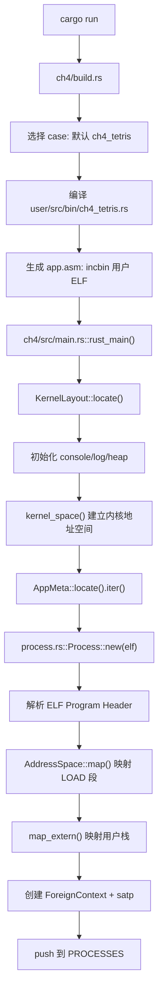
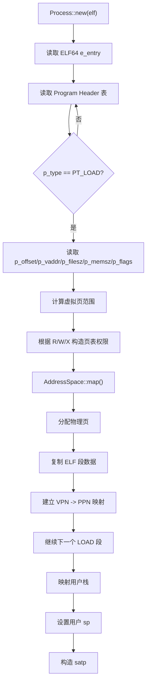
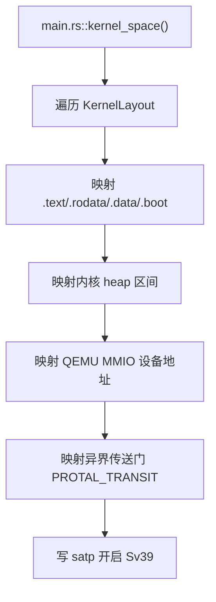
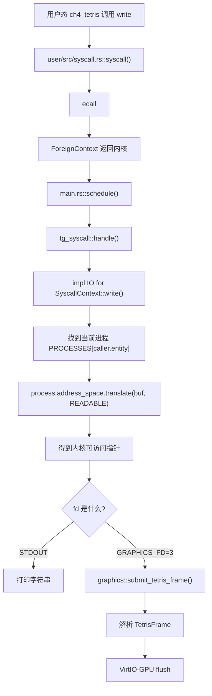
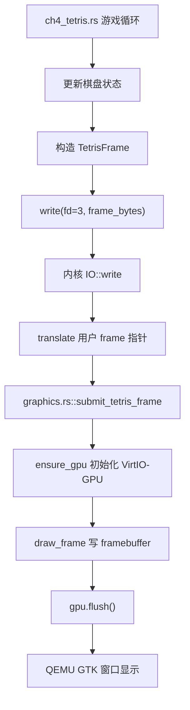
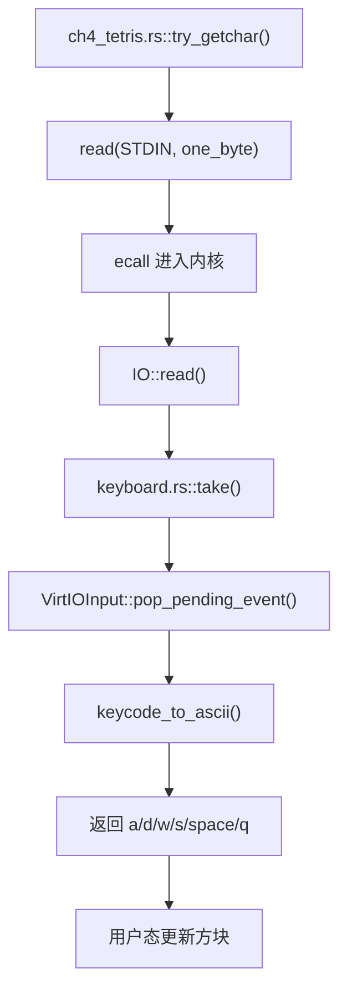
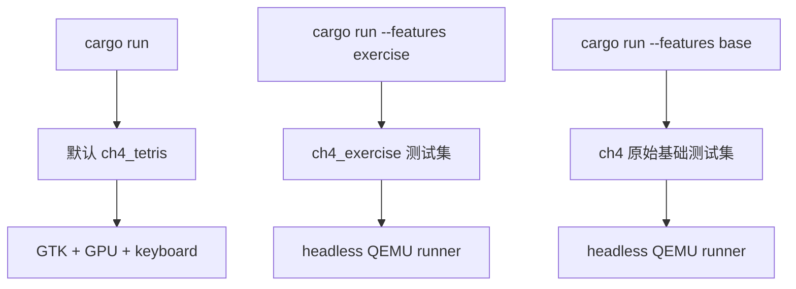

# rCore ch4 代码链与模块对应底稿

## 目录结构观察

ch4 相比 ch3，最关键的变化是引入地址空间和页表管理。代码上可以分成几条线：

```text
tg-rcore-tutorial-ch4/
├── build.rs
├── src/
│   ├── main.rs
│   ├── process.rs
│   ├── graphics.rs
│   ├── keyboard.rs
│   └── ...
tg-rcore-tutorial-kernel-vm/
├── src/
│   ├── lib.rs
│   └── space/
│       ├── mod.rs
│       ├── mapper.rs
│       └── visitor.rs
tg-rcore-tutorial-user/
└── src/bin/
    └── ch4_tetris.rs
```

其中：

- `main.rs`：内核主流程、地址空间初始化、系统调用实现、调度循环。
- `process.rs`：从 ELF 创建用户进程，建立用户地址空间。
- `kernel-vm`：页表和地址空间抽象。
- `graphics.rs`：ch4 Tetris 扩展中的 VirtIO-GPU 输出。
- `keyboard.rs`：ch4 Tetris 扩展中的 VirtIO-keyboard 输入。
- `ch4_tetris.rs`：用户态俄罗斯方块程序。

## 启动与加载链



这个链条说明：用户程序不是运行时从磁盘加载的，而是在构建阶段被 `incbin` 打包进内核镜像。内核启动后通过 `AppMeta` 找到这些 ELF 字节，再为每个 ELF 创建独立进程。

## 用户地址空间创建链



这里的重点不是“复制一个程序”，而是“把 ELF 中各段映射进一个新地址空间”。每个 LOAD 段都有自己的权限，例如代码段可读可执行，数据段可读可写。

## 内核地址空间创建链



本次 ch4 Tetris 的一个关键 bug 就出在这里。开启 Sv39 以后，内核访问设备 MMIO 地址也要经过页表。如果没有把 `0x1000_0000` 附近的 UART、VirtIO-GPU、VirtIO-keyboard 地址映射进去，内核访问 `0x1000_1000` 会触发 `LoadPageFault`。

修复后的设备映射逻辑是：

```text
0x1000_0000 -> UART
0x1000_1000 -> VirtIO-GPU
0x1000_2000 -> VirtIO-keyboard
```

## 系统调用地址翻译链

以 `write(fd, buf, count)` 为例：



这条链就是 ch4 的核心：系统调用不再能直接使用用户指针，必须走当前进程的 `AddressSpace::translate()`。

## ch4 Tetris 图形链



用户态只提交抽象游戏帧，不直接碰硬件。内核态负责把游戏帧翻译成像素并提交给 GPU。

## ch4 Tetris 输入链



键盘输入也体现了用户态/内核态分工：用户程序只读标准输入，具体是 UART 还是 VirtIO-keyboard，由内核实现。

## 测试链



为了避免 CI 卡在图形窗口，`test.sh` 会强制使用：

```text
qemu-system-riscv64 -machine virt -nographic -bios none -kernel
```

而本地默认运行使用：

```text
qemu-system-riscv64 -machine virt -display gtk -serial stdio
  -device virtio-gpu-device
  -device virtio-keyboard-device
```

## 本次调试关键点

1. 一开始 `cargo run` 实际打包的不是 `ch4_tetris`，而是原 ch4 测试程序，需要在 `build.rs` 中区分默认 case、base case、exercise case。
2. 用户态程序成功启动后，访问 GPU MMIO 地址触发 `LoadPageFault 0x10001000`。
3. 原因是 ch4 开启页表后，内核地址空间没有映射 VirtIO-GPU 和 VirtIO-keyboard 的 MMIO 页。
4. 修复方式是在 `kernel_space()` 中额外映射 `0x1000_0000..0x1000_3000`。
5. 修复后日志出现 `virtio-gpu ready` 和 `virtio-keyboard ready`，说明设备链路打通。

## 流程再细化：从 ELF 到用户地址空间的 30 步

这一段按时间顺序解释 ch4 最核心的加载流程：用户程序不再只是复制到某个物理地址，而是被装入一个独立地址空间。

1. `build.rs` 仍然会在构建期选择并编译用户程序。
2. 用户程序这次通常以 ELF 形式嵌入内核镜像。
3. ELF 里面不只是机器码，还有程序头表、入口地址、段权限等元数据。
4. 内核启动后通过 `AppMeta` 找到嵌入的 ELF 字节。
5. 内核把 ELF 字节传给 `Process::new`。
6. `Process::new` 先校验 ELF 格式是否正确。
7. `Process::new` 读取 ELF header 中的入口地址 `e_entry`。
8. `Process::new` 遍历 Program Header 表。
9. 内核只关心 `PT_LOAD` 类型的段，因为这些段需要装入内存。
10. 对每个 LOAD 段，内核读取 `p_vaddr`，知道它希望出现在用户虚拟地址哪里。
11. 内核读取 `p_offset`，知道该段数据在 ELF 文件里的偏移。
12. 内核读取 `p_filesz`，知道文件里实际有多少字节要复制。
13. 内核读取 `p_memsz`，知道运行时该段应该占多少内存。
14. 如果 `p_memsz > p_filesz`，多出来的部分通常对应 `.bss`，需要清零。
15. 内核根据 `p_flags` 生成页表权限，例如 R/W/X/U。
16. 内核把段覆盖的虚拟地址范围按页对齐。
17. `AddressSpace::map` 为这些虚拟页创建映射。
18. 每映射一个用户虚拟页，内核要分配一个物理页帧。
19. 页帧分配器返回一个可用物理页。
20. 页表中建立 VPN 到 PPN 的映射。
21. 页表项 PTE 写入有效位和权限位。
22. 内核把 ELF 段数据复制到对应物理页。
23. 如果段结尾不是页对齐，内核要处理页内偏移。
24. 如果存在 `.bss` 区域，内核要把对应内存清零。
25. 所有 LOAD 段映射完成后，代码段、只读段、数据段就进入了用户地址空间。
26. 内核额外映射用户栈。
27. 内核设置用户栈顶，作为将来用户态 `sp`。
28. 内核准备 TrapContext 或 ForeignContext，把 `sepc` 指向 ELF 入口。
29. 内核生成该地址空间对应的 `satp` 值。
30. 进程被加入调度结构，等待被恢复到用户态执行。

## 流程再细化：Sv39 地址翻译的 28 步

这一段解释“MMU 到底怎么根据页表找物理地址”。实际硬件自动完成，但我们学习时要能讲清楚。

1. 用户程序发出一次访存，例如读取虚拟地址 `va`。
2. CPU 发现当前分页模式是 Sv39。
3. CPU 从 `satp` 中取出根页表物理页号。
4. CPU 把虚拟地址拆成 VPN[2]、VPN[1]、VPN[0] 和 page offset。
5. CPU 先用 VPN[2] 去根页表中找第三级页表项。
6. 如果该 PTE 无效，就触发 PageFault。
7. 如果该 PTE 是中间页表项，CPU 得到下一级页表物理页号。
8. CPU 用 VPN[1] 去第二级页表查找。
9. 如果 PTE 无效或权限不合适，也触发 PageFault。
10. CPU 再用 VPN[0] 去第一级页表查找。
11. 最后一级 PTE 应该指向真正的数据物理页。
12. CPU 检查 PTE 的 V/R/W/X/U 等权限位。
13. 如果用户态访问没有 U 权限的页，触发 PageFault。
14. 如果写只读页，触发 StorePageFault。
15. 如果执行不可执行页，触发 InstructionPageFault。
16. 权限检查通过后，CPU 得到 PPN。
17. CPU 把 PPN 和原虚拟地址的页内偏移拼起来。
18. 拼出的结果就是物理地址。
19. 后续真正访问内存时使用物理地址。
20. 如果 TLB 中已有缓存，CPU 可能不重新走完整三级页表。
21. 切换 `satp` 后通常需要刷新地址翻译缓存。
22. 内核创建页表时，必须保证中间页表页本身也在物理内存中。
23. 内核撤销映射时，要把 PTE 清除。
24. 内核修改权限时，要更新 PTE 权限位。
25. 用户进程切换时，切换 `satp` 就等于切换整个地址空间视角。
26. 同一个虚拟地址在不同进程里可以指向不同物理页。
27. 这就是隔离成立的原因。
28. ch4 之后所有用户指针都必须按当前进程页表翻译。

## 流程再细化：系统调用访问用户指针的 27 步

以 `write(fd, buf, len)` 为例，ch4 和 ch2/ch3 最大不同是 `buf` 不能直接解引用。

1. 用户程序准备一段 buffer。
2. 这个 buffer 地址是用户虚拟地址。
3. 用户程序调用 `write(fd, buf, len)`。
4. 用户态 syscall 包装把 `fd/buf/len` 放入寄存器。
5. 用户执行 `ecall`。
6. CPU 进入内核。
7. 内核保存用户现场。
8. 内核读取 syscall id。
9. 内核识别这是 `write`。
10. 内核拿到 `buf`，但此时它只是用户虚拟地址。
11. 内核通过 `caller.entity` 找到当前进程。
12. 当前进程里保存自己的 `AddressSpace`。
13. 内核调用 `address_space.translate(buf, READABLE)`。
14. `translate` 根据进程页表查找 `buf` 对应的 PTE。
15. `translate` 检查该页是否有效。
16. `translate` 检查该页是否有用户可读权限。
17. 如果 buffer 跨页，内核需要处理多个页。
18. 权限检查失败时返回错误或触发异常处理。
19. 翻译成功后，内核得到可访问的物理地址或内核映射地址。
20. 内核才可以读取用户 buffer 内容。
21. 如果 `fd=1`，内容被送到 console。
22. 如果 `fd=3`，内容被解释成 Tetris 图形帧。
23. 内核完成输出后，把返回值写回用户 `a0`。
24. 内核让 `sepc += 4`。
25. 内核恢复用户上下文。
26. 用户程序从 `write` 后继续。
27. 这条链说明：ch4 后系统调用的关键难点变成“用户地址翻译”。

## 流程再细化：Tetris 图形和输入的 26 步

1. `cargo run` 默认选择 `ch4_tetris`。
2. QEMU 以 GTK 图形窗口启动。
3. QEMU 挂载 VirtIO-GPU 设备。
4. QEMU 挂载 VirtIO-keyboard 设备。
5. 内核启动并建立内核地址空间。
6. 内核映射普通内核段。
7. 内核映射 heap。
8. 内核额外映射 MMIO 设备地址。
9. 用户态 Tetris 程序被加载进自己的地址空间。
10. Tetris 用户程序进入游戏循环。
11. 游戏逻辑更新当前方块位置。
12. 游戏逻辑检测碰撞和行消除。
13. 游戏逻辑计算分数、等级和速度。
14. 用户程序构造 `TetrisFrame`。
15. 用户程序调用 `write(fd=3, frame_ptr, frame_len)`。
16. 内核翻译 `frame_ptr`。
17. 内核确认 frame 数据可读。
18. `graphics.rs` 解析 frame。
19. `graphics.rs` 初始化或复用 VirtIO-GPU。
20. `graphics.rs` 把方块格子转换成 framebuffer 像素。
21. 内核调用 GPU flush。
22. QEMU GTK 窗口显示新画面。
23. 用户程序调用 `read(STDIN)` 读取键盘。
24. 内核从 VirtIO-keyboard 取按键事件。
25. 内核把按键转换为 `a/d/w/s/space/q`。
26. 用户态根据按键移动、旋转、下落或退出。

## Guide 代码树和组件化仓库的详细对应

Guide ch4 为了教学，通常会把内存管理拆成很清楚的模块：

```text
os/src/
├── config.rs
├── loader.rs
├── main.rs
├── mm/
│   ├── address.rs
│   ├── frame_allocator.rs
│   ├── heap_allocator.rs
│   ├── memory_set.rs
│   ├── mod.rs
│   └── page_table.rs
├── task/
├── syscall/
└── trap/
```

组件化 `tg-rcore-tutorial-ch4` 把其中很多通用能力抽成 crate，当前仓库里看到的是：

```text
tg-rcore-tutorial-ch4/src/
├── main.rs
├── process.rs
├── graphics.rs
└── keyboard.rs

tg-rcore-tutorial-kernel-vm/src/
├── lib.rs
└── space/
    ├── mod.rs
    ├── mapper.rs
    └── visitor.rs

tg-rcore-tutorial-kernel-alloc/
tg-rcore-tutorial-kernel-context/
tg-rcore-tutorial-user/
```

详细对应关系如下：

| Guide 模块 | Guide 中负责什么 | 组件化仓库对应 | 在流程里何时调用 |
| --- | --- | --- | --- |
| `mm/address.rs` | 定义物理地址、虚拟地址、页号、页内偏移 | `tg-kernel-vm` 中地址和页表抽象 | 建立映射、翻译用户指针时使用 |
| `mm/frame_allocator.rs` | 分配物理页帧 | `tg-kernel-alloc` 和 `tg-kernel-vm` 内部分配逻辑 | `AddressSpace::map` 需要新物理页时 |
| `mm/page_table.rs` | Sv39 页表结构、PTE、map/translate | `tg-kernel-vm/space/mapper.rs` 等 | 建立 VPN->PPN、系统调用翻译用户地址 |
| `mm/memory_set.rs` | 地址空间 `MemorySet`，管理多个映射区域 | `tg-kernel-vm::AddressSpace` | 创建内核地址空间、创建用户进程地址空间 |
| `mm/heap_allocator.rs` | 内核堆初始化 | `tg-kernel-alloc` | `rust_main` 初始化 heap 时 |
| `loader.rs` | 读取 app ELF 数据 | `build.rs + AppMeta` | 内核启动后找到嵌入的用户 ELF |
| `task/task.rs` | TCB 增加 `memory_set/trap_cx_ppn/base_size` | `process.rs::Process` 和上下文结构 | 进程创建、syscall 查当前进程地址空间 |
| `syscall/process.rs` | `sys_mmap/sys_munmap/sys_sbrk` 等 | `main.rs` 中相关 syscall trait impl | 用户请求修改地址空间时 |
| `syscall/fs.rs` | `read/write` 用户 buffer 翻译 | `main.rs::IO::read/write` | Tetris frame、console 输出、输入读取 |
| `trap/mod.rs` | 处理 PageFault、UserEnvCall | `main.rs` 调度/异常处理 + context crate | 用户访存错误或 syscall 时 |

所以 ch4 的学习不能只看 `process.rs`，还要把 `tg-kernel-vm` 当成 Guide 里 `mm/` 目录的组件化版本。

## ch4 模块调用时机总表

```text
1. QEMU 启动
   -> main.rs::rust_main

2. 内核基础初始化
   -> console/log/heap

3. 建立内核地址空间
   -> main.rs::kernel_space
   -> tg-kernel-vm::AddressSpace
   -> 映射内核段、heap、MMIO

4. 找到用户 ELF
   -> AppMeta::locate
   -> build.rs 生成的 app 元数据

5. 创建进程
   -> process.rs::Process::new
   -> 解析 ELF
   -> 创建用户 AddressSpace

6. 映射用户 LOAD 段
   -> tg-kernel-vm map
   -> frame allocator 分配物理页
   -> 复制 ELF 段

7. 映射用户栈
   -> AddressSpace::map_extern 或等价接口
   -> 设置用户 sp

8. 进入用户态
   -> kernel-context / ForeignContext
   -> 写 satp 或使用进程地址空间
   -> sret

9. 用户 syscall
   -> user syscall.rs
   -> ecall
   -> trap/context

10. 内核处理用户指针
    -> main.rs syscall impl
    -> process.address_space.translate
    -> 检查 PTE 权限

11. 图形/输入扩展
    -> graphics.rs / keyboard.rs
    -> 设备 MMIO 必须已经在内核页表中映射
```

## 和 Guide 原文叙述的对应理解

Guide 先讲 `address.rs`，是为了让我们知道地址不是单一数字，而是可以分成：

```text
VirtAddr / PhysAddr
VirtPageNum / PhysPageNum
page offset
```

Guide 再讲 `frame_allocator.rs`，是因为页表映射必须有真实物理页承载用户数据。没有页帧分配器，就无法给新虚拟页找物理内存。

Guide 接着讲 `page_table.rs`，是为了说明页表项 PTE 如何记录：

```text
PPN + V/R/W/X/U/A/D 权限位
```

Guide 再讲 `memory_set.rs`，是为了把单个页表操作升级成“一个进程完整地址空间”的管理。一个进程不是只有一个页，而是代码段、数据段、栈、堆、mmap 区域等多个区域。

组件化仓库的 `tg-kernel-vm::AddressSpace` 就是这个思想的封装：它不是一张孤立页表，而是给内核提供“创建、映射、翻译、切换地址空间”的统一接口。
