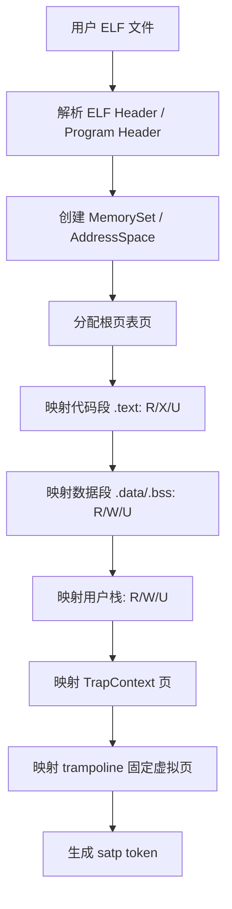
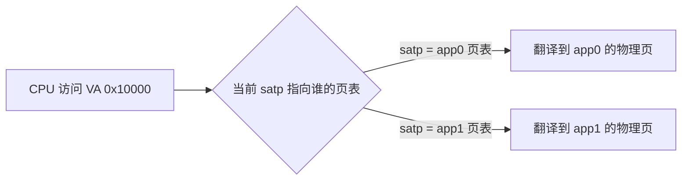
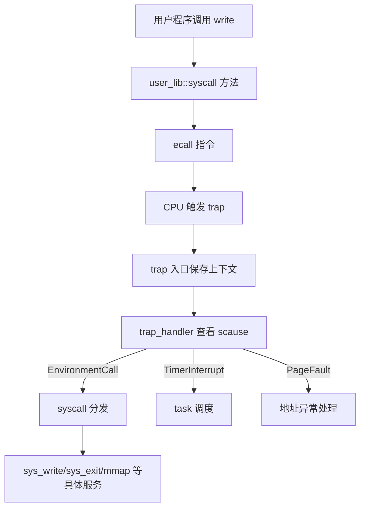
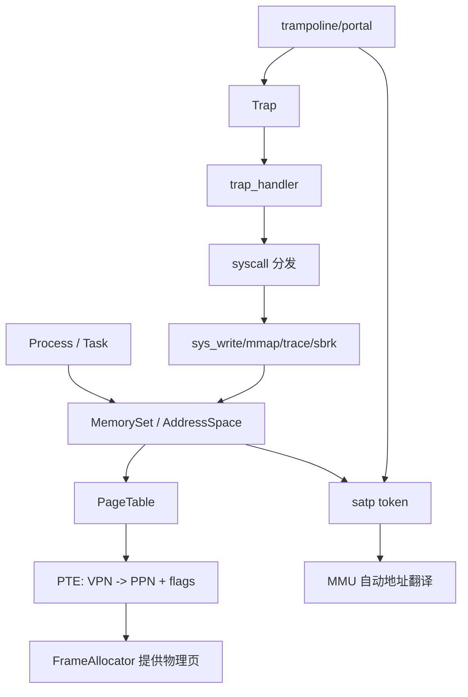

# rCore ch4 地址空间模块关系精讲版

> 这一版不是单纯背调用链，而是从“底层机制 -> 内核模块 -> 系统调用接口 -> 用户程序感受到的效果”来讲。目标是把第四章最容易混乱的几个概念讲清楚：地址空间、页表、satp、MMU、trampoline/portal、Trap、syscall、UserBuffer。

## 0. 先把一句话说准

第四章的核心不是“多开几个 portal 门”，而是：

```text
每个进程拥有一张自己的页表；
CPU 的 satp 寄存器指向当前正在使用的页表；
MMU 根据 satp 自动把虚拟地址翻译成物理地址；
trampoline/portal 只是为了在切换页表时保证那一小段切换代码不会失效。
```

这里最关键的词是：**页表才是地图，satp 是当前地图编号，MMU 是自动查地图的人，trampoline 只是换地图时站着不动的安全平台。**

## 1. 第四章是在第三章基础上补什么

第三章已经有：

```text
多个任务
  -> TaskControlBlock
  -> TrapContext
  -> TaskContext
  -> timer / yield / switch
```

第三章解决的是：

```text
CPU 时间怎么分给多个程序
```

但是第三章没有真正解决：

```text
内存怎么隔离
```

也就是说，第三章里多个用户程序虽然可以轮流跑，但地址管理还比较粗糙。一个程序如果访问错误地址，可能影响别的程序或内核。

第四章补上的就是：

```text
每个用户程序有自己的虚拟地址空间 MemorySet；
每个 MemorySet 背后有自己的页表；
切换程序时，不只是换执行上下文，还要换 satp。
```

可以这样理解：

```text
ch3：谁来运行，由调度器管。
ch4：运行的人能看见哪片内存，由地址空间管。
```

## 2. 几个底层概念必须先分开

### 2.1 物理地址

物理地址是机器真实内存地址。

比如 QEMU virt 机器上，内核可能被加载到：

```text
0x80200000
```

这个地址更接近“真实内存里的位置”。

### 2.2 虚拟地址

虚拟地址是程序看到的地址。

用户程序可能都以为自己从：

```text
0x10000
```

开始运行。

但这只是它看到的“门牌号”，不是必然等于真实物理位置。

### 2.3 页表

页表就是一张转换表：

```text
虚拟页号 VPN -> 物理页号 PPN + 权限
```

权限包括：

```text
R  可读
W  可写
X  可执行
U  用户态可访问
V  有效
```

### 2.4 satp

satp 是 RISC-V 的控制寄存器，用来告诉 MMU：

```text
当前应该使用哪一张根页表。
```

所以更准确地说：

```text
每个地址空间不是“有一套 satp 寄存器”；
而是每个地址空间有一张根页表，对应一个 satp 值。
CPU 只有一个当前 satp，切换进程时内核把 satp 改成另一个地址空间的页表 token。
```

### 2.5 MMU

MMU 是硬件。

程序每次取指令、读内存、写内存时，CPU 都会通过 MMU 自动把虚拟地址翻译成物理地址。

内核不会每条 load/store 都手动查页表。内核的职责是：

```text
把页表建对；
把 satp 切对；
权限设对；
必要时处理 page fault。
```

### 2.6 trampoline / portal

trampoline，也可以叫 portal/传送门，但这个比喻要用准。

它不是：

```text
很多个门分别通向不同物理地址
```

它是：

```text
所有地址空间都把同一个固定虚拟地址映射到同一个物理页。
```

它的作用是：

```text
切换 satp 的时候，当前正在执行的那段代码不能突然消失。
```

因为切换 satp 等于换地图。如果换地图前后当前 PC 所在的虚拟地址映射不一致，CPU 下一条指令就可能找不到。trampoline 的存在就是为了让这段“换地图代码”在旧页表和新页表里都能被找到。

## 3. 第四章的模块分工

在传统 rCore 代码里，第四章相关模块通常是：

```text
mm/address.rs
  -> 地址类型封装，VirtAddr / PhysAddr / VPN / PPN

mm/frame_allocator.rs
  -> 物理页帧分配器，负责分配真实物理页

mm/page_table.rs
  -> 页表结构与 PTE 操作，负责 map/unmap/translate

mm/memory_set.rs
  -> 地址空间 MemorySet，负责组织一整个进程能看到的虚拟内存地图

trap/
  -> TrapContext、__alltraps、__restore、trampoline 切换入口

task/
  -> TCB，调度当前任务，并在切换时带上地址空间 token
```

在 tg 组件化版本里，名字会变成组件库封装，例如：

```text
tg_kernel_vm::AddressSpace
tg_kernel_vm::page_table::Sv39
tg_kernel_context::foreign::ForeignContext
MultislotPortal
```

但底层思想不变：

```text
AddressSpace / MemorySet 负责整张地图；
PageTable 负责地图的页表结构；
FrameAllocator 负责给地图背后找真实物理页；
ForeignContext / TrapContext 负责跨地址空间执行时保存恢复现场；
Portal / trampoline 负责切 satp 时不让 CPU 跑飞。
```

## 4. 内核初始化 mm 时到底做了什么

你之前的问题是：是不是先把所有东西集合到一个统一虚拟空间？

更准确的说法是：

```text
内核先建立自己的内核地址空间；
然后每个用户进程再建立自己的用户地址空间；
这些地址空间不是一个统一大空间，而是彼此独立的地图。
```

内核地址空间里通常包括：

```text
内核 .text   -> 内核代码，可读可执行
内核 .rodata -> 只读数据
内核 .data   -> 已初始化全局变量
内核 .bss    -> 未初始化全局变量，启动时清零
内核 heap    -> 内核动态分配内存
MMIO 区域    -> 设备寄存器映射
trampoline   -> 所有地址空间共享的跳板页
```

映射 heap 和数据段是什么意思？

意思是：

```text
内核也要访问自己的全局变量、静态数据、堆内存；
开启分页后，CPU 看到的是虚拟地址；
所以必须在内核页表里建立“这些虚拟地址 -> 正确物理地址”的映射。
```

如果不映射，内核访问自己的变量也会 page fault。

## 5. 用户进程地址空间怎么创建

创建用户进程时，核心流程是：

```text
读取用户 ELF
  -> 创建新的 MemorySet / AddressSpace
  -> 创建根页表
  -> 解析 ELF 的 LOAD 段
  -> 给代码段/数据段分配物理页
  -> 把 ELF 内容复制进去
  -> 设置 PTE 权限
  -> 映射用户栈
  -> 映射 TrapContext
  -> 映射 trampoline/portal
  -> 得到这个进程对应的 satp token
```

可以画成：



这里的重点是：

```text
用户程序的代码和数据不是直接“塞到某个固定物理地址然后裸跑”；
而是被放进物理页，再通过页表映射到用户程序期望看到的虚拟地址。
```

## 6. “同一个虚拟地址，换 satp 到不同真实地址”怎么理解

例子：

```text
app0 页表：
  VA 0x10000 -> PA 0x80500000

app1 页表：
  VA 0x10000 -> PA 0x80600000
```

用户程序 app0 和 app1 都可以认为：

```text
我的入口地址是 0x10000
```

但 CPU 当前 satp 不同，MMU 查到的物理地址就不同。



这就是地址空间隔离的核心。

## 7. syscall 和 trap 在第四章里的关系

这里也要讲准：

```text
syscall 不是“特权级切换机制本身”；
syscall 是内核提供的服务接口和分发逻辑。

trap 才是 CPU 从用户态进入内核态的异常/中断机制。
```

用户程序调用系统调用时：

```text
user_lib::sys_write
  -> 把 syscall id 放入 a7
  -> 把参数放入 a0/a1/a2
  -> 执行 ecall
```

`ecall` 会触发 trap：

```text
CPU 发现 U-mode 执行 ecall
  -> 保存异常原因 scause
  -> 保存返回位置 sepc
  -> 跳到 stvec 指定的 trap 入口
```

然后内核的 trap_handler 再判断：

```text
如果 scause 是 syscall
  -> 调用 syscall 分发

如果 scause 是 timer
  -> 调用调度逻辑

如果 scause 是 page fault
  -> 检查地址是否合法或杀死进程
```

关系图：



所以你可以把层次说成：

```text
ecall 是触发 trap 的指令；
trap 是进入内核的硬件机制；
syscall 是 trap_handler 里的一类软件分发服务；
具体 sys_write/mmap/sbrk 才是内核 API 的实现。
```

## 8. 第四章后 sys_write 为什么复杂了

第三章时，内核可能可以比较粗暴地读用户地址。

第四章后，用户传进来的地址是虚拟地址：

```text
sys_write(fd, buf, len)
```

这里的 `buf` 是用户地址空间里的虚拟地址。内核不能直接把它当物理地址用。

正确过程是：

```text
当前进程 satp/token
  -> 找到当前进程页表
  -> 把用户虚拟地址范围翻译成物理页切片
  -> 包装成 UserBuffer
  -> 内核再读取这些字节
```

注意：

```text
用户程序自己访问 buf 时，MMU 自动翻译。
内核要替用户读 buf 时，内核必须显式根据用户页表翻译它。
```

这是因为内核此时可能运行在内核地址空间，不能假装用户虚拟地址就是内核可访问地址。

## 9. mmap/munmap 和 trace 在第四章里的意义

`mmap` 的本质是：

```text
让用户进程向内核申请一段新的虚拟地址范围；
内核在当前进程 MemorySet 中增加映射；
给这段虚拟地址背后分配物理页；
设置权限。
```

`munmap` 的本质是：

```text
把某段虚拟地址范围从当前进程页表里拆掉；
必要时回收背后的物理页。
```

`trace` 在第四章变难，是因为：

```text
trace_read(addr)
```

里面的 `addr` 不再是可以直接 dereference 的地址，而是用户虚拟地址。必须检查：

```text
这个虚拟地址有没有映射？
权限是否允许读/写？
它是不是用户页？
```

所以第四章的 trace 练习本质上是在逼你理解：

```text
用户指针不是普通指针，而是“某个地址空间里的虚拟地址”。
```

## 10. 本章模块之间的精髓关系

可以用这张图总结：



一句话讲清它们：

```text
Process 拥有 MemorySet；
MemorySet 组织 PageTable；
PageTable 的 PTE 指向 FrameAllocator 分配的物理页；
satp 选择当前使用哪张 PageTable；
MMU 根据 satp 自动翻译地址；
trap 负责从用户态进入内核；
syscall 是 trap 里的一种服务分发；
trampoline 保证切换 satp 时那段代码仍能执行。
```

## 11. 最容易说错的地方

### 11.1 “每个地址空间有自己的 satp”

更严谨：

```text
每个地址空间有自己的根页表；
这个根页表可以编码成一个 satp 值；
CPU 当前只有一个 satp 寄存器。
```

### 11.2 “portal 帮 MMU 查地址”

错。

```text
MMU 查的是页表，不查 portal。
portal/trampoline 只是切换页表时保证代码不断掉。
```

### 11.3 “内核空间和用户空间是一个统一虚拟空间”

不完全对。

```text
内核有自己的地址空间；
每个用户进程有自己的地址空间；
它们会共享某些固定映射，比如 trampoline；
也可能在用户页表中映射必要的内核入口信息。
```

### 11.4 “syscall 就是中断”

不准确。

```text
ecall 触发同步异常；
trap 是异常/中断进入内核的总机制；
syscall 是 trap_handler 对 ecall 的软件分发。
```

## 12. 给别人讲这一章时可以这样说

第四章真正干的事，是给每个程序发了一张自己的“地址地图”。用户程序拿着固定的虚拟地址运行，但 CPU 实际访问哪里，由当前 satp 指向的页表决定。页表由内核创建，物理页由页帧分配器提供，MMU 负责自动翻译。系统调用时，用户通过 ecall 触发 trap 进入内核，trap_handler 再把它分发给 syscall。为了在用户页表和内核页表之间切换时不让 CPU 找不到下一条指令，所有地址空间共享一个固定虚拟地址的 trampoline 页。  

所以第四章不是“多开几个门”，而是：**地址空间隔离 + 页表翻译 + trap/syscall 跨特权级服务 + trampoline 保证切换连续性**。

