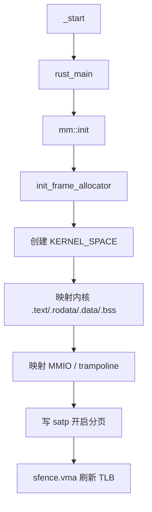
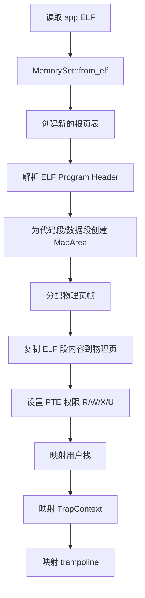
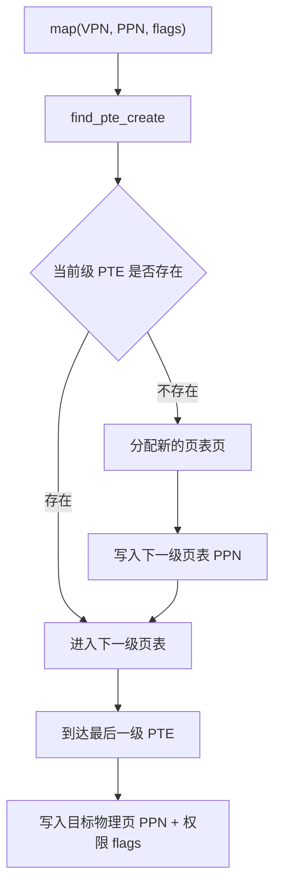
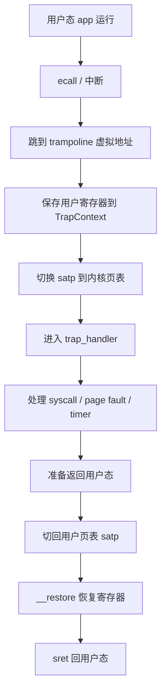

# rCore ch4 执行流程归纳：地址空间、页表与内存隔离

> 本文件重点整理 ch4 的执行流程。ch4 是整个 rCore 学习里非常关键的一章：从这里开始，用户程序不再直接面对物理地址，而是拥有独立虚拟地址空间。

## 1. 本章要解决的问题

ch3 虽然能让多个任务轮流运行，但它们仍然缺乏真正的内存隔离。

问题包括：

```text
app0 如果写错地址
  -> 可能破坏 app1
  -> 可能破坏内核
  -> 内核很难保护系统
```

ch4 要引入：

- 虚拟地址
- 物理地址
- 页表
- MMU 地址翻译
- `satp` 页表切换
- 每个任务独立 `MemorySet`

一句话：

```text
同样的用户虚拟地址，在不同进程/任务里可以映射到不同物理页。
```

## 2. 地址空间的核心直觉

没有地址空间时：

```text
程序看到的地址 == 真实物理地址
```

有地址空间后：

```text
程序看到的是虚拟地址
MMU 根据当前 satp 指向的页表
把虚拟地址翻译成物理地址
```

比如：

```text
app0 的 VA 0x10000 -> PA 0x80500000
app1 的 VA 0x10000 -> PA 0x80600000
```

用户程序都以为自己从 `0x10000` 开始运行，但实际物理内存不同。

## 3. ch4 新增的主要模块

典型结构：

```text
src/mm/
  address.rs          -> 物理/虚拟地址、页号抽象
  frame_allocator.rs  -> 物理页帧分配器
  page_table.rs       -> Sv39 页表与 PTE
  memory_set.rs       -> 地址空间 MemorySet
```

模块职责：

```text
address.rs
  -> 把 usize 包装成 VirtAddr / PhysAddr / VirtPageNum / PhysPageNum

frame_allocator.rs
  -> 管理哪些物理页可以分配

page_table.rs
  -> 建立 VA 到 PA 的映射

memory_set.rs
  -> 管理一个完整地址空间，包含多个 MapArea
```

## 4. 内核启动阶段：建立内核地址空间

ch4 启动时，内核要先给自己建立地址空间。

流程：



重点：

- 内核也要在分页机制下运行。
- 内核地址空间通常映射内核自身代码、数据和设备 MMIO。
- 开启分页后，CPU 取指和访存都会经过 MMU。

## 5. 创建用户地址空间

当内核要运行 app0 时，要创建 app0 的 `MemorySet`：



这一步的直觉：

```text
MemorySet 不是程序本身
MemorySet 是“这个程序能看到的一整张虚拟内存地图”
```

## 6. PageTable 的工作流程

Sv39 是三级页表。一个虚拟页号 VPN 会被拆成三级索引：

```text
VPN[2] -> 一级页表索引
VPN[1] -> 二级页表索引
VPN[0] -> 三级页表索引
```

建立映射时：



所以页表页本身也是物理页帧，需要由 `frame_allocator` 分配。

## 7. `satp` 与 MMU 自动翻译

每个地址空间都有自己的根页表。

切换地址空间时，内核要写 `satp`：

```text
satp = 根页表 PPN + Sv39 模式
sfence.vma
```

然后硬件 MMU 自动做：

```text
用户访问 VA
  -> MMU 读取 satp
  -> 找到根页表
  -> 三级查页表
  -> 检查权限 R/W/X/U
  -> 得到 PA
  -> 访问物理内存
```

这里很重要：

```text
地址翻译不是 Rust 代码每次手动查。
正常用户访存由硬件 MMU 自动完成。
内核只负责把页表建正确、satp 切正确。
```

## 8. TrapContext 与 trampoline

引入地址空间后，trap 变复杂了。

原因：

```text
用户态运行时 satp 指向用户页表
trap 发生时 CPU 要跳到内核代码
但如果用户页表里没有映射内核入口，就跳不过去
```

解决办法是 trampoline：

```text
所有地址空间都把同一段 trampoline 代码映射到同一个虚拟地址
```

trap 流程：



TrapContext 保存的是：

- 用户寄存器
- `sepc`
- `sstatus`
- 内核栈地址
- 内核页表 token
- trap_handler 地址

## 9. 系统调用访问用户缓冲区

ch4 以后，用户传给内核的指针是用户虚拟地址。

例如：

```text
sys_write(fd, buf, len)
```

这里的 `buf` 不能被内核直接当作物理地址访问。

正确思路：

```text
当前任务 token
  -> 找到用户页表
  -> 把用户虚拟地址范围翻译成若干物理页
  -> 包装成 UserBuffer
  -> 内核安全地读写这些物理内存
```

这就是 ch4 地址空间带来的关键变化。

## 10. mmap / trace 练习的理解

ch4 的练习通常围绕：

- 映射一段虚拟内存
- 解除映射
- 检查权限
- trace 读写用户地址时做合法性检查

和 ch3 的区别：

```text
ch3 trace 可以 unsafe 直接读写地址
ch4 trace 必须检查虚拟地址是否映射、权限是否允许
```

因为 ch4 开始，地址已经不是裸物理地址。

## 11. ch4 相对 ch3 的演进

```text
ch3：多任务
  -> 每个任务有上下文
  -> 但内存隔离弱

ch4：地址空间
  -> 每个任务有自己的 MemorySet
  -> 每个任务有自己的页表
  -> 切换任务时也要切换 satp
  -> 用户指针必须通过页表转换
```

一句话：

```text
ch3 管“谁运行”
ch4 管“每个人看到哪片内存”
```

## 12. 一句话总结

ch4 的本质是：给每个任务建立独立虚拟地址空间，让用户程序看到稳定的虚拟地址，而真实物理内存由页表和 MMU 管理，从而实现内存隔离和权限保护。

