# rCore ch5 代码链与模块对应底稿

## 目录结构观察

本章的组件化仓库结构如下：

```text
tg-rcore-tutorial-ch5/
├── build.rs
├── Cargo.toml
├── test.sh
├── .cargo/
│   └── config.toml
└── src/
    ├── main.rs
    ├── process.rs
    ├── processor.rs
    ├── graphics.rs
    └── keyboard.rs

tg-rcore-tutorial-user/
├── cases.toml
└── src/bin/
    ├── ch5_usertest.rs
    ├── ch5_spawn0.rs
    ├── ch5_spawn1.rs
    ├── ch5_setprio.rs
    ├── ch5_stride*.rs
    └── ch5_pingpong.rs
```

相比 Guide 的传统结构，这个组件化版本没有把 `syscall/process.rs`、`syscall/mm.rs`、`task/mod.rs`、`mm/memory_set.rs` 都放在本章目录里，而是做了拆分：

```text
Guide 中的 syscall/process.rs
-> ch5/src/main.rs::impls::Process

Guide 中的 syscall/mm.rs
-> ch5/src/main.rs::impls::Memory

Guide 中的 syscall/fs.rs 或 console I/O
-> ch5/src/main.rs::impls::IO

Guide 中的 TaskManager / Processor
-> ch5/src/processor.rs::ProcManager + PROCESSOR

Guide 中的 ProcessControlBlock
-> ch5/src/process.rs::Process

Guide 中的 MemorySet
-> tg-rcore-tutorial-kernel-vm::AddressSpace

Guide 中的 frame_allocator
-> tg-rcore-tutorial-kernel-alloc

Guide 中的 loader
-> build.rs + APPS Lazy map
```

所以读组件化代码时，不能机械按照 Guide 的文件名找，而要按照功能找。

## ch5 的核心文件职责

### build.rs

`build.rs` 是构建期脚本，负责把用户程序编译并嵌入内核。

它做几件事：

1. 找到 `tg-rcore-tutorial-user`。
2. 读取 `cases.toml`。
3. 根据 feature 和环境变量选择 case。
4. 编译对应用户态程序。
5. 生成 `app.asm`。
6. 让内核编译时通过 `APP_ASM` 环境变量包含这些用户程序。

当前选择逻辑：

```text
--features exercise -> ch5_exercise
CHAPTER=-5          -> ch5
默认 cargo run      -> ch5_pingpong
```

### main.rs

`main.rs` 是内核主控文件，包含：

- `rust_main` 启动流程。
- 内核地址空间建立。
- APPS 表。
- portal 映射。
- 系统调用 trait 实现。
- 初始进程选择。

这里的 `impls` 模块尤其重要，它把 `tg_syscall` 的 trait 接到具体实现上。

### process.rs

`process.rs` 定义进程对象 `Process`。

它包含：

- 从 ELF 创建进程。
- fork 复制进程。
- exec 替换当前进程内容。
- sbrk 调整堆。
- 进程字段如 pid、address_space、context、priority、stride。

### processor.rs

`processor.rs` 定义进程管理器。

它负责：

- 保存所有进程。
- 保存 ready queue。
- 记录当前进程。
- 添加进程。
- 让当前进程挂起。
- 让当前进程退出。
- 使用 stride 算法选择下一个进程。

### graphics.rs

`graphics.rs` 是 pingpong 扩展加入的 VirtIO-GPU 渲染模块。

它负责：

- 初始化 VirtIO-GPU。
- 建立 framebuffer。
- 接收用户态 `PingpongFrame`。
- 绘制球场、挡板、球和比分。
- flush framebuffer。

### keyboard.rs

`keyboard.rs` 是 pingpong 扩展加入的 VirtIO-keyboard 输入模块。

它负责：

- 初始化 VirtIO-keyboard。
- 轮询按键事件。
- 把 QEMU 键码转换为 `w/s/i/k/q`。
- 提供给 `main.rs::input` 统一读取。

## 构建期流程：用户程序如何进入内核

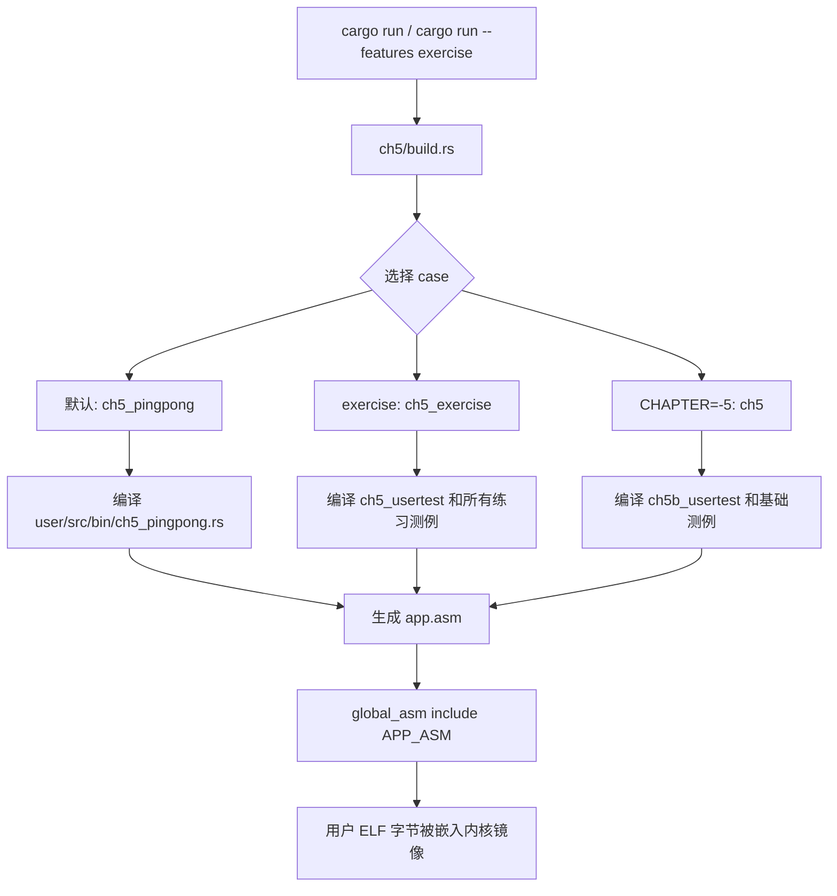

这里要注意：用户程序不是运行时从磁盘加载的，而是构建时打包进内核的。

## 启动期 30 步流程

下面是 ch5 从 QEMU 启动到运行第一个用户进程的完整流程。

```text
01. cargo run 调用 Rust 编译。
02. build.rs 先运行。
03. build.rs 读取 TG_USER_DIR，找到用户态 crate。
04. build.rs 读取 cases.toml。
05. build.rs 根据 feature/CHAPTER 选择 case。
06. build.rs 编译对应用户态 ELF。
07. build.rs 生成 app.asm。
08. 内核编译时 include app.asm。
09. QEMU 加载内核 ELF。
10. CPU 进入内核入口。
11. rust_main 开始执行。
12. 清空 .bss。
13. 初始化 console。
14. 设置 log level。
15. 初始化内核堆。
16. 分配 portal 页面。
17. kernel_space 建立内核地址空间。
18. 映射内核 text/rodata/data/boot。
19. 映射内核 heap。
20. 映射 UART / VirtIO-GPU / VirtIO-keyboard MMIO。
21. 映射 portal 页面。
22. 写 satp，开启 Sv39。
23. 初始化 MultislotPortal。
24. 注册 IO/Process/Scheduling/Clock/Memory syscall 实现。
25. 根据 CHAPTER 选择初始进程名。
26. APPS.get 找到初始 ELF。
27. Process::from_elf 解析 ELF 并创建地址空间。
28. map_portal 将 portal 映射复制进用户地址空间。
29. ProcManager::add 把初始进程加入管理器。
30. schedule 循环开始调度用户进程。
```

## 初始进程选择链

我们对 ch5 做了入口区分，避免默认游戏和测试互相干扰。

```mermaid
flowchart TD
    A["main.rs::rust_main"] --> B{"option_env!(CHAPTER)"}
    B -->|Some(\"5\")| C["initproc_name = ch5_usertest"]
    B -->|Some(\"-5\")| D["initproc_name = ch5b_usertest"]
    B -->|None/Other| E["initproc_name = ch5_pingpong"]
    C --> F["APPS.get(initproc_name)"]
    D --> F
    E --> F
    F --> G["ElfFile::new"]
    G --> H["Process::from_elf"]
    H --> I["ProcManager::add"]
```

这样：

- 测试入口固定，不会卡在 shell。
- 默认入口直接进入 pingpong。
- base 和 exercise 分离。

## Process::from_elf 流程

`Process::from_elf` 是从 ELF 创建进程的关键。

```text
01. 输入 ElfFile。
02. 读取 ELF entry。
03. 创建新的 AddressSpace。
04. 遍历 Program Header。
05. 找到 PT_LOAD 段。
06. 读取 p_vaddr/p_offset/p_filesz/p_memsz。
07. 根据 ELF flags 计算 R/W/X 权限。
08. 计算虚拟页范围。
09. AddressSpace 分配物理页。
10. 建立 VPN -> PPN 映射。
11. 复制 ELF 文件内容到物理页。
12. 对 bss 区域清零。
13. 分配用户栈。
14. 设置用户 sp。
15. 设置 heap_bottom 和 program_brk。
16. 创建 ForeignContext。
17. 写入入口地址 entry。
18. 写入用户栈指针。
19. 设置 satp 为该进程地址空间根页表。
20. 初始化 pid/parent/children/priority/stride。
```

## fork 调用链

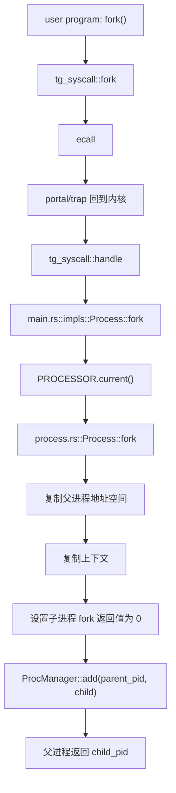

fork 后父子进程从同一位置继续执行，是因为子进程复制了父进程当前上下文。差别靠返回值区分。

## exec 调用链

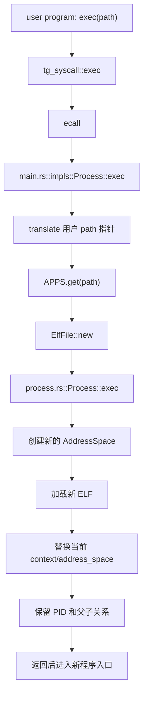

exec 的关键：换程序，不换 PID。

## wait 调用链

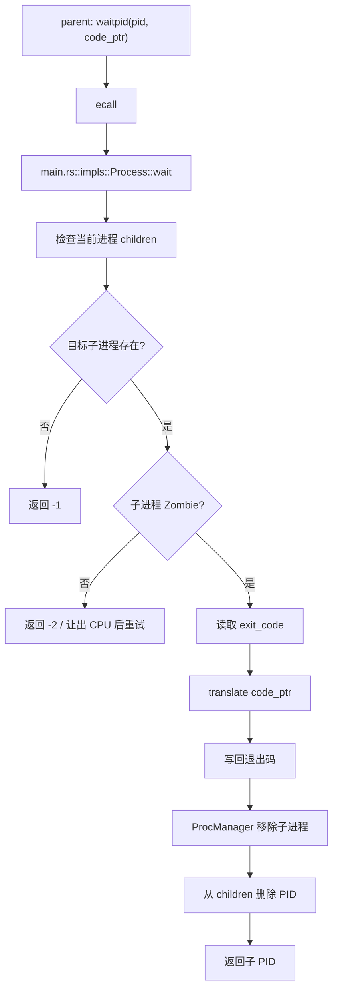

wait 的重点是资源回收。

## exit 调用链

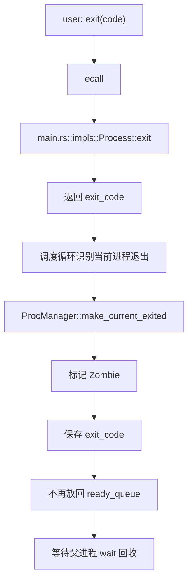

exit 后进程不是立刻消失，而是等待父进程回收。

## spawn 练习实现链

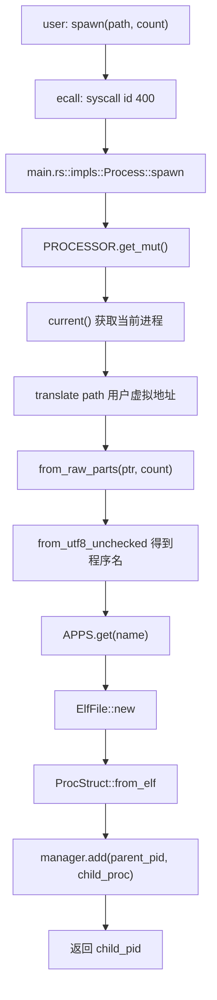

spawn 和 fork 的区别：

```text
fork: 复制当前进程
spawn: 直接从目标 ELF 创建新进程
```

## mmap 调用链

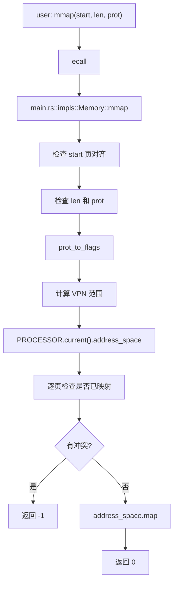

## munmap 调用链

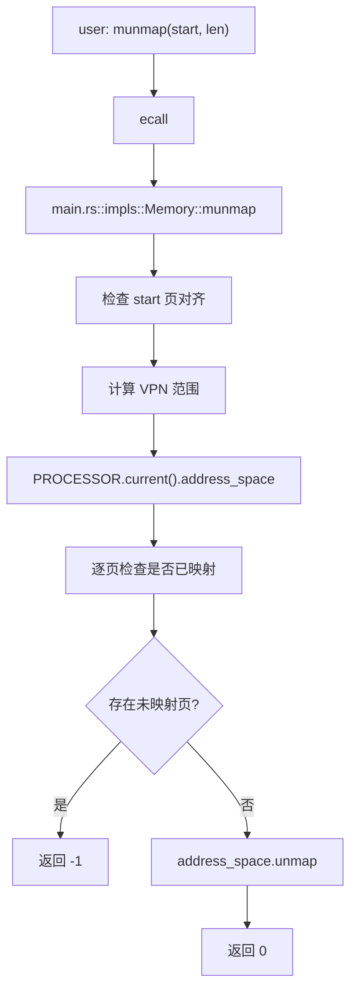

## set_priority 调用链

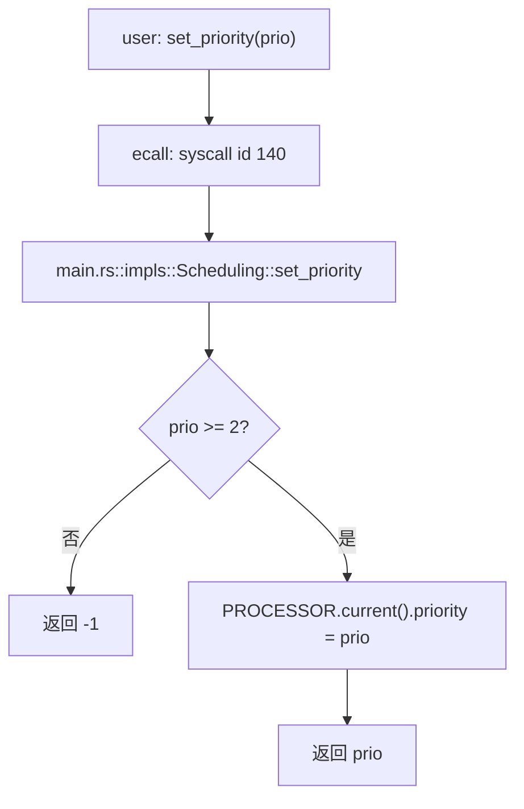

## stride 调度 28 步细化流程

```text
01. 一个进程进入 ready_queue。
02. 每个进程保存 priority。
03. 每个进程保存 stride。
04. 初始 priority = 16。
05. 初始 stride = 0。
06. 调度器需要选择下一个进程。
07. ProcManager::fetch 被调用。
08. fetch 遍历 ready_queue。
09. 对每个 PID 找到对应 Process。
10. 读取 Process.stride。
11. 记录当前最小 stride。
12. 如果 stride 更小，更新候选进程。
13. 如果 stride 相同，用 PID 做稳定比较。
14. 遍历结束后得到 selected_pid。
15. 从 ready_queue 删除 selected_pid。
16. 找到 selected_pid 对应 Process。
17. 计算 pass = BIG_STRIDE / priority。
18. 如果 pass 为 0，则修正为 1。
19. Process.stride += pass。
20. selected_pid 成为当前运行进程。
21. 用户进程运行一个时间片或直到 syscall。
22. 如果进程 yield，保存状态。
23. yield 后进程重新进入 ready_queue。
24. 如果进程 exit，不再进入 ready_queue。
25. 下一次调度再次调用 fetch。
26. stride 小的进程优先被选。
27. priority 高的进程 pass 小，stride 增长慢。
28. 因此 priority 高的进程获得更多 CPU 机会。
```

## ProcManager 状态迁移链

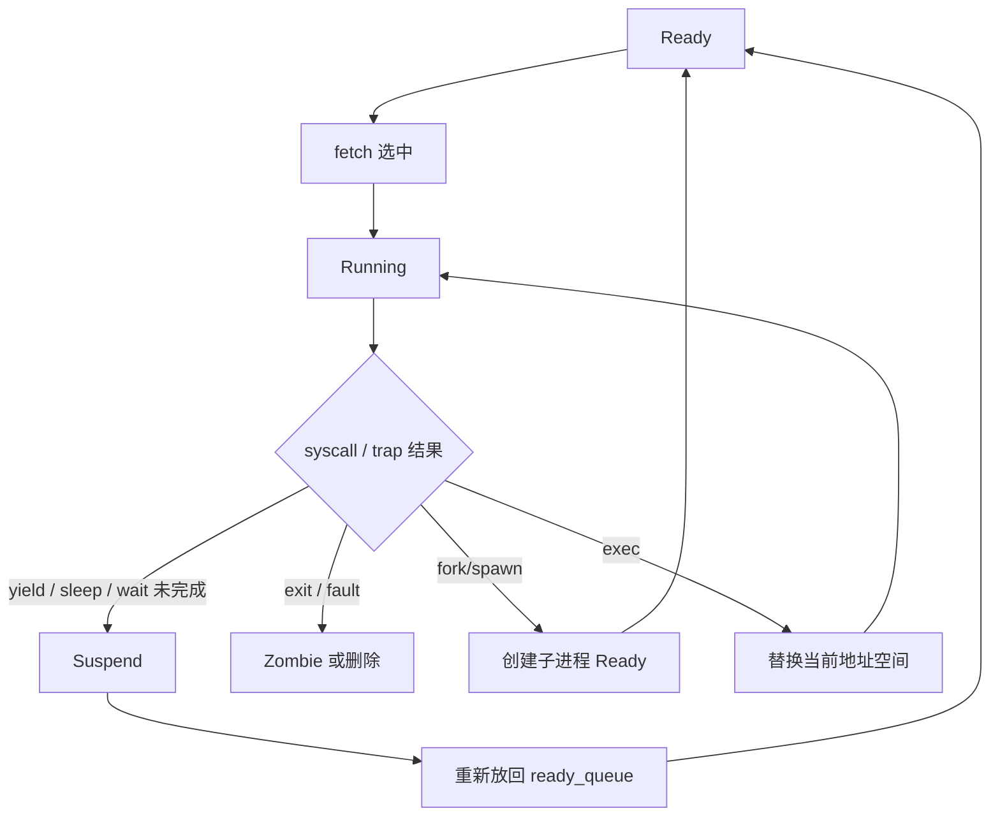

## 用户态 pingpong 到内核图形链

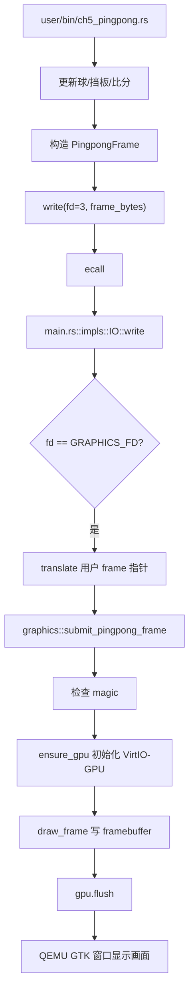

## 用户态 pingpong 键盘输入链

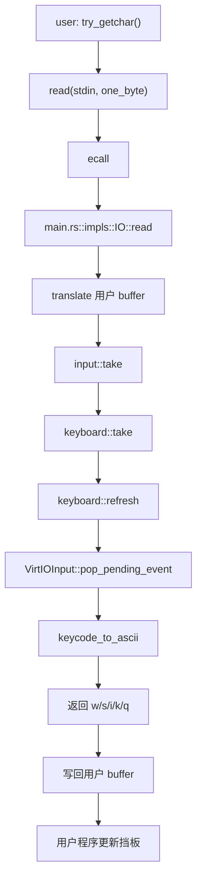

## ch5_pingpong 用户程序内部 30 步流程

```text
01. 用户程序 ch5_pingpong 作为初始进程启动。
02. 初始化左右挡板位置。
03. 初始化球位置。
04. 初始化速度向量 vx/vy。
05. 初始化比分。
06. 打印控制说明。
07. 构造第一帧 PingpongFrame。
08. write(fd=3) 提交第一帧。
09. 进入游戏循环。
10. try_getchar 轮询按键。
11. 如果按 w，左挡板上移。
12. 如果按 s，左挡板下移。
13. 如果按 i，右挡板上移。
14. 如果按 k，右挡板下移。
15. 如果按 q，提交 game_over 帧并退出。
16. 读取当前时间 get_time。
17. 判断是否到达下一帧时间。
18. 更新 ball_x。
19. 更新 ball_y。
20. 检查上墙/下墙碰撞。
21. 检查左挡板碰撞。
22. 检查右挡板碰撞。
23. 碰撞后反向 vx。
24. 根据碰撞提高 speed。
25. 检查球是否越过左边界。
26. 如果越界，右方得分并重置球。
27. 检查球是否越过右边界。
28. 如果越界，左方得分并重置球。
29. 构造新帧并 write(fd=3)。
30. sleep + sched_yield 让出 CPU。
```

## 图形 DMA 调试链

一开始出现：

```text
[ch5-pingpong] failed to initialize virtio-gpu
```

定位过程：

```text
01. 日志显示 Device features 能读到。
02. 说明 MMIO 地址映射基本正确。
03. 日志显示 Config 能读到。
04. 说明 VirtIO-GPU 设备存在。
05. 失败发生在 setup_framebuffer。
06. framebuffer 大小 = width * height * 4。
07. 800 * 480 * 4 ≈ 1.46MB。
08. 128 页 DMA = 128 * 4096 = 512KB。
09. DMA 不够，setup_framebuffer 失败。
10. 不能简单无限加大 DMA。
11. 因为 ch5 exercise spawn 会创建很多进程。
12. 过大的静态 DMA 会压缩内核可用堆。
13. 解决方案：降低分辨率。
14. 改为 640 * 360 * 4 ≈ 900KB。
15. GPU DMA 调为 256 页 ≈ 1MB。
16. keyboard DMA 保持 16 页。
17. 重新运行后出现 virtio-gpu ready。
```

## 测试链

### exercise 测试

```text
CHAPTER=5 cargo run --features exercise
```

链路：

```text
build.rs 选择 ch5_exercise
-> 初始进程选择 ch5_usertest
-> ch5_usertest 依次 spawn 各测例
-> 测试 mmap/munmap/spawn/set_priority/stride
-> 输出 ch5 Usertests passed!
```

### base 测试

```text
CHAPTER=-5 cargo run
```

链路：

```text
build.rs 选择 ch5
-> 初始进程选择 ch5b_usertest
-> 运行基础 fork/exec/wait/sbrk 等测例
-> 输出 Basic usertests passed!
```

### 默认游戏

```text
cargo run
```

链路：

```text
build.rs 选择 ch5_pingpong
-> 初始进程选择 ch5_pingpong
-> 用户态游戏循环
-> fd=3 图形输出
-> stdin 键盘输入
```

## 本章模块关系总图

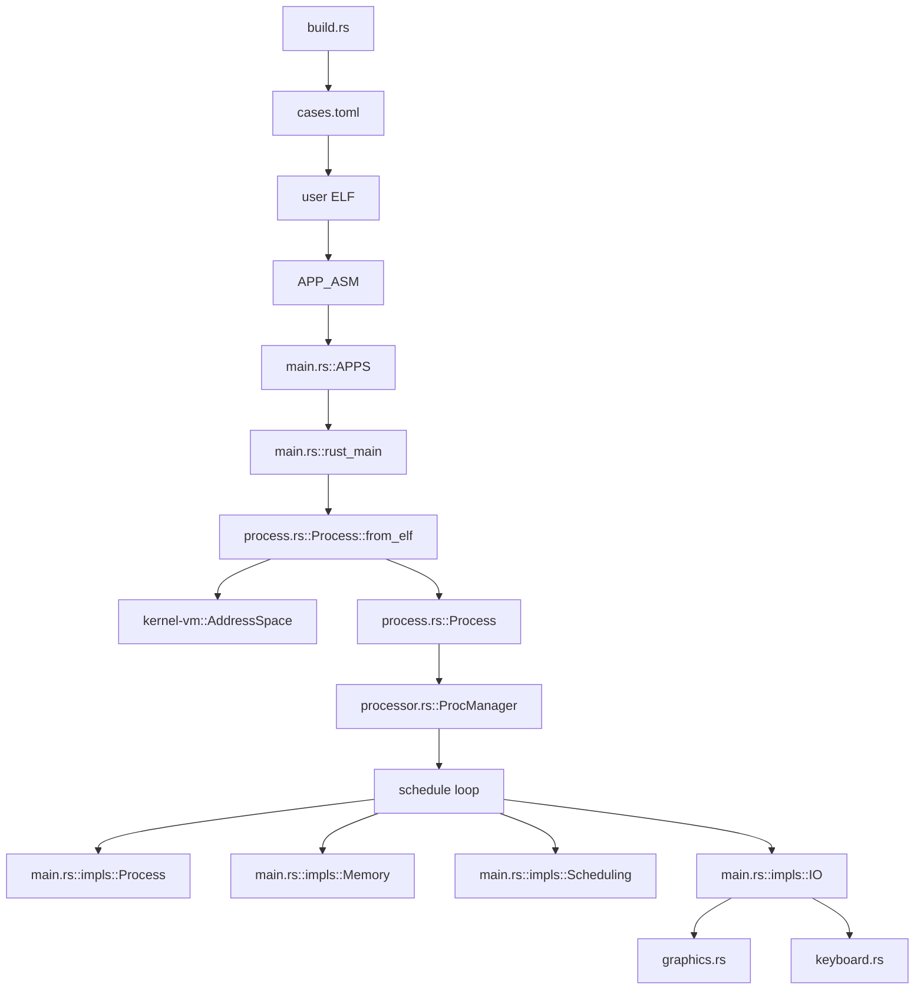

## 读代码时的建议

如果只看 `main.rs` 会觉得它很大，但可以拆成几块：

```text
启动部分:
    rust_main / kernel_space / map_portal

数据入口:
    APPS / app_names

系统调用:
    impls::IO
    impls::Process
    impls::Scheduling
    impls::Clock
    impls::Memory

进程结构:
    process.rs

调度结构:
    processor.rs

游戏扩展:
    graphics.rs
    keyboard.rs
```

真正理解 ch5 的关键是把 `Process` 和 `ProcManager` 分开：

- `Process` 是单个进程档案。
- `ProcManager` 是管理所有进程的调度器和进程表。

## 本章最值得回看的一条链

```text
用户程序 spawn("ch5_getpid")
-> syscall id 400
-> 内核翻译用户 path 地址
-> APPS 找到 ch5_getpid ELF
-> Process::from_elf 创建新地址空间和上下文
-> ProcManager::add 建立父子关系
-> ready_queue 中出现新 PID
-> stride fetch 选中该子进程
-> 子进程运行并 exit
-> 父进程 wait 回收
```

这条链把 ch4 地址空间、ch5 进程管理、系统调用、调度、父子关系全部串起来了。
