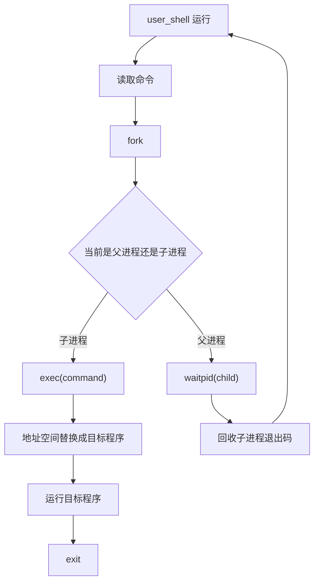
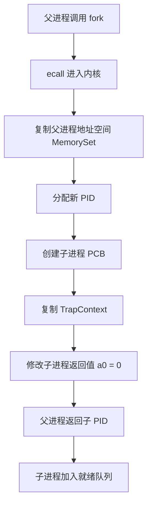
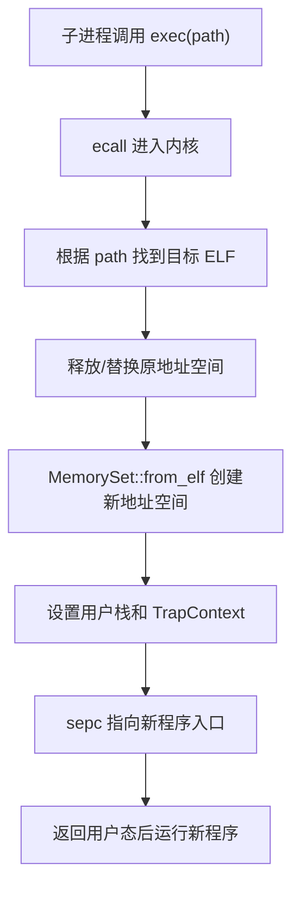
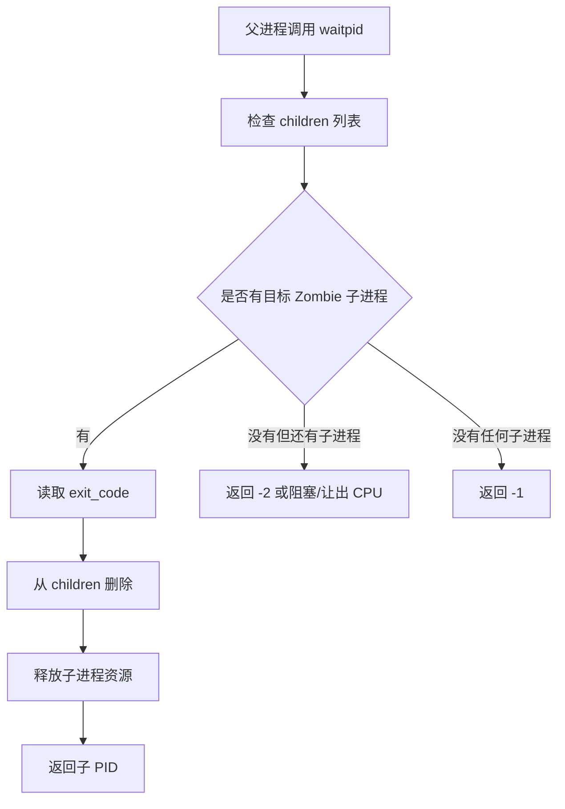
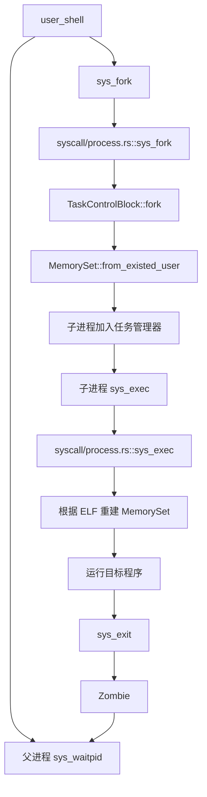

# rCore ch5 执行流程归纳：从任务到进程

> 本文件重点整理 ch5 的执行流程。ch5 的核心是：把前面“内核预先装好的任务”升级成真正的进程模型，引入 `fork`、`exec`、`waitpid`、父子关系和 shell。

## 1. 本章要解决的问题

ch3/ch4 已经能运行多个任务，并且 ch4 有了地址空间。但它们更像：

```text
内核启动前就知道有哪些程序
内核把它们加载好
然后轮流运行
```

ch5 要更接近真实操作系统：

```text
shell 本身是一个用户程序
用户在 shell 输入命令
shell fork 出子进程
子进程 exec 替换成目标程序
父进程 waitpid 等待子进程结束
```

这就是进程生命周期管理。

## 2. 进程和任务的区别

可以粗略理解：

```text
任务 Task
  -> 关注“CPU 正在执行谁”
  -> 重点是上下文切换和调度

进程 Process
  -> 关注“一个程序运行实例拥有的资源”
  -> 包括地址空间、文件描述符、父子关系、退出码等
```

ch5 以后，调度对象虽然仍然要能被 CPU 切换，但它背后已经带着完整资源集合。

## 3. 进程控制块 PCB / TCB

典型字段：

```text
ProcessControlBlock / TaskControlBlock
  pid                  -> 进程 ID
  inner                -> 可变内部状态
  memory_set           -> 地址空间
  trap_cx_ppn          -> TrapContext 所在物理页
  base_size            -> 用户程序数据区域大小
  task_cx              -> TaskContext，任务切换上下文
  task_status          -> Ready / Running / Zombie
  parent               -> 父进程
  children             -> 子进程列表
  exit_code            -> 退出码
```

这里很多字段来自前面章节：

- `memory_set` 来自 ch4 地址空间。
- `trap_cx_ppn` 对应用户态/内核态切换现场。
- `task_cx` 来自 ch3 任务切换。

ch5 不是推翻前面，而是把它们包进“进程”这个更完整的抽象里。

## 4. shell 的执行模型

shell 是一个用户态程序，不是内核魔法。

它循环做：

```text
打印提示符
  -> 读入命令
  -> fork 创建子进程
  -> 子进程 exec 目标程序
  -> 父进程 waitpid 等待
  -> 回到提示符
```

流程图：



## 5. fork 的流程

`fork` 的语义是复制当前进程。

内核执行：



最关键的一点：

```text
fork 返回两次。
父进程里返回子进程 PID。
子进程里返回 0。
```

它们之后根据返回值走不同分支。

## 6. exec 的流程

`exec` 不是创建新进程，而是替换当前进程的程序内容。

流程：



这就是为什么 shell 不能自己直接 `exec` 命令：

```text
如果 shell 自己 exec ls
  -> shell 的代码和地址空间被 ls 替换
  -> ls 结束后 shell 就没了
```

所以正确做法是：

```text
shell fork 子进程
子进程 exec 命令
父进程继续当 shell
```

## 7. waitpid 与 Zombie

子进程退出后，不能马上完全消失。

因为父进程还要拿到：

- 子进程 PID
- 退出码
- 退出状态

所以子进程先变成：

```text
Zombie
```

`waitpid` 流程：



## 8. sys_exit 的流程

用户程序退出：

```text
sys_exit(exit_code)
  -> trap 进内核
  -> 标记当前进程 Zombie
  -> 保存 exit_code
  -> 把子进程交给 initproc
  -> 唤醒可能等待的父进程
  -> 调度下一个进程
```

其中“把子进程交给 initproc”是为了避免孤儿进程没人回收。

## 9. 本章模块调用链

典型模块：

```text
task/
  mod.rs       -> 调度、当前任务、run_next
  task.rs      -> TCB/PCB 定义
  manager.rs   -> 就绪队列
  pid.rs       -> PID / KernelStack 管理

mm/
  memory_set.rs -> from_elf / fork 地址空间复制
  page_table.rs -> 页表映射

syscall/
  process.rs   -> sys_fork / sys_exec / sys_waitpid / sys_exit

fs/
  inode / open -> exec 根据路径读取 ELF
```

以 `fork + exec + waitpid` 为主线：



## 10. ch5 相对 ch4 的演进

```text
ch4：每个任务有独立地址空间
  -> 能隔离内存
  -> 但任务来源仍偏静态

ch5：进程生命周期
  -> fork 动态创建
  -> exec 替换程序
  -> waitpid 回收子进程
  -> shell 作为用户程序控制系统
```

一句话：

```text
ch4 解决“程序住在哪里”
ch5 解决“程序如何出生、变身、等待、死亡”
```

## 11. 易错点

### Q1：fork 和 exec 都是创建新进程吗？

不是。

```text
fork -> 创建子进程，复制当前进程
exec -> 不创建新进程，只替换当前进程的程序内容
```

### Q2：父进程是不是一定是 shell？

不一定。任何进程都可以 fork 子进程。只是实验里 shell 是最典型的父进程。

### Q3：Zombie 是不是死循环卡住？

不是。Zombie 表示进程已经退出，但退出码等信息还没被父进程回收。

### Q4：waitpid 为什么需要？

因为父进程需要知道子进程何时结束、退出码是多少，并最终释放子进程残留资源。

## 12. 一句话总结

ch5 的本质是：把 ch3/ch4 的任务和地址空间进一步封装成进程，让程序可以由用户态 shell 动态创建、替换、等待和回收，操作系统开始真正像一个“可交互系统”。

