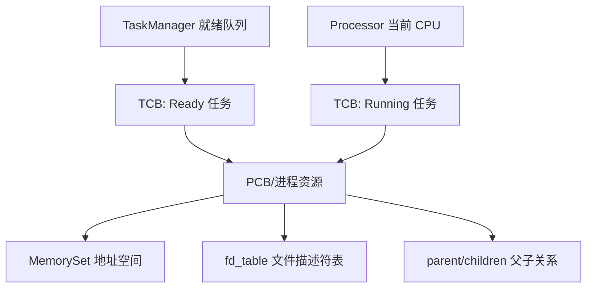
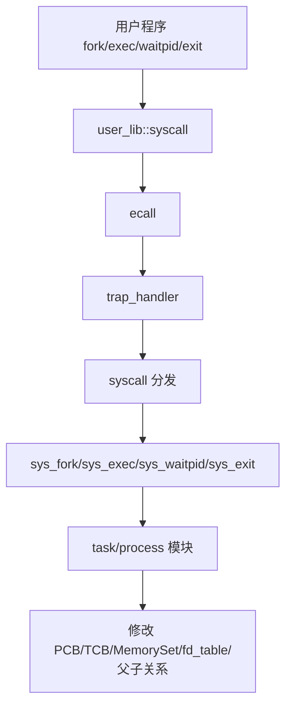
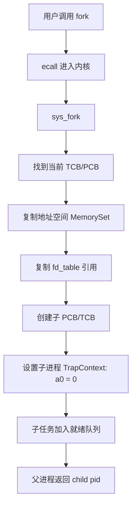
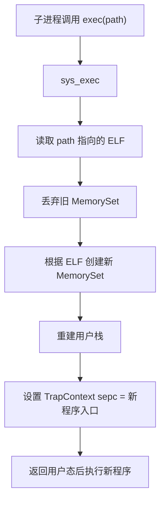
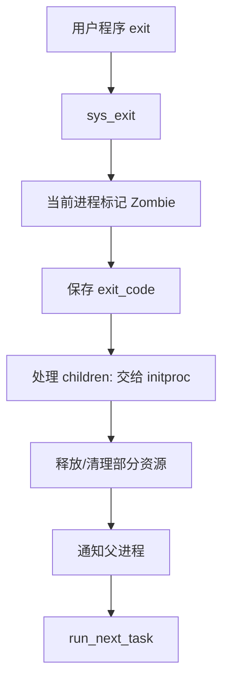
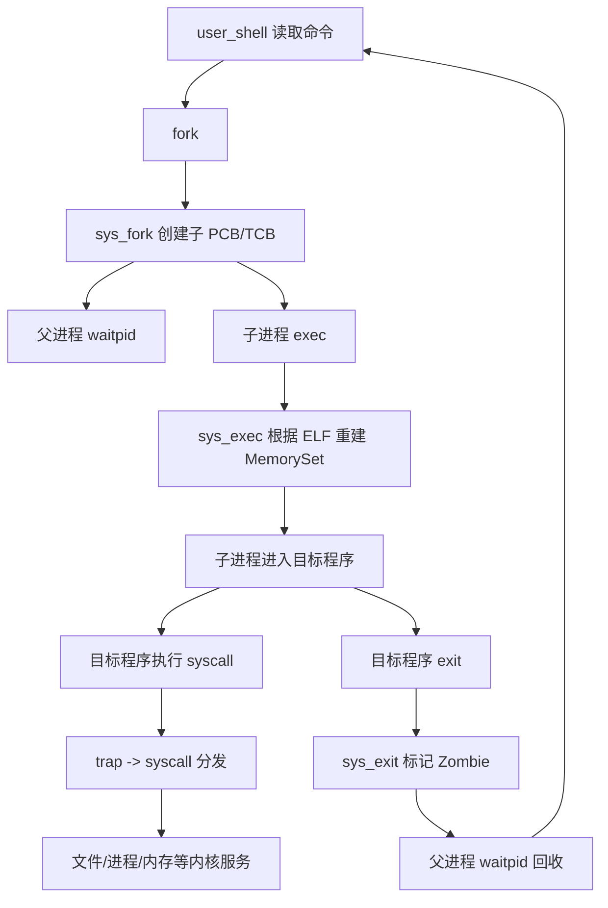

# rCore ch5 进程模块关系精讲版

> 这一版重点解释：第五章为什么要引入进程、PCB 和生命周期管理；它和第三章 TCB 调度、第四章 MemorySet 地址空间之间是什么关系；syscall、task、processor/manager 各自到底做什么。

## 0. 先把一句话说准

第五章的核心不是“又多了几个系统调用”，而是：

```text
把前面“内核预先管理的一组任务”升级成“用户程序可以动态创建、替换、等待、回收的进程模型”。
```

它继承了：

```text
ch3 的调度能力：任务能被切换。
ch4 的地址空间能力：每个执行实体有自己的 MemorySet。
```

然后新增：

```text
进程父子关系；
fork；
exec；
waitpid；
Zombie；
shell。
```

## 1. 为什么 ch5 不能只靠 ch3/ch4

ch3 的问题：

```text
任务是内核启动时预先准备好的；
用户不能动态启动新程序；
没有父子关系。
```

ch4 的问题：

```text
虽然每个任务有独立地址空间；
但还没有完整的“进程生命周期”。
```

真实操作系统需要：

```text
shell 输入命令
  -> 创建子进程
  -> 子进程加载目标程序
  -> 父进程等待结果
  -> 子进程退出后被回收
```

这就是第五章。

## 2. PCB 和 TCB 的关系先讲清楚

### 2.1 TCB 是执行单位

TCB，Task Control Block，强调：

```text
CPU 当前执行谁？
这个执行流被切走时上下文保存在哪里？
它现在是 Ready、Running 还是 Zombie？
```

典型内容：

```text
TaskContext
KernelStack
TaskStatus
TrapContext 位置
调度相关字段
```

### 2.2 PCB 是资源容器

PCB，Process Control Block，强调：

```text
这个进程拥有哪些资源？
它的地址空间是什么？
它打开了哪些文件？
它的父进程和子进程是谁？
它退出码是什么？
```

典型内容：

```text
pid
memory_set
fd_table
parent
children
exit_code
```

### 2.3 第五章为什么容易混

在很多教学 OS 里，第五章还没有真正引入“一个进程多个线程”，所以常常出现：

```text
一个进程 ≈ 一个任务
PCB 和 TCB 在结构上可能合在一起，或者 TCB 里带着进程资源。
```

这时候你看到的 `TaskControlBlock` 可能承担了两份职责：

```text
调度职责：作为 TCB 被调度器管理。
资源职责：保存 memory_set、fd_table、parent、children 等 PCB 字段。
```

所以不要死扣名字，要看它的字段：

```text
如果它保存 TaskContext/KernelStack/状态 -> 它在做 TCB 的事。
如果它保存 MemorySet/fd_table/父子关系 -> 它在做 PCB 的事。
```

## 3. Processor、TaskManager、ProcessManager 分别是什么

不同版本代码命名可能不同，但概念可以这样分。

### 3.1 Processor：当前 CPU 状态管理器

Processor 管的不是“所有进程”，而是：

```text
当前 CPU 正在运行的那个任务/线程。
```

它更像：

```text
CPU 桌面上当前摊开的那份工作。
```

典型职责：

```text
current
idle task context
take_current
schedule
```

### 3.2 TaskManager：就绪队列管理器

TaskManager 管：

```text
所有 Ready 状态、等待被 CPU 选中的 TCB。
```

它更像：

```text
排队等待上 CPU 的队伍。
```

### 3.3 ProcessManager / PCB 管理

有些版本有显式 ProcessManager，有些版本没有。

如果有，它负责：

```text
根据 PID 管理 PCB；
保存进程集合；
支持查找、创建、回收。
```

如果没有显式 ProcessManager，那么 PCB 管理通常被放在：

```text
TaskControlBlock 的字段里；
task/mod.rs 的接口里；
全局任务队列和父子引用关系里。
```

所以讲给别人时要说：

```text
Processor/TaskManager 主要管调度对象，也就是 TCB；
PCB 管资源；
某些版本代码里 PCB 和 TCB 可能融合在一个结构体中，但概念上仍然要分开。
```

关系图：



## 4. syscall 在第五章中的角色

syscall 不是生命周期的真正管理者。

syscall 更像：

```text
用户态进入内核的服务窗口。
```

比如：

```text
sys_fork
sys_exec
sys_waitpid
sys_exit
```

它们做的事是：

```text
取用户传来的参数；
检查参数是否合法；
调用 task/process 模块里的核心逻辑；
把结果返回给用户。
```

真正维护资源和状态的，是 task/process 相关模块。

关系：



所以精准表述是：

```text
syscall 层接请求；
process/task 层做管理；
processor/manager 层做调度。
```

## 5. fork 到底创建了什么

`fork` 的含义不是“加载一个新程序”。

它是：

```text
复制当前进程，得到一个几乎一样的子进程。
```

复制内容包括：

```text
地址空间 MemorySet
文件描述符表 fd_table
父子关系
用户上下文
```

但是返回值不同：

```text
父进程 fork 返回子进程 pid；
子进程 fork 返回 0。
```

流程图：



这里的关键点：

```text
fork 既涉及 PCB，也涉及 TCB。

PCB 层面：复制资源容器。
TCB 层面：创建一个可以被调度的执行流。
```

## 6. exec 到底替换了什么

`exec` 不是创建新进程。

它是：

```text
在当前进程壳子不变的情况下，把里面运行的程序换掉。
```

保留的可能有：

```text
pid
父子关系
部分文件描述符
```

替换的核心是：

```text
MemorySet 地址空间；
TrapContext 的入口 sepc；
用户栈和参数。
```

流程：



为什么 shell 不自己 exec？

```text
shell 如果自己 exec ls，
shell 的地址空间会被 ls 替换；
ls 退出后 shell 就没了。
```

所以 shell 要：

```text
fork 子进程；
子进程 exec 命令；
父进程 waitpid 等子进程结束。
```

## 7. waitpid 和 Zombie 的意义

子进程退出后，不能直接消失。

因为父进程还需要：

```text
知道它退出了；
拿到 exit_code；
回收它的 PCB 残留信息。
```

所以引入 Zombie：

```text
Zombie = 已经停止运行，但还保留退出信息，等待父进程回收。
```

`waitpid` 的本质是：

```text
父进程检查 children；
找有没有目标 Zombie；
有就取 exit_code 并释放；
没有就返回等待/让出 CPU。
```

## 8. exit 做了什么

`sys_exit` 不只是结束当前函数，而是进入进程生命周期回收流程。

它要做：

```text
设置当前进程状态为 Zombie；
保存 exit_code；
释放或准备释放地址空间；
关闭/释放文件描述符引用；
把孤儿子进程交给 initproc；
唤醒等待自己的父进程；
调度下一个任务。
```

流程：



## 9. ch5 和 ch3/ch4 的连接

第五章不是凭空冒出来的。

它和前面章节的关系可以这样讲：

```text
ch3 提供执行流切换能力：
  TaskContext、TrapContext、__switch、__restore。

ch4 提供内存隔离能力：
  MemorySet、PageTable、satp、UserBuffer。

ch5 把它们包成进程生命周期：
  fork、exec、waitpid、exit、parent/children。
```

表格：

| 层次 | ch3 | ch4 | ch5 |
|---|---|---|---|
| 解决问题 | CPU 轮流执行谁 | 每个程序能访问哪片内存 | 程序如何创建、替换、等待、退出 |
| 核心对象 | TCB | MemorySet / PageTable | PCB / Process |
| 切换关键 | TaskContext | satp / 页表 | TCB + PCB 资源关系 |
| 用户接口 | yield/exit/sleep | mmap/sbrk/trace | fork/exec/waitpid |

## 10. 从 shell 输入命令到程序退出的完整链



这条线就是第五章的精髓。

## 11. 给别人讲第五章时可以这样说

第五章不是简单加了 `fork` 和 `exec`，而是把前三、四章的底层机制封装成真正的进程模型。第三章的 TCB 负责“这个执行流怎么被 CPU 切换”，第四章的 MemorySet 负责“这个程序看到哪片虚拟内存”，第五章的 PCB 则把这些资源组织成一个有生命周期的进程。用户态通过 syscall 请求 fork/exec/waitpid/exit，syscall 只是服务入口，真正改变进程资源、父子关系和调度状态的是 task/process 模块。shell 本身也是用户程序，它通过 fork 子进程、让子进程 exec 命令、父进程 waitpid 回收结果，形成了真实操作系统的交互模型。

