# rCore ch6 代码链与模块对应底稿

## 1. 本章代码树观察

当前组件化仓库中，ch6 的核心位置是：

```text
tg-rcore-tutorial-ch6/
├── build.rs
├── Cargo.toml
├── test.sh
├── .cargo/
│   └── config.toml
└── src/
    ├── main.rs
    ├── fs.rs
    ├── process.rs
    ├── processor.rs
    ├── graphics.rs
    └── keyboard.rs

tg-rcore-tutorial-easy-fs/
└── src/
    ├── block_cache.rs
    ├── block_dev.rs
    ├── bitmap.rs
    ├── efs.rs
    ├── layout.rs
    └── vfs.rs

tg-rcore-tutorial-user/
├── cases.toml
└── src/bin/
    ├── ch6_usertest.rs
    ├── ch6_file0.rs
    ├── ch6_file1.rs
    ├── ch6_file2.rs
    ├── ch6_file3.rs
    └── ch6_breakout.rs
```

## 2. Guide 结构和组件化结构的对应

Guide 中的传统结构和本仓库对应关系：

```text
Guide: fs/mod.rs, fs/inode.rs
-> tg-rcore-tutorial-ch6/src/fs.rs
-> tg-rcore-tutorial-easy-fs/src/vfs.rs

Guide: syscall/fs.rs
-> tg-rcore-tutorial-ch6/src/main.rs::impls::IO

Guide: mm/page_table.rs, memory_set.rs
-> tg-rcore-tutorial-kernel-vm::AddressSpace

Guide: task/process.rs
-> tg-rcore-tutorial-ch6/src/process.rs

Guide: task/processor.rs
-> tg-rcore-tutorial-ch6/src/processor.rs

Guide: drivers/block
-> tg-rcore-tutorial-ch6/src/fs.rs 中的 BlockDevice 接入

Guide: easy-fs
-> tg-rcore-tutorial-easy-fs crate
```

所以本仓库不是没有 Guide 里的模块，而是把模块放在了不同 crate 和 trait impl 里。

## 3. build.rs 的作用

`build.rs` 负责构建用户程序并生成文件系统镜像。

它大致做：

1. 找到 `tg-rcore-tutorial-user`。
2. 根据 `cases.toml` 选择 ch6 用例。
3. 编译用户态 ELF。
4. 把用户程序放进 `fs.img`。
5. 生成内核链接脚本。
6. 让内核运行时可以从文件系统打开这些程序。

这和 ch2/ch3 把应用直接链接进内核不同。ch6 用户程序更多是“文件系统中的 ELF 文件”。

## 4. .cargo/config.toml 的作用

本章 runner 包括块设备：

```text
-drive file=target/riscv64gc-unknown-none-elf/debug/fs.img,if=none,format=raw,id=x0
-device virtio-blk-device,drive=x0,bus=virtio-mmio-bus.0
```

breakout 扩展还加入：

```text
-device virtio-gpu-device,bus=virtio-mmio-bus.1,xres=640,yres=360
-device virtio-keyboard-device,bus=virtio-mmio-bus.2
```

所以 QEMU 设备顺序是：

```text
0x1000_1000 -> virtio-blk
0x1000_2000 -> virtio-gpu
0x1000_3000 -> virtio-keyboard
```

## 5. rust_main 启动链

ch6 启动链可以拆成 30 步：

1. QEMU 加载内核。
2. QEMU 额外挂载 `fs.img`。
3. 内核从入口汇编进入 Rust。
4. 调用 `rust_main`。
5. 初始化日志系统。
6. 打印内核段布局。
7. 初始化堆。
8. 建立内核地址空间。
9. 映射内核代码段。
10. 映射内核数据段。
11. 映射物理内存区域。
12. 映射 MMIO 区域。
13. 本实现把 MMIO 扩到 `0x1000_1000..0x1000_4000`。
14. 初始化 trap/portal/syscall。
15. 初始化文件系统。
16. VirtIO block driver 识别块设备。
17. easy-fs 打开根目录。
18. 根据环境变量 `CHAPTER` 选择初始程序。
19. `CHAPTER=6` 运行 ch6 exercise 测试。
20. `CHAPTER=-6` 运行基础测试。
21. 默认运行 `ch6_breakout`。
22. 从文件系统读取目标 ELF。
23. `Process::from_elf` 创建进程地址空间。
24. 初始化用户栈、TrapContext。
25. 初始化 fd_table。
26. 加入 `PROCESSOR`。
27. 进入调度循环。
28. 切换到用户态。
29. 用户进程通过 syscall 回到内核。
30. 所有任务结束后输出 `no task`。

## 6. fs.rs 职责

`tg-rcore-tutorial-ch6/src/fs.rs` 是内核层的文件系统桥。

它通常负责：

- 定义块设备适配。
- 初始化 easy-fs。
- 提供 `FS` 全局文件系统管理器。
- 定义 `OSInode` 这种内核文件对象。
- 把 easy-fs 的 `Inode` 包装成可读写对象。

它处在中间层：

```text
syscall IO trait
-> fs.rs
-> easy-fs vfs.rs
-> easy-fs layout.rs
-> block cache
-> virtio-blk
```

## 7. process.rs 职责

`process.rs` 里 `Process` 的 ch6 重点是 `fd_table`。

进程不只是 ch5 的 PID、地址空间、父子关系，还多了：

```text
fd_table: Vec<Option<Arc<Mutex<OSInode>>>>
```

这表示当前进程打开了哪些文件。

## 8. processor.rs 职责

`processor.rs` 仍然负责：

- 当前运行进程。
- ready 队列。
- 调度。
- 添加/移除进程。

ch6 的文件系统调用都要先通过 `PROCESSOR.get_mut().current()` 找当前进程，因为 fd_table 属于当前进程。

## 9. easy-fs layout.rs 职责

`layout.rs` 描述磁盘上的结构。

本次修改加入：

```rust
nlink: u32
```

以及：

```rust
nlink()
inc_nlink()
dec_nlink()
```

这是为了实现 hard link。

## 10. easy-fs efs.rs 职责

`efs.rs` 管理整个文件系统布局，包括 inode 和 data block 的分配释放。

本次增加：

```rust
get_disk_inode_id(block_id, block_offset)
dealloc_inode(inode_id)
```

原因：

- `fstat` 需要知道 inode 编号。
- `unlink` 最后一个硬链接消失时要释放 inode。

## 11. easy-fs vfs.rs 职责

`vfs.rs` 是面向文件/目录操作的接口层。

本次增加：

```rust
inode_id()
stat()
link(src, dst)
unlink(name)
```

它把底层 inode/block 操作包装成更接近系统调用语义的函数。

## 12. open 调用链

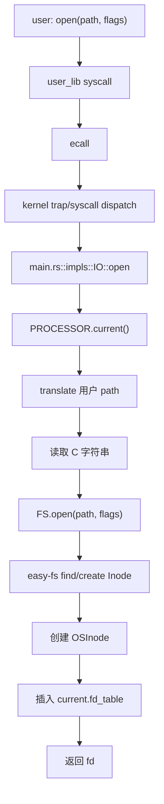

## 13. write 普通文件调用链

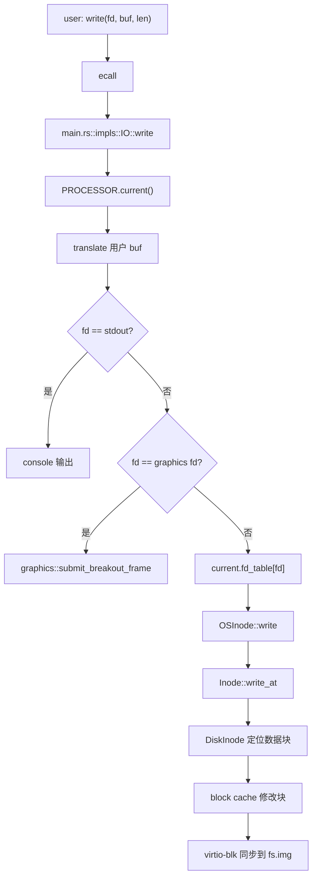

## 14. read 普通文件调用链

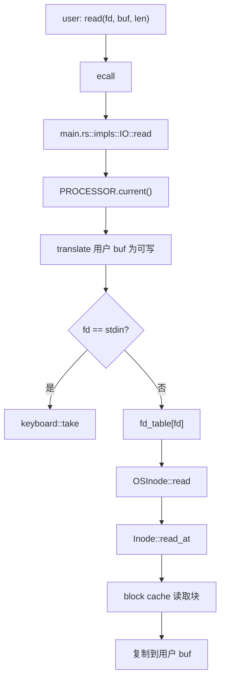

## 15. linkat 调用链

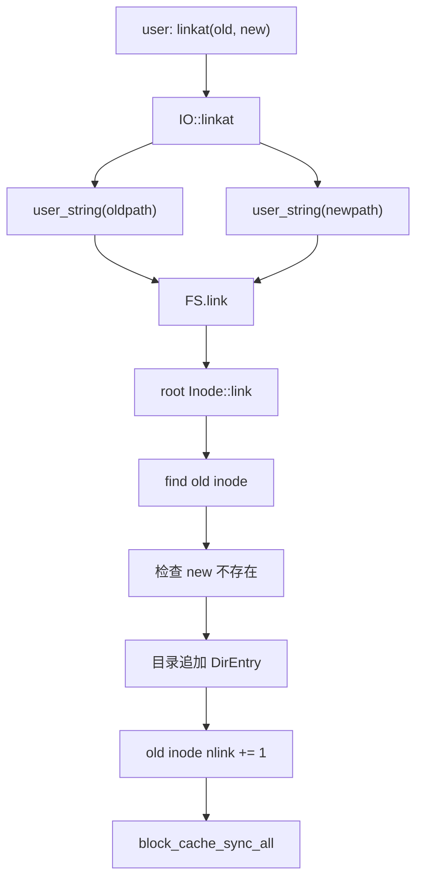

## 16. unlinkat 调用链

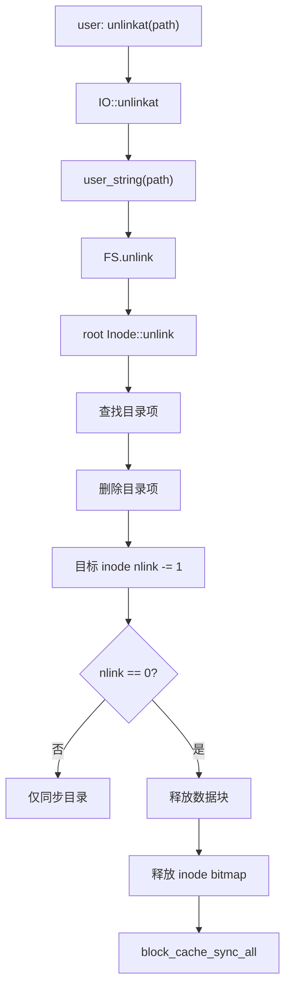

## 17. fstat 调用链

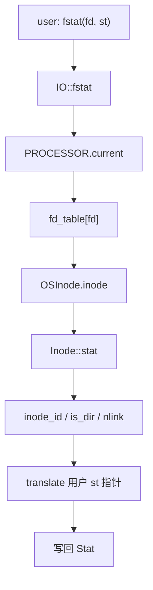

## 18. spawn 调用链

ch6 的 `spawn` 从文件系统读取 ELF：

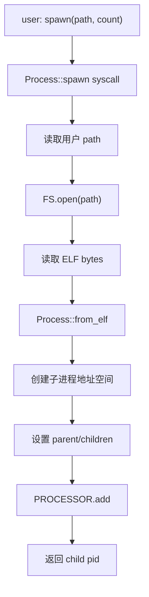

和 ch5 相比，ch6 的程序来源更自然：不是只从内核内嵌 app 表里拿，而是可以从文件系统里打开。

## 19. mmap/munmap 调用链

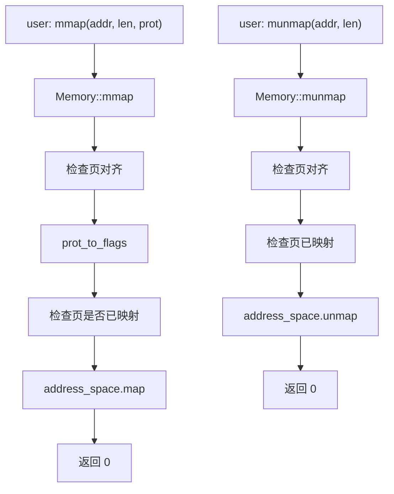

## 20. breakout 图形调用链

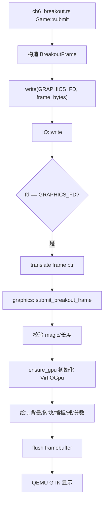

## 21. breakout 键盘调用链

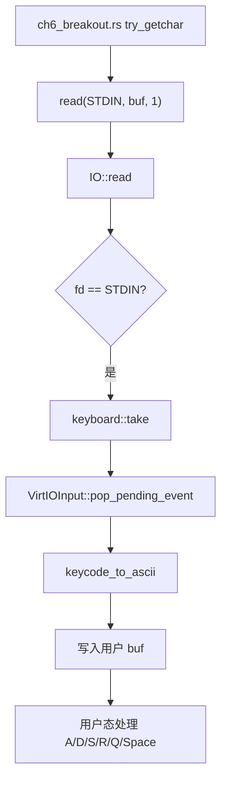

## 22. breakout 保存调用链

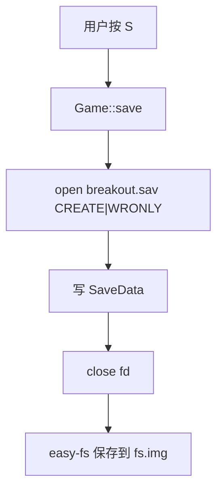

## 23. breakout 恢复调用链

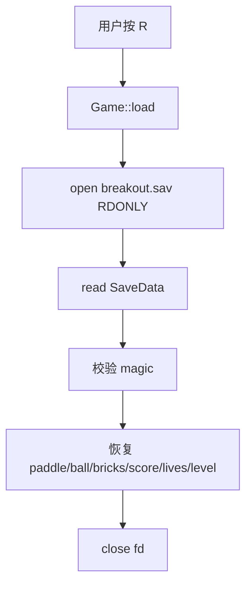

## 24. 本章测试链

已验证：

```text
CHAPTER=6 cargo run --features exercise
-> ch6 Usertests passed!

CHAPTER=-6 cargo run
-> Basic usertests passed!

cargo build
-> build passed
```

测试中看到的 panic/page fault 并不等于整体失败。某些测试故意访问非法地址或验证异常路径，最终 checker 输出通过才说明实现符合预期。

## 25. 我读代码时的主线

建议按这条线读：

```text
用户程序 ch6_file*.rs
-> user_lib open/read/write/link/unlink/fstat
-> syscall
-> main.rs::impls::IO
-> fs.rs
-> easy-fs vfs.rs
-> easy-fs layout.rs
-> block_cache.rs
-> VirtIO block device
-> fs.img
```

这比按文件从上到下硬读更容易。

