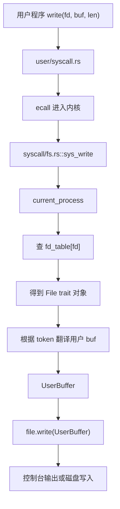
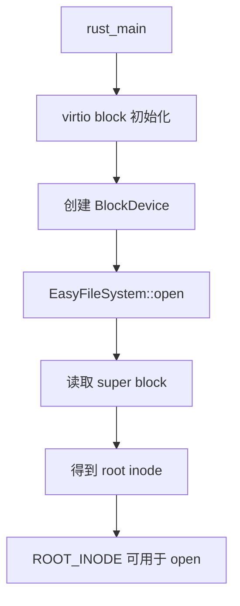
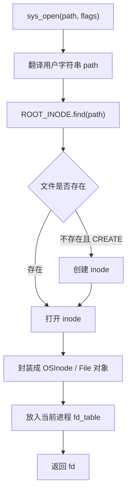

# rCore ch6 执行流程归纳：文件系统、文件描述符与块设备

> 本文件整理 ch6 的完整流程。ch6 的核心是：把“文件”抽象引入内核，让用户程序可以通过统一的文件描述符访问控制台、普通文件和后续管道等对象。

## 1. 本章要解决的问题

前面章节里，用户程序主要通过系统调用输出字符、创建进程。ch6 开始引入文件系统：

```text
open
read
write
close
```

重点不是“文件只能是磁盘文件”，而是：

```text
文件是一个统一抽象
  -> 控制台可以是文件
  -> 磁盘上的 inode 可以是文件
  -> 管道也可以是文件
```

用户程序只拿到一个整数 fd，真正对象由内核管理。

## 2. 文件描述符 fd 的直觉

每个进程有自己的 fd table：

```text
fd 0 -> stdin
fd 1 -> stdout
fd 2 -> stderr
fd 3 -> 某个打开的普通文件
fd 4 -> 另一个文件或管道
```

用户程序只知道：

```text
write(fd, buf, len)
```

内核负责：

```text
根据当前进程找到 fd table
  -> 根据 fd 找到 File 对象
  -> 调用这个对象的 read/write 方法
```

## 3. sys_write 的完整流程

以 `sys_write(fd, buf, len)` 为例：



这里有两个关键点：

1. `fd` 不是进程 ID，它是当前进程打开文件表里的下标。
2. `buf` 是用户虚拟地址，内核必须通过当前进程页表把它转换成可以访问的物理内存片段。

## 4. UserBuffer 的作用

用户传进来的缓冲区可能跨页：

```text
buf 起点在第 1 页末尾
len 跨到第 2 页甚至第 3 页
```

内核不能假设它是连续物理内存。

所以要构造：

```text
UserBuffer
  -> Vec<&'static mut [u8]>
  -> 每一段对应一个已经翻译好的物理页切片
```

这和 ch4 地址空间强相关：

```text
用户虚拟地址
  -> 页表翻译
  -> 物理页切片
  -> UserBuffer
  -> 文件对象读写
```

## 5. easy-fs 与磁盘镜像

实验里的磁盘通常是一个文件：

```text
fs.img
```

QEMU 把它模拟成一块块设备。

流程：

```text
宿主机 fs.img
  -> QEMU virtio block device
  -> 内核块设备驱动
  -> easy-fs
  -> inode
  -> 文件读写
```

用户程序不直接操作 `fs.img`。它只调用 `open/read/write`，内核通过文件系统完成实际读写。

## 6. 文件系统挂载与初始化

内核启动时会初始化文件系统：



可以把这一段理解成：

```text
先把 QEMU 给的虚拟硬盘接进内核
再在这块硬盘上识别 easy-fs 文件系统
最后拿到根目录入口
```

## 7. open 的流程

用户调用：

```text
open("filea", flags)
```

内核执行：



之后用户就可以用这个 fd 做 read/write。

## 8. read/write 到普通文件

普通文件写入流程：

```text
sys_write(fd, user_buf)
  -> fd_table 找到 OSInode
  -> UserBuffer 读取用户数据
  -> inode.write_at
  -> block cache
  -> block device
  -> fs.img
```

普通文件读取流程：

```text
sys_read(fd, user_buf)
  -> fd_table 找到 OSInode
  -> inode.read_at
  -> block cache
  -> block device
  -> 把数据复制到 UserBuffer
  -> 用户程序读到内容
```

## 9. block cache 的作用

磁盘读写按块进行，例如 512B/4KB。

如果每次读写都直接访问块设备，会很慢。所以引入 block cache：

```text
读块
  -> 先看缓存有没有
  -> 没有再从块设备读

写块
  -> 先改缓存
  -> 合适时机同步回块设备
```

这是文件系统性能和一致性的基础。

## 10. ch6 相对 ch5 的演进

```text
ch5：进程
  -> 进程有地址空间、父子关系、生命周期

ch6：文件系统
  -> 进程拥有 fd_table
  -> 通过 fd 访问文件对象
  -> 支持普通文件和控制台统一抽象
```

一句话：

```text
ch5 解决“程序怎么活”
ch6 解决“程序怎么和持久数据交互”
```

## 11. 易错点

### Q1：fd 是不是文件名？

不是。fd 是当前进程 fd table 的下标。文件名只在 open 时使用。

### Q2：文件一定在磁盘上吗？

不是。控制台、管道、设备都可以抽象成文件对象。

### Q3：为什么 write 需要 token？

因为用户传进来的 `buf` 是用户虚拟地址，内核要用当前进程页表 token 找到对应物理页。

### Q4：QEMU 操作的是不是永远 fs.img？

对实验中的块设备来说，是的。QEMU 把宿主机上的 `fs.img` 模拟成虚拟硬盘，内核通过 virtio block 访问它。

## 12. 一句话总结

ch6 的本质是：在进程模型上加入文件描述符表和 easy-fs，让用户程序通过统一的 fd 接口访问控制台和磁盘文件，而内核负责地址翻译、inode 查找、块缓存和块设备读写。

