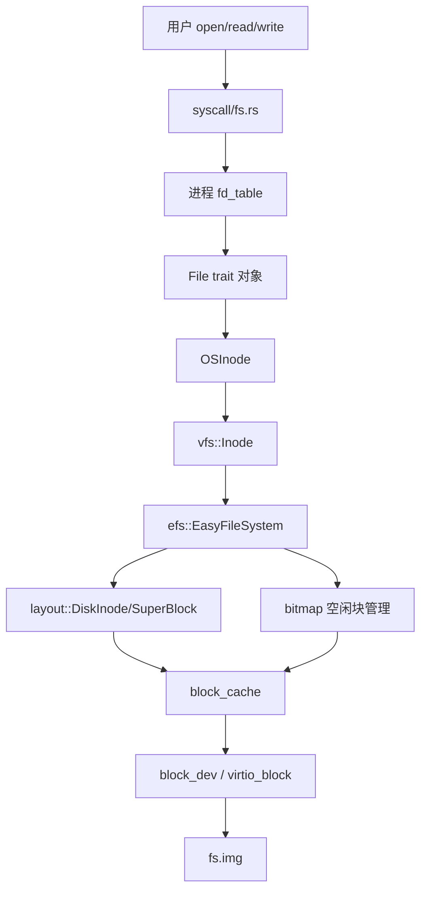
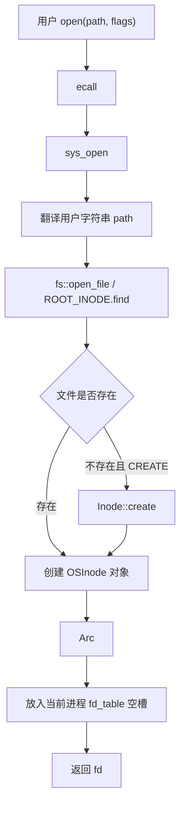
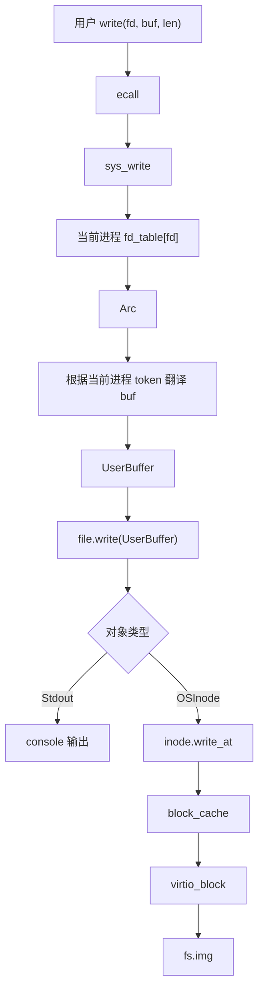

# rCore ch6 文件系统模块关系精讲版

> 这一版重点解释：文件系统不是“多了几个读写函数”，而是把磁盘块、缓存、inode、文件对象、fd_table、syscall 串成一套从底层块设备到用户 API 的层次结构。

## 0. 先把一句话说准

第六章的核心是：

```text
把“磁盘上的字节块”封装成“用户程序能通过 fd 读写的文件对象”。
```

它继承了：

```text
ch4 的地址空间：用户传来的 buf 是用户虚拟地址，需要翻译成 UserBuffer。
ch5 的进程模型：每个进程有自己的 fd_table。
```

然后新增：

```text
块设备；
块缓存；
easy-fs；
inode；
File trait；
open/read/write/close。
```

## 1. 文件不是只有磁盘文件

操作系统里的“文件”是一种抽象。

它可以代表：

```text
控制台 stdout/stdin
普通磁盘文件
目录
管道
设备
```

用户程序统一使用：

```text
read(fd, buf, len)
write(fd, buf, len)
```

它不需要知道背后是：

```text
往屏幕写；
往 fs.img 写；
从 pipe 读；
从键盘读。
```

内核通过 `File trait` 和 `fd_table` 把不同对象统一起来。

## 2. fd_table 到底是什么

fd_table 不是方法表。

它是：

```text
每个进程私有的一张“文件使用记录表”。
```

形式大概是：

```text
fd_table: Vec<Option<Arc<dyn File>>>
```

意思：

```text
fd 是下标；
fd_table[fd] 是一个内核文件对象；
这个对象实现了 File trait。
```

例子：

```text
fd 0 -> Stdin
fd 1 -> Stdout
fd 2 -> Stderr 或 Stdout
fd 3 -> OSInode("/a.txt")
fd 4 -> Pipe read end
```

所以：

```text
fd_table 是实例表；
File trait 才是方法接口。
```

## 3. File trait 是什么

File trait 是内核对“文件对象”的统一接口。

它通常定义：

```text
read
write
readable
writable
```

不同对象实现同一套接口：

```text
Stdout 实现 File:
  write -> 输出到控制台

OSInode 实现 File:
  read/write -> 读写磁盘 inode

Pipe 实现 File:
  read/write -> 读写管道 ring buffer
```

这就是多态：

```text
sys_write 不需要知道 fd 背后是什么；
它只需要从 fd_table 找到 Arc<dyn File>；
然后调用 file.write(...)。
```

## 4. syscall/fs/process 三者怎么分工

### 4.1 syscall 是服务入口

用户调用：

```text
open/read/write/close
```

会通过 ecall 进入内核，然后走 syscall 分发。

syscall 层负责：

```text
解析系统调用号；
取参数；
检查 fd/path/buf；
调用 fs/process 里的对象完成真正操作。
```

### 4.2 process 管 fd_table

fd_table 属于进程。

所以打开文件时：

```text
sys_open 找到文件对象；
然后把它塞进当前进程的 fd_table；
返回下标 fd。
```

读写文件时：

```text
sys_read/sys_write 根据当前进程 fd_table 找到对象。
```

### 4.3 fs 管文件对象和文件系统

fs 模块负责：

```text
File trait
OSInode
Stdin/Stdout
ROOT_INODE
open_file
```

在传统 rCore 结构里可能有：

```text
fs/mod.rs
  -> File trait、ROOT_INODE、open_file 等总接口

fs/inode.rs
  -> OSInode，普通磁盘文件对象

fs/stdio.rs
  -> Stdin/Stdout
```

系统调用的 fs.rs 是“系统调用入口”，内核 fs 模块是“文件对象和文件系统抽象”。这两个名字容易混。

## 5. easy-fs 的底层分层

你提到的 efs、vfs、layout、bitmap、block_cache、block_dev，可以这样理解：

```text
block_dev
  -> 块设备接口，抽象真实硬件/QEMU virtio block

block_cache
  -> 块缓存，避免每次都直接访问磁盘

layout
  -> 磁盘布局结构定义，如 SuperBlock、DiskInode、目录项

bitmap
  -> 空闲块/空闲 inode 的分配表

efs
  -> EasyFileSystem 总管理器，管理整个文件系统、分配/释放块和 inode

vfs
  -> Inode 高层接口，对内核暴露 create/find/read/write 等操作
```

建房子比喻：

```text
layout 是施工图纸；
bitmap 是哪些地块空着的登记表；
block_dev 是运输材料的路；
block_cache 是临时仓库；
efs 是包工头；
vfs/Inode 是前台服务接口。
```

层次图：



## 6. sys_open 的完整关系

用户：

```text
let fd = open("filea", flags);
```

内核流程：



重点：

```text
open 返回的 fd 不是文件本身；
fd 只是当前进程 fd_table 的下标。
```

## 7. sys_write 的完整关系

用户：

```text
write(fd, buf, len)
```

内核：



这里连接了三个章节：

```text
ch4：buf 是用户虚拟地址，需要 UserBuffer。
ch5：fd_table 属于当前进程。
ch6：fd_table 里的 File 对象可能是磁盘文件。
```

## 8. linkat/unlinkat 到底属于哪一层

`linkat` 和 `unlinkat` 是系统调用接口。

它们不应该被说成“只是 efs 的操作”。

更准确：

```text
用户调用 linkat/unlinkat
  -> syscall 层接请求
  -> VFS/Inode 层做路径和目录项操作
  -> easy-fs/layout/bitmap 层修改磁盘元数据
```

### linkat

`linkat` 是创建硬链接。

它不是改名。

```text
linkat(old, new)
  -> 新增一个目录项 new
  -> 指向 old 对应的同一个 inode
  -> inode 硬链接计数 +1
  -> 原来的 old 还存在
```

### unlinkat

`unlinkat` 是删除一个目录项。

```text
unlinkat(path)
  -> 删除目录里的这个名字
  -> inode 硬链接计数 -1
  -> 如果计数为 0 且没有打开引用，才释放 inode 和数据块
```

区别：

```text
linkat = 给同一份文件数据增加一个名字。
rename = 改名字/移动目录项。
unlinkat = 删除一个名字，必要时释放文件。
```

## 9. fs.img 到底什么时候被改

实验里 QEMU 把宿主机上的：

```text
fs.img
```

模拟成虚拟硬盘。

内核并不是直接拿 Windows 文件 API 改 `fs.img`。

流程是：

```text
内核 easy-fs
  -> block_cache
  -> virtio_block 驱动
  -> QEMU 虚拟块设备
  -> 宿主机 fs.img
```

所以：

```text
用户 write 文件
最终可能会改 fs.img；
但中间经过 fd_table、File trait、Inode、block_cache、block_dev。
```

## 10. ch6 和前面章节的连接

```text
ch4 地址空间：
  用户 buf 是虚拟地址，所以 fs syscall 要通过 UserBuffer 访问用户内存。

ch5 进程：
  每个进程有自己的 fd_table，所以 fd=3 在不同进程里可能指向不同文件。

ch6 文件系统：
  fd_table 里的对象实现 File trait，具体可以是 stdout、OSInode、后续 pipe。
```

这就是第六章最核心的模块关系。

## 11. 给别人讲第六章时可以这样说

第六章不是简单实现 `read/write`，而是把磁盘块设备一层层封装成用户能用的文件抽象。最底层是 QEMU 提供的 virtio block 设备，往上是 block_cache 缓存，再往上是 easy-fs 的 layout、bitmap、efs、vfs/Inode，最后内核把打开的文件封装成实现 File trait 的对象，放进当前进程的 fd_table。用户拿到的 fd 只是这张表的下标。之后 `read/write(fd, buf, len)` 时，syscall 层先通过 fd_table 找到 File 对象，再通过 ch4 的页表机制把用户 buf 翻译成 UserBuffer，最后调用对象的 read/write 方法。这样控制台、磁盘文件、后面的管道都可以统一成“文件”。

