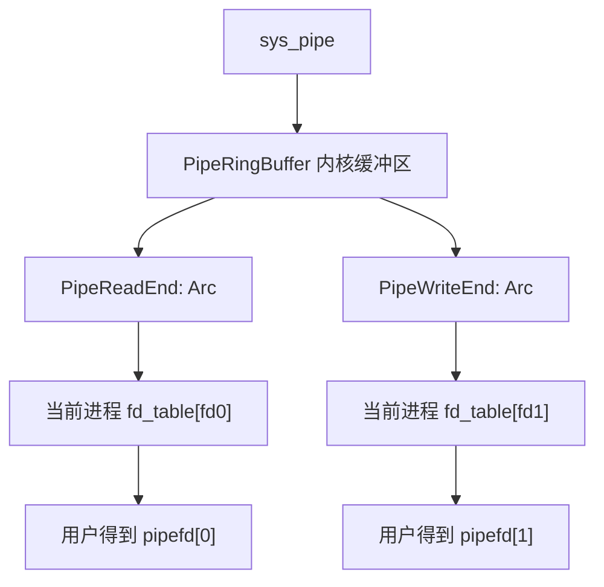
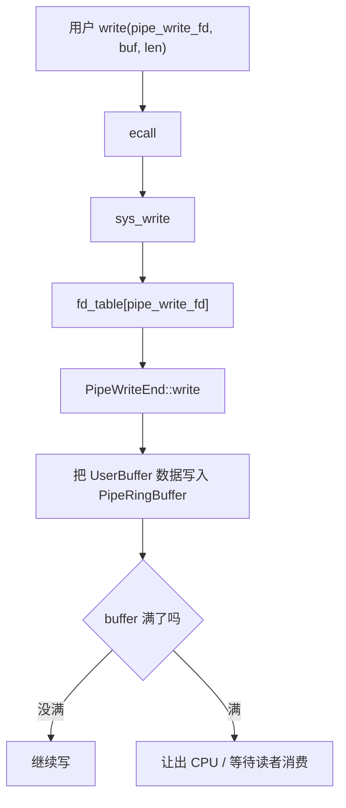
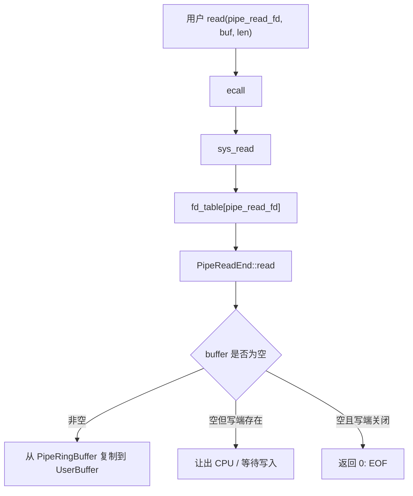
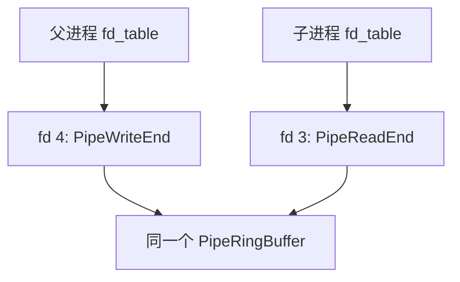
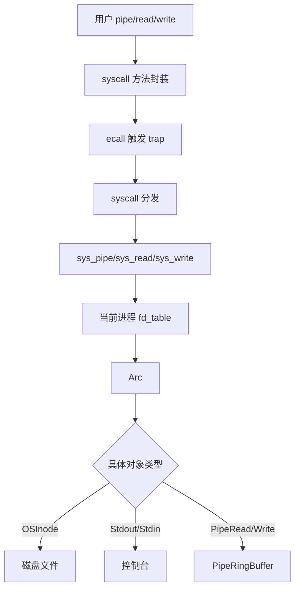

# rCore ch7 pipe 通讯模块关系精讲版

> 这一版重点解释：pipe 不是凭空出现的新机制，而是建立在 ch5 进程、ch6 fd_table/File trait 之上的一种“内核缓冲区文件对象”。理解它的关键是：每个进程有自己的 fd_table，但 fork 后父子进程的 fd 可以指向同一个 pipe 对象。

## 0. 先把一句话说准

第七章的 pipe 本质是：

```text
内核创建一个环形缓冲区；
把它包装成两个 File 对象：读端和写端；
把这两个对象放进当前进程 fd_table；
用户用 read/write 操作 fd；
fork 后父子进程拥有指向同一 pipe 的 fd，于是可以通信。
```

所以 pipe 不是单独一套 API 世界，它是 ch6 文件抽象的继续。

## 1. ch7 继承了什么

来自 ch5：

```text
进程有父子关系；
fork 会复制进程资源；
父子进程可以同时存在；
waitpid 可以等待子进程结束。
```

来自 ch6：

```text
每个进程有 fd_table；
fd_table 里放 Arc<dyn File>；
read/write 根据 fd 找 File 对象；
不同 File 对象可以有不同实现。
```

ch7 新增：

```text
PipeRingBuffer；
Pipe read end；
Pipe write end；
pipe 系统调用；
dup / 重定向；
exec 参数。
```

## 2. fd_table 是不是所有进程共享

不是。

```text
每个进程都有自己的 fd_table。
```

但是 fork 有一个特殊效果：

```text
子进程复制父进程 fd_table。
```

这里的复制通常是浅拷贝：

```text
fd_table 本身是两张表；
但表里的 Arc<dyn File> 指向同一个内核文件对象。
```

例子：

```text
父进程 fd_table[3] -> PipeReadEnd
父进程 fd_table[4] -> PipeWriteEnd

fork 后：

子进程 fd_table[3] -> 同一个 PipeReadEnd
子进程 fd_table[4] -> 同一个 PipeWriteEnd
```

所以父子进程不是共享同一张表，而是：

```text
各自有表，但表项可以指向同一个内核对象。
```

这个区别非常关键。

## 3. pipe 和 fd_table 的关系

用户调用：

```text
pipe(&mut pipefd)
```

内核会：

```text
创建 PipeRingBuffer；
创建读端 File 对象；
创建写端 File 对象；
在当前进程 fd_table 里找两个空位；
把读端和写端分别塞进去；
把两个 fd 写回用户数组。
```

图：



所以你可以说：

```text
pipe 被包装成 fd 调用；
fd 只是用户看到的编号；
编号背后是实现 File trait 的管道端对象。
```

## 4. ring buffer 是什么

ring buffer 本质就是数据结构里的循环队列。

```text
buffer[N]
head 读指针
tail 写指针
```

写：

```text
buffer[tail] = byte
tail = (tail + 1) % N
```

读：

```text
byte = buffer[head]
head = (head + 1) % N
```

为什么用 ring buffer？

```text
不用频繁移动数组；
读写指针循环前进；
适合生产者/消费者模型。
```

pipe 正好是：

```text
写端生产数据；
读端消费数据。
```

## 5. sys_read/sys_write 为什么不用管对象类型

因为 File trait 把不同对象统一了。

`sys_read(fd, buf, len)` 做的是：

```text
从当前进程 fd_table 找到 fd 对应的 Arc<dyn File>；
调用 file.read(UserBuffer)。
```

如果这个对象是：

```text
OSInode -> 从磁盘文件读
Stdin   -> 从控制台读
Pipe    -> 从 ring buffer 读
```

syscall 层不需要写三套分支。

这就是抽象的价值。

## 6. pipe 的读写流程

### 6.1 写 pipe



### 6.2 读 pipe



## 7. 为什么父子进程可以用 pipe 通信

关键在 fork。

典型 shell 执行：

```text
pipe(pipefd)
fork()
```

fork 后：

```text
父进程 fd_table 和子进程 fd_table 是两张表；
但 pipefd[0]/pipefd[1] 指向同一个 pipe 内核对象。
```

所以可以：

```text
父进程关闭读端，只写；
子进程关闭写端，只读。
```

这样数据路径就是：

```text
父进程 write(fd_write)
  -> 同一个 PipeRingBuffer
  -> 子进程 read(fd_read)
```

关系图：



## 8. pipe 和磁盘文件的区别

共同点：

```text
都可以放进 fd_table；
都实现 File trait；
都能被 read/write 操作。
```

不同点：

```text
普通文件：
  数据在 fs.img / 磁盘块里；
  inode 管元数据；
  可以持久保存。

pipe：
  数据在内核内存 ring buffer 里；
  没有磁盘 inode；
  进程关闭后数据消失。
```

## 9. dup 和重定向为什么能工作

重定向的核心不是修改程序代码，而是修改 fd_table。

例如：

```text
echo hello > out.txt
```

shell 做的是：

```text
打开 out.txt 得到 fd；
把子进程 fd_table[1] 替换成 out.txt 对应 File 对象；
exec echo；
echo 仍然写 stdout，也就是 fd 1；
但 fd 1 已经指向 out.txt。
```

所以程序不需要知道自己被重定向了。

这就是 Unix 风格的优雅：

```text
程序只认 fd；
shell 改 fd 背后的对象。
```

## 10. exec 参数和 pipe 的关系

第七章还会讲 argv/命令行参数。

它和 pipe 不是同一个机制。

```text
pipe：
  解决进程运行时的数据通信。

argv：
  解决进程启动时的参数传递。
```

exec 带参数时，内核要：

```text
读取用户传来的 path 和 argv；
创建新地址空间；
把参数字符串复制到新用户栈；
把 argv 指针数组压栈；
设置 a0/a1 或约定寄存器；
让新程序从入口开始执行。
```

它和 pipe 的共同点是：

```text
都依赖 ch5 的 fork/exec 模型。
```

但 pipe 通信依赖：

```text
fd_table + File trait + ring buffer。
```

## 11. pipe、fd_table、File trait、syscall 的完整关系



这张图要背下来，因为它能解释 ch6 和 ch7 的关系。

## 12. ch7 和前面章节的连接

```text
ch4 地址空间：
  pipe read/write 仍然要处理用户 buf，所以要 UserBuffer。

ch5 进程：
  pipe 通常用于父子进程通信，依赖 fork 复制 fd_table。

ch6 文件系统：
  pipe 复用 File trait 和 fd_table，不需要单独设计一套 pipe_read/pipe_write 用户接口。

ch7：
  在这个抽象上加入 ring buffer，实现进程间通信。
```

## 13. 给别人讲第七章时可以这样说

第七章的 pipe 不是新开一条和文件系统无关的通路，而是把“管道”也包装成文件对象。每个进程都有自己的 fd_table，fd 是这张表的下标，表项是 `Arc<dyn File>`。普通文件、标准输入输出、管道端都实现 File trait，所以 sys_read/sys_write 只需要根据 fd 找对象再调用 read/write。pipe 系统调用会创建一个内核 ring buffer，再创建读端和写端两个 File 对象放入当前进程 fd_table。fork 后父子进程各自有 fd_table 副本，但表项指向同一个 pipe 对象，因此父写子读就能通信。重定向也是同样思想：不改程序代码，只改 fd_table 里 fd 0/1/2 指向的对象。

