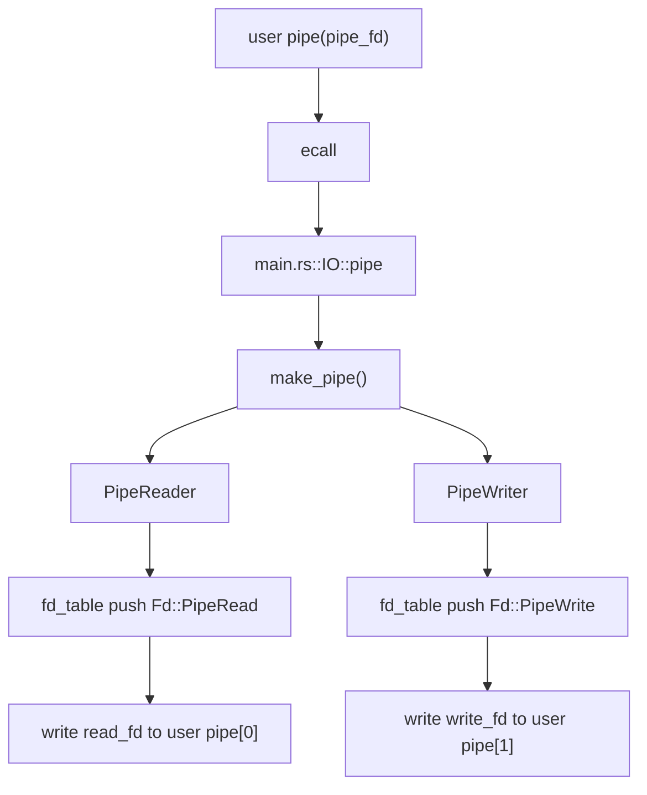
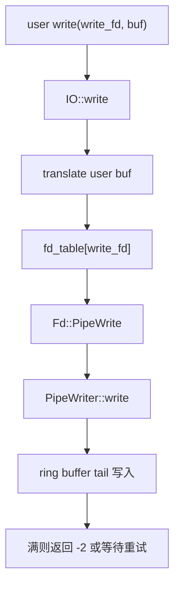
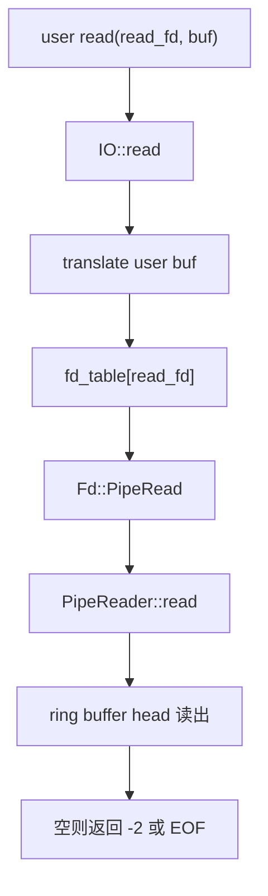
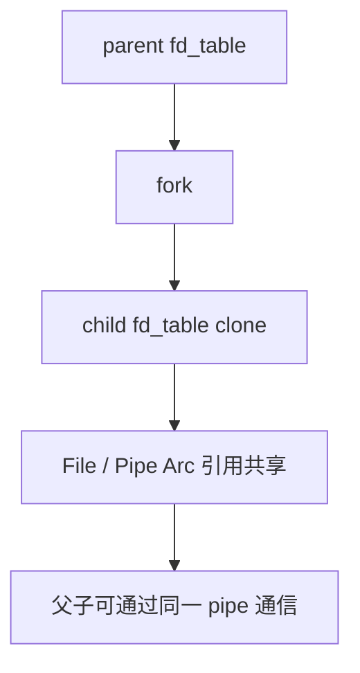
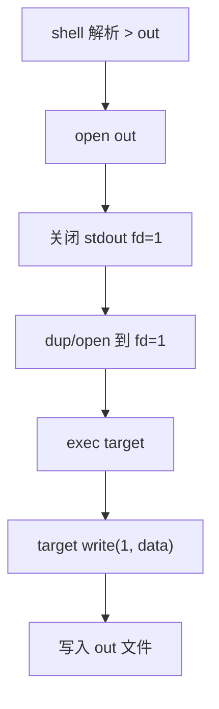
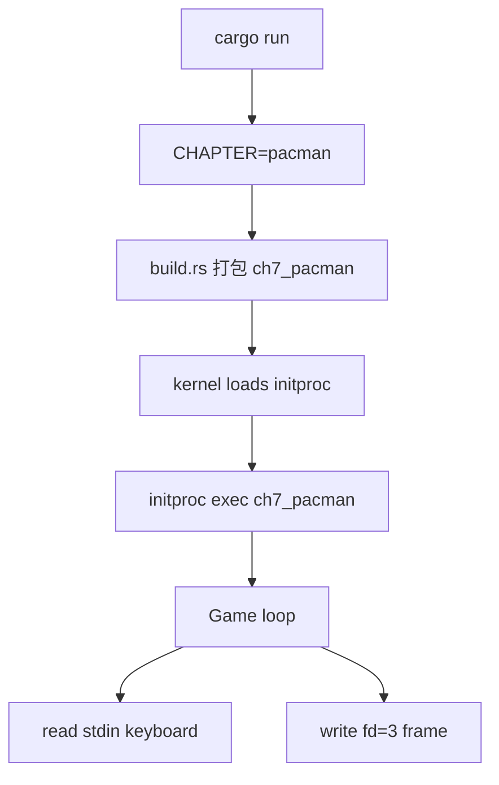
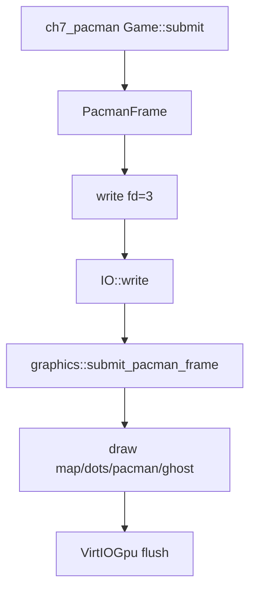
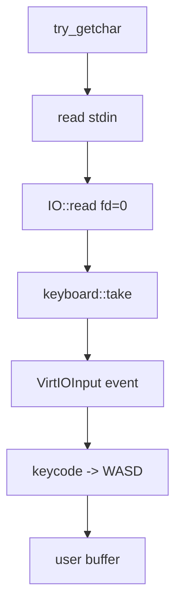

# rCore ch7 代码链与模块对应底稿

## 1. 代码树

```text
tg-rcore-tutorial-ch7/
├── build.rs
├── test.sh
├── .cargo/config.toml
└── src/
    ├── main.rs
    ├── fs.rs
    ├── process.rs
    ├── processor.rs
    ├── virtio_block.rs
    ├── graphics.rs
    └── keyboard.rs

tg-rcore-tutorial-user/
└── src/bin/
    ├── pipetest.rs
    ├── pipe_large_test.rs
    ├── ch7b_usertest.rs
    ├── user_shell.rs
    ├── initproc.rs
    └── ch7_pacman.rs
```

## 2. Guide 和组件化仓库对应

```text
Guide: fs/pipe.rs
-> tg-easy-fs 中 PipeReader/PipeWriter/UserBuffer
-> ch7/src/fs.rs 中 Fd::PipeRead/Fd::PipeWrite

Guide: syscall/fs.rs
-> ch7/src/main.rs::impls::IO

Guide: task/process.rs
-> ch7/src/process.rs::Process

Guide: shell/redirection
-> user_shell + fd_table 继承/替换

Pacman 扩展
-> ch7/src/graphics.rs
-> ch7/src/keyboard.rs
-> user/src/bin/ch7_pacman.rs
```

## 3. fd_table 类型变化

ch6：

```text
fd_table: Vec<Option<Mutex<FileHandle>>>
```

ch7：

```text
fd_table: Vec<Option<Mutex<Fd>>>
```

原因是 fd 不再只可能是普通文件。

## 4. Fd 枚举

```text
Fd::File(FileHandle)
Fd::PipeRead(PipeReader)
Fd::PipeWrite(Arc<PipeWriter>)
Fd::Empty { read, write }
```

`Fd::read` 和 `Fd::write` 负责根据类型调用不同实现。

## 5. pipe 调用链



## 6. pipe write 调用链



## 7. pipe read 调用链



## 8. fork 继承 fd_table



## 9. 重定向链



## 10. Pacman 默认启动链



## 11. Pacman 图形链



## 12. Pacman 输入链



## 13. 测试链

```text
CHAPTER=-7 cargo run
-> initproc exec ch7b_usertest
-> pipetest / pipe_large_test / signal tests
-> Basic usertests passed!
```

测试脚本强制 headless runner，防止打开 GTK 窗口。

## 14. 已验证

```text
cargo build
CHAPTER=-7 cargo run
```

均已通过。默认 Pacman 会启动图形窗口并持续运行。

