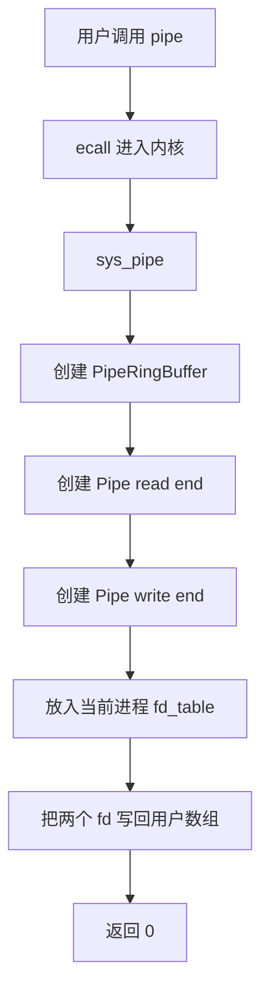
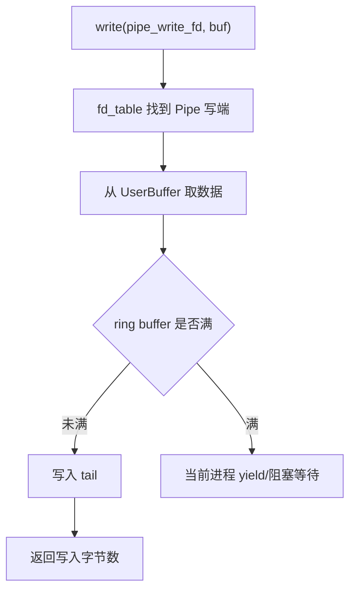
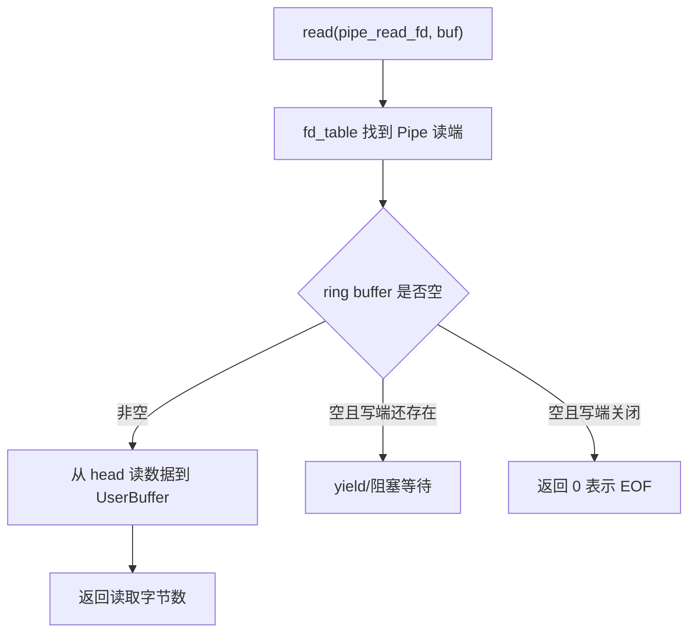
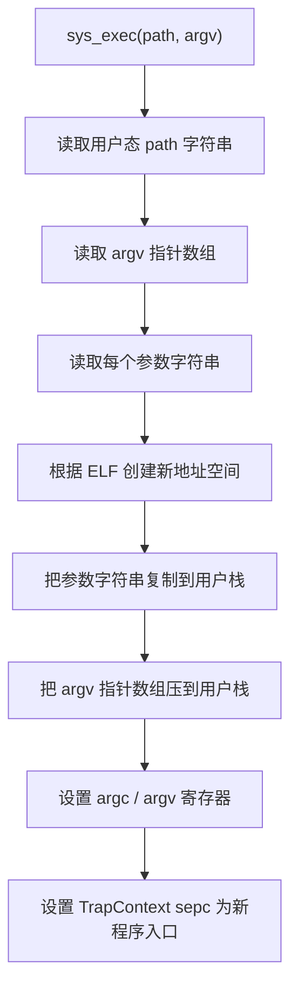
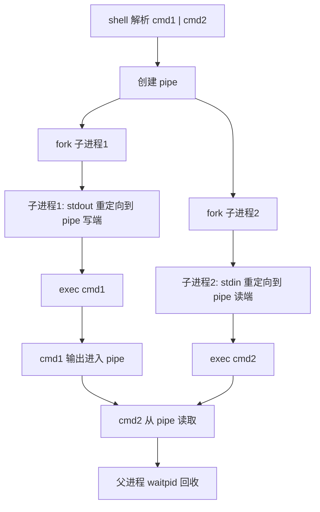

# rCore ch7 执行流程归纳：管道、命令行参数与重定向

> 本文件整理 ch7 的完整流程。ch7 的核心是：在文件描述符抽象之上加入管道和重定向，让进程之间可以通过 fd 通信，shell 也可以带参数启动程序。

## 1. 本章要解决的问题

ch6 有了文件系统和 fd，但进程之间还缺乏方便通信方式。

ch7 引入：

- pipe 管道
- ring buffer
- 命令行参数
- 输入输出重定向

这让 shell 可以支持类似：

```text
cat file | grep hello
echo hi > output.txt
app arg1 arg2
```

## 2. pipe 的本质

管道不是磁盘文件，而是一段内核内存缓冲区。

它有两个端：

```text
read end  -> 读端 fd
write end -> 写端 fd
```

用户视角：

```text
pipe(&mut fds)
fds[0] = read_fd
fds[1] = write_fd
```

之后：

```text
write(write_fd, data)
read(read_fd, buf)
```

## 3. ring buffer：循环队列

管道内部常用 ring buffer。

它其实就是数据结构里的循环队列：

```text
buffer[N]
head -> 读指针
tail -> 写指针
```

写入：

```text
buffer[tail] = byte
tail = (tail + 1) % N
```

读取：

```text
byte = buffer[head]
head = (head + 1) % N
```

状态：

```text
empty -> head == tail 且状态为空
full  -> tail 追上 head 或额外状态标记满
```

所以“ring buffer”听起来高级，本质就是循环队列，只是用在内核同步通信场景里。

## 4. pipe 创建流程



重点：

- 两个 fd 指向同一个管道缓冲区。
- 一个只能读，一个只能写。
- fd table 让 pipe 和普通文件一样通过 read/write 使用。

## 5. pipe 读写流程

写端：



读端：



## 6. 重定向的本质

重定向不是让程序自己知道“我要写到文件”。

而是 shell 在启动子进程前改它的 fd table：

```text
原来：
fd 1 -> stdout

重定向后：
fd 1 -> output.txt
```

这样目标程序仍然只调用：

```text
println!
```

但 `println!` 最终写 fd 1，fd 1 已经被 shell 换成文件了。

## 7. 命令行参数与 exec

ch5 已经有 exec，ch7 增强 exec 支持参数。

用户态：

```text
exec(path, argv)
```

内核要做：



这意味着：

```text
exec 后程序代码被替换
但启动时能从栈和寄存器里拿到参数
```

## 8. shell 里的 pipe 执行流程

例如：

```text
cmd1 | cmd2
```

shell 大致执行：



## 9. ch7 相对 ch6 的演进

```text
ch6：文件描述符 + 文件系统
  -> fd 可以代表控制台或磁盘文件

ch7：管道 + 重定向
  -> fd 也可以代表进程间通信通道
  -> shell 可以改 fd table 实现重定向
  -> exec 支持 argv 参数
```

一句话：

```text
ch6 让进程访问文件
ch7 让进程之间也能像访问文件一样通信
```

## 10. 易错点

### Q1：pipe 和普通文件有什么共同点？

它们都实现了 File 抽象，都可以被 fd table 管理，都可以用 read/write 操作。

### Q2：pipe 和普通文件有什么不同？

pipe 的数据在内核内存 ring buffer 中，通常不持久化到磁盘。

### Q3：重定向是不是改程序代码？

不是。重定向改的是进程的 fd table，程序本身仍然写 fd 0/1/2。

### Q4：命令行参数为什么要压用户栈？

因为 exec 后原程序地址空间被替换，新程序启动时只能从约定好的寄存器和用户栈位置读取 argc/argv。

## 11. 一句话总结

ch7 的本质是：把 ch6 的文件描述符抽象扩展到进程通信和 shell 控制，让管道、重定向、命令行参数都统一落到 fd table、UserBuffer 和 exec 地址空间初始化流程上。

