# rCore ch8 代码链与模块对应底稿

## 目录结构

ch8 的代码树重点集中在内核线程模型和同步原语：

```text
tg-rcore-tutorial-ch8/
├── build.rs
├── exercise.md
├── src/
│   ├── main.rs
│   ├── process.rs
│   ├── processor.rs
│   ├── fs.rs
│   └── virtio_block.rs
tg-rcore-tutorial-user/
└── src/bin/
    ├── ch8_usertest.rs
    ├── ch8_deadlock_mutex1.rs
    ├── ch8_deadlock_sem1.rs
    ├── ch8_deadlock_sem2.rs
    ├── threads.rs
    ├── threads_arg.rs
    ├── mpsc_sem.rs
    ├── sync_sem.rs
    ├── race_adder_mutex_blocking.rs
    ├── phil_din_mutex.rs
    └── test_condvar.rs
```

模块职责：

- `main.rs`：内核启动、系统调用分发、主调度循环、同步阻塞处理。
- `process.rs`：定义 `Process` 和 `Thread`，处理 ELF 加载、fork、exec。
- `processor.rs`：定义全局 `PROCESSOR`，用 `PThreadManager` 同时管理进程和线程。
- `fs.rs`：文件系统和 fd 支持，沿用 ch6/ch7 能力。
- `virtio_block.rs`：块设备驱动，支持文件系统镜像。
- `tg_sync`：提供 `MutexBlocking`、`Semaphore`、`Condvar` 等同步原语实现。

## 总启动链

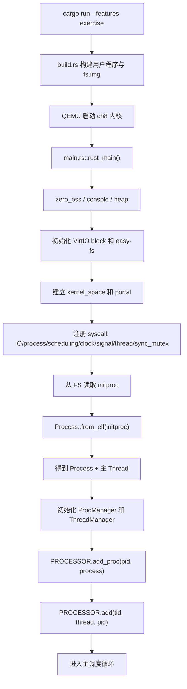

ch8 和 ch7 的一个重要区别是：`Process::from_elf` 不再只返回一个进程，而是返回 `(Process, Thread)`。这体现了“资源容器”和“执行单元”的拆分。

## Process / Thread 数据结构链

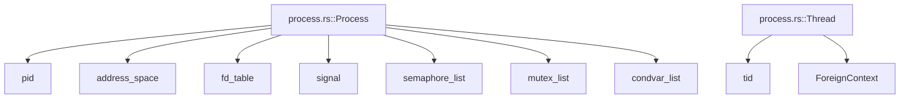

理解口诀：

```text
Process 管共享资源。
Thread 管当前执行。
```

同一进程中的多个线程共享：

- 地址空间。
- 文件描述符表。
- 信号处理状态。
- mutex/semaphore/condvar 列表。

每个线程独立拥有：

- TID。
- 用户栈。
- 寄存器上下文。
- 调度状态。

## Processor 双层管理链

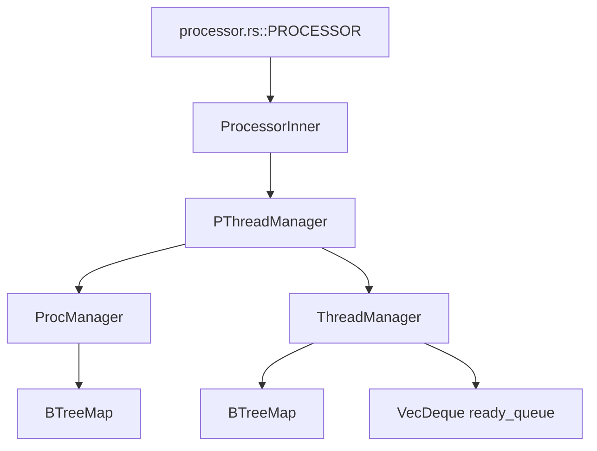

`ProcManager` 负责 PID 到进程资源的映射。`ThreadManager` 负责 TID 到线程执行体的映射，并维护就绪队列。`PThreadManager` 则负责把两层对象关联起来，例如当前线程属于哪个进程、某进程有哪些线程、线程退出时是否需要回收进程等。

## 主调度循环链

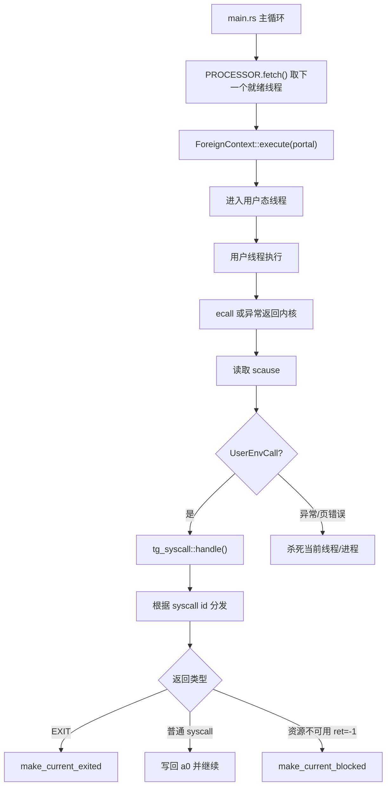

ch8 的主循环重点是：同步原语可能让线程阻塞，而不是简单返回。对于 `SEMAPHORE_DOWN`、`MUTEX_LOCK`、`CONDVAR_WAIT`，如果返回 `-1`，主循环会调用 `make_current_blocked()`。

## thread_create 调用链

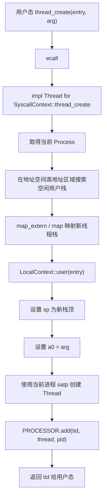

注意：新线程和当前线程共享同一个地址空间，所以它们使用同一个进程的 `satp`。差别在于各自有不同栈和执行上下文。

## waittid 调用链

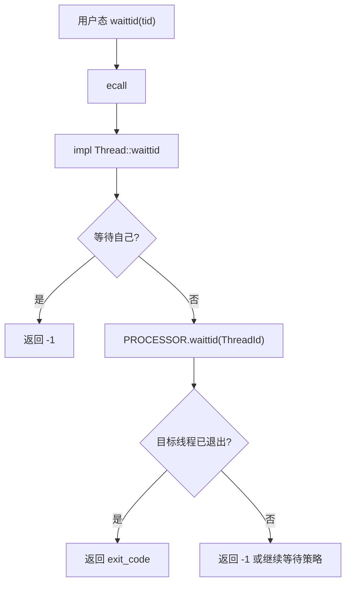

`waittid` 用于回收线程退出状态，类似进程里的 `waitpid`，但粒度变成线程。

## mutex 调用链

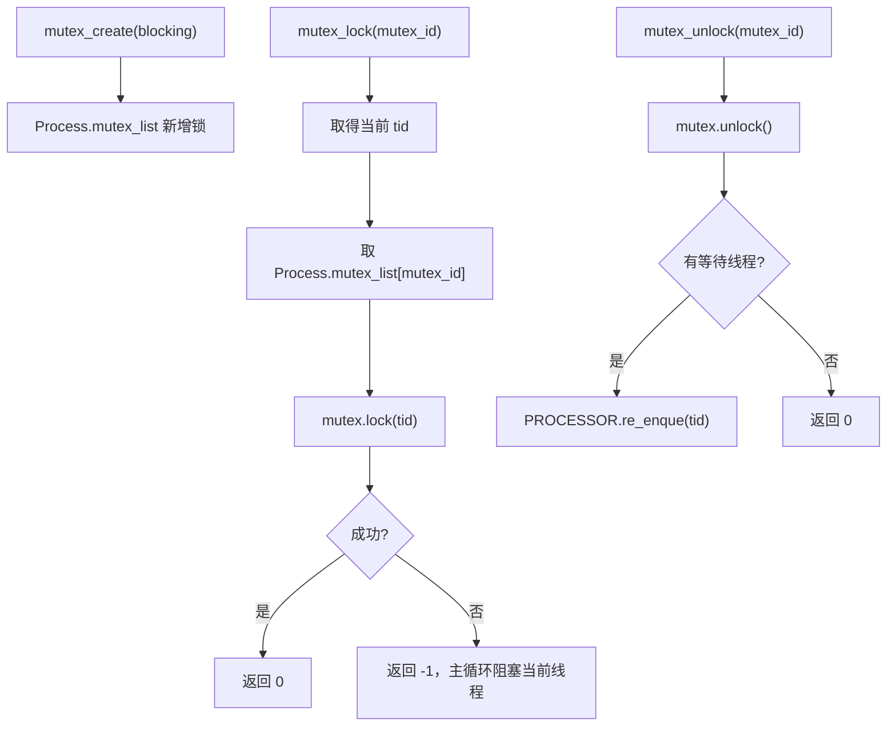

mutex 属于进程资源，所以所有线程看到的是同一个 `mutex_list`。

## semaphore 调用链

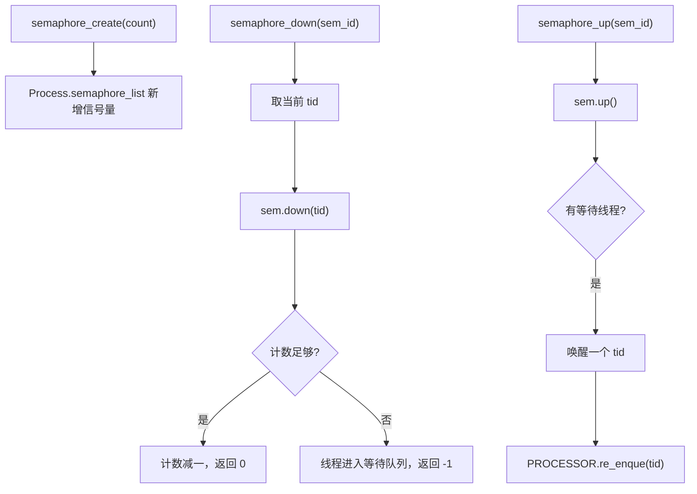

semaphore 和 mutex 的共同点是都可能阻塞线程；不同点是 semaphore 管的是计数资源。

## condvar 调用链

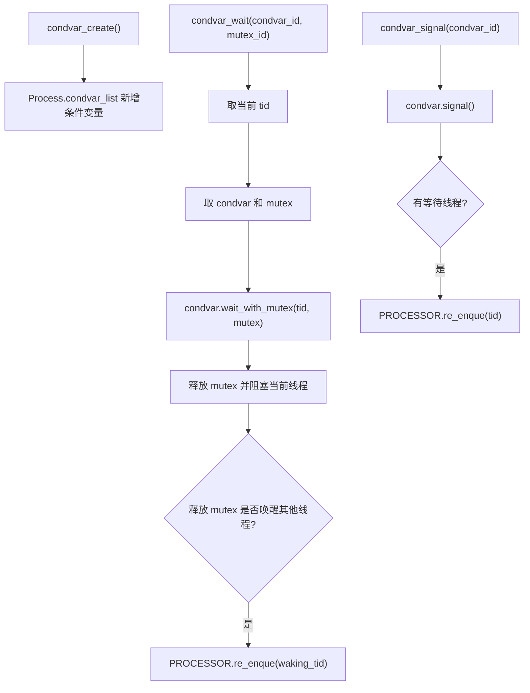

条件变量的关键是：等待时要释放锁，唤醒后还要重新参与同步。

## 死锁检测 exercise 链

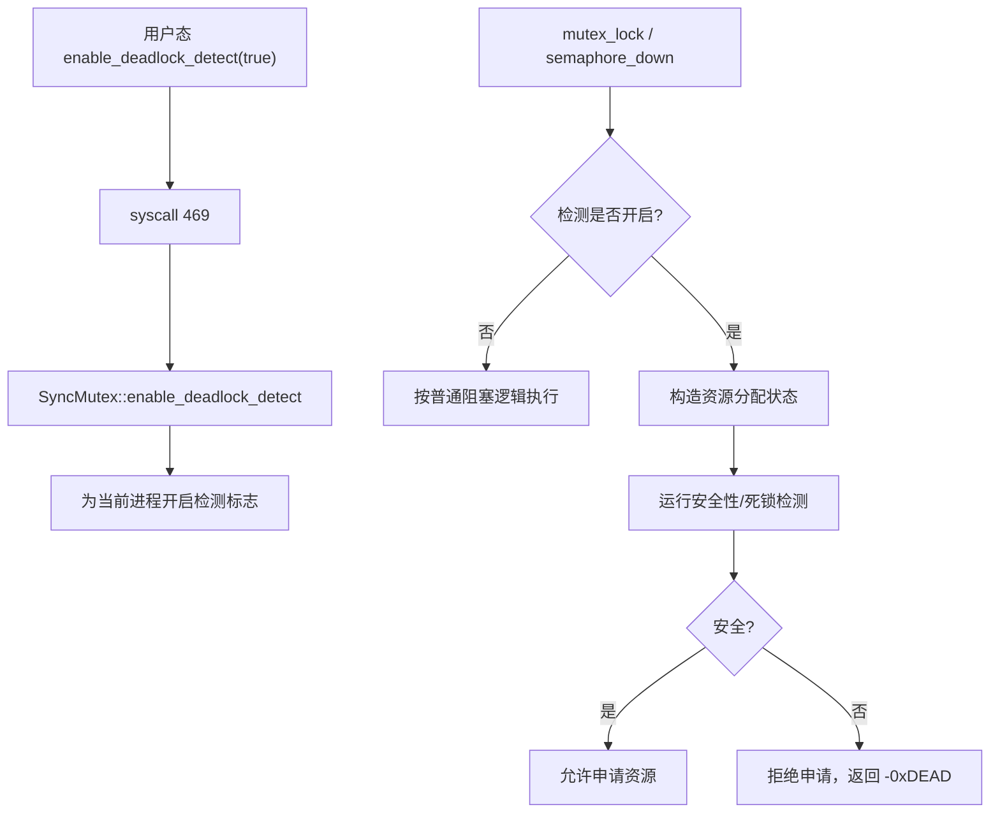

exercise.md 给出的算法使用：

```text
Available：每类资源剩余数量。
Allocation：每个线程已持有资源数。
Need：每个线程还需要的资源数。
Work：模拟可用资源。
Finish：模拟线程是否能完成。
```

如果无法找到一个让所有线程完成的安全序列，就认为存在死锁风险。

## ch8_usertest 测试链

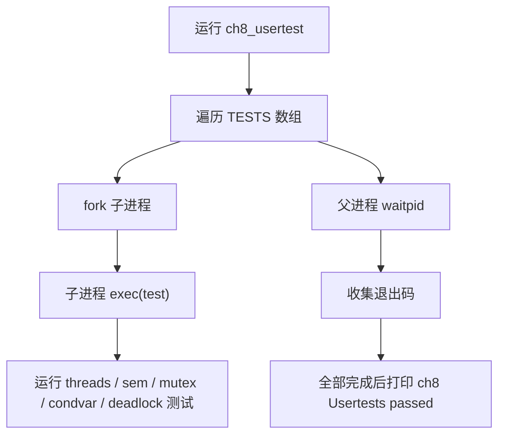

`ch8_usertest.rs` 把线程、同步、管道、死锁检测等测试统一跑一遍，是本章综合回归入口。

## GitHub 交付说明

本文件与同目录其他三份 ch8 文档整理完成后，随提交推送到 GitHub 仓库 `doc/ch8/`。这是对课程要求“Markdown 文档、AI 协作归档、学习进展记录”的补充。
