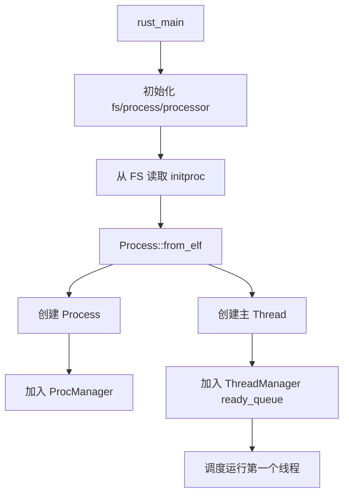
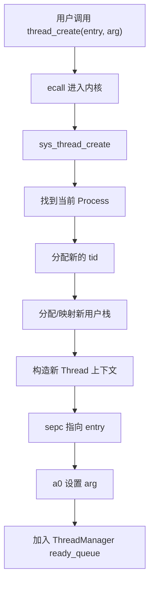
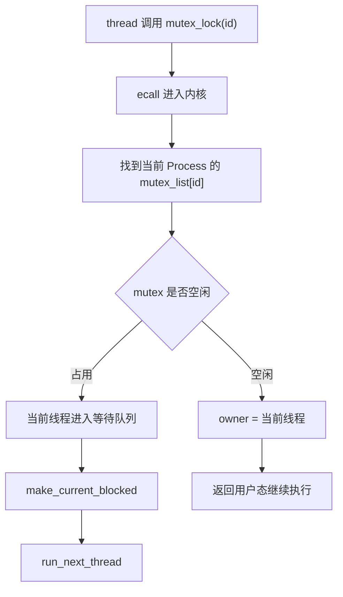
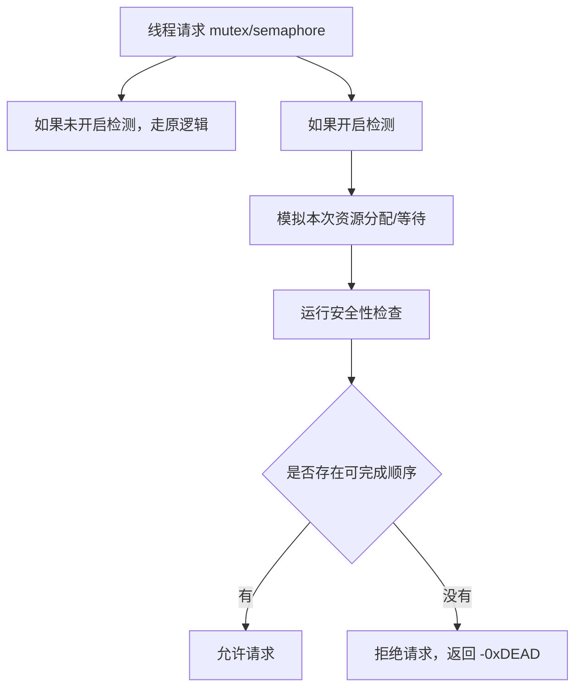

# rCore ch8 执行流程归纳：线程、同步原语与死锁检测

> 本文件整理 ch8 的完整流程。ch8 的核心是：把“一个进程一个执行流”扩展为“一个进程可以有多个线程”，并引入 mutex、semaphore、condvar 等同步机制。

## 1. 本章要解决的问题

ch5 有进程，ch6/ch7 有文件和进程间通信。但一个进程内部仍然主要是单执行流。

ch8 引入线程：

```text
一个进程 Process
  -> 共享地址空间
  -> 共享文件描述符
  -> 可以包含多个 Thread
  -> 每个 Thread 有自己的执行上下文和用户栈
```

这可以支持：

- 多线程计算
- 线程间共享内存
- 互斥锁
- 信号量
- 条件变量
- 死锁检测

## 2. 进程与线程的分工

ch8 里可以这样理解：

```text
Process
  -> 管资源
  -> 地址空间 MemorySet
  -> fd_table
  -> mutex/semaphore/condvar 列表
  -> signal 等进程级资源

Thread
  -> 管执行流
  -> tid
  -> TrapContext / ForeignContext
  -> 用户栈
  -> 调度状态
```

一句话：

```text
进程是资源容器，线程是 CPU 执行单位。
```

## 3. 内核启动与 initproc

ch8 内核启动后会从文件系统读取 `initproc`：



相比 ch5：

- ch5 调度对象偏进程。
- ch8 更明确地区分进程管理器和线程管理器。

## 4. 创建线程 thread_create

用户程序调用线程创建 syscall 时：



线程和进程的最大区别：

```text
线程不需要复制整个地址空间
同一进程内线程共享 MemorySet
```

所以线程创建通常比进程 fork 更轻。

## 5. 线程调度

线程也要被调度。

流程和前面任务切换类似：

```text
当前线程 trap 进内核
  -> 保存上下文
  -> 如果 yield/block/exit
  -> ThreadManager 选择下一个 ready 线程
  -> __switch
  -> __restore
  -> 回到下一个线程用户态
```

区别是：

```text
如果两个线程属于同一进程
  -> 地址空间可以不变
  -> 但执行上下文和用户栈不同

如果属于不同进程
  -> 还要切换 satp / 地址空间
```

## 6. mutex 互斥锁流程

mutex 用来保护共享数据。

```text
mutex_lock
  -> 如果锁空闲，当前线程获得锁
  -> 如果锁已被占用，当前线程阻塞

mutex_unlock
  -> 释放锁
  -> 唤醒等待队列中的一个线程
```

流程：



## 7. semaphore 信号量流程

信号量可以理解成一个带计数的资源池。

```text
down / P 操作
  -> 如果 count > 0，count -= 1，成功
  -> 如果 count == 0，线程阻塞

up / V 操作
  -> count += 1
  -> 如果有等待线程，唤醒一个
```

与 mutex 区别：

```text
mutex 通常只有一个 owner
semaphore 表示有 N 份资源
```

## 8. condvar 条件变量流程

条件变量用于“等待某个条件成立”。

典型模式：

```text
mutex_lock
while condition 不满足:
    condvar_wait(cond, mutex)
使用共享数据
mutex_unlock
```

`condvar_wait` 通常会：

```text
释放 mutex
  -> 当前线程进入条件变量等待队列
  -> 切换到其他线程
  -> 被 signal 唤醒后重新尝试获得 mutex
```

它不是单独保护资源，而是配合 mutex 使用。

## 9. 死锁检测练习

ch8 练习要求实现：

```text
enable_deadlock_detect(is_enable)
```

开启后，`mutex_lock` 和 `semaphore_down` 在可能导致死锁时返回：

```text
-0xDEAD
```

死锁的直觉：

```text
线程 A 拿着资源 1，等待资源 2
线程 B 拿着资源 2，等待资源 1
两者互相等待，谁都不能继续
```

可以用资源分配图或银行家算法思想判断。

## 10. 死锁检测的数据流

可以把系统抽象成：

```text
Available
  -> 当前可用资源数量

Allocation[thread][resource]
  -> 每个线程已经持有多少资源

Need[thread][resource]
  -> 每个线程还在等待什么资源
```

当一个线程请求资源时，内核先假设分配给它，然后检查系统是否仍然安全：



## 11. ch8 用户测试流程

典型测试包括：

```text
threads
threads_arg
mpsc_sem
sync_sem
race_adder_mutex_blocking
phil_din_mutex
test_condvar
ch8_deadlock_mutex1
ch8_deadlock_sem1
ch8_deadlock_sem2
```

这些测试分别覆盖：

- 线程创建与参数传递
- 信号量同步
- 互斥锁保护共享变量
- 哲学家就餐类同步问题
- 条件变量等待/唤醒
- 死锁检测正确拒绝危险请求
- 不误判安全请求

## 12. ch8 相对 ch5/ch7 的演进

```text
ch5：进程
  -> fork/exec/waitpid
  -> 每个进程独立地址空间

ch7：进程间通信
  -> pipe / redirection
  -> fd 抽象增强

ch8：线程与同步
  -> 一个进程内多个执行流
  -> 共享地址空间
  -> 需要 mutex/semaphore/condvar 保证并发正确性
```

一句话：

```text
ch5 让系统能管理多个进程
ch8 让一个进程内部也能并发执行
```

## 13. 易错点

### Q1：线程是不是比进程更小？

可以这么理解。线程共享进程资源，只拥有自己的执行上下文和栈，因此创建和切换通常更轻。

### Q2：多线程为什么需要锁？

因为多个线程共享地址空间，可能同时读写同一份数据。不加锁会产生竞态条件。

### Q3：semaphore 和 mutex 有什么区别？

mutex 通常保护一个临界区；semaphore 表示有限数量资源，可以允许多个线程同时获得不同份额。

### Q4：死锁检测是不是发现程序写错就杀掉？

不是。实验要求是在请求资源时判断这次请求是否会让系统进入不安全状态，如果会，就拒绝并返回错误码。

## 14. 一句话总结

ch8 的本质是：在进程模型上引入线程，让一个进程内部拥有多个执行流；同时用同步原语管理共享资源，并通过死锁检测避免线程之间互相等待导致系统停住。

