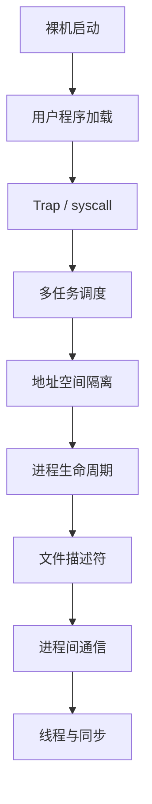
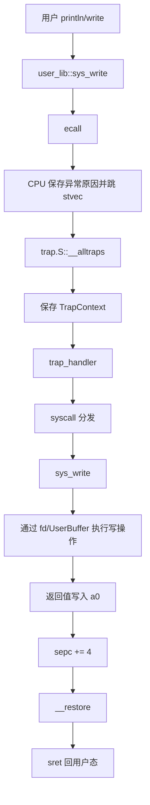

# rCore ch1-ch8 核心演进总流程

> 本文件是 ch1-ch8 的横向总览，重点突出 ch3、ch4、ch5 的演进：从批处理/多任务，到地址空间，再到进程。

## 1. 总体路线

```text
ch1：裸机最小内核
  -> 解决“内核怎么启动、怎么输出”

ch2：批处理系统
  -> 解决“内核怎么运行用户程序”

ch3：分时多任务
  -> 解决“多个程序怎么轮流运行”

ch4：地址空间
  -> 解决“多个程序怎么互不破坏内存”

ch5：进程
  -> 解决“程序怎么动态创建、替换、等待、退出”

ch6：文件系统
  -> 解决“程序怎么访问持久化文件”

ch7：管道与重定向
  -> 解决“进程之间怎么通过 fd 通信”

ch8：线程与同步
  -> 解决“一个进程内部怎么并发执行并保证正确”
```

## 2. 贯穿全程的主线

可以把整个课程看成这条线：



## 3. 编写与编译：用户态程序如何形成

用户程序通常来自：

```text
user/src/bin/*.rs
```

编译时依赖：

```text
user/src/lib.rs
  -> _start 用户态入口
  -> 调用 main
  -> main 返回后调用 exit

user/src/syscall.rs
  -> 把 write/exit/fork/exec 等封装成 ecall

user/src/console.rs
  -> println! 最终调用 sys_write

user/linker.ld
  -> 指定用户程序内存布局
```

用户态执行链：

```text
用户 main
  -> user_lib
  -> syscall 封装
  -> ecall
  -> 内核 trap_handler
```

## 4. 内核构建阶段：应用如何进入内核/文件系统

早期章节通常把用户程序嵌入内核：

```text
build.rs
  -> 扫描用户程序
  -> 编译成 ELF/bin
  -> 生成 link_app.S / AppMeta
  -> 链接进内核镜像
```

后续章节有文件系统后，用户程序可以来自：

```text
fs.img
  -> easy-fs
  -> open/read ELF
  -> Process::from_elf
```

差别：

```text
早期：用户程序像“随内核打包的资源”
后期：用户程序像“文件系统里的可执行文件”
```

## 5. 内核启动与初始化

通用启动流程：

```text
QEMU
  -> _start
  -> 设置内核栈
  -> 清 BSS
  -> rust_main
```

`rust_main` 随章节逐步增加初始化内容：

```text
ch1：console / shutdown
ch2：trap / batch
ch3：task manager / timer
ch4：frame allocator / page table / KERNEL_SPACE
ch5：process manager / initproc / shell
ch6：block device / easy-fs
ch7：pipe / fd 增强 / argv
ch8：thread manager / sync primitives
```

## 6. ch3：从批处理到分时多任务

ch2 的批处理：

```text
app0 exit 后 app1 才运行
```

ch3 的分时多任务：

```text
app0 运行一会儿
  -> yield 或 timer
  -> 保存上下文
  -> app1 运行一会儿
  -> 再切回来
```

核心机制：

```text
TaskControlBlock
  -> 保存任务状态
  -> 保存 TaskContext
  -> 关联用户 TrapContext

TrapContext
  -> 用户态寄存器现场

TaskContext
  -> 内核态任务切换现场

__switch
  -> 在内核态切换任务

__restore
  -> 从 TrapContext 回用户态
```

这一章解决：

```text
CPU 时间怎么分给多个程序
```

## 7. ch4：地址空间

ch3 的问题：

```text
多个任务虽然能轮流运行
但内存保护很弱
```

ch4 引入：

```text
MemorySet
PageTable
FrameAllocator
satp
trampoline
UserBuffer
```

用户访存流程：

```text
用户程序访问虚拟地址 VA
  -> MMU 读取 satp
  -> 查当前进程页表
  -> 检查 PTE 权限
  -> 得到物理地址 PA
  -> 访问真实内存
```

这一章解决：

```text
每个程序看到自己的虚拟世界
同一个 VA 在不同地址空间里可以对应不同 PA
```

## 8. ch5：进程

ch4 已有独立地址空间，但程序来源和生命周期还不够真实。

ch5 引入：

```text
fork
exec
waitpid
exit
Zombie
parent / children
shell
```

典型 shell 流程：

```text
shell 读命令
  -> fork 子进程
  -> 子进程 exec 目标程序
  -> 父进程 waitpid
  -> 子进程 exit 后变 Zombie
  -> 父进程回收退出码
  -> shell 继续读下一条命令
```

这一章解决：

```text
程序如何被用户动态启动、替换、等待、回收
```

## 9. ch3/ch4/ch5 对比

| 维度 | ch3 分时多任务 | ch4 地址空间 | ch5 进程 |
|---|---|---|---|
| 核心目标 | 多个任务轮流跑 | 内存隔离 | 生命周期管理 |
| 调度对象 | TaskControlBlock | 带 MemorySet 的任务 | 进程/任务控制块 |
| 地址空间 | 弱/未完整隔离 | 每任务独立页表 | 继承并加强 |
| 切换时是否换 satp | 通常不需要 | 需要 | 需要 |
| 创建方式 | 内核预设 app | ELF 建立 MemorySet | fork / exec |
| 退出处理 | 标记任务完成 | 回收地址空间 | Zombie + waitpid |
| 用户交互 | 测试程序 | 独立内存程序 | shell |

## 10. 系统调用通用流程

以 `sys_write` 为例：



## 11. 任务/进程切换通用流程

```text
当前用户程序运行
  -> yield / timer / blocking syscall
  -> trap 进内核
  -> 保存 TrapContext
  -> 调度器选择下一个任务/线程
  -> __switch 切换 TaskContext
  -> 如需切换地址空间，更新 satp
  -> __restore 恢复目标用户上下文
  -> sret 回用户态
```

## 12. 进程退出与资源回收

```text
sys_exit
  -> 当前进程标记 Zombie
  -> 保存 exit_code
  -> 释放/准备释放地址空间、fd、同步资源
  -> 子进程交给 initproc
  -> 唤醒等待的父进程
  -> 调度下一个任务
```

父进程：

```text
waitpid
  -> 找到 Zombie 子进程
  -> 读取 exit_code
  -> 从 children 删除
  -> 彻底释放 PCB
```

## 13. 最终理解

如果用一句大白话串起来：

```text
ch1 让内核自己能启动；
ch2 让内核能运行用户程序；
ch3 让多个用户程序能轮流运行；
ch4 让每个用户程序有自己的虚拟内存世界；
ch5 让用户程序能像真实系统一样 fork/exec/wait；
ch6 让程序能访问文件；
ch7 让程序能通过 fd 通信和重定向；
ch8 让一个进程内部能多线程并发并用锁保证正确。
```

